# python 中的 np.reshape

> 原文：<https://towardsdatascience.com/np-reshape-in-python-39b4636d7d91?source=collection_archive---------6----------------------->

## numpy 中的形状和 numpy.reshape 的工作原理

# 介绍

numpy.reshape 并不总是像预期的那样工作，很多次我几乎疯狂地在代码中搜索错误，最终是因为 np.reshape 没有像我预期的那样工作，旧数组的一些元素出现在了新数组中意想不到的地方。正因为如此，很多时候我都是围绕着 np.reshape 工作，但今天我将面对我的命运。

# 阵列形状

## 一维数组

在 NumPy 中，数组有特定的形状。当我们用 np.array 创建数组时，numpy 会自动推断形状。让我们创建一个一维数组。

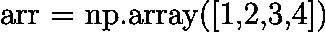

(所有图片均由作者提供)

我们可以通过键入以下命令来打印数组的形状:

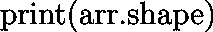

这个数组的形状是:

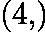

不要被形状元组中的逗号分散注意力，它只是在那里，以便我们可以将它识别为一个元组。它仍然是一个一维数组。

## 二维数组

当创建二维数组时，我们必须使用双括号。

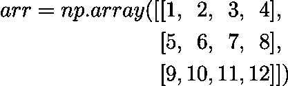

我们可以通过键入以下命令来打印数组的形状:

这个数组的形状是:

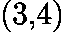

数组的形状是:(行数，列数)。或者换句话说(第一索引，第二索引)。

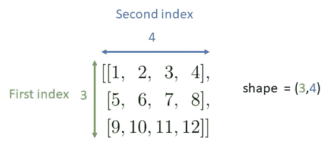

为了更好地理解第一个索引和第二个索引，想象一下整个数组像这样展开。

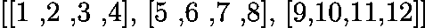

当我们按以下方式索引数组时:

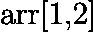

我们应用第一个指数(1):

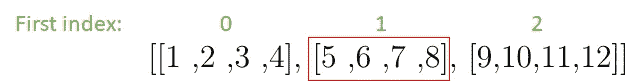

然后是第二个索引(2):

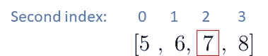

## 三维阵列

我们可以通过使用三层括号创建一个三维数组。

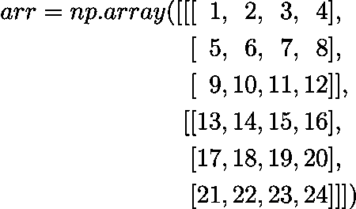

然后我们有了第一、第二和第三个指数。

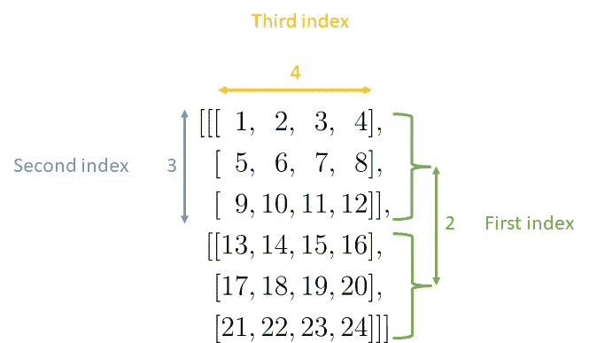

## 多维数组

对于任何多维数组，我们可以应用相同的逻辑。第一个索引是最外层的索引，最后一个索引是最外层的索引。

# np .重塑

重塑过程中有两个思考步骤。第一步是将数组展开成一条直线，第二步是将其卷回新的指定形状。

现在的问题是:元素展开并卷成新形状的顺序是什么？有 3 种不同的顺序，我们可以这样做，我们可以指定我们想要使用哪一个。

## 订单= 'C '

C 实际上代表编程语言 C。这是默认顺序，如果我们键入:

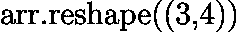

然后，数组“arr”被整形为 shape (3，4)。顺序应该是 C 调。因此，它将与以下内容相同:

对于 C 顺序，我们都展开和回滚，最后一个索引变化最快，第一个索引变化最慢。

对于二维数组，我们展开数组，最后一个(第二个)索引变化最快。我们回滚到变化最快的最后一个(第二个)索引。

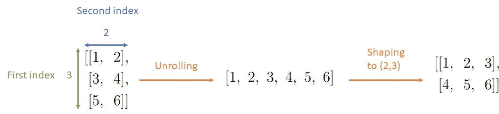

整个过程也可以在下面的动画中看到:

对于三维数组，我们展开数组，最后一个(第三个)索引变化最快。我们用变化最快的最后一个(第三个)索引进行回滚。

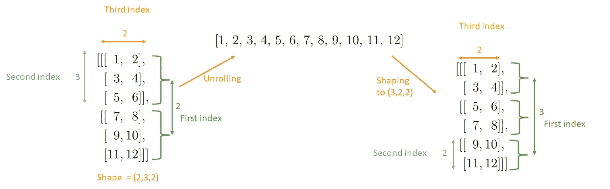

一旦你理解了它是如何工作的，你也可以直接从输入数组到输出数组，跳过展开。我们也可以把二维数组改造成三维数组，实际上是可以想象到的所有其他维度的组合。我可以在这里举更多的例子，但是如果你严格地按照展开的过程，并把它恢复成想要的形状，这应该很容易理解。

## order = 'F '

F 实际上代表编程语言 Fortran。要使用这个顺序，我们必须指定它，例如:

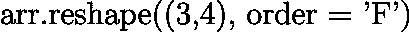

按照 Fortran 的顺序，我们展开时第一个索引变化最快，第二个索引变化最快，最后一个索引变化最慢。

对于二维数组，第一个索引变化最快，第二个索引变化最慢:

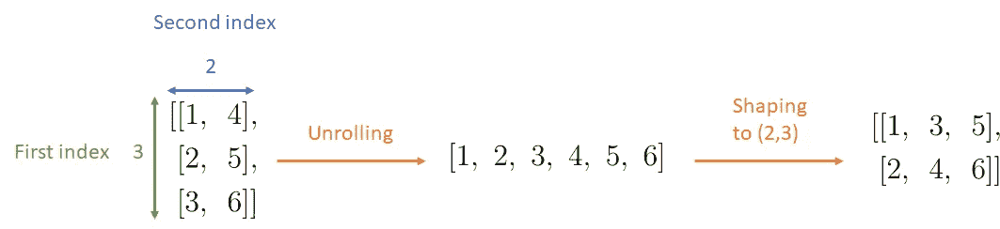

一个小动画:

对于三维 numpy 阵列，第一个指数变化最快，第三个指数变化最慢。

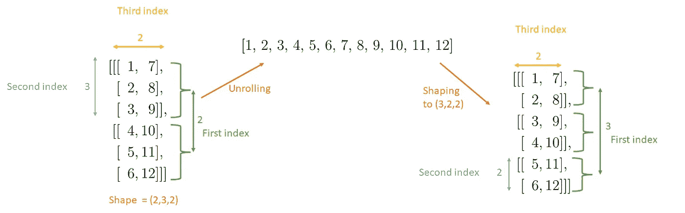

## order = 'A '

order = 'A '，根据数组在内存中的存储方式，按照 C 语言顺序或 Fortran 语言顺序重塑。如果它存储在内存中，就像在 C 编程语言中一样，那么 order = 'A '将使用 C order 进行整形。如果数组像 fortran 编程语言一样存储在内存中，那么它将使用 Fortran 顺序重新整形。这可能会加速您的 tcode，但我实际上从未使用过它，因为结果是不可预测的。

## Fortran 顺序展开，C 顺序整形？

我们可以使用 np.ravel 函数按照 Fortran 的顺序展开数组，使用 np.reshape 按照 C 的顺序对展开的数组进行整形。

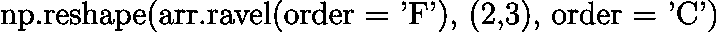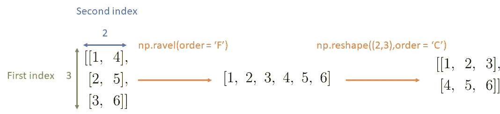

与动画一样的重塑:

## 按 C 顺序展开，按 F 顺序整形

我们只是按照 C 顺序拉威尔，然后按照 F 顺序重塑，这应该很简单，但是这里有一个动画，这样你就可以看到了。

就像在 np.reshape 中一样，np.ravel 中的默认顺序是 C，所以如果我们不指定它，np.ravel 将按照 C 顺序展开。

## -1 英寸 np.reshape

我们可以在 np.reshape 中的形状中使用-1。-1 是一个占位符，并自动获取正确的值，以便输入和输出形状最终匹配。如果我们写一个函数，但我们不知道输入数组的确切维数，但我们知道输出应该有 2 列，这就特别有用。但是请注意，一次只能用-1 替换一个值。所以我们必须知道输出数组中除一维以外的所有内容。

例如，假设我们有三个不同的阵列:

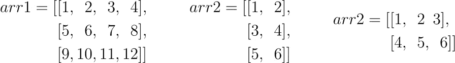

当我们打字时:

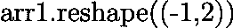

然后-1 取值 **6** 。因为 arr1 有 12 个元素，2 乘以 **6** 等于 12。

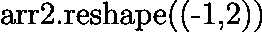

然后-1 取值 **3** 。由于 arr2 有 6 个元素，2 乘以 **3** 等于 6。

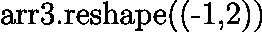

那么-1 也取值 **3** 。由于 arr2 有 6 个元素，2 乘以 **3** 等于 6。

# 作者的其他文章

</einstein-index-notation-d62d48795378>  </backpropagation-in-neural-networks-6561e1268da8>  </snake-with-policy-gradients-deep-reinforcement-learning-5e6e921db054>  </how-you-can-use-gpt-j-9c4299dd8526>  

## 想联系支持我？

领英
[https://www.linkedin.com/in/vincent-m%C3%BCller-6b3542214/](https://www.linkedin.com/in/vincent-m%C3%BCller-6b3542214/)
脸书
[https://www.facebook.com/profile.php?id=100072095823739](https://www.facebook.com/profile.php?id=100072095823739)
推特
[https://twitter.com/Vincent02770108](https://twitter.com/Vincent02770108)
中等
[https://medium.com/@Vincent.Mueller](https://medium.com/@Vincent.Mueller)
成为中等会员并支持我(你的部分会员费直接归我)
[https://medium.com/@Vincent.Mueller/membership](https://medium.com/@Vincent.Mueller/membership)