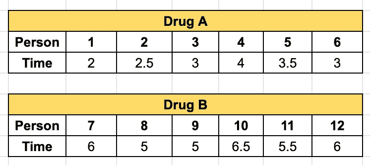

# 无效假设和交替假设

> 原文：<https://towardsdatascience.com/null-and-alternate-hypothesis-c5b6ae9d7845?source=collection_archive---------23----------------------->

## …用简单明了的英语！让我们把基本情况弄清楚。

图片由[马库斯](https://unsplash.com/@markusspiske)在 [Unsplash](https://unsplash.com/photos/VZnmCtD5KdI) 上拍摄

**统计数据**听起来令人生畏，因为我们阅读的大部分文本使用困难的统计词汇来定义术语。😩当我们开始阅读一个概念及其定义时，我们很难在脑海中将其形象化，没有视觉画面，我们总是感到困惑。🙇🏻这往往会让我们多次搜索同一个概念。😰

在这篇文章中，我将试着用简单的方式解释无效假设和交替假设的概念。那么，我们开始吧。🏄

假设，我们有两种药物，药物 A 和药物 B，用来治疗流感。💊我们用药物 A 治疗 6 名流感患者，用药物 B 治疗 6 名不同的流感患者，并测量这些人从流感中康复的时间(以天为单位)。🤕正如我们所知，每个人都是不同的，我们已经意识到一个事实，即不是每个人都会在相同的天数内康复。因此，我们将着眼于平均时间，而不是个人时间。

以下是我们的测试统计数据:

作者图片

很容易找到每种药物的平均值。经过计算，我们发现服用药物 A 的人平均需要 3 天才能康复，而服用药物 B 的人平均需要 5.67 天才能康复。💪🏼

我们可以清楚地看到，恢复时间相差 2.67 天，这一差距非常大。虽然我们知道每个人都有不同的免疫力和不同的生活方式(饮食、锻炼、工作等)。)可以导致这样的结果，我们最有可能说药物 A 比药物 B 更好，因为它帮助人们更快地恢复。因此，我们可能会在下次患流感时开始服用这种药物。🤒

该数据使我们形成一个假设，即药物 A 的恢复时间比药物 b 的恢复时间少 2.67 天。

*请注意，这只是一个玩具示例，实际上，在形成任何假设之前，我们会测试更多的人。*

现在，假设我们在不同的人群中测试这两种药物，发现药物 B 的恢复时间比药物 a 的恢复时间少 1.5 天，这与我们之前的假设完全不同。所以，我们继续在另一组人身上试验这些药物。这一次，我们发现药物 A 的恢复时间比药物 b 的恢复时间少 4 天。如果我们继续做这个练习，我们可能会得到类似的结果，或者很可能会得到完全不同的结果。

在这一点上，统计学家迈出了重要的一步，他们不是在不同的人群中一次又一次地测试已形成的假设，而是实际上设计了一个新的假设。

在这种情况下，新的假设将是:

药物 A 和药物 b 的恢复时间没有差异。他们将这种假设命名为**无效假设**，以确定是否有任何差异。

针对一个已形成的假设检验无效假设，在这种情况下，药物 A 的恢复时间比药物 b 的恢复时间少 2.67 天。该假设被命名为**替代假设**。

为了进行假设检验，我们对很多人进行了抽样调查。现在假设我们发现两种药物的恢复时间确实有差异。(虽然这个结果背后可能有许多隐藏的原因，但目前我们不会考虑这些原因。)在这种情况下，我们**拒绝我们的零假设**。🙅

让我们看看，如果结果相反，我们会怎么做。假设我们对很多人进行抽样，发现两种药物的恢复时间没有差异。在这种情况下，我们将无法拒绝零假设。🙆

## 此时，一个很好的问题是，为什么我们不接受基于我们观察的零假设。🙋

无效的假设永远不会被接受。我们要么拒绝它们，要么不能拒绝它们。原因很简单。我们抽取的样本总是随机的。我们从来不对整个人口进行测试，总是从人口中抽取一小部分样本来形成我们的假设。

因此，如果我们随机选择的样本显示的结果不同于零假设，我们就万事俱备了，事情变得简单了。我们简单地拒绝零假设。

然而，如果我们得到与我们的零假设相似的结果，我们不能拒绝零假设，这表明没有足够的证据表明零假设是错误的。我们这样做是因为仍然有很多关于人口的数据是我们没有的。

无效假设和替代假设是相互对立的。假设检验的主要目的是拒绝或未能拒绝零假设，因为统计学家从不接受它，即使他们采取的样本支持零假设，反对替代假设。

***对于任何统计检验，我们都需要数据、零假设、备择假设。***

我们通常用 **H₀** 表示零假设，用 **Hₐ** 表示替代假设。

## 如何陈述零假设？✍️

我们通常通过定义零假设和替代假设将文字问题转化为统计假设检验。

让我们考虑我们上面的例子来写这两个假设。

从问题这个词中提取出另一个假设，然后我们把它写成数学形式。

**备选假设:**

药物 A 的恢复时间比药物 b 的恢复时间少 2.67 天

让我们用μ来表示平均恢复时间的差异。

**Hₐ:** μ = 2.67

**零假设:**

现在，为了写出零假设，我们陈述如果假设不成立会发生什么。基于我们的替代假设，我们有两种可能性:

μ >2.67 或μ <2.67

Any of these possibilities can form a null hypothesis. However, since the statisticians don’t have an idea about the truth, they generally frame it by saying that there is no difference in the recovery time between Drug A and Drug B. The mathematical form for the same will be:

**H₀:** μ =0

## 零假设中的‘零’是什么？🤔

据我所知，零假设并不意味着假设是零，而是它被称为零，因为统计学家的工作使这个假设无效。这背后很可能有其他隐藏的原因。

零假设和交替假设的概念不仅适用于统计学领域，也适用于其他领域。研究人员和科学家在进行任何统计测试之前形成这些假设。🔭 🔬 💊 💉 🌡

我希望这能让你对无效假设和替代假设有所了解。有一个与此相关的置信区间和 p 值的概念，但对于本文，我没有深入探讨。我的主要目的是让你们用简单的语言，而不是统计学术语，理解无效假设和替代假设的概念。😊

***参考文献:***

[https://www.youtube.com/playlist?list = plbl H5 jkooluk 0 fluzwntyi 10 uqfuhsy 9](https://www.youtube.com/playlist?list=PLblh5JKOoLUK0FLuzwntyYI10UQFUhsY9)

谢谢大家阅读这篇文章。请分享您对这篇文章的宝贵反馈或建议！快乐阅读！📗 🖌

[领英](https://www.linkedin.com/in/chetna-khanna/)