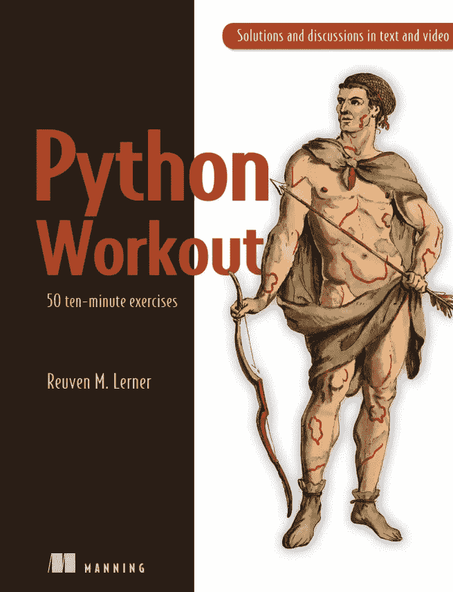
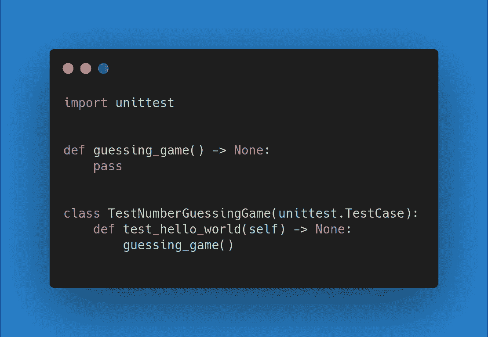
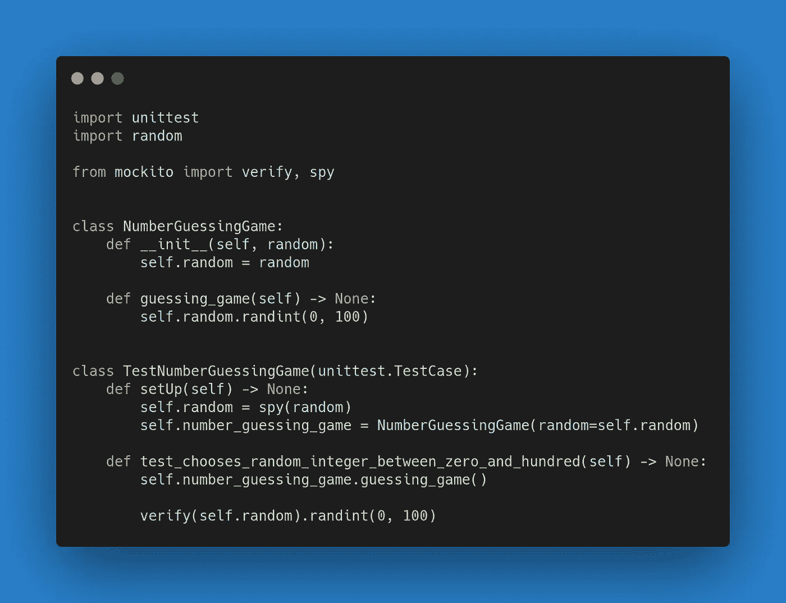
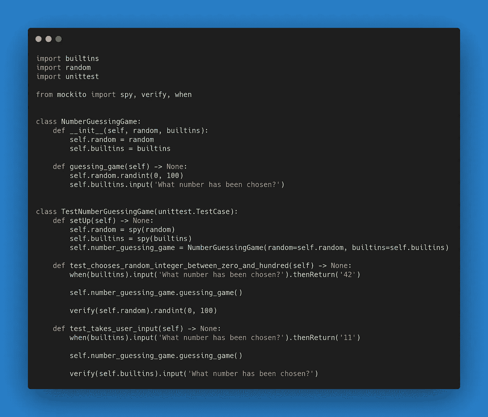
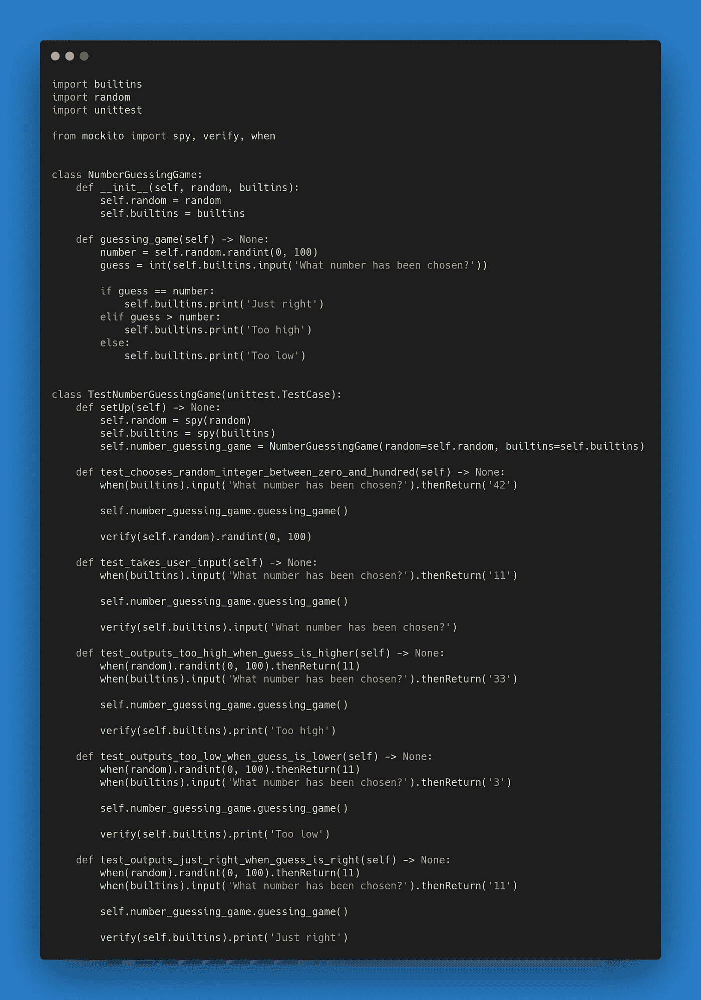
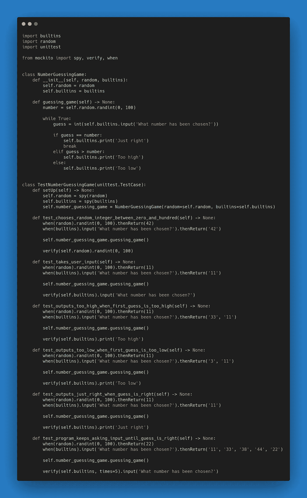

# 猜数字游戏

> 原文：<https://towardsdatascience.com/number-guessing-game-504b5f3bb0e7?source=collection_archive---------35----------------------->

## 使用测试驱动开发方法的 Python 练习

在 [Unsplash](https://unsplash.com?utm_source=medium&utm_medium=referral) 上[迈特·蒂斯卡尔](https://unsplash.com/@maitetiscar?utm_source=medium&utm_medium=referral)拍摄的照片

几周前，我开始阅读一本有趣的书:鲁文·m·勒纳的《Python 测试》。它由 50 个十分钟的练习组成。这是一本积累一些 Python 编程经验的理想书籍。

我自己开始阅读这本书，因为我的 Python 技能需要一些改进。有时你忙于学习另一种语言，以致于你的语法知识受到影响。

我最喜欢的解决编码问题的方法是测试驱动开发。为了让你开始，我决定分享我解决给定问题的方法。我们一起来看看如何解决这本书的第一个练习:猜数字游戏。

Python 锻炼手册

为企业发展和为自己发展有着巨大的区别。虽然书籍主要关注于为自己编码，但这是我试图有所作为的地方。

在本文中，首先，我们将看看测试驱动开发的一些优势。如果你已经理解了测试的重要性，你可以跳过这一节。

第二，我们要解决数字猜谜游戏，它由 5 个简单的步骤组成:

*   写一个没有参数的函数“guessing_game”
*   该函数选择 0 到 100(包括 0 和 100)之间的随机整数
*   请用户猜测选择了哪个数字
*   打印相应的猜测:“太高”，“太低”，或“刚刚好。”
*   只允许程序在用户猜对后退出

> 尝试自己解决这些步骤，然后比较你的解决方案。有一些不同并不意味着你的解决方案是错误的。甚至可能更好！这个练习的目的是学习和分享知识，所以如果你有改进，请在评论中分享！

对于每一步，我会给你我的推理。

# 测试驱动开发的优势

用测试驱动的方式做这个练习至少有三个好处。因为你不同意一个论点，并不意味着其他论点都是废话。

*   **在这个练习之后，你将拥有 100%的分支代码覆盖率**

如果你的同事想要改变你的实现，他们会有一个安全网来检查所有的需求。如果你独自工作，就像你在业余爱好项目或学习中所做的那样，你可能看不到以这种方式测试的任何附加价值。

但是在这个行业里，你不是一个人在工作。迟早有人会修改你的代码。这有风险。你不希望现有的价值被破坏。因为你预先编写了你的测试，所以不可能出现从未测试过的情况。

*   迭代生成的代码可读性更好。

随着需求的增加，软件变得更加复杂。朝着一个解决方案反复工作会让一切变得更容易理解。

你可能同意下面的说法。当一个难题被分成多个部分时，它就变得不那么复杂了。每一部分本身都更容易消化。

测试驱动的开发方法允许你对任何问题都这样做。因为每一部分都是单独完成的，所以你的代码将是结构良好的，可读性强的。

*   **添加测试比从头开始更容易**

几乎每个人都说软件测试会让你慢下来，尤其是当你第一次做的时候。但是你应该意识到测试是**而不是**可选的。

迟早，你必须开始，你拖得越久，事情就变得越复杂。除非你是自私的，并且无意与他人合作，否则你没有正当的理由不测试你的代码。

你应该什么时候开始？

为了获得所有的好处，你应该尽早开始。如果您在编写生产代码之前就开始测试，那将是最好的。虽然一开始可能会令人沮丧和困难，但它会让你更快。一旦你足够熟悉你的语言，测试驱动的开发就不会再拖你的后腿了。

# 猜数字游戏

## 写一个没有参数的函数“guessing_game”

如果你以前从未编写过测试，你需要花一些时间来熟悉它们。在第一步中，我们将从一个测试文件开始。`number_guessing_game.py`。

在开始编写代码之前，我们需要进行第一次测试。这是测试驱动开发的黄金法则。我们从单元测试开始。因此，让我们导入`unittest`库。

没有实现就成功的测试并不好。我们想避免这种情况。因此，我们将不得不放弃失败的测试。在第一个测试中，您可以在定义方法之前编写方法名。这将被指示为错误。

为了通过这个测试，您必须创建一个方法。一个经验丰富的开发人员用他最喜欢的 IDE 中的快捷方式来做这件事，但是你也可以键入它。

这就是第一步。在一次成功的红绿迭代之后，我们有了一个没有参数的方法`guessing_game`。

> 不用担心我下面代码中的 pass 语句。它只是未来代码的占位符。它什么也不做。如你所见，这个方法不返回任何东西。这个测试唯一要做的事情是检查是否有一个用名称`guessing_game`定义的方法。

`guessing_game`一种没有任何论据的方法。

## 写一个从 0 到 100(包括 0 和 100)之间选择一个随机整数的函数

让我带你走完这稍微难一点的一步。我们要生成一个 0 到 100 之间的随机整数，包括 100。你可以采取多种方法。

首先，你可以试着自己写一个随机整数的函数。但这相当复杂。测试它甚至更复杂。

*   如何让它变得真正随机？
*   你的种子是什么？是时间还是别的什么

因此，我们没有重新发明轮子，而是引进了`random`。这是一个已经使用了很多年的库，根据文档，它的功能正是我们想要的。

因此，我编写了一个测试来验证正确的方法将被调用。我们没有将随机库作为方法参数传递，而是使用了一种不同的技术。我们在构造函数中注入这个库，使用的是`dependency injection`的原理。

*   依赖注入使得嘲笑或监视变得更加容易。想象一下在现有代码上添加测试。您将遇到的第一个问题是决定您将模仿哪些库，不模仿哪些库。避免这个问题，尽早测试。
*   依赖注入不会将我们的代码耦合到一个特定的库。我们可以很容易地把图书馆换成另一个。这只是一个小班级，但是想象一下使用一个大系统。只会变得更加复杂。

还有一件事。你可以用假的或者间谍。在这种情况下，生成随机数非常快。我们真的不需要模仿。作为开发人员，您必须做出权衡。

> 如果您更喜欢真正的实现，除非它需要太多的时间来执行，这将是最好的。库如何生成随机数只是一个细节。从我们现在掌握的信息来看，我们可以同意这个图书馆正是我们所需要的。

一种生成 0 到 100 之间的随机整数的方法。

## 请用户猜一个数字。

乍一看，下一步并不比第一步复杂。但是和所有事情一样，细节决定成败。

输入法在 Python 中是如此常用。它甚至不需要进口。但这对我们来说很困难。如果没有导入，如何应用依赖注入？

嗯，有可能。如果你点击输入方法，你会看到它也包含在内置库中。所以，我们可以重复我们在第一步中看到的。

您编写第二个测试，验证输入法已经被称为对用户有用的消息。要让它通过，必须调用内置的输入库。确保您模拟了`builtins`输入法的返回值，因为否则，您的测试将在等待用户输入时停滞不前。

确保两个测试都成功。在第一个例子中，我们验证了随机数的产生。第二，我们测试用户的输入。这开始看起来像一步猜谜游戏。

你做得很好。让我们进入下一步。

要求用户输入，以便他们能猜出数字。

## 当用户进行猜测时，输出“太高”、“太低”或“刚刚好”。

前面两步感觉不太像编程吧？这个会。在这一步，我们将为用户添加一些逻辑和反馈。我们将添加三个用例:

*   如果猜测的数字高于真实数字，则打印“太高”
*   如果猜测的数字低于真实数字，则打印“太低”
*   如果猜测的数字正是真实的数字，则打印“恰到好处”

每个案例都将是一个新的测试驱动的步骤。我总是用最少的努力使测试成功。

*   第一步，用户的每一次高输入都会输出“太高”。
*   在第二步中，我们修改代码，否则输出“太低”。
*   在第三步，我们将涵盖最后一种情况，“刚刚好。”

通过迭代工作，您可以为每个分支执行添加一个测试。在每个时间点，这都会导致 100%的分支代码覆盖率。我们以三个额外的测试结束，`guessing_game`现在是一个猜测的完整特性。

如果你一直跟着，我们就快完成了！

基于用户输入的反馈。

## 只有当用户猜对时才退出

你已经到了这个练习的最后一步。循环往往会增加相当多的复杂性——尤其是这个。我们只能在猜对的情况下退出程序。

为了允许这种改变，我们必须修改一些测试。否则，测试将永远不会退出无限循环。每个测试最终都必须退出 while 循环。

在这一步中，最重要的部分是编写一个测试，在以正确的输入结束之前输入一些错误的输入。三个数字足以测试一个循环，但是您可以选择任何数字(例如，5 次尝试，参见下面的代码片段)。

> 一个重构改进可以将一个猜测的代码移动到它自己的函数中。这将减少对其他部分的更改量。你可以自己试试。如我所说，我提供的代码示例并不是最佳的。这只是我在一定时间内努力的结果。

只有当用户输入 5 个正确的数字时才退出

## 结论

几乎所有的文章和书籍都专注于编写高质量的代码。但是他们倾向于将测试移到它自己的章节。这并不理想。测试应该从软件开发的早期阶段开始。

您已经看到了将一个复杂的任务分成更小的可测试步骤是可能的。每一步都应该通过测试、实现和重构步骤。这产生了经过良好测试的、可维护的和可读的代码。

为了结束这篇文章，我将添加最终的解决方案。您将看到这个解决方案与原作者提出的几乎相同。您可以自己尝试一下，或者在其他编码挑战中尝试一下。

猜数字游戏

猜数字游戏测试。