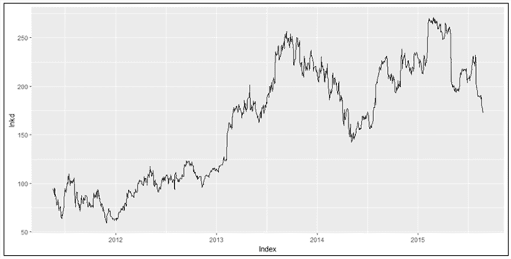
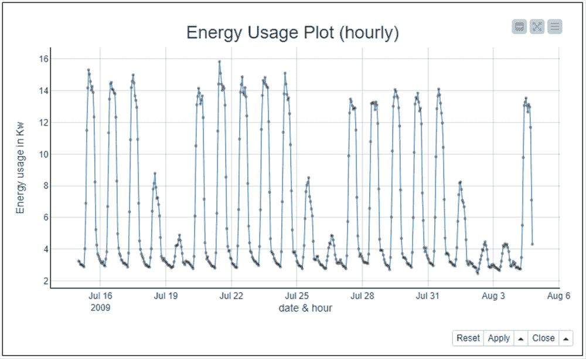
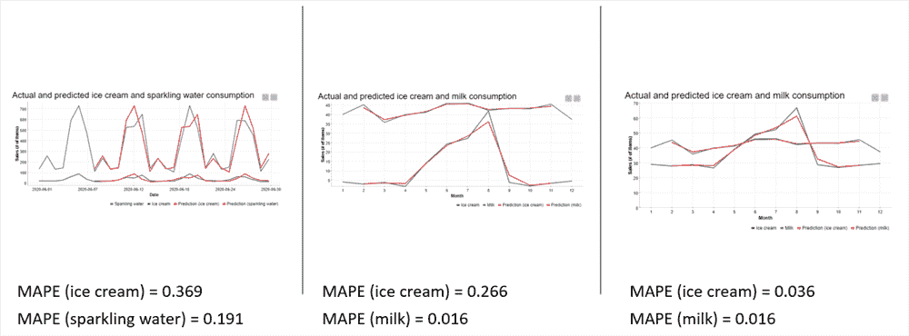
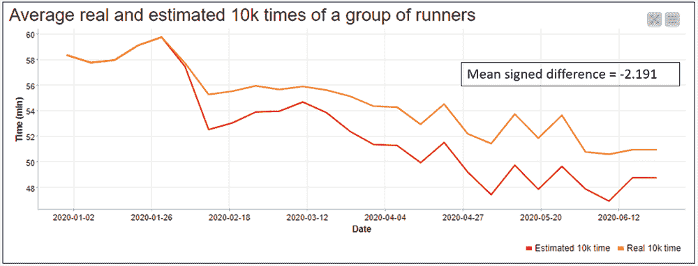
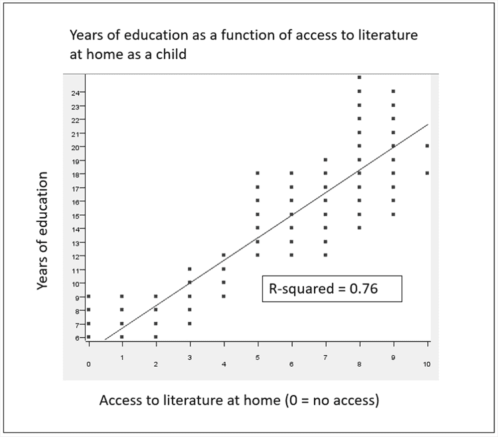
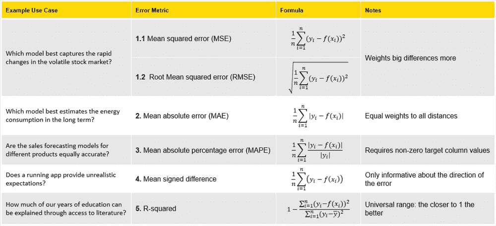

# 数字评分指标

> 原文：<https://towardsdatascience.com/numeric-scoring-metrics-acd3896c5eff?source=collection_archive---------42----------------------->

## **为预测模型找到正确的指标**

*KNIME 数据科学家玛瑞·威德曼*

量化数据有说不完的故事！

每日收盘价告诉我们股票市场的动态，小型智能仪表告诉我们家庭的能源消耗，智能手表告诉我们人体在锻炼时发生了什么，以及关于一些人在某个时间点对某个话题的自我评估的调查。不同类型的专家可以讲述这些故事:金融分析师、数据科学家、体育科学家、社会学家、心理学家等等。他们的故事基于模型，例如，[回归模型](https://en.wikipedia.org/wiki/Regression_analysis)、[时间序列模型](https://en.wikipedia.org/wiki/Time_series)和[方差分析模型](https://en.wikipedia.org/wiki/Analysis_of_variance#:~:text=Analysis%2520of%2520variance%2520(ANOVA)%2520is,by%2520the%2520statistician%2520Ronald%2520Fisher.)。

**为什么需要数字评分指标？**

这些模型在现实世界中有许多后果，从投资组合经理的决策到一天、一周和一年中不同时间的电力定价。需要数字评分指标，以便:

*   选择最准确的型号
*   估计模型误差对现实世界的影响

在本文中，我们将描述数值预测模型的五个真实用例，在每个用例中，我们从稍微不同的角度来衡量预测准确性。在一种情况下，我们衡量一个模型是否有系统偏差，在另一种情况下，我们衡量一个模型的解释能力。本文最后回顾了数字评分指标，展示了计算它们的公式，并总结了它们的属性。我们还将链接到几个在 [KNIME 分析平台](https://www.knime.com/knime-analytics-platform)中构建和评估预测模型的示例实现。

**五个指标:预测准确性的五个不同角度**

**(根)均方误差，MSE——哪种模型最能捕捉到动荡的股票市场的快速变化？**

在下面的图 1 中，你可以看到 LinkedIn 收盘价从 2011 年到 2016 年的变化。在该时间段内，行为包括突然的峰值、突然的低点、更长时间的增加和减少值，以及几个稳定期。预测这种不稳定的行为具有挑战性，尤其是从长期来看。然而，对于 LinkedIn 的利益相关者来说，这是有价值的。因此，我们更喜欢捕捉突然变化的预测模型，而不是在五年内平均表现良好的模型。

我们选择具有最低[(根)均方误差](https://en.wikipedia.org/wiki/Mean_squared_error)的模型，因为与小误差相比，该指标更重视大误差，并且支持能够对短期变化做出反应并节省利益相关者资金的模型。

图一。2011-2016 年 LinkedIn 每日股市收盘价:规律少，突变多，可预测性低的数据。我们选择具有最低(根)均方误差的预测模型，因为它对较大的预测误差加权更大，并且更倾向于可以捕捉突然的峰值和低点的模型。

**平均绝对误差，MAE——哪个模型能最好地估计长期能耗？**

在图 2 中，您可以看到都柏林 2009 年 7 月的每小时能耗值，这些值是从一组家庭和行业收集的。能源消耗显示出相对规律的模式，工作时间和工作日的数值较高，夜间和周末的数值较低。这种有规律的行为可以相对准确地预测，允许对能源供应进行长期规划。因此，我们选择一个具有最低[平均绝对误差](https://en.wikipedia.org/wiki/Mean_absolute_error)的预测模型。我们这样做是因为它对大误差和小误差进行了同等加权，因此对异常值具有鲁棒性，并显示了在整个时间段内哪个模型具有最高的预测准确性。

图二。都柏林 2009 年 6 月的每小时能耗值，收集自一组家庭和行业。该数据显示了相对规律的行为，因此可以进行长期预测。我们选择具有最低平均绝对误差的预测模型，因为这个度量对于异常值是稳健的。

**平均绝对百分比误差，MAPE——不同产品的销售预测模型是否同样准确？**

炎炎夏日，汽水和冰淇淋的供应都要有保障！我们要检查预测这两种产品销售的两个预测模型是否同样准确。

这两个模型都以同样的单位——售出商品的数量——生成预测，但规模不同，因为苏打水的销量比冰淇淋大得多。在这种情况下，我们需要一个相对误差度量，并使用[平均绝对百分比误差](https://en.wikipedia.org/wiki/Mean_absolute_percentage_error)，它报告相对于实际值的误差。在图 3 中，在左侧的线图中，您可以看到 2020 年 6 月苏打水的销售额(紫色线)和冰淇淋的销售额(绿色线)以及这两种产品的预测销售额(红色线)。汽水的预测线似乎比冰淇淋偏离得稍微多一点。然而，起泡水的实际值较大，这使可见的比较产生偏差。实际上，预测模型对苏打水的预测比对冰淇淋的预测更好，据 MAPE 报告，苏打水的预测值为 0.191，冰淇淋的预测值为 0.369。

但是请注意，当实际值接近零时，MAPE 值可能会有偏差。例如，与夏季相比，冰淇淋在冬季的销量相对较低，而牛奶的销量则全年保持不变。当我们通过 MAPE 值比较牛奶和冰淇淋预测模型的准确性时，冰淇淋销售额中的小值使得冰淇淋预测模型看起来比牛奶预测模型差得多。

在图 3 中，在中间的线图中，您可以看到牛奶(蓝线)和冰淇淋(绿线)的销售额以及这两种产品的预测销售额(红线)。如果我们看一下 MAPE 值，牛奶(MAPE = 0.016)的预测准确度显然比冰淇淋(0.266)好得多。然而，这种巨大的差异是由于冬季月份冰淇淋销售的低价值。图 3 中右边的线形图显示了冰淇淋和牛奶的实际和预测销售额，冰淇淋销售额每月增加 25 件。如果没有接近于零的偏差，冰淇淋(MAPE=0.036)和牛奶(MAPE=0.016)的预测精度现在更加接近。

图 3。三个线图显示了冰淇淋和苏打水(左边的线图)以及冰淇淋和牛奶(中间和右边的线图)的实际值和预测值。在右侧的线图中，冰淇淋销售额按比例放大了 25 倍，以避免由小的实际值引起的平均绝对百分比误差的偏差。

**平均符号差——一个正在运行的应用程序是否提供了不切实际的期望？**

智能手表可以连接到一个正在运行的应用程序，该应用程序可以估计 10 公里跑的完成时间。有可能，作为一种激励，应用程序估计的时间比实际预期的要低。

为了测试这一点，我们收集了一组跑步者六个月的预计和实际完成时间，并将平均值绘制在图 4 的线图中。如您所见，在这六个月中，实际完成时间(橙色线)比预计完成时间(红色线)减少得更慢。我们通过计算实际完成时间和估计完成时间之间的[平均符号差](https://en.wikipedia.org/wiki/Mean_signed_deviation)来确认估计值中的系统偏差。它是负的(-2.191)，所以这个应用程序确实提出了不切实际的期望！但是，请注意，这个度量并不能提供关于误差大小的信息，因为如果有一个跑步者实际上跑得比预期时间更快，这个正误差会补偿一部分负误差。

图 4。在六个月的时间里，10k 跑的预计(红线)和实现(橙线)完成时间。估计的时间向下偏移，这也由平均符号差的负值示出。

**R 平方——我们多少年的教育可以通过查阅文献来解释？**

在图 5 中，你可以看到在一个人口样本中，获得文学(x 轴)和教育年数(y 轴)之间的关系。对数据拟合线性回归线，以模拟这两个变量之间的关系。为了测量线性回归模型的拟合度，我们使用 [R 平方](https://en.wikipedia.org/wiki/Coefficient_of_determination)。

r 平方表示模型解释了目标列(受教育年限)的多少方差。基于该模型的 R 平方值 0.76，获得文献解释了受教育年限中 76%的差异。

图 5。线性回归线模拟文学作品的获取与受教育年限之间的关系。R-squared 用于测量模型拟合度，即目标列(受教育年限)中的方差有多少可以由模型解释，在本例中为 76%。

**回顾五个数字评分指标**

上面介绍的数字评分标准如图 6 所示。这些指标与用于计算它们的公式以及每个指标的一些关键属性一起列出。在公式中，yi 是实际值，f(xi)是预测值。

图 6。常见的数字评分指标、它们的公式和关键属性。在公式中，yi 是实际值，f(xi)是预测值，n 是样本量。

**总结**

在本文中，我们介绍了最常用的错误度量，以及它们对模型性能的影响。

通常建议查看多个数字评分指标，以全面了解模型的性能。例如，通过查看平均符号差，您可以看到您的模型是否有系统偏差，而通过研究(根)均方误差，您可以看到哪个模型最能捕捉到突然的波动。可视化，例如，线形图，补充了模型评估。

对于实际的实现，请看一下可视化数据科学工具 KNIME Analytics Platform 中构建的示例工作流。

从 KNIME Hub 下载并检查这些免费的工作流程:

*   [评估回归模型的性能](https://kni.me/w/ijM45fGpZId_JJd3)
*   [预测和重构时间序列](https://kni.me/w/nRzAJzVATgcqry9h)

*为首次出版的* [*新栈*](https://thenewstack.io/numeric-scoring-metrics-find-the-right-metric-for-a-prediction-model/) *。*