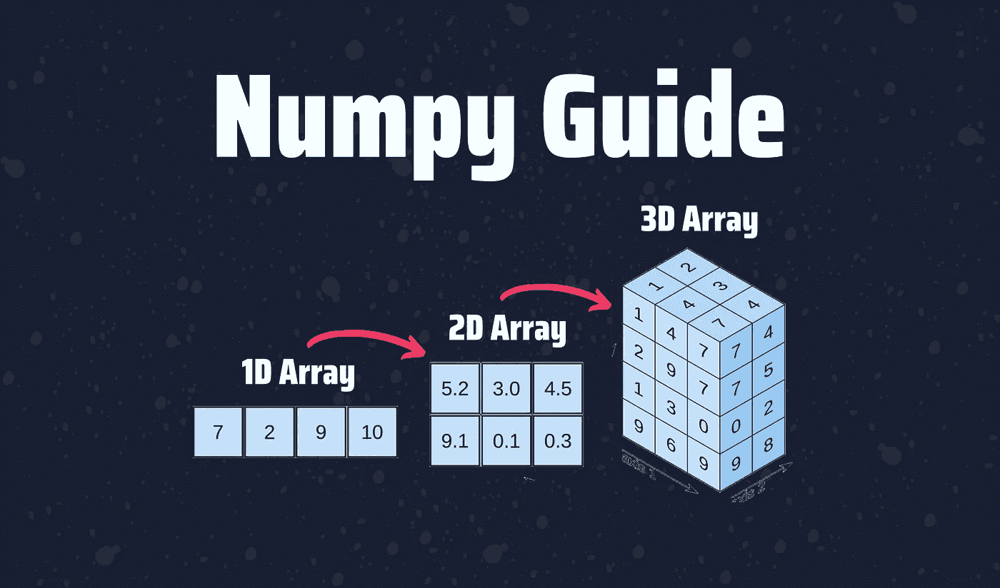

# Python 中 NumPy 的简单指南

> 原文：<https://towardsdatascience.com/numpy-basics-for-people-in-a-hurry-8e05781503f?source=collection_archive---------34----------------------->

## 一个用于数据科学的有用的 Python 库。



作者图片(Canva 上制作)

NumPy 是一个 Python 库，大多数数据科学包如 SciPy(科学 Python)、Matplotlib 和 Scikit-learn 在某种程度上都依赖于它。它增加了对大型多维数组和矩阵的支持，以及对这些数组进行操作的大量高级数学函数。

毫无疑问，如果你是一个数据科学爱好者，Numpy 是一个你应该学习的库。这就是为什么，在本指南中，我将向您展示使用 Numpy 库可以做的所有事情。

下面，您将找到本指南涵盖的主题:

```
**Table of Contents** 1\. [How to Create an Array](#ab1b)
 - [Create arrays from lists](#9254)
 - [Create arrays with 0’s, 1’s, and a random number](#2adf)
 - [Create arrays with a range of elements](#170f)
2\. [Basic Operations](#9853)
3\. [Array Manipulation](#ffcf)
 - [Transposing and Reshaping a matrix](#c675)
 - [Indexing and Slicing](#d1e9)
 - [Concatenate arrays](#99fc)
```

# 入门指南

从本指南开始，让我们安装 Numpy 库。

```
pip install numpy
```

在这之后，我们必须导入库来开始使用 Numpy。

```
import numpy as np
```

# 如何创建数组

在 Numpy 中，大多数时候我们使用数组。数组是一个数值网格，包含有关原始数据、如何定位元素以及如何解释元素的信息。数组的一些例子有向量(一个单列的数组)和矩阵(一个多列的数组)。

在 Numpy 中创建数组有不同的方法。让我们写一些代码来创建数组。

## 从列表创建数组

我们可以从 Python 列表中创建一个数组，我们只需将列表插入到`np.array()`中，如下所示。

```
a = np.array([1,2,3])IN [0]: print(a)
IN [1]: print(f'Dimension: {a.ndim}')OUT [0]: [1 2 3]
OUT [1]: Dimension: 1
```

我们刚刚创建了一个 1D 数组(我们可以使用`.ndim`获得维度)。现在让我们创建一个 2D 数组。

```
b = np.array([[1.5,2,3], [4,5,6]],dtype=float)IN [0]: print(b)
IN [1]: print(f'Dimension: {b.ndim}')OUT [0]: [[1.5 2\.  3\. ]
          [4\.  5\.  6\. ]]
OUT [1]: Dimension: 2
```

2D 数组以矩阵或类似表格的格式存储多个相同类型的数据元素，具有许多行和列。

## 用 0、1 和一个随机数创建数组

我们可以很容易地创建一个用 0 或 1 填充的数组，甚至可以指定维数。

让我们创建一个 2 行 3 列的数组，用 0 填充。

```
IN [0]: np.zeros([2,3])
OUT [0]: array([[0., 0., 0.],
                [0., 0., 0.]])
```

如果你想创建一个 1D 数组，只写你想得到的列数。

```
IN [0]: np.ones(4)
OUT [0]: array([1., 1., 1., 1.])
```

此外，您可以使用`np.full()`创建一个随机数数组

```
IN [0]: np.full([3,3], 8)
OUT [0]: array([[8, 8, 8],
                [8, 8, 8],
                [8, 8, 8]])
```

## 创建包含一系列元素的数组

就像内置的`range()`函数一样，您可以创建一个包含一系列元素的数组。为此，请使用`np.arange()`

```
IN [0]: np.arange(5,30,5)
OUT [0]: array([ 5, 10, 15, 20, 25])
```

上述代码中包含的三个参数是:

*   **start** :返回整数序列的起始整数
*   **stop:** 返回整数序列之前的整数(范围截止于`stop - 1)`
*   **步骤:**整数值，决定序列中每个整数之间的增量

# 基本操作

使用 Numpy 可以轻松执行基本操作，如加、减、乘、除等。

我们将使用下面的 Numpy 数组进行下面的操作。

```
a = np.array([2,3,4])
b = np.array([[3,4,5], [6,7,8]])
```

## 添加

要添加两个或更多数组，使用`np.add(a,b)`或`+`符号。

```
IN [0]: a+b
OUT [1]: np.add(b,a)OUT [0]: [[ 5  7  9]
          [ 8 10 12]]
```

## 减法

要从一个数组中减去另一个数组，使用`np.subtract(a,b)`或`—` 符号

```
IN [0]: a-b
OUT [1]: np.subtract(a,b)OUT [0]: [[-1 -1 -1]
          [-4 -4 -4]]
```

## *乘法*

要将两个数组相乘，使用`np.multiply(a,b)`或`*`符号。

```
IN [0]: a*b
OUT [1]: np.multiply(a,b)OUT [0]: [[ 6 12 20]
          [12 21 32]]
```

## *分部*

要划分两个数组，使用`np.divide(a,b)`或`/`符号。

```
IN [0]: b/a
OUT [1]: np.divide(b,a)OUT [0]: [[1.5  1.33  1.25]
          [3\.   2.33  2\.  ]]
```

## 聚合函数

下面列出了一些有用的聚合函数。

```
a.sum()
a.min()
b.max(axis= 0)
b.cumsum(axis= 1) #Cumulative sum 
a.mean()
np.std(b) #Standard deviation
```

# 数组操作

就像 Pandas dataframes 一样，您可以使用 Numpy 数组进行转置、索引、切片等操作。

## 转置和重塑矩阵

您可以使用`.reshape()` 改变矩阵的形状，并指出您想要的行数和列数。

我们将使用下面的 Numpy 数组来测试转置和整形。

```
IN[0]: c = np.array([4,5,6,7,8,9])
IN[1]: print(c)OUT[0]: [4 5 6 7 8 9]
```

我们将其设置为 2 行 3 列。

```
IN[0]: c.reshape(2,3)
OUT[0]: [[4 5 6]
         [7 8 9]]
```

现在，让我们将其设置为 3 列 2 行，并转置数组。要转置数组，您可以使用`.transpose()`或`.T`

```
IN[0]: c.reshape(3,2)
IN[1]: c.TOUT[0]: [[4 5]
         [6 7]
         [8 9]]IN [1]: [[4 6 8]
         [5 7 9]]
```

## 索引和切片

索引和切片 NumPy 数组的工作方式与 Python 列表相同。让我们看一看。

## 子集化

要获得数组的特定元素，我们可以使用方括号`[]`并指定行和列

```
IN[0]: b = np.array([[3,4,5], [6,7,8]])
IN[1]: b[1,2]OUT[0]: array([[3, 4, 5],
              [6, 7, 8]])IN [1]: 8
```

## 限幅

切片允许访问数组序列的一部分。您可以指定切片的开始位置和结束位置。

```
IN[0]: a = np.arange(5,20,2)
IN[1]: a[0:2]OUT[0]: [5 7 9 11 13 15 17 19]
IN [1]: [5 7]
```

## 布尔索引

我们也可以在方括号中设置条件来过滤掉元素。

```
IN[0]: a = np.arange(5,20,2)
IN[1]: a[a<10]OUT[0]: [5 7 9 11 13 15 17 19]
IN [1]: array([5, 7, 9])
```

# 串联数组

您可以用`np.concatenate()`连接两个数组。默认情况下，它的轴=0(行)

```
a = np.array([[1, 2], [3, 4]])
b = np.array([[5, 6], [7, 8]])IN[0]: np.concatenate((a, b))
OUT[0]: array([[1, 2],
               [3, 4],
               [5, 6],
               [7, 8]])
```

如果您想要按列连接，请设置 axis=1。

```
IN[0]: np.concatenate((a, b), axis=1)
OUT[0]: array([[1, 2, 5, 6],
               [3, 4, 7, 8]])
```

就是这样！本指南所写的所有代码都可以在我的 [Github](https://github.com/ifrankandrade/data_preprocessing.git) 上找到。你可以把它和熊猫一起使用来解锁更多的 Numpy 功能。下面是使用 Pandas 和 Numpy 库从 Excel 迁移到 Python 的指南。

</a-complete-yet-simple-guide-to-move-from-excel-to-python-d664e5683039>  

[**与 3k 以上的人一起加入我的电子邮件列表，获取我在所有教程中使用的 Python for Data Science 备忘单(免费 PDF)**](https://frankandrade.ck.page/bd063ff2d3)