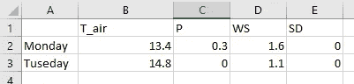
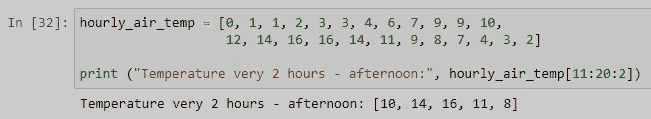

# 初学者的 Numpy

> 原文：<https://towardsdatascience.com/numpy-for-beginners-ba9ca0bba441?source=collection_archive---------25----------------------->

## 承载你的数据科学项目的沉默巨人

Geran de Klerk 在 [Unsplash](https://unsplash.com?utm_source=medium&utm_medium=referral) 上拍摄的照片

到目前为止，我们已经大致了解了 [Python 编程](https://medium.com/geekculture/how-to-start-coding-with-python-aa84534305d9)，哪些[操作符何时使用](https://medium.com/geekculture/python-operators-certainly-not-very-interesting-but-very-important-dac777c21c59)和[如何简化可重复的任务或者使用控制流](/python-for-beginners-control-flow-b086713ba6bf)做出决策。因为在水文学(&气象学)中，我们主要与大量数字打交道，所以我们需要进一步研究可以帮助我们处理大量数字的工具。因此，本文涵盖了数据科学界非常流行的库 Numpy。

这篇文章的结构如下:

*   介绍
*   创建数组
*   塑造和重塑
*   访问元素和分割数组
*   Numpy 的数学和统计
*   额外内容 Numpy 的速度优势
*   结论

享受学习的乐趣！

# 介绍

为什么要用 Numpy？打印时，整数或浮点数的 Python 列表看起来与 **Numpy 数组**完全一样。两者都可以对一堆数字进行数学运算，两者都可以进行统计计算和比较……所以你可能认为 Numpy 只是一个数学库，具有与列表相似的功能，但真的是这样吗？让我解释一下…

Numpy 数组中的数据是同质类型的，这意味着数组中的所有数据都是同一类型，而列表只是指向对象的指针，即使所有数据都是同一类型。因此，Numpy 数组使用的内存比常规列表少得多。此外，大多数 Numpy 操作都是用 C 语言实现的，这意味着避免了 Python 循环和数据类型动态检查的开销。与 Python 列表相比，这显著提高了处理速度。

我们经常会遇到包含数万行数据的大型数据集，只要想想某个国家或地区的每小时气温测量值就知道了，因为测量是从该地区开始的。如果你的气象服务正在测量过去 50 年的每小时气温，那么仅仅一个气象站就有超过 400 000 行的数据。

## 如何安装 Numpy？

如果使用 Anaconda，Numpy 是预安装在基础环境中的。然而，通常情况下，为新项目创建新环境是一个好的实践。要安装 Numpy，我们运行 Anaconda 提示符并键入:

> 康达安装数量

或者

> conda install -c 蟒蛇 numpy

如果正在使用 pip，可以通过键入以下命令来安装 Numpy:

> pip 安装数量

## 如何导入 Numpy？

当导入包括 Numpy 在内的某些库时，我们遵循一个约定，基本上这意味着我们对库使用公认的缩写。在 Numpy 的情况下，我们使用“ **np** ”。

> 将 numpy 作为 np 导入

目标是我们的代码是可复制的，并且世界上的每个 Python 程序员都知道下面这行代码的作用:

> a = np.array([3，4])

恭喜你，如果你已经导入了 Numpy，并且使用了上面的命令，你已经成功地创建了你的第一个 **Numpy 数组**。让我们看看如果把它打印出来会发生什么。打印给我们一些看起来像列表的东西，但它不是。当我们检查类型时，我们看到这是一个" **numpy.ndarray** " ( *n 维数组*)。

作者图片

## 向量？

在这个例子中，我们看到了如何创建一维数组。如果你还记得数学中的向量，一维 Numpy 数组基本上是一个向量。由于我们给出了两个数字，3 和 4，这个向量位于 2 维空间(几何平面)。这和数学中有一个矢量是一样的。

> v= 3i + 4j

摘自:[https://en.wikiversity.org/](https://en.wikiversity.org/)

在计算机科学中，向量只是列表，其中列表的长度(在我们的例子中是 2)是向量的维数。在数据科学术语中，向量代表一个或多个对象的特征。想想周一的气象测量，你可以测量气温、降雨量、风速、积雪深度等。要了解更多关于矢量的知识，我强烈推荐 3Blue1Brown 的视频。

# 创建数组

上面我们已经看到了如何在 Numpy 中创建一个简单的一维数组。通常，我们的数据来自更多的维度，我们有多个特征(如上)，但也有一周中多天的测量。在这种情况下，我们需要向数组中添加第二个维度。让我们来看一些二维数组。

作者图片

为了创建一个二维数组，我们提供了一个包含两个列表的列表。将该数组视为周一(第一行)和周二(第二行/列表)的测量值，其中第一列是气温，第二列是降水量，第三列是风速，第四列是积雪深度。excel 截图应该把事情说清楚了。

作者图片

Numpy 还提供了一些有用的函数来创建 0 或 1 的数组。自己尝试以下命令，并打印出结果。

为了演示如何获得新创建的数组的维数，我将使用 **np.ones** 函数和 **ndim** 属性。

我们的数组是四维的，但是四维数组是什么样子的呢？

作者图片

如果我们仔细观察，我们可以确定维数，如果我们计算数组开头或结尾的方括号，这也是一个方便的方法🙂

另一个有用的方法是 **arange** 。它用于获得均匀间隔的数组。我们需要指定**结束号** ( **int** 或 **float** )。

Numpy 然后假设起点是零。我们还可以提供**起点**和**终点**。

并且，我们可以指定**步骤**如下:

类似地，使用方法 **linspace** 我们可以创建一个数组，但是代替步骤的是， **linspace** 获取数组中元素的数量。在这里，我们创建了一个包含 7 到 12 个元素的数组。同样，与 **np.arange** 和大多数 Python 方法相反，这里的最后一个数字(结束数字)是包括在内的**。**

# 塑造和重塑

之前，我们检查了我们的*one*数组有多少个维度(或轴)。但是如果我们对每个维度中有多少元素感兴趣呢？shape 属性就派上用场了。因为我们有 4 个维度，所以我们得到 4 个数元组。

作者图片

为了计算整个数组中元素的数量，我们使用了 size 属性。

作者图片

为了改变数组的形状，我们使用。shape()方法。不过要小心，新整形的数组必须和旧的一样大。让我解释一下..

作者图片

最初的零数组具有(2，3)的形状，我们可以将其整形为(3，2)、(6，1)或(1，6)，因为它的大小为 6 个元素。我要提到的是，在将它重新整形为(6，1)或(1，6)的情况下，我们将维数从二维数组更改为一维数组，但是只要我们注意数组的大小，我们就是安全的。

一维数组的一个便捷“捷径”是 **flatten()** 和 **ravel()** 方法。不同之处在于 **flatten** 创建原始数组的一维副本，而 **ravel** 创建对原始数组的引用。因此，使用 ravel()的结果是改变了新创建的数组中的一些数据，同时也改变了原始数组中的数据。

用法取决于具体的任务，大多数时候我使用的是 **flatten()** 方法。

作者图片

最后但同样重要的是，我们不要忘记 transpose()方法。这个方法只是交换数组的行和列。

作者图片

在这种情况下，结果与之前的整形相同。在多维数组的情况下，所有的维度都被交换，让我们看看。

作者图片

# 访问元素和分割数组

到目前为止，我们已经了解了如何创建、寻找比例以及重塑或展平数组。现在让我们把注意力转向使用**索引**和**切片**从数组中提取数据。对数组进行**切片**意味着通过提供想要的元素**索引**来访问它的元素。

切片的默认语法包括数组名和方括号，就像 Python 列表一样，如下所示:

> 数组名称[开始索引:结束索引:步长大小]

作者图片

在我们的阵列中，温度测量从 1:00 开始。为了说明问题，我们打印出了 12:00、14:00、16:00、18:00 和 20:00 的每小时温度。

如果我们不定义步长，指定范围内的每个元素都会被返回。例如，如果我们需要从 7:00 到 12:00 的每小时温度。

作者图片

在列表中通常如此，在 Numpy 中也是如此，start_index 包含在内，而 end_index 不包含在内。此外，数组中的第一个索引始终为零。因此，为了访问 7:00 的温度，我们输入第 6 个索引。由于我们需要测量到 12(在第 11 个索引处)，我们提供了第 12 个索引(不包括)。

## 分割二维数组

当分割一个二维数组时，我们需要指定我们想要的元素的行和列。一开始可能有点棘手，但是当在几个例子中尝试后，很快就会变得非常简单。

对二维数组进行切片的语法如下:

> array _ name[行 _ 开始 _ 索引:行 _ 结束 _ 索引:行 _ 步长大小，列 _ 开始 _ 索引:列 _ 结束 _ 索引:列 _ 步长大小]

为了了解如何分割一个二维数组，我首先将 weather_data 数组扩展到一整周，这样我们将得到一个 shape (7，4)数组。

作者图片

假设我们想知道每周的降水量。所以我们需要切掉所有的行和第二列。

作者图片

在本例中，为了选择所有的行，我们使用了一个**冒号**符号( **:** ) **。**为了选择第 2 列，我们使用索引值为 1 的**(记住，**索引从零开始**)。**

**随意尝试其他的可能性，我会比较数学中的切片和积分，有一定的规则可循，*但是熟能生巧*。**

**负切片也是允许的，其工作方式与 python 列表相同。数组中的最后一项的索引为-1。**

## **在数组中“查找”数据**

**在数组中查找数据的另一种方法是使用 Numpy 中一个非常流行的函数， **np.where()** 。该函数返回满足条件的元素的索引。通常，它用于查找大于、等于或小于一个数字的元素。 **np.where()** 的基本语法如下:**

> **np.where(条件[，x，y])**

****x** 和 **y** 是参数，可以用来用**替换**数组中满足给定条件的值。要么**我们不提供** **x 和 y** (我们只需要找到满足条件的索引或值)，要么**提供 x 和 y** 然后找到的索引处的值由 **x(如果为真**)改变，或者 **y(如果条件为假**)。非常类似于 MS Excel 中的 **IF()** 函数。**

**假设我们想打印出气温高于 14.5 摄氏度的日子的指数。**

****

**作者图片**

**这里我们有两件重要的事情:首先，我们使用上面学到的切片来选择第一列(所有行，因为我们搜索所有工作日)，然后我们设置条件> 14.5。**

**假设我们想要将所有大于 14.5 的温度值转换为华氏温度，并将结果数组存储到变量 **weather_b** 。**

****

**作者图片**

**同样，我们首先提供一个条件(> 14.5°C)，然后我们给出如果**为真**时使用什么值(将该值乘以 1.8 并加 32)，如果**为假**时使用什么值(使用现有值)。注意，我们总是对数组进行切片，因为我们只处理第一列。**

**我们现在可以创建一个名为 weather_f(与 weather_data 相同)的新数组，但是温度值将被替换为 Fahrenheits 中的值。**

****

**作者图片**

**首先，我们复制一份 weather_data(记住 flatten()和 ravel()方法)，以避免原始 weather_data 数组发生变化，然后我们对新的 weather_f(第一列)进行切片，并用 weather_b 中计算的值替换这些值。**

# **Numpy 的数学和统计**

**最后，我们来到了我最喜欢的数字部分，数学和统计运算。在我看来，这就是 Numpy 如此伟大的原因，它优于普通列表的相同操作。这是处理大量数字数据时的简单性和速度优势。我们先来看看数学运算。我会提供一个关于除法的例子，但是一般的语法对于其他运算是一样的，可以在官方的 [Numpy pages](https://numpy.org/doc/stable/reference/routines.math.html) 中查找。**

**我们的 weather_data 数组包含以毫米为单位的降水数据，让我们将它们转换成米。要将毫米转换成米，我们需要将数值除以 1000。**

****

**作者图片**

**我们再次使用切片来选择数组的第二列，并将值除以 1000。在实践中，尝试用转换成米的值替换 weather_f 数组中的降水值。(您可以直接在 weather_f 数组上进行更改)**

**至于统计示例，我将使用最常见的情况，我们需要计算一周的平均温度、降水量、风速和雪深值。计算平均值的 Numpy 函数称为 **np.mean()** 。 **np.mean()** 函数的基本语法如下:**

> **np.mean(a，axis=None，dtype=None，out=None，keepdims= <no value="">，*，where= <no value="">)</no></no>**

**对于我们的情况，重要的部分是轴。因为我们的目标是计算每一列的平均值，所以我们需要将轴参数设置为 0。将轴设置为 1，将产生行方式的结果。**

****

**作者图片**

**其他统计函数保留了相同或相似的语法，可以在 Numpy 官方网站的[统计部分](https://numpy.org/doc/stable/reference/routines.statistics.html)中查找。**

# **额外内容 Numpy 的速度优势**

**我提到过 Numpy 也有一些速度优势，这可能会让你动心。让我们看看实际情况。Numpy 真的比 for 循环快吗？**

**首先，我们将创建一个随机的浮动数组，假设它是在美国某个地方测量的每小时气温。数组的长度是 30 000。**

****

**作者图片**

**我们想把这些数字转换成摄氏度。让我们使用 for 循环和 Python 列表来测量所需的时间，然后使用 Numpy。**

****

**作者图片**

**因此，在 Python 列表上使用循环所花费的时间大约为 5 ms，而使用 Numpy 数组，相同的操作花费的时间不到 1 ms。因此，在这个特定的情况下(任务), Numpy 大约快 5 倍。**

**此外，请考虑这个测试并不完全适用，它真的取决于你的计算机的速度(主要是 CPU)和选择的任务。因为这不是本文的主题，所以我将把它留给您去查看其他介绍 Numpy 的速度优势的文章，并且希望您自己在使用数据的特定任务上尝试一下。**

# **结论**

**恭喜，我们已经介绍了 Numpy 的基础知识。但是请记住，Numpy 远不止这些，练习很重要。这里，我主要介绍了我在任务和项目中经常使用的函数，但是 Numpy 中还有更多函数和方法。**

**请务必查看 Numpy 官方网站，了解更多与您的项目或任务相关的有用信息。一开始不要气馁，所有这些语法看起来都有点复杂，但是相信我，比你想象的要快，你会很快采用它们。🙂**

**我的下一篇文章将介绍数据科学应用程序中另一个流行的库，名为 Pandas。请继续收听，直到下次继续练习，因为熟能生巧。**

**对于这篇文章或我在[媒体](https://medium.com/@Karlo_Leskovar)上的其他文章有任何问题或建议，欢迎通过 [LinkedIn](https://www.linkedin.com/mwlite/in/karlo-leskovar-a8612b105) 联系我。**

**感谢您抽出时间，干杯！🙂**