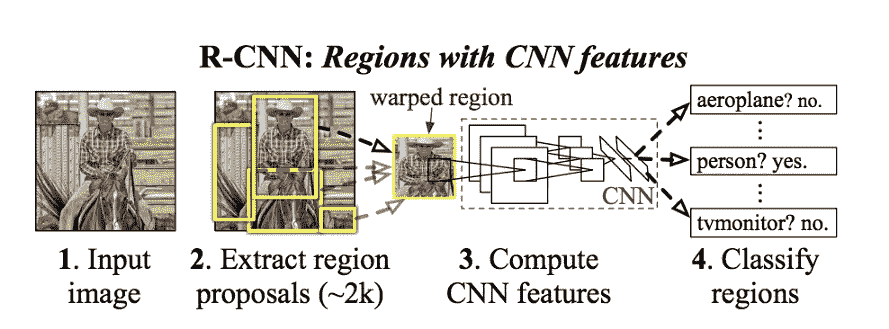
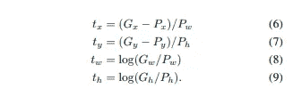
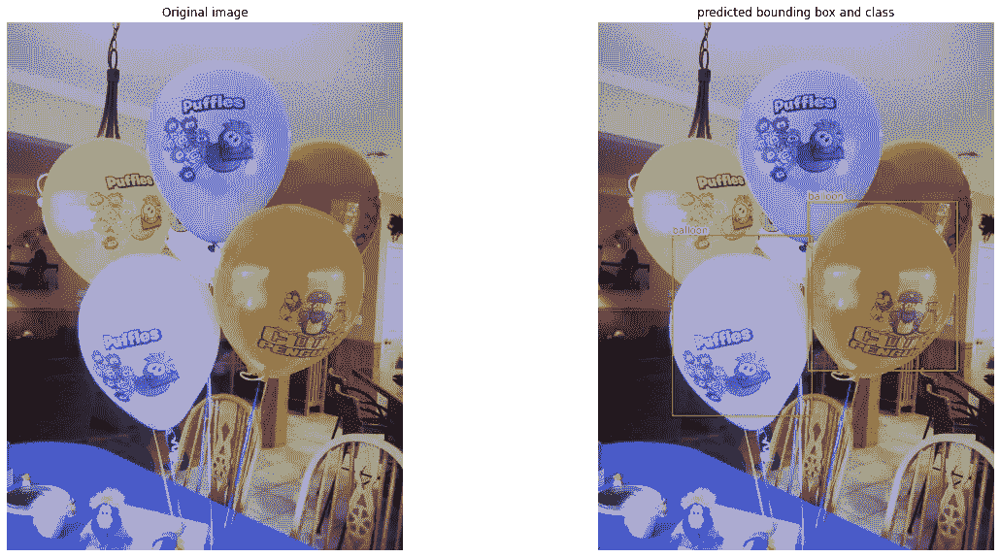

# 物体探测解释:R-CNN

> 原文：<https://towardsdatascience.com/object-detection-explained-r-cnn-a6c813937a76?source=collection_archive---------3----------------------->

[马特·阿特兹](https://unsplash.com/@mattartz)途经 [Unsplash](https://unsplash.com/photos/2hPCkRAkVbY)

## 基于区域的卷积神经网络

目标检测包括两个独立的任务，即分类和定位。R-CNN 代表基于区域的卷积神经网络。R-CNN 系列背后的关键概念是地区提案。区域建议用于定位图像中的对象。在接下来的博客中，我决定写一些在物体检测中使用的不同方法和架构。因此，我很高兴从基于 R-CNN 的物体探测器开始这次旅程。

# 工作细节

RCNN:工作细节。来源:【https://arxiv.org/pdf/1311.2524.pdf[。](https://arxiv.org/pdf/1311.2524.pdf)

如上图所示，在将图像通过网络之前，我们需要使用选择性搜索等算法提取区域建议或感兴趣区域。然后，我们需要调整(包装)所有提取的作物，并通过网络传递它们。

最后，网络从 C + 1 中分配一个类别，包括给定作物的“背景”标签、类别。此外，它还预测 delta Xs 和 Ys 来塑造给定的作物。

# 提取区域建议

选择性搜索是一种用于对象定位的区域提议算法，它基于区域的像素强度将区域分组在一起。因此，它根据相似像素的层次分组来对像素进行分组。在原始论文中，作者摘录了大约 2000 条建议。

# 正面和反面的例子

在我们提取我们的区域提案之后，我们还必须为它们添加标签以便进行培训。因此，作者将 IOU 至少为 0.5 的所有提案标上任何基本事实边界框及其相应的类别。但是，IOU 低于 0.3 的所有其他区域提案都被标记为背景。因此，其余的都被忽略了。

# 包围盒回归

包围盒回归。来源:[https://arxiv.org/pdf/1311.2524.pdf](https://arxiv.org/pdf/1311.2524.pdf)[。](https://arxiv.org/pdf/1311.2524.pdf)

上图显示了 CNN 预测的三角洲。所以，x，y 是中心坐标。而 w、h 分别是宽度和高度。最后，G 和 P 分别代表地面实况包围盒和区域提议。值得注意的是，边界框丢失仅针对正样本进行计算。

# 失败

总损失计算为分类和回归损失的总和。但是后一个有一个系数λ，原文中是 1000。注意，对于负面例子，回归损失被忽略。

# 体系结构

通常，我们通过 VGG 16 或 ResNet 50 传递调整后的裁剪，以获得特征。它们随后通过输出预测的完全连接的层。

如果你想看完整的代码，你可以很容易地在我的 [GitHub 上找到一个木星笔记本。](https://github.com/chingisooinar/Object-Detection_from-Scratch/blob/main/RCNN/RCNN.ipynb)

# 一些遗言

[气球数据集](https://github.com/matterport/Mask_RCNN/releases)

我只训练了它 5 个时期，所以你可以看到它能够检测到图像中的一些气球。为什么不再使用它有几个缺点。最大的缺点是用于提议提取的选择性搜索算法。考虑到算法是在 cpu 上执行的，推理时间变得很慢。此外，所有提案都必须调整大小并通过网络传递，这也增加了开销。因此，我将写一些其他的算法来克服这些问题。

# 纸

[丰富的特征层次，用于精确的对象检测和语义分割](https://arxiv.org/pdf/1311.2524.pdf)

# 相关文章

 [## R-CNN，快速 R-CNN，更快 R-CNN，YOLO —目标检测算法

### 了解对象检测算法

towardsdatascience.com](/r-cnn-fast-r-cnn-faster-r-cnn-yolo-object-detection-algorithms-36d53571365e)  [## 了解用于对象检测的选择性搜索

### 用 Python 实现

medium.com](https://medium.com/dataseries/understanding-selective-search-for-object-detection-3f38709067d7)