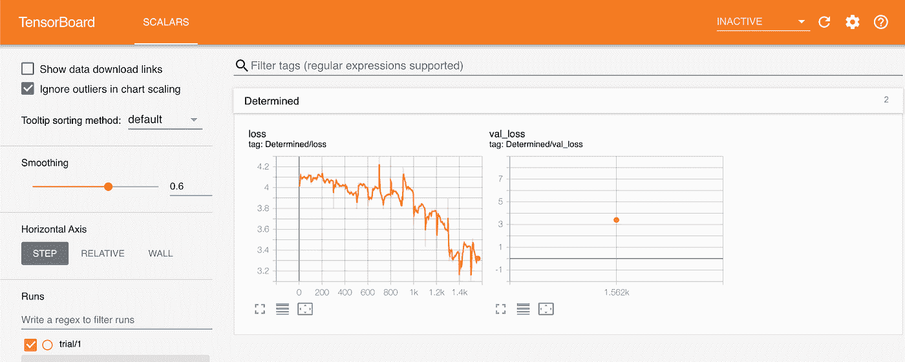
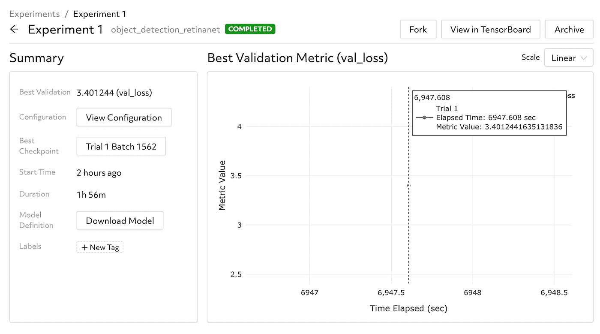
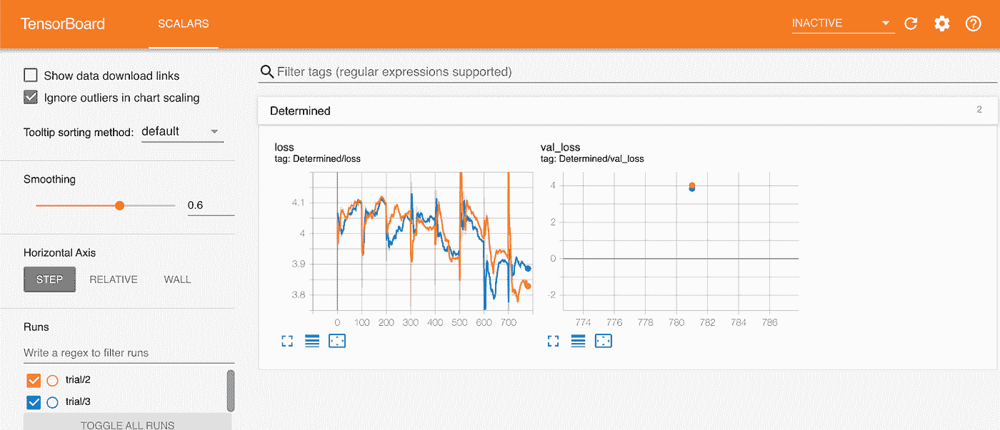
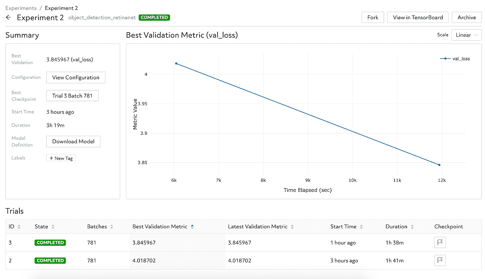

# 使用 Keras 和确定的对象检测

> 原文：<https://towardsdatascience.com/object-detection-with-keras-and-determined-2120e7ef2df9?source=collection_archive---------36----------------------->

由萨姆希塔·阿拉和尼尔·康威组成


照片由[社拍摄。从](https://unsplash.com/@socialcut)[去毛刺](https://images.unsplash.com/photo-1517707711963-adf9078bdf01?ixid=MXwxMjA3fDB8MHxwaG90by1wYWdlfHx8fGVufDB8fHw%3D&ixlib=rb-1.2.1&auto=format&fit=crop&w=1350&q=80)处切掉

目标检测是计算机视觉中的一项重要任务。使用深度学习进行对象检测可以产生高度准确的模型，但开发人员也可能遇到几个挑战。首先，深度学习模型的训练成本非常高——即使使用 GPU，现代物体检测模型也可能需要许多小时的计算才能从头开始训练。管理这些 GPU 并在许多 GPU 上并行运行工作负载变得非常复杂。第二，对象检测模型通常具有许多超参数。虽然存在自动调整超参数的算法，但是[在实践中应用这些算法](https://determined.ai/blog/why-does-no-one-use-advanced-hp-tuning/)需要运行数百或数千个训练任务，并比较所有这些模型的性能。谈复杂！

Determined 使得训练深度学习模型和调整超参数变得更加容易。它可以自动将作业调度到一个 GPU 集群(本地或云中)上，并包括用于高效超参数调整的一流算法。它提供了一个实时仪表板来跟踪和可视化结果，使您能够清楚地了解您的模型的实时表现——作为一名模型开发人员，您可以快速启动培训工作或惠普搜索，并确定将处理其余工作。

Determined 还可以轻松地同时利用多个 GPU，这意味着您可以更快地训练单个模型(使用[分布式训练](https://docs.determined.ai/latest/how-to/distributed-training.html))或在更短的时间内搜索巨大的超参数空间——无需修改代码或手动管理 GPU。Determined 让您专注于模型开发，因此您可以更快地从一个想法变成生产中的工作模型。

> *决心比看上去的要多得多！要了解决心还能做什么，请查看* [*文档*](https://docs.determined.ai/latest/) *！*

在本教程中，您将从在 AWS 上安装 Determined 开始，然后修改一个现成的`tf.keras`对象检测模型来使用 Determined。接下来，您将在单个 GPU 上训练模型，最后进行超参数搜索。

正在使用的模型基于使用 Keras 教程的 RetinaNet 的[对象检测。](https://keras.io/examples/vision/retinanet/)

# RetinaNet 目标检测模型概述

RetinaNet 是一个两级检测器，它可以定位和检测图像中的物体。它使用特征金字塔网络在多个尺度上检测对象，并引入新的损失，焦点损失函数，以缓解前景-背景类别极端不平衡的问题。要深入了解该模型，可以参考原文，[密集物体探测的焦损](https://arxiv.org/abs/1708.02002)。

# 设置已确定

我已经在 AWS p2.xlarge (P2)实例上部署了深度学习模型。但是，您可以使用 GCP 或者自己选择的本地 Linux 实例。运行主服务器的实例应该至少有 200GB 的磁盘空间；每个代理实例应该有 50GB 的磁盘空间。对于本教程，我们将使用单个代理，并将主代理和代理部署到同一个 AWS 实例。

要在单个 AWS 实例上安装 Determined，请按照下列步骤操作:

> 每一步都附有与 Amazon Linux/RHEL/CentOS Linux 实例兼容的代码。

**步骤 1** :设置您的 Linux 实例——AWS、GCP 或内部部署。

**步骤 2** :确保 Python3 和 Docker 安装在您的 Linux 实例上。

```
sudo yum install python3 docker
```

第三步:启动 docker 服务。

```
sudo service docker start
```

**步骤 4** :给 docker 套接字分配全局读、写和执行权限。(*这不是生产系统的推荐做法！*)

```
sudo chmod 777 /var/run/docker.sock
```

**步骤 5** :使用 pip 安装`det-deploy`，这是一个工具，我们将用它来安装已确定系统的其余部分。

```
sudo pip3 install determined-deploy
```

**第六步**:使用 pip 安装 Determined 的 CLI。CLI 用于提交新的深度学习工作负载，以供所确定的系统的其余部分执行。

```
sudo pip3 install determined-cli
```

**第七步**:设置 DET_MASTER 环境变量；这将告诉 CLI 所确定的主服务器正在运行的 IP 地址或主机名。在本例中，我们将主服务器部署到安装了 det-deploy 的同一个实例，因此我们可以使用“localhost”。

```
export DET_MASTER=<master-hostip>
```

**第八步**:调出确定的主人和代理。

如果您的系统有 GPU，请确保安装了 NVIDIA 驱动程序，以及 NVIDIA 容器工具包。参考链接:[特斯拉](https://docs.nvidia.com/datacenter/tesla/tesla-installation-notes/index.html)和[集装箱工具包](https://docs.nvidia.com/datacenter/cloud-native/container-toolkit/install-guide.html)

如果您使用带有 GPU 的 AWS 实例，请运行以下命令:

```
det-deploy local cluster-up
```

如果您使用不带 GPU 的 AWS 实例，请运行以下命令:

```
det-deploy local cluster-up --no-gpu
```

现在，您应该在工作区中设置了一个确定的集群。

> 上述过程不是安装 Determined 的唯一方法；对于生产部署，建议您在单个实例(无 GPU)上运行 master，并配置 Determined，以便在提交新的深度学习工作负载时，自动供应配备 GPU 的实例，称为“动态代理”。有关更多详细信息，请查阅[安装文档](https://docs.determined.ai/latest/how-to/install-main.html#install-cluster)。

# 调整 RetinaNet 以使用 Determined

将模型移植到 Determined 包括使模型与 Determined API 兼容。有关修改现有模型代码以使用 Determined 的更多信息，请查看 [Determined tf.keras 教程](https://docs.determined.ai/latest/tutorials/tf-mnist-tutorial.html#tf-mnist-tutorial)。

一旦我们的模型代码适应了 Determined，我们将训练模型的单个实例并执行超参数搜索——而不改变我们的模型代码！

你可以在这里下载模型源代码[。](https://determined.ai/assets/images/blogs/determined-writers-program/object-detection/model-def.py)

## 概观

将模型移植到 Determined 的 API 通常很简单；如果我们有一个现有的训练脚本，大部分代码可以保持不变，我们只需要“重构”它以适应四个不同的步骤:

*   初始化您的模型
*   定义您的模型
*   加载训练数据集
*   加载验证数据集

你首先要初始化一个模型。这一步包括定义训练模型时可能需要的所有超参数。

接下来，定义模型的层，以及使用的优化器和损耗。

分别加载训练和验证模型所需的训练和验证数据。

然后在一个基于 TensorFlow 的试验类中安排这四个方法——一个继承自[determined . keras . tfkerastrial](https://docs.determined.ai/latest/reference/api/keras.html#determined.keras.TFKerasTrial)类的 Python 类，如下所示:

这个试验类定义了你的模型的原型。

深度学习算法建模中通常涉及的实际训练和测试程序如何？

已确定提供内置的训练循环，在加载训练数据后会自动调用该循环。它记录训练和验证指标，并定期检查模型的状态。

有了原型之后，定义每个试验类方法。

## 初始化

这一步涉及到我们在 Python 类中看到的典型的`__init__()`方法。Determined 向该方法传递一个参数 [TrialContext](https://docs.determined.ai/latest/reference/api/trial_context.html#determined.TrialContext) ，该参数包含有关训练时使用的超参数的信息，以及其他有用的数据。

对于当前的对象检测模型，将上下文存储到实例变量中。

```
**def** __init__(self, context: TFKerasTrialContext):
    self.context = context
```

创建一个名为`startup-hook.sh`的文件，内容如下所示。一个[启动钩子](https://docs.determined.ai/latest/how-to/custom-env.html#startup-hooks)是一个特殊的文件，在调用用户的模型代码之前，它将在每个试验容器的启动过程中被执行。这对于定制容器环境(例如，设置环境变量)和安装额外的依赖项很有用。在这种情况下，我们将使用一个启动钩子来安装`tensorflow_datasets`库:

```
pip install -q -U tensorflow-datasets==4.1.0
```

## 构建模型

这一步包括定义模型的架构。试用类中的 [build_model()](https://docs.determined.ai/latest/reference/api/keras.html#determined.keras.TFKerasTrial.build_model) 方法返回一个编译后的 **tf.keras.Model** 对象。在这个方法中，模型在编译之前必须通过调用[self . context . wrap _ model()](https://docs.determined.ai/latest/reference/api/keras.html#determined.keras.TFKerasTrialContext.wrap_model)进行包装，优化器需要通过调用[self . context . wrap _ optimizer()](https://docs.determined.ai/latest/reference/api/keras.html#determined.keras.TFKerasTrialContext.wrap_optimizer)进行包装。

```
**def** build_model(self):
    resnet50_backbone = get_backbone()
    loss_fn = RetinaNetLoss(self.context.get_hparam("num_classes"))
    model = RetinaNet(self.context.get_hparam("num_classes"), resnet50_backbone)
    model = self.context.wrap_model(model)
    learning_rate_fn = tf.optimizers.schedules.PiecewiseConstantDecay(
        boundaries=[125, 250, 500, 240000, 360000],
        values=self.context.get_hparam("learning_rate")
    )

    optimizer = tf.optimizers.SGD(learning_rate=learning_rate_fn, momentum=0.9)
    optimizer = self.context.wrap_optimizer(optimizer)
    model.compile(loss=loss_fn, optimizer=optimizer)
    **return** model
```

## 加载数据

接下来，分别使用方法[build _ training _ data _ loader()](https://docs.determined.ai/latest/reference/api/keras.html#determined.keras.TFKerasTrial.build_training_data_loader)和[build _ testing _ data _ loader()](https://docs.determined.ai/latest/reference/api/keras.html#determined.keras.TFKerasTrial.build_validation_data_loader)加载训练和测试数据集。Determined 支持几个将数据加载到 tf.keras 模型中的 API，包括 tf.keras.Sequence、tf.data.Dataset，甚至一对 NumPy 数组(用于小型数据集或测试运行)。

现在，将对象检测数据加载到一个 [tf.data.Dataset](https://www.tensorflow.org/api_docs/python/tf/data/Dataset) 对象中。

```
**def** build_training_data_loader(self):
    label_encoder = LabelEncoder()
    train, dataset_info = tfds.load(
        "coco/2017", split="train[:5%]", with_info=True
    )

    autotune = tf.data.experimental.AUTOTUNE
    train = train.map(preprocess_data, num_parallel_calls=autotune)
    train = self.context.wrap_dataset(train)
    train_dataset = train.cache().shuffle(8 * self.context.get_hparam("batch_size"))
    train_dataset = train_dataset.padded_batch(
        batch_size=self.context.get_hparam("batch_size"),
        padding_values=(0.0, 1e-8, -1),
        drop_remainder=True
    )

    train_dataset = train_dataset.map(
        label_encoder.encode_batch, num_parallel_calls=autotune
    )

    train_dataset = train_dataset.apply(tf.data.experimental.ignore_errors())
    train_dataset = train_dataset.prefetch(autotune)

    **return** train_dataset
```

类似地，使用一个 [tf.data.Dataset](https://www.tensorflow.org/api_docs/python/tf/data/Dataset) 对象加载测试数据。

```
**def** build_validation_data_loader(self):
    label_encoder = LabelEncoder()
    test, dataset_info = tfds.load(
        "coco/2017", split="validation", with_info=True
    )

    autotune = tf.data.experimental.AUTOTUNE
    test = test.map(preprocess_data, num_parallel_calls=autotune)
    test = self.context.wrap_dataset(test)
    test_dataset = test.padded_batch(
        batch_size=1, padding_values=(0.0, 1e-8, -1), drop_remainder=True
    )

    test_dataset = test_dataset.map(label_encoder.encode_batch, num_parallel_calls=autotune)
    test_dataset = test_dataset.apply(tf.data.experimental.ignore_errors())
    test_dataset = test_dataset.prefetch(autotune)
    **return** test_dataset
```

确保包含运行模型所需的其他函数。该模型的完整源代码可以在[这里](https://determined.ai/assets/images/blogs/determined-writers-program/object-detection/model-def.py)找到。

## 训练模型

现在您已经构建了您的试验类，是时候定义超参数来训练您的模型了。为此，创建一个[实验](https://docs.determined.ai/latest/topic-guides/system-concepts/terminology-concepts.html#concept-experiment)，通过在`const.yaml`文件中定义超参数来训练模型的单个实例。

以下是对其中一些设置的详细描述:

*   `global_batch_size`:用于训练的批量。每个实验都必须指定。
*   `num_classes`:数据集中存在的类的数量。
*   `records_per_epoch`:用于训练的每个历元的记录数。
*   `searcher`:如何寻找实验的超参数空间。暂时设置为`single`不做超参数搜索。
*   `metric`:评估模型性能的验证度量的名称。
*   `max_length`:模型应该训练多长时间。在这种情况下，我们配置 Determined 来根据 20 个时期的训练数据训练模型。一个时期中的记录数由上面的`records_per_epoch`变量设置，因此这相当于在 100，000 条数据记录上训练模型。
*   `entrypoint`:试验班名称。`model_def`是 Python 文件，`ObjectDetectionTrial`是类。
*   `environment`:这里我们配置任务环境使用 TensorFlow 2.2，这是该模型所需要的。默认情况下，确定使用 *TensorFlow 1.x* 。

要了解更多关于实验配置的信息，请参见[实验配置参考](https://docs.determined.ai/latest/reference/experiment-config.html#experiment-configuration)。

## 进行实验

原型制作完成后，您现在可以使用确定的 CLI 创建一个实验。为此，请使用以下命令:

```
det experiment create -f const.yaml .
```

`‘.’`指定要使用的目录(`.`表示当前目录)，而`const.yaml`是您之前创建的配置文件。`-f`标志用于在您的终端上打印详细的输出，并实时“跟踪”实验的进度。

## 评估模型

模型评估由 Determined 自动完成。要查看输出，请转到`http://<master-hostname>:8080`并使用空密码作为“已确定”用户登录。

您可以选择您的实验，并在 TensorBoard 中查看训练和验证损失曲线。



作者图片

使用上述设置训练模型，我们得到约 3.40 的验证损失。

您还可以观察最佳验证指标和检查点，如确定的仪表板中所提供的。



作者图片

## 调整超参数

超参数调整是训练和评估模型的重要步骤。该模型的有效性和准确性高度依赖于其超参数的值。然而，超参数搜索是一个具有挑战性的问题，既耗时又难以跟踪。

Determined 为用户提供了一个易于使用的超参数搜索界面，以自动使用内置算法，跟踪和可视化实验。

Determined 提供了多种[搜索算法](https://docs.determined.ai/latest/topic-guides/hp-tuning-det/index.html#topic-guides-hp-tuning-det)，您可以使用其中任何一种算法来执行您的超参数搜索。对于大多数情况，[“adaptive _ Asha”搜索方法](https://docs.determined.ai/latest/topic-guides/hp-tuning-det/hp-adaptive-asha.html#topic-guides-hp-tuning-det-adaptive-asha)通常是一个不错的选择:它是一种基于早期停止的最先进技术，通过有原则地定期放弃低性能超参数配置，优于随机搜索等传统技术。

用以下内容创建一个新文件`adaptive.yaml`:

Determined 让模型开发人员来声明哪些超参数是重要的，并为这些超参数中的每一个定义搜索空间。在这种情况下，除了学习率之外，我们保持所有超参数固定不变，在学习率中，我们指定了一个可能的学习率列表来研究。

这里，我们将`adaptive_asha`搜索器配置为总共探索两个不同的超参数配置，并针对最多十个时期的训练数据训练每个配置。这是一个最小的超参数搜索，所以它应该运行得很快！

使用`det experiment create -f adaptive.yaml .`命令创建实验后，您可以查看与两次试验相对应的训练和验证损失图。



作者图片

您还可以比较两次试验之间的验证损失。



作者图片

> 这只是一个起点:您可以修改配置文件，使 Determined 搜索许多其他超参数的良好设置，还可以增加资源预算，以便探索更多的配置—然后您可以观察模型的性能如何变化！

# 结论

如上所述，Determined 在没有任何人工干预的情况下进行自动模型评估，从而简化了模型开发和优化。已确定自动执行设备初始化、计划、模型检查点和容错。

此外，Determined 还提供了一个执行分布式训练的选项，以加快训练过程并优化利用您的处理能力。

# 后续步骤

*   [实验配置](https://docs.determined.ai/latest/reference/experiment-config.html#experiment-configuration)
*   [术语和概念](https://docs.determined.ai/latest/topic-guides/system-concepts/terminology-concepts.html#terminology-concepts)
*   [更快的深度学习 NLP:分布式训练](https://determined.ai/blog/faster-nlp-with-deep-learning-distributed-training/)
*   [为什么没有人使用高级超参数调谐？](https://determined.ai/blog/why-does-no-one-use-advanced-hp-tuning/)