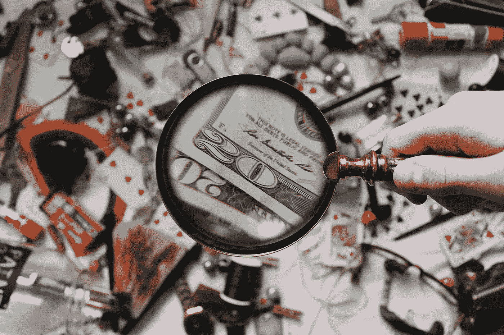
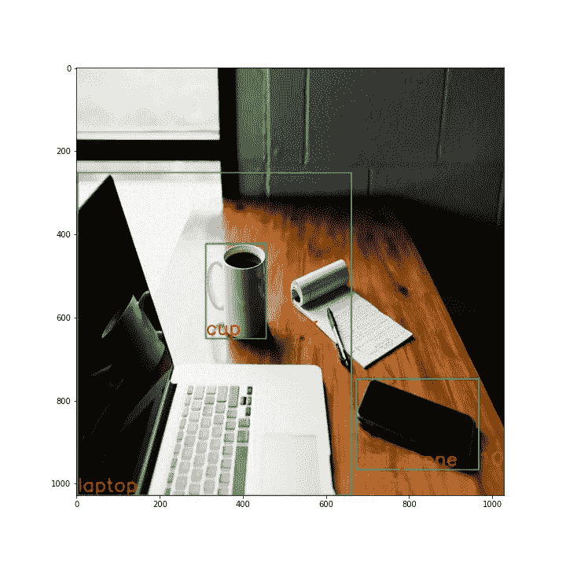
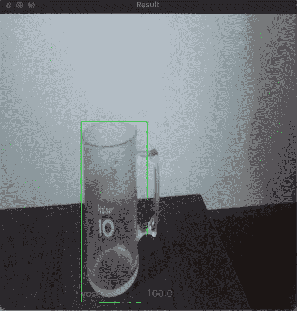

# 基于 Tensorflow 模型和 OpenCV 的目标检测

> 原文：<https://towardsdatascience.com/object-detection-with-tensorflow-model-and-opencv-d839f3e42849?source=collection_archive---------0----------------------->

## *使用经过训练的模型来识别静态图像和实时视频上的对象*

[来源](https://www.pexels.com/photo/close-up-photography-of-magnifying-glass-906055/)

在这篇文章中，我将演示如何使用一个经过训练的模型来检测图像和视频中的对象，使用两个最好的库来解决这类问题。对于检测，我们需要一个模型，能够预测图像中的多个类别，并返回这些对象的位置，以便我们可以在图像上放置盒子。

# 模型

我们将使用来自 [Tensorflow Hub](https://tfhub.dev/) 库中的模型，该库中有多个在各种数据集内训练过的准备部署模型，可以解决各种问题。对于我们的使用，我过滤了为对象检测任务训练的模型和 TFLite 格式的模型。这种格式通常用于物联网应用，因为它的尺寸小，性能比更大的模型更快。我选择这种格式，因为我打算在未来的项目中在 Rasberry Pi 上使用这种模型。

选择的模型是 [EfficientDet-Lite2 物体探测模型](https://tfhub.dev/tensorflow/efficientdet/lite2/detection/1)。它在具有 91 个不同标签的 COCO17 数据集上进行训练，并针对 TFLite 应用进行了优化。该模型返回:

1.  检测的框边界；
2.  检测分数(给定类别的概率)；
3.  检测类；
4.  检测次数。

# 检测物体

我将把这个部分分为两个部分:静态图像的检测和网络视频的检测。

## 静态图像

我们将从检测 Unsplash 图像中的对象开始:

[来源](https://unsplash.com/photos/cckf4TsHAuw)

因此，我们要做的第一件事是加载这个图像，并将其处理为 TensorFlow 模型的预期格式。

基本上，我们使用 OpenCV 加载原始图像，并将其转换为模型格式的 RGB 张量。

现在我们可以加载模型和标签了:

该模型是直接从网站上加载的，但是，您可以将其下载到您的计算机上，以获得更好的加载性能。文本标签 CSV 可在[项目报告](https://github.com/gabrielcassimiro17/raspberry-pi-tensorflow)中找到。

现在，我们可以创建预测，并将找到的方框和标签放入图像中:

现在，如果我们运行 *plt.imshow(img_boxes)* ，我们会得到以下输出:

[修改后的来源](https://unsplash.com/photos/cckf4TsHAuw)

## 实时网络摄像头视频

现在，我们可以使用电脑上的网络摄像头实时检测物体。

这一部分并没有看起来那么难，我们只需要在一个循环中插入我们用于一个图像的代码:

然后我们得到:

作者 GIF

我们使用 open cv 中的 VideoCapture 从计算机网络摄像头加载视频。然后，我们对静态图像进行了同样的处理，并预测了标签和位置。主要区别在于图像输入是连续的，所以我们在 while 循环中插入了代码。

所有使用的代码和笔记本都在这个库中:

<https://github.com/gabrielcassimiro17/raspberry-pi-tensorflow>  

在不久的将来，我会将它加载到一个 raspberry pi 中，使用一个能够检测对象的模型来创建一些交互，并将结果发布在这里。

如果你喜欢内容，想支持我，可以给我买杯咖啡:

 