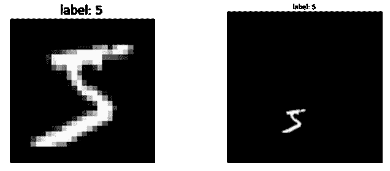
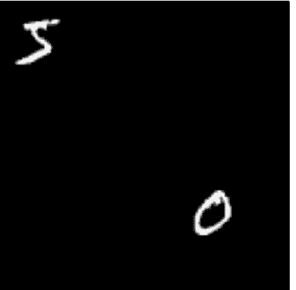
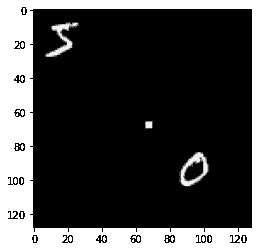
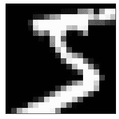
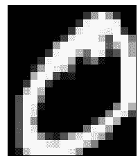

# 从图像中提取目标

> 原文：<https://towardsdatascience.com/object-extraction-from-images-2423f51ef67e?source=collection_archive---------16----------------------->

## 使用 Skimage 包从图像中提取对象

图片来自[马库斯·温克勒](https://unsplash.com/photos/BvlxNyjnIzg)拍摄的 [Unsplash](https://unsplash.com/)

## 这个故事是关于什么的？

如今，像 [Tensorflow](https://www.tensorflow.org/) 和 [Keras](https://keras.io/) 这样强大的开源平台和库已经大大提高了深度学习模型的效率和可访问性。我们现在可以建立神经网络来预测未来的温度，识别句子的情感，等等，只需要几行代码。从深度学习模型中受益匪浅的一个领域是图像识别。使用卷积神经网络(CNN)，我们可以建立能够识别数千种不同物体的模型，从蝴蝶到马，从卡车到飞机。然而，机器学习模型的性能在很大程度上取决于输入的质量。较好的输入不仅可以提高模型的精度，还可以减少训练时间。考虑下面的一对图像:

(图片由作者提供)

两幅图像包含相同的东西:一个手写的数字“5”。然而，左图像具有 28×28 像素，而右图像具有 128×128 像素。如果我们将正确的图像作为训练样本，我们需要 21 倍的 RAM 来存储输入数据。此外，模型要正确识别图像会困难得多。两幅图像都只包含一个对象。如果你有成千上万张像下面这样的图片，你需要从图片中提取数字作为你的训练样本，那该怎么办？然后，您将需要一种有效的方法来帮助您从给定的图像中提取您想要的对象。在这个故事中，我将向你展示一个非常简单而有用的从图像中提取物体的方法。

(图片由作者提供)

## 使用撇除法的对象提取

假设你有一张如下图，和上图一模一样，只是中间我手动加了一个“白色污点”。你的目标是提取“0”和“5”，并使它们成为独立的图像。使用 Skimage，你只需两步就能做到。

(图片由作者提供)

**第一步:**第一步是使用 Skimage 中*【测量】*模块的 [*【查找 _ 轮廓】*](https://scikit-image.org/docs/dev/api/skimage.measure.html#skimage.measure.find_contours) 功能。这个函数有两个重要的参数——数组(图像)和级别。Array (image)只是图像的 NumPy 数组表示。但是什么是“水平”参数呢？让我用两张图片来解释一下:

使用“级别=10”找到的等高线(图片由作者提供)

使用“级别=150”找到的等高线(图片由作者提供)

对于上面的两幅图像，左边的图形显示了找到的所有轮廓，右边的图形说明了如何找到数字“5”的轮廓。聪明的人可能已经注意到,“级别”值为 150 时，轮廓中包含的像素更多。天才可能已经发现，轮廓本质上将小于“级别”值的像素值和大于“级别”值的像素值分开。没错。！ **find_contour 函数试图找到一个闭环，使得环外的像素值小于“级别”，而环内的像素值大于或等于“级别”。**因此,“级别”越大，轮廓内的像素就越少。

要找到轮廓，你只需要一行代码！注意，为了方便起见，我还显示了绘制等高线的代码。

**第二步:**现在，我们只需要从轮廓中提取物体。首先，让我们了解一下 *find_contours* 函数返回什么:

正如我们在上面看到的，它返回一个数组列表。数组中的值表示原始图像的坐标值:contour[:，1]表示 x 坐标(横轴)，contour[:，0]表示 y 坐标(纵轴)。请注意，等高线值不是整数。这是因为它试图在你的像素数组中找到精确的“级别”值。但是，您的值可能不完全等于“级别”值。例如，如果您的“级别”值设置为 10，并且(1，1)和(1，2)处的两个值分别为 0 和 20，则这两个点之间的轮廓位置将为(1，1.5)。

由于轮廓的值代表坐标值，我们可以利用它们来裁剪我们的图像并获得我们想要的对象！具体来说，对象必须位于 y 坐标的最大值(轮廓[0])和最小值(轮廓[0])之间，x 坐标的最大值(轮廓[1])和最小值(轮廓[1])之间。

使用上述代码裁剪的数字“5”(图片由作者提供)

既然我们成功地抽取了数字“5 ”!但是，对于“0”，我们可以注意到有两个轮廓:橙色的较大轮廓包含整个“0”数字，而绿色的较小轮廓包含内部部分，这不是我们想要的。此外，由于我们在中间有一个“污点”，它也以某种方式被函数选中。解决这个问题的简单方法是只选择最长的轮廓。因为我们知道只需要提取两个对象，所以我们可以选择两个最长的轮廓。

使用上述代码裁剪的数字“0”(图片由作者提供)

现在你知道了！如上所述，您可能需要使用这段代码来处理成千上万的图像。为此，只需将代码转换成函数，这样就可以轻松地重复应用了！

## 旁注

有时，您的图像可能过于清晰，这意味着对象内的像素值可能会有很大的变化。如果像素值在“级别”值上变化，则可以在对象内部检测到多个轮廓。在这种情况下，您可以应用“平滑过滤器”来减少变化。一个流行的选择是"*中值滤波器*"，在这里你用像素的中值替换像素区域的值。您也可以使用 Skimage 应用一个*中值滤波器*:

下图说明了如何使用“*中值滤波器*来帮助轮廓检测:

平滑前(左)和平滑后(右)在 t 恤图像中发现的轮廓(图片由作者提供)

## 结论

从图像中检测和提取目标是为机器学习创建新数据集或改进现有数据集的重要技术。在这个故事中，我分享了一个非常方便和强大的方法，使用 Skimage 包从图像中检测和提取对象。如果你想看完整的笔记本，请随意查看我的 GitHub 库:

<https://github.com/KuanWeiBeCool/Object-Extraction-From-Images>  

感谢阅读！