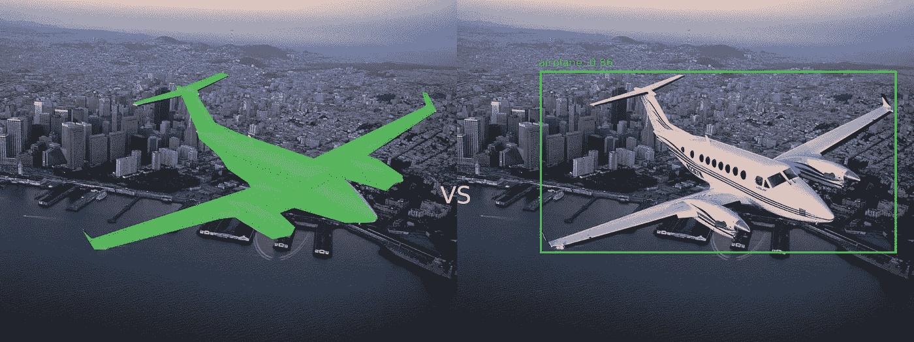
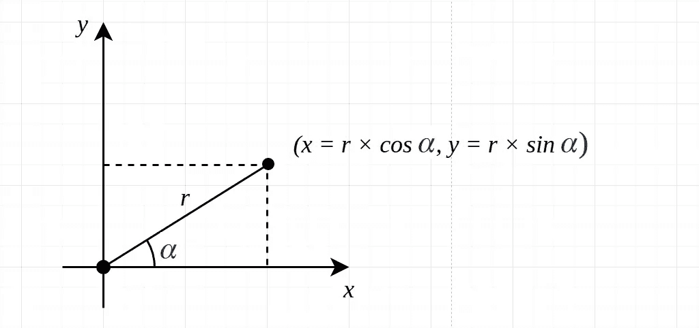
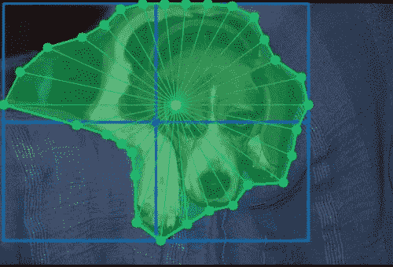

# 利用极坐标的目标定位/分割

> 原文：<https://towardsdatascience.com/object-localization-segmentation-with-polar-coordinates-62be64da0097?source=collection_archive---------33----------------------->

## 在这篇博文中，我分享了一个关于如何更精确地定位对象(与边界框相比)而不显著改变深度学习模型训练管道的初步想法

“尽管盒子是愚蠢的，但我可能是面具的忠实信徒，除非我不能让 YOLO 学会它们。”j .雷德蒙

当我在*“yolov 3:一个增量改进”*的论文中读到这些话时，我想对一个像边界框这样普通的结构说这些可能太尖锐了。它有什么问题？事实上，对象检测和实例分割模型是为了解决不同的任务而创建的，不是吗？这是正确的，但在一定程度上。它们都旨在定位某个对象，但精度不同。分段遮罩旨在捕捉对象的形状，而不考虑其复杂性。边界框要简单得多。扩展一下“愚蠢”这个词，我会说包围盒不能告诉你任何关于物体的形状，它的实际占据面积，而且包围盒经常捕捉太多的背景噪音。

分段遮罩与边界框。图片来源:[https://aeroaffaires . com/private-jet-hire/涡桨飞机/king-air-350/](https://aeroaffaires.com/private-jet-hire/turboprop-aircrafts/king-air-350/)

有时，对于计算机视觉解决方案来说，这可能是一件大事。如果对象的裁剪图像随后被管道中的另一个模型使用，边界框的上述缺点可能会显著影响性能。另一方面，目标检测网络通常用于边缘设备，目的是实时处理。在边缘环境中运行复杂的逐像素分割神经网络成为一项重要的任务。在这里，我们面临的问题是:我们想提取一些东西，而不仅仅是一个简单的矩形，然而模型可以做到这一点需要不可负担的计算资源。知道了所有这些，问题的表述将如下:我们能否以某种方式扩展对象检测，使得它能够以分割级别的精度找到对象，但同时保持轻量级对象检测网络所具有的实时性能的所有优点？

让我们考虑一下。多边形可以很好地替代边界框。然而，多边形组件的数量是变化的，它取决于形状的复杂性。因此，多边形不可能是具有固定输出维度的神经网络的直接输出。据我所见，解决深度学习中多边形预测问题的研究方向有很多。这些模型的实际应用实际上取决于项目细节。我想强调一下我最近遇到的一种方法——[偏光板](https://arxiv.org/abs/1909.13226)。在我们深入细节之前，我想回顾一下 PolarMask 所基于的极坐标表示的一些基础知识。不是用 *x* 和 *y* 的绝对值，而是用角度和距离来表示点。

极坐标。*作者图片*

下面是 PolarMask 的想法:让我们找到一个对象的中心，并以一定的间隔(例如 10 度，360/10=总共 36 条光线)从它投射一组光线。光线与物体轮廓相交的点就是目标多边形的点。这些点的数量是固定的，因为角度是预先定义的。模型唯一需要预测的是离原点(中心)的距离。基本上，多边形组件数量变化的问题在这里以一种相当精确的方式得到了解决。现在，我们可以将我们的目标数据从未定义和多样的维度转换为简单和统一的维度。

图片来源:[https://www.robots.ox.ac.uk/~vgg/data/pets/](https://www.robots.ox.ac.uk/~vgg/data/pets/)

算法工作所缺少的另一条信息是对象的中心，这也是模型输出中所期望的。基本上就是两个值的回归而已。然而，这里棘手的部分是我们究竟以哪个点为中心。关键是，对于自由形式的对象，中间坐标不是最佳选择。还不如把“质心”作为一个地面真值点。这将给出所有光线到达它们的最佳交点的更好的概率。

因此，每个对象的模型输出是角度网格的中心坐标和距离矢量。

为什么我个人觉得上述想法很有趣:

*   从**推理时间**的角度来看，它几乎与包围盒回归相同，我们只是有更多的值要回归。此外，边界框可以被认为是具有 4 个元素的多边形的特殊情况。换句话说，我们几乎可以免费获得更复杂、更一般化的预测。
*   多边形的极坐标表示可以应用于各种各样的神经网络架构，因为这只是一种构建模型输出的**灵活**方式。例如，诸如 YOLO 或 FCOS 的众所周知的对象检测架构可以被修改以产生对象多边形而不是边界框，而不需要那么大的努力。
*   它给出了介于对象检测和实例分割之间的输出结构。因此，它可以是一个**折衷**解决方案，不需要显著改变每像素分割的整个流水线。
*   当实用的解决方案出现在深度学习中时，这是**酷**，因为深度学习被理论谈论和基准测试所淹没。当工程头脑想到这样的想法，并把不同的人类知识连接成一个有用的和可行的解决方案时，真是令人兴奋。

在下一篇文章中，我将讲述我自己使用这种方法的实验。没有什么突破性的东西，但是我想看看从头开始实现这样的多边形回归有多容易。让我们保持联系。