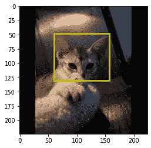
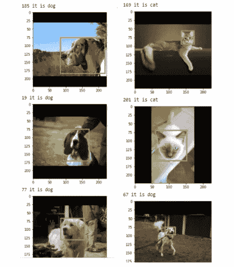
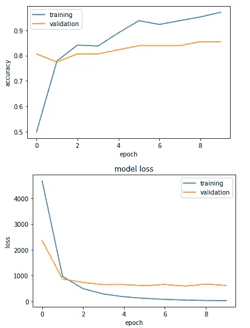
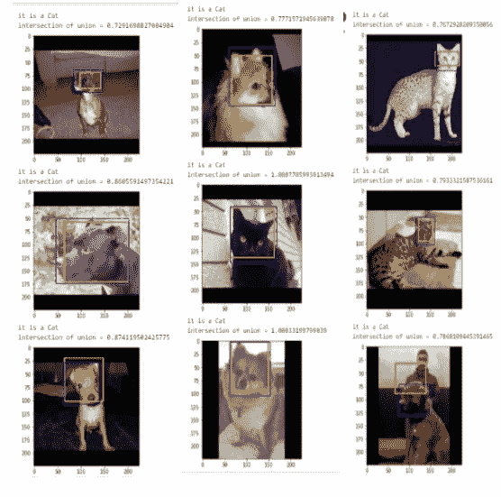
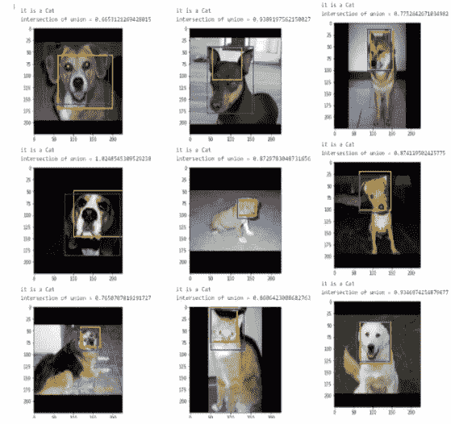
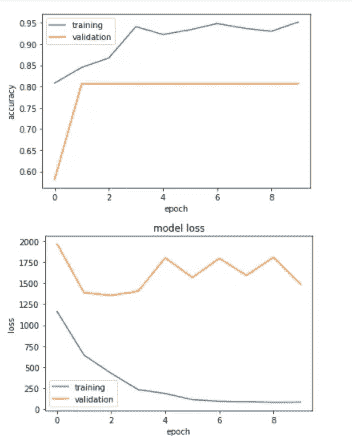
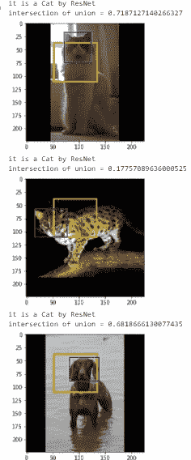
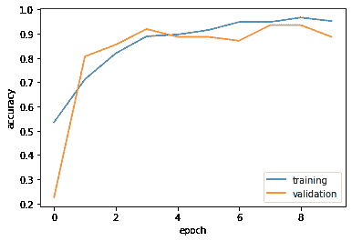
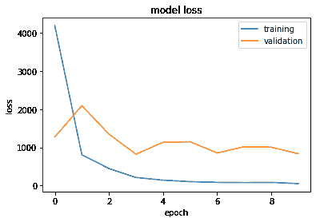
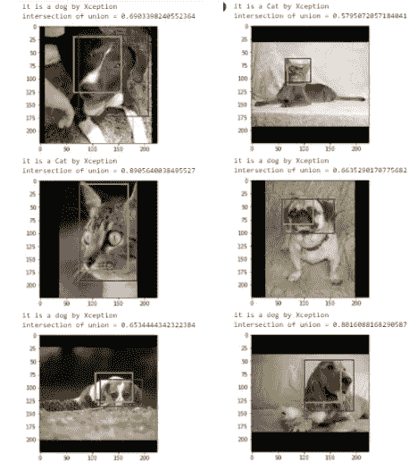

# 使用预先训练的 CNN 模型(如 MobileNet、ResNet 和 Xception)进行目标定位

> 原文：<https://towardsdatascience.com/object-localization-using-pre-trained-cnn-models-such-as-mobilenet-resnet-xception-f8a5f6a0228d?source=collection_archive---------4----------------------->

## **目标定位使用不同的预先训练的 CNN 模型在来自**牛津 Pet 数据集**的图像中定位动物面孔**


照片由[凯文·巴加](https://unsplash.com/@kevnbhagat?utm_source=medium&utm_medium=referral)在 [Unsplash](https://unsplash.com?utm_source=medium&utm_medium=referral) 上拍摄

这项工作将向您介绍使用预先训练的 CNN 和一些额外的有趣的改编，以根据上下文在其中找到最佳执行模型的单个对象定位。

先来解释一下本地化。简而言之，在图像中定位一个物体。定位意味着在识别一个对象之后，将该对象引入一个边界框或者精确地引入一个矩形来定位该对象。有单对象定位、多对象定位和语义分割，用于做手段相似但做目的形式不同的事情。

在这里，我将坚持单个对象定位，这将识别图像中所需的对象，然后使用 CNN 对其进行定位。另外，请注意，我将分别使用 Mobile Net、ResNet 和 Xception 作为预训练的卷积神经网络，并将为每个网络执行整个分类器和定位器。在此过程中，Union 上的交集)将变得熟悉，并将为每个 IOU 打印出相同的结果，最后，我们将看到哪个预训练网络对我们使用的数据集表现良好。

对于这个项目，牛津宠物数据集是合适的:你可以从下面的链接下载。

[http://www.robots.ox.ac.uk/~vgg/data/pets/](http://www.robots.ox.ac.uk/~vgg/data/pets/)

现在让我们分析数据集。数据集包含动物的图像，并且每个图像包含单个动物。我们可以看到这些动物是不同类型的猫和狗。请注意，图像的对齐、位置和结构在每个图像中都是不同的，这可以帮助我们获得更准确的结果。通过上面的链接，我们可以下载数据集和地面实况数据。一旦我们下载了数据，我们将在两个文件中结束:图像和注释。我们可以在 annotations 文件夹中获得 xml 注释、类列表和所有内容。一旦我们掌握了所有这些，让我们进入使用不同的预先训练的 CNN 模型的目标定位。

在开始之前，我们将引入 IOU 作为衡量指标。**并集上的交集(IOU)** 有助于理解预测的边界框与真实的边界框相差多少。这是理解我们的预测如何进行的一个很好的方法…

***PS:对于所有用预先训练好的网络分别训练后用包围盒打印出来的图片，我们会在每张图片下面打印出 IOU***…..

首先，我们需要导入所有必需的库和包。

```
from collections import namedtupleimport csvimport tensorflow as tffrom tensorflow.keras.applications.mobilenet_v2 import MobileNetV2, preprocess_inputfrom tensorflow.keras.applications.resnet50 import ResNet50, preprocess_inputfrom tensorflow.keras.applications.xception import Xception, preprocess_inputfrom tensorflow.keras import backend as Kfrom tensorflow.keras.layers import Dense, GlobalAveragePooling2D, Dropout, Flattenfrom tensorflow.keras.models import Model, Sequentialfrom tensorflow.keras.preprocessing.image import ImageDataGeneratorfrom tensorflow.keras.utils import to_categoricalimport matplotlib.pyplot as pltimport matplotlib.patches as patchesimport numpy as npimport os# import the necessary packagesfrom collections import namedtupleimport numpy as npimport cv2# define the `Detection` object for IOU(Detection = namedtuple("Detection", ["image_path", "gt", "pred"])from PIL import Image, ImageOps# importing XML parsing library for parsing the dataimport xml.etree.ElementTree as ET
```

现在，让我们导入数据——我通常使用谷歌合作实验室。因此，我将我的 google drive 安装到 colab 上(您可以通过任何方式导入数据，只要您方便就可以保存到任何地方)。

此外，这里我们可以将**目标大小设置为(224，224)，**，我们将使用 Mobile Net、ResNet 和 Xception 作为预训练网络来比较它们中的每一个。

```
from google.colab import drivedrive.mount('/content/drive')data_images = '/content/drive/MyDrive/AI_dataset_pets/images'data_ClassList = '/content/drive/MyDrive/AI_dataset_pets/annotations/list.txt'data_xmlAnnotations = '/content/drive/MyDrive/AI_dataset_pets/annotations/xmls'TARGET_SIZE = (224, 224)
```

现在定义边界框来定位图像中的动物。

```
#BoundingBoxBounding_Box = namedtuple('Bounding_Box', 'xmin ymin xmax ymax')# The following function will read the xml and return the values for xmin, ymin, xmax, ymax for formulating the bounding boxdef building_bounding_box(path_to_xml_annotation):tree = ET.parse(path_to_xml_annotation)root = tree.getroot()path_to_box = './object/bndbox/'xmin = int(root.find(path_to_box + "xmin").text)ymin = int(root.find(path_to_box + "ymin").text)xmax = int(root.find(path_to_box + "xmax").text)ymax = int(root.find(path_to_box + "ymax").text)return Bounding_Box(xmin, ymin, xmax, ymax)
```

因此，让我们做**填充**使图像成为一个完美的正方形，并根据填充和缩放对边界框进行必要的修改。

**在下面的代码中，标准化也已经完成**。

```
def resize_image_with_bounds(path_to_image, bounding_box=None, target_size=None):image = Image.open(path_to_image)width, height = image.sizew_pad = 0h_pad = 0bonus_h_pad = 0bonus_w_pad = 0#the following code helps determining where to pad or is it not necessary for the images we have.# If the difference between the width and height was odd((height<width)case), we add one pixel on one side# If the difference between the height and width was odd((height>width)case), then we add one pixel on one side.#if both of these are not the case, then pads=0, no padding is needed, since the image is already a square itself.if width > height:pix_diff = (width - height)h_pad = pix_diff // 2bonus_h_pad = pix_diff % 2elif height > width:pix_diff = (height - width)w_pad = pix_diff // 2bonus_w_pad = pix_diff % 2# When we pad the image to square, we need to adjust all the bounding box values by the amounts we added on the left or top.#The "bonus" pads are always done on the bottom and right so we can ignore them in terms of the box.image = ImageOps.expand(image, (w_pad, h_pad, w_pad+bonus_w_pad, h_pad+bonus_h_pad))if bounding_box is not None:new_xmin = bounding_box.xmin + w_padnew_xmax = bounding_box.xmax + w_padnew_ymin = bounding_box.ymin + h_padnew_ymax = bounding_box.ymax + h_pad# We need to also apply the scalr to the bounding box which we used in resizing the imageif target_size is not None:# So, width and height have changed due to the padding resize.width, height = image.sizeimage = image.resize(target_size)width_scale = target_size[0] / widthheight_scale = target_size[1] / heightif bounding_box is not None:new_xmin = new_xmin * width_scalenew_xmax = new_xmax * width_scalenew_ymin = new_ymin * height_scalenew_ymax = new_ymax * height_scaleimage_data = np.array(image.getdata()).reshape(image.size[0], image.size[1], 3)# The image data is a 3D array such that 3 channels ,RGB of target_size.(RGB values are 0-255)if bounding_box is None:return image_data, Nonereturn (image_data, Bounding_Box(new_xmin, new_ymin, new_xmax, new_ymax))
```

因此，根据输入数据，我们已经重塑了图像和边界框。

```
def setting_sample_from_name(sample_name):path_to_image = os.path.join(data_images, sample_name + '.jpg')path_to_xml = os.path.join(data_xmlAnnotations, sample_name + '.xml')original_bounding_box = get_bounding_box(path_to_xml)image_data, bounding_box = resize_image_with_bounds(path_to_image, original_bounding_box, TARGET_SIZE)return (image_data, bounding_box)
```

注意**黄色框**是**预测边界框，**和**蓝色框**是**真实边界框**是**真实边界框。**

现在让我们编写函数来绘制图像数据和边界框，并找到两个框在并集 IOU 上的**交集。它可以计算为 IOU =重叠面积/并集面积。**

*代码在下面的函数‘plot _ with _ box’中。*

```
def plot_with_box(image_data, bounding_box, compare_box=None):fig,ax = plt.subplots(1)ax.imshow(image_data)# Creating a Rectangle patch for the changed oneboxA = patches.Rectangle((bounding_box.xmin, bounding_box.ymin),bounding_box.xmax - bounding_box.xmin,bounding_box.ymax - bounding_box.ymin,linewidth=3, edgecolor='y', facecolor='none')# Add the patch to the Axesax.add_patch(boxA)#Creating another Rectangular patch for the real oneif compare_box is not None:boxB = patches.Rectangle((compare_box.xmin, compare_box.ymin),compare_box.xmax - compare_box.xmin,compare_box.ymax - compare_box.ymin,linewidth=2, edgecolor='b', facecolor='none')# Add the patch to the Axesax.add_patch(boxB)#FOR FINDING INTERSECTION OVER UNIONxA = max(bounding_box.xmin, compare_box.xmin)yA = max(bounding_box.ymin, compare_box.ymin)xB = min(bounding_box.xmax, compare_box.xmax)yB = max(bounding_box.ymax, compare_box.ymax)interArea = max(0, xB - xA + 1) * max(0, yB - yA + 1)boxAArea = (bounding_box.xmax - bounding_box.xmin + 1) * (bounding_box.ymax - bounding_box.ymin + 1)boxBArea = (compare_box.xmax - compare_box.xmin + 1) * (compare_box.ymax - compare_box.ymin + 1)iou =interArea/float(boxAArea+boxBArea-interArea)
#By intersection of union I mean intersection over union(IOU) #itselfprint('intersection of union =',iou)plt.show()
```

***现在，让我们绘制一个随机图像，看看发生了什么，并检查预测边界框的工作情况。***

```
sample_name = 'Abyssinian_10'image, bounding_box = setting_sample_from_name(sample_name)plot_with_box(image, bounding_box)
```



作者图片

这样我们就有了物体的边界框。

现在，让我们处理所有的数据。此外，让我们删除所有没有注释的图像。并将其转换为 Numpy 数组。

```
data_pros = []with open(data_ClassList) as csv_list_file:csv_reader = csv.reader(csv_list_file, delimiter=' ')for row in csv_reader:if row[0].startswith('#'): continue# Unpack for readabilitysample_name, class_id, species, breed_id = row# Not every image has a bounding box, some files are missing.So, lets ignore those by the following linestry:image, bounding_box = setting_sample_from_name(sample_name)except FileNotFoundError:# This actually happens quite a lot, as you can see in the output.# we end up with 7349 samples.print(f'cannot find annotations for {sample_name}: so skipped it')continue# cat = 0 and dog = 1.data_tuple = (image, int(species) - 1, bounding_box)data_pros.append(data_tuple)print(f'Processed {len(data_pros)} samples')data_pros = np.array(data_pros)
```

现在，一旦我们完成了这个，让我们用 6 张随机的图片来测试整体

```
#for checking lets print 6 of themfor _ in range(6):i = np.random.randint(len(data_pros))image, species, bounding_box = data_pros[i]if species == 0:print(i, "it is cat")elif species == 1:print(i, "it is dog")else:print("ERROR FOUND: This is of invalid species type")plot_with_box(image, bounding_box)
```

结果是这样的。



作者图片

***分割给定数据进行包围盒预测。***

```
x_train = []y_class_train = []y_box_train = []x_validation = []y_class_validation = []y_box_validation = []validation_split = 0.2for image, species, bounding_box in processed_data:if np.random.random() > validation_split:x_train.append(preprocess_input(image))y_class_train.append(species)y_box_train.append(bounding_box)else:x_validation.append(preprocess_input(image))y_class_validation.append(species)y_box_validation.append(bounding_box)x_train = np.array(x_train)y_class_train = np.array(y_class_train)y_box_train = np.array(y_box_train)x_validation = np.array(x_validation)y_class_validation = np.array(y_class_validation)y_box_validation = np.array(y_box_validation)
```

我们将使用一些使用迁移学习的预训练模型。

首先，我使用移动网络，我将同时执行分类器和定位器。

```
base_model = MobileNetV2(weights='imagenet', include_top=False, input_shape=(TARGET_SIZE[0], TARGET_SIZE[1], 3))chopped_mobilenet = Model(inputs=[base_model.input], outputs=[base_model.layers[90].output])classification_output = GlobalAveragePooling2D()(chopped_mobilenet.output)classification_output = Dense(units=1, activation='sigmoid')(classification_output)localization_output = Flatten()(chopped_mobilenet.output)localization_output = Dense(units=4, activation='relu')(localization_output)model = Model(inputs=[chopped_mobilenet.input], outputs=[classification_output, localization_output])model.summary()
```

一旦打印出以上内容，我们将获得使用 MobileNet 构建模型的详细摘要。

现在，绘制每个时期模型的精确度和损失。

```
plot_training_history(history1, model)
```

这些图是:



作者图片

## 真实框是蓝色的，预测框是黄色的

```
for _ in range(18):i = np.random.randint(len(processed_data))img, species, true_bounding_box = processed_data[i]pred = model.predict(np.array([preprocess_input(img)]))if pred[0][0] < .5:print("it is a Cat")else:print("it is a dog")plot_with_box(img, Bounding_Box(*pred[1][0]), true_bounding_box)
```

结果是:



作者提供的图片

请注意，这里所有的图像都使用 MobileNet 检测为猫。随机抽取一些样本进行检查，以了解模型的完善程度:

```
some_random_samples = ['Abyssinian_174','american_bulldog_59']for sample_name in some_random_samples:path_to_image = os.path.join(data_images, sample_name + '.jpg')print(path_to_image)img, _ = resize_image_with_bounds(path_to_image, target_size=TARGET_SIZE)pred = model.predict(np.array([preprocess_input(img)]))if pred[0][0] < .5:print("Yes,Its a Cat")else:print("Yes Its a dog")plot_with_box(img, Bounding_Box(*pred[1][0]),true_bounding_box)
```


作者图片

使用 MobileNet 时的 IOU 值还不错…但是在有一些小匿名的图片中，IOU 值太小了…..

让我们看看它是如何使用 **ResNet 和 Xception 的。**

# 现在，使用 ResNet 预训练网络进行同样的尝试

```
base_model1 = ResNet50(weights='imagenet', include_top=False, input_shape=(TARGET_SIZE[0], TARGET_SIZE[1], 3))chopped_resnet1 = Model(inputs=[base_model1.input], outputs=[base_model1.layers[90].output])classification_output1 = GlobalAveragePooling2D()(chopped_resnet1.output)classification_output1 = Dense(units=1, activation='sigmoid')(classification_output1)localization_output1 = Flatten()(chopped_resnet1.output)localization_output1 = Dense(units=4, activation='relu')(localization_output1)model1 = Model(inputs=[chopped_resnet1.input], outputs=[classification_output1, localization_output1])model1.summary()
```

请浏览一下这个摘要，一旦你把它打印出来。这将有助于你对网络有一个清晰的了解。

现在，我们将继续编译和拟合用 Resnet 制作的模型。

```
model1.compile(optimizer='adam', metrics=['accuracy'],loss=['binary_crossentropy', 'mse'],loss_weights=[800, 1]  )#lets run it through 10 epochshistory2=model1.fit(x_train, [y_class_train, y_box_train], validation_data=(x_validation, [y_class_validation, y_box_validation]),epochs=10,verbose=True)history2
```

我不包括每个时期的总结和验证准确性和损失。一旦你实现了它们，你就可以看到它们，下面给出了每个时期的准确度和损失图。

```
def plot_training_history(history, model):plt.plot(history.history['dense_3_accuracy'])plt.plot(history.history['val_dense_3_accuracy'])plt.ylabel('accuracy')plt.xlabel('epoch')plt.legend(['training', 'validation'], loc='best')plt.show()plt.plot(history.history['dense_3_loss'])plt.plot(history.history['val_dense_3_loss'])plt.title('model loss')plt.ylabel('loss')plt.xlabel('epoch')plt.legend(['training', 'validation'], loc='best')plt.show()plot_training_history(history2, model1)
```



作者图片

让我们打印更改后的图像，并使用 ResNet 进行训练，并打印两个框的 IOU(交集/并集),看看我们的预测有多好。

```
for _ in range(3):i = np.random.randint(len(processed_data))img, species, true_bounding_box = processed_data[i]pred = model1.predict(np.array([preprocess_input(img)]))if pred[0][0] < .5:print("it is a Cat by ResNet")else:print("it is a dog by ResNet")plot_with_box(img, Bounding_Box(*pred[1][0]), true_bounding_box)
```



作者图片

这是检测一只狗作为一只猫，但 IOU 值相当不错！

现在让我们试试 Xception 预训练网络。下面给出了实现它的代码。

```
base_model2 = Xception(weights='imagenet', include_top=False, input_shape=(TARGET_SIZE[0], TARGET_SIZE[1], 3))chopped_Xception = Model(inputs=[base_model2.input], outputs=[base_model2.layers[90].output])classification_output2 = GlobalAveragePooling2D()(chopped_Xception.output)classification_output2 = Dense(units=1, activation='sigmoid')(classification_output2)localization_output2 = Flatten()(chopped_Xception.output)localization_output2 = Dense(units=4, activation='relu')(localization_output2)model2 = Model(inputs=[chopped_Xception.input], outputs=[classification_output2, localization_output2])model2.summary()
```

通过异常网络编译和拟合模型:

```
model2.compile(optimizer='adam', metrics=['accuracy'],loss=['binary_crossentropy', 'mse'],loss_weights=[800, 1]  )#lets run it through 10 epochshistory3=model2.fit(x_train, [y_class_train, y_box_train], validation_data=(x_validation, [y_class_validation, y_box_validation]),epochs=10,verbose=True)history3
```

画出它的精确度和损耗。

```
def plot_training_history(history, model):plt.plot(history.history['dense_9_accuracy'])plt.plot(history.history['val_dense_9_accuracy'])plt.ylabel('accuracy')plt.xlabel('epoch')plt.legend(['training', 'validation'], loc='best')plt.show()plt.plot(history.history['dense_9_loss'])plt.plot(history.history['val_dense_9_loss'])plt.title('model loss')plt.ylabel('loss')plt.xlabel('epoch')plt.legend(['training', 'validation'], loc='best')plt.show()plot_training_history(history3, model2)
```



作者图片

让我们使用**异常**打印更改和训练后的图像，并打印两个箱子的**借据**。

让我们看看使用 Xception 处理的图像:

```
for _ in range(6):i = np.random.randint(len(processed_data))img, species, true_bounding_box = processed_data[i]pred = model2.predict(np.array([preprocess_input(img)]))if pred[0][0] < .5:print("it is a Cat by Xception")else:print("it is a dog by Xception")plot_with_box(img, BoundingBox(*pred[1][0]), true_bounding_box)
```

结果:



作者图片

现在，我们将使用少量随机样本来测试模型。

```
#testing with randSome_Random_samples = ['Abyssinian_174','american_bulldog_59']for sample_name in Some_Random_samples:path_to_image = os.path.join(data_images, sample_name + '.jpg')print(path_to_image)img, _ = resize_image_with_bounds(path_to_image, target_size=TARGET_SIZE)pred = model2.predict(np.array([preprocess_input(img)]))if pred[0][0] < .5:print("Yes,Its a Cat by Xception")else:print("Yes Its a dog by Xception")plot_with_box(img, Bounding_Box(*pred[1][0]),true_bounding_box)
```

结果:


作者图片

Xception 表现很好，给出了相当准确的预测。

# 在尝试使用 Xception、MobileNet 和 Resnet 时，IOU 值看起来不错。

对于 **MobilNet** = 0.8125，获得最终层的最终验证精度

对于 **ResNet** = 0.7969，获得最终层的最终验证精度

对于**例外** = 0.8438，获得最终层的最终验证精度

(当您在每个模型的训练中获得每个时期的结果时，您可以获得准确的最终验证准确性)。

所有预先训练好的网络，如 MobileNet、ResNet 和 Xception，都表现得令人满意。

但就准确性而言，MobileNet 和 Xception 做得很好，但就 IoU 而言，预测在所有这些网络中都有波动。

当涉及到匿名图片时，情况就不一样了。

**但是大部分图片的欠条都相当不错。**

使用 IOU 的测量清楚地使我们了解在哪个图片中我们得到了坏的 IOU，以及预测的边界框与真实的边界框不同到什么程度。

# **每个模型的精度图和损失图的观察结果**

对于第一个预训练模型 MobileNet，我发现在绘制每个历元中的精度和损失时，初始历元之后的训练精度高于验证精度。模型中的验证损失也很高。

对于第二个预训练模型 ResNet，当从初始或起始时期本身绘图时，训练精度大大高于验证精度。验证损失太高了！

对于第三个预训练模型——例外——在绘图时，发现训练精度高于第 4 个历元本身的验证精度。此外，验证损失很高。

也就是说，模型训练过度了。

我觉得根据 IOU，除了一些令人困惑的图像之外，所有这些模型都表现得相当好。

除此之外，一些图片也给出了很好的 IOU 值！

**总的来说，Xception 在这个数据集上表现良好。**

我希望从这篇文章中你能了解如何在数据集中进行对象定位，并尝试各种预先训练好的网络，如 Mobile Net、ResNet 和 Xception。

结果可能会因您将采用的数据集而异，但这肯定会帮助您通过执行各种实验或测试来利用数据，并根据您的研究背景得出最佳的预训练网络。