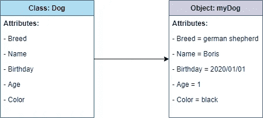
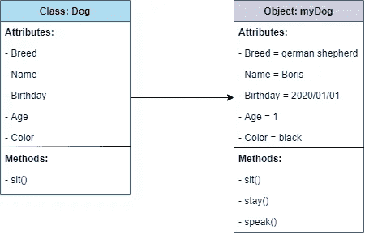

# 面向数据科学家的面向对象编程

> 原文：<https://towardsdatascience.com/object-oriented-programming-for-data-scientists-8d4d976b6af8?source=collection_archive---------12----------------------->

## 转换如何使您的代码可以投入生产，如何降低代码复杂性，以及如何提高团队效率

Joanna Reichert 的图片来自 [Pixabay](https://pixabay.com/photos/animal-guinea-pig-pet-cute-rodent-4988403/)

在编程、数据分析、机器学习、人工智能、数学和数据科学的所有其他组成部分方面有如此多的东西要学，公平地说，当成为一名数据科学家时，概念的学习成为一件艰巨的事情。

数据科学家来自各种背景，其中许多人都不是基于计算机科学的，完全可以理解的是，一些计算机科学的原则被忽略了，有利于获得好的东西:完成数据分析。

其中一个概念是面向对象编程(OOP)。

当你询问当前的数据科学家对 OOP 的看法时，你可能会得到各种各样的答案。在某些情况下，OOP 对于降低复杂性和减少完成分析所需的时间非常有用。在其他情况下， [OOP 会导致代码比你需要的还要多](/do-we-need-object-orientated-programming-in-data-science-b4a7c431644f)，甚至不知道该怎么处理。

根据您的情况或您正在进行的项目，您可能会发现切换到 OOP 方法是有益的，或者您可能会发现它阻碍了您的进展。

然而，有一件事是肯定的:作为一名数据科学家，在你最意想不到的时候拥有一项额外的技能可能会派上用场。换句话说，为什么不学一点 OOP，看看你或你的团队如何从它的原理中获益？

# 面向对象编程(OOP)快速入门。

像许多优秀的东西一样(仅举几个例子，经典摇滚、福特 GT40 和阿波罗 11 号太空任务)，面向对象编程是在世纪之交之前开发的。从 20 世纪 60 年代开始，然后在 80 年代变得更加主流， [OOP](https://www.britannica.com/technology/object-oriented-programming) 成为管理大型程序复杂性的首选方法。

OOP 的目标是以一种可维护、易读、最重要的是可重用的方式组织代码。代码被组织成两种不同的结构，这两种结构一起工作，也称为对象和类。类是一段代码，它定义了可用于创建对象的特定属性和函数。把一个类想象成一个蓝图。对象是使用类创建的代码片段。每个对象都包含由类赋予它的属性，并且可以为每个属性分配唯一的值。换句话说，一个对象是一个类的唯一实例。想象一个物体，比如一个使用蓝图建造的房子(类)。

这里有一个使用狗的视觉例子:

类和对象之间关系的例子。灵感来源:[艾琳·多赫蒂](https://www.educative.io/blog/object-oriented-programming)

每只狗都是一样的，它们都有相同的品种、名字、生日、年龄和颜色。然而，我的狗是独一无二的。他对每个属性都有不同的值。因此，我创建了 Dog 类的唯一实例，并用它来描述我的狗。如果我购买了另一只狗，我可以创建该类的第二个实例来描述我的新狗。换句话说，我重用了为该类创建的代码，而不必再次键入它。

如上所述，类和对象也可以包含方法。对象将从它所源自的类中继承任何方法。然而，对象也可能包含没有出现在类中的唯一方法。比如，所有的狗都知道怎么坐。因此，Dog 类将包含 sit()方法。除了坐()，我还教我的狗呆()，说话()。因此，描述我的狗的对象将包含在其他任何地方都不会出现的独特方法。

这是它的视觉效果:

从类到对象的方法继承的例子，向对象添加了两个最初不在类中出现的独特方法。灵感来源:[艾琳·多赫蒂](https://www.educative.io/blog/object-oriented-programming)

然而，这是一个非常普通的例子。你明白这个想法，但是在数据科学的背景下不一定有意义。没问题。让我们从数据科学的角度来看一下这个问题。

[Rose Day](https://medium.com/u/a7f2e8e50135?source=post_page-----8d4d976b6af8--------------------------------) 在本文中描述了[OOP 如何应用于数据科学，她对此做了最好的解释。她举了一个团队成员的例子，他使用一组特定的函数来清理数据，这些函数通常适用于团队使用的所有数据集。团队成员以面向对象的方式创建数据清理库，这允许其他团队成员使用相同的函数清理他们的代码，而不必从头开始编写代码。现在，任何想要使用这些函数来清理代码的团队成员都可以直接使用这个库，而不用每次都编写新的方法。](/do-we-need-object-orientated-programming-in-data-science-b4a7c431644f)

有关如何在数据科学环境中使用 OOP 的更多示例，请查看这篇文章，这篇文章通过示例和源代码，带您了解如何使用类和对象更好地处理数据:

 [## 使用面向对象编程改善您的数据争论

### munging 和 OOP 令人惊讶的成功结合

towardsdatascience.com](/improve-your-data-wrangling-with-object-oriented-programming-914d3ebc83a9) 

# 为什么数据科学家需要 OOP？

面向对象程序设计的阴阳两极是[函数式编程](https://hackr.io/blog/functional-programming)，这是一种编程方法，它通过以更加自由的方式创建变量和函数来避免类和对象的结构，从而避免了面向对象程序设计的共享状态特性。函数式编程依赖于纯函数(函数总是产生相同的结果，并且没有副作用)、递归(不使用 for 和 while 循环)、引用透明性(变量的值一旦定义就不能更改)和变量的不变性(变量一旦初始化就不能修改)。

对于数据科学中的许多实例来说，函数式编程会工作得非常好，许多数据科学家将花费他们的职业生涯来编写严格的函数式代码。取决于你问谁，你可能会在使用函数式编程的人和喜欢 OOP 的人之间得到截然不同的回答。此外，根据实例的不同，您甚至可以在这两者之间进行切换，这取决于您在给定时间正在进行的项目。

然而，有一些关键的原因可以解释为什么数据科学家至少应该对 OOP 有所了解。

*   **编程最佳实践的基石之一是** [**干原则(不要重复自己)**](https://opendatascience.com/an-introduction-to-object-oriented-data-science-in-python/) **。**假设包含数据的文件名从“数据”变为“数据集”。如果您的代码是函数式编程的，您将需要一行一行地检查您的代码，并将“数据”的每个引用都更改为“数据集”。然而，如果你的数据被组织成类，你只需要改变一个对“数据”的引用，并且保证来自那个类的对象将继承这个改变。
*   使用 OOP 原则编写代码可以确保你的代码更容易调试。当你看到一个 bug 突然出现在一个特定的对象中时，你知道它来自于它的类。此功能在故障排除或实施新功能时也会有所帮助。此外，当您在一个对象中对代码进行更改时，您知道它将会执行，而代码的其他部分则不受影响。因此，如果出现问题，会有更少的代码被破坏，问题也更容易被发现和解决。
*   **数据科学家经常与软件开发人员合作，开发出可投入生产的代码。**由于数据科学家和软件开发人员在创建生产代码时的常见合作关系，数据科学家开发一些 OOP 技能来帮助使过程顺利进行是有意义的。数据科学家来自多种背景，通常与计算机科学无关。正因为如此，面向对象的原则不一定会被使用。然而，OOP 对于软件开发人员来说是家常便饭。因此，学习这种语言有助于让团队合作变得容易和流畅。

简而言之，使用 OOP 将有助于提高团队效率，降低代码复杂性，并帮助您生成软件开发人员期待收到的生产就绪代码。

# 如何更好的掌握面向对象编程？

*   **只关注面向对象编程的四个原则。**对于数据科学家来说，理解 OOP 的四个基本原则往往就足够过得去了。理解除此之外的任何东西都是奇妙的，但因为它可能是如此抽象的概念，所以不要担心理解深层的黑暗细节，直到你真正需要它们。OOP 的四个原则是封装(将对象放入类中以保护它们不与其他对象交互)、抽象(隐藏特定的属性以使对象更容易处理)、继承(子类将从超类继承特征，对象将从它们所属的类继承特征)和多态(一个对象采取多种形式的能力)。我在这里更详细地解释这些概念[。](https://medium.com/better-programming/7-in-demand-skills-for-software-development-positions-in-2021-18f7672e4f3a)
*   **用面向对象的方法建模一个现实世界的问题。**对狗的品种、汽车和房子建模是开始 OOP 的好方法，许多在线教程非常详细地介绍了这些基础知识。然而，这些概念比您在进行数据分析时可能要处理的概念更具体一些。所以我建议找一些现实世界的问题用 OOP 来解决。我特别建议遵循我在“面向对象编程快速入门”中链接的教程，因为它的数据争论本质。
*   **用强类型语言强迫自己使用 OOP。根据你问谁，你会得到各种各样的答案，当你问一个强类型编程语言的例子时，这些答案往往是自相矛盾的。因此，我建议在学习 OOP 时使用 Java(这似乎是唯一被认可的强类型语言)。使用 Java 将迫使你使用 OOP 来使你的代码工作，而使用另一种语言可能会让你逃脱不完全面向对象的惩罚。这将有助于巩固概念，并让您轻松地将它们转换到您选择的语言。**

# 最后的想法。

如你所见，OOP 不仅仅是软件开发人员的专利——它还包含了许多数据科学家可以利用的优势。当你在考虑一个你想要高效完成的新项目时，或者当你在考虑一个你想要优化的旧项目时，在你的脑海中有一些 OOP 知识是没有坏处的。

此外，如果情况需要，谁不想编写生产就绪、不太复杂并且通过提高团队效率来完成的数据科学代码呢？