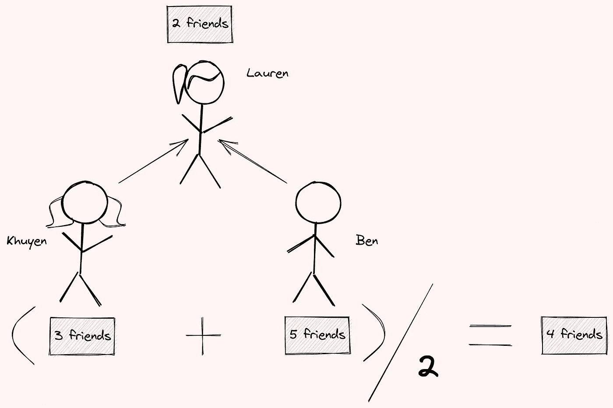
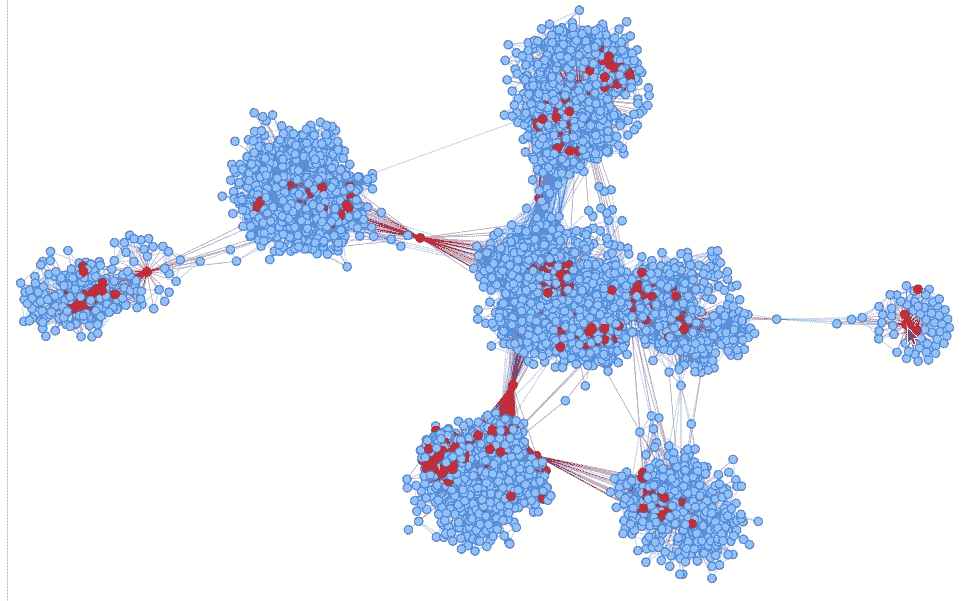

# 使用 Python 观察脸书数据中的朋友悖论

> 原文：<https://towardsdatascience.com/observe-the-friend-paradox-in-facebook-data-using-python-314c23fd49e4?source=collection_archive---------13----------------------->

## 平均来说，你的朋友比你的朋友多吗？

# 动机

平均来说，你的朋友比你的朋友多吗？如果你是一个普通人，很有可能你的 T4 朋友比你的朋友少。

这就是所谓的友谊悖论。这种现象表明，平均来说，大多数人的朋友比他们的朋友少。

在这篇文章中，我将展示为什么这样一个悖论存在，以及我们是否能在脸书数据中找到这个悖论。


GIF by Author —在这里与图形[互动。](https://khuyentran1401.github.io/pages/all_people_with_edges.html)

# 最小示例

为了理解朋友悖论为什么存在，让我们从一个最小的例子开始。我们将创建一个人际网络。两个人如果列在同一个 Python 元组里就是朋友。

现在我们将使用 Pyvis 来可视化网络。

```
pip install pyvis
```

如果你四处移动节点，你可以看到本是朋友圈的中心。

我们感兴趣的是发现这个网络中有多少人的朋友比他们的朋友平均少。我们将创建多个函数来帮助我们回答这个问题。这些功能是:

*   获取特定人的朋友:

例如，劳伦的朋友是:

```
>>> get_friends(friends, "Lauren")
['Khuyen', 'Ben']
```

*   获取特定人的朋友数量:

```
>>> get_friends(friends, "Lauren")
2
```

*   获取某人朋友的好友数量:

```
>>> num_friends_map = get_num_friends_map(friends)
>>> get_num_friends_of_a_person_friends(friends, "Lauren",
...                                     num_friends_map)[3, 5]
```

结果显示 Khuyen 有 3 个朋友，Ben 有 5 个朋友。

*   获取一个人的朋友平均拥有的朋友数量:

```
>>> get_average_friends_of_a_person_friends(friends, "Lauren")
4.0
```

输出显示 Lauren 的朋友平均有 4 个朋友，比她拥有的朋友数量多。



作者图片

如果我们仔细观察上面的图片，我们可以看到本的朋友数量增加了劳伦朋友的平均数量。

由于本有很多朋友，他的很多朋友也会和劳伦有类似的情况。换句话说，他们朋友的朋友数量平均高于他们的朋友数量，因为他们的一两个朋友是有影响力的人。

*   获取网络中所有人的朋友数量

在上表中，

*   列`num_friends`显示一个人有多少朋友。
*   列`avg_friends_of_friends`显示了一个人的朋友平均拥有的朋友数量。
*   `friends_have_more_friends`一栏表示一个人的朋友是否平均比他/她自己有更多的朋友。

让我们找出网络中的朋友比他们的朋友平均少的人的百分比。

```
0.8333333333333334
```

从上表中我们可以看出，只有本的朋友比他的朋友平均多。是因为他是群体中的影响者。

# 分析脸书网络

[脸书数据](https://snap.stanford.edu/data/ego-Facebook.html)由来自脸书的朋友列表组成。脸书的数据是从调查参与者那里收集的，这些数据中的用户已经匿名。

你可以从[这里](https://snap.stanford.edu/data/facebook_combined.txt.gz)下载数据。下载完数据后，解压保存为`facebook_combined.txt`。

我们将使用前面的函数来获取人们在网络中拥有的朋友数量。

让我们找出网络中的朋友比他们的朋友平均少的人的百分比。

```
0.874721465709334
```

网络中 87%的人的朋友比他们的朋友平均少！

## 可视化影响者

网络中的影响者是哪些节点？让我们用 Pyvis 将它们可视化。

从向网络添加节点开始。

我们将影响者定义为那些比他们的朋友平均拥有更多朋友的人。我们将用红色标记被定义为影响者的节点。

添加边并显示网络图:


GIF by Author —在这里与图形[互动。](https://khuyentran1401.github.io/pages/all_people_with_edges.html)

正如我们所看到的，红色节点(比他们的朋友平均拥有更多朋友的人)往往位于图表的中心。如果我们移动一个红色节点，许多蓝色节点也会跟着移动。这表明这些红色节点是网络中一个或两个子群的影响者。



GIF by Author —在这里与图表[互动](https://khuyentran1401.github.io/pages/all_people_with_edges.html)。

# **结论**

恭喜你！您刚刚学习了什么是朋友悖论，以及如何使用 Python 来观察脸书数据中的这种悖论。我希望这篇文章能给你动力，让你使用可视化和数据科学技术来观察你周围的其他悖论。

在这个回购中，您可以随意使用这篇文章的代码:

[](https://github.com/khuyentran1401/Data-science/blob/master/visualization/friend_paradox/facebook_network.ipynb) [## 数据科学/Facebook _ network . ipynb at master khuyentran 1401/数据科学

### 收集有用的数据科学主题以及代码和文章-Data-science/Facebook _ network . ipynb at master…

github.com](https://github.com/khuyentran1401/Data-science/blob/master/visualization/friend_paradox/facebook_network.ipynb) 

我喜欢写一些基本的数据科学概念，并尝试不同的算法和数据科学工具。你可以在 LinkedIn 和 Twitter 上与我联系。

如果你想查看我写的所有文章的代码，请点击这里。在 Medium 上关注我，了解我的最新数据科学文章，例如:

[](/pyvis-visualize-interactive-network-graphs-in-python-77e059791f01) [## Pyvis:用 Python 可视化交互式网络图

### 只需要几行代码

towardsdatascience.com](/pyvis-visualize-interactive-network-graphs-in-python-77e059791f01) [](/build-and-analyze-knowledge-graphs-with-diffbot-2af83065ade0) [## 用 Diffbot 构建和分析知识图

### 如何用知识图谱回答疑难问题

towardsdatascience.com](/build-and-analyze-knowledge-graphs-with-diffbot-2af83065ade0) [](/i-scraped-more-than-1k-top-machine-learning-github-profiles-and-this-is-what-i-found-1ab4fb0c0474) [## 我收集了超过 1k 的顶级机器学习 Github 配置文件，这就是我的发现

### 从 Github 上的顶级机器学习档案中获得见解

towardsdatascience.com](/i-scraped-more-than-1k-top-machine-learning-github-profiles-and-this-is-what-i-found-1ab4fb0c0474) [](/how-to-sketch-your-data-science-ideas-with-excalidraw-a993d049f55c) [## 如何用 Excalidraw 勾画您的数据科学想法

towardsdatascience.com](/how-to-sketch-your-data-science-ideas-with-excalidraw-a993d049f55c) 

# 参考

```
@misc{snapnets,
  author       = {Jure Leskovec and Andrej Krevl},
  title        = {{SNAP Datasets}: {Stanford} Large Network Dataset Collection},
  howpublished = {\url{http://snap.stanford.edu/data}},
  month        = jun,
  year         = 2014
}
```