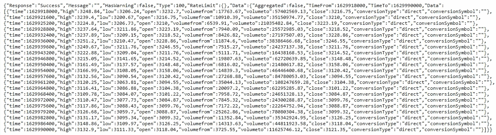
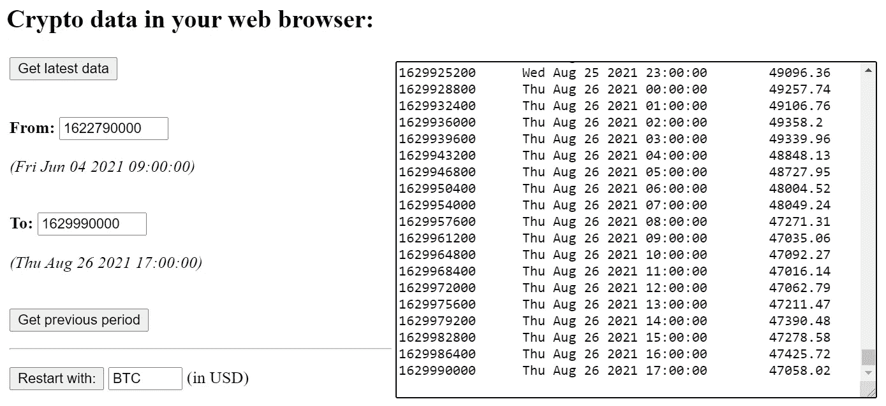
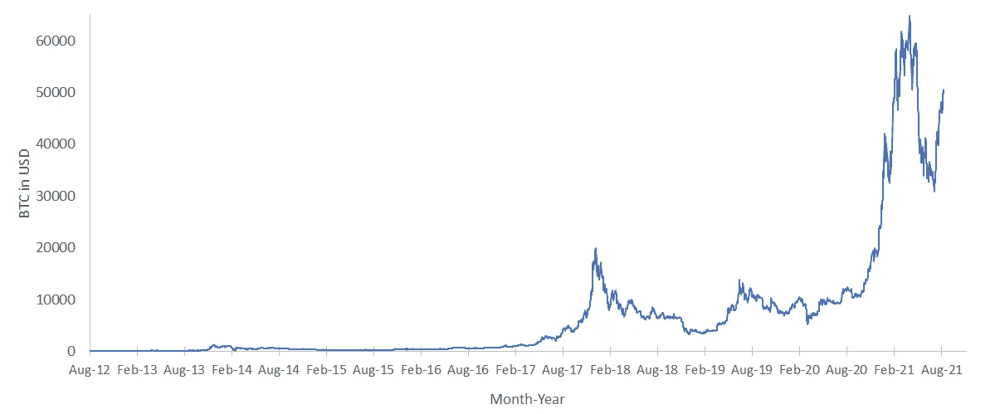
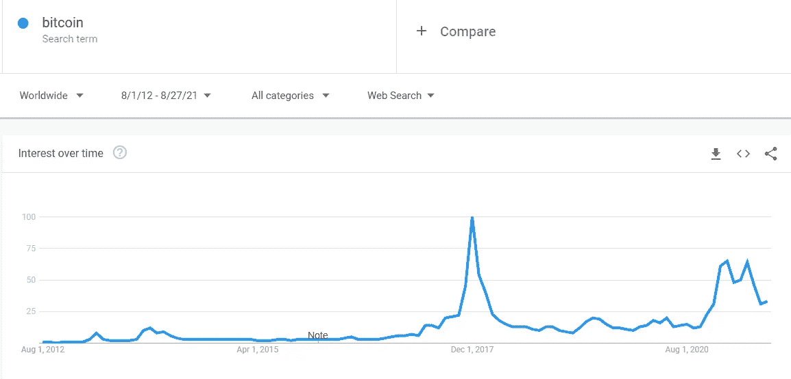
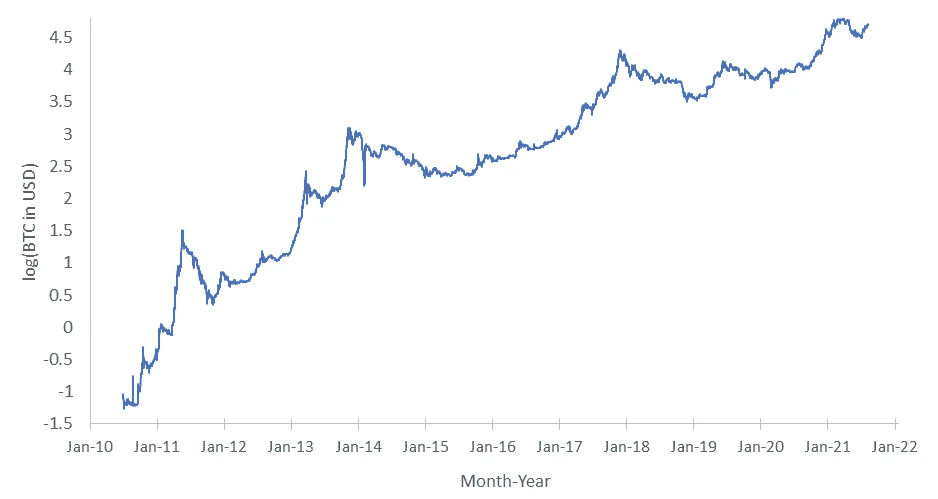
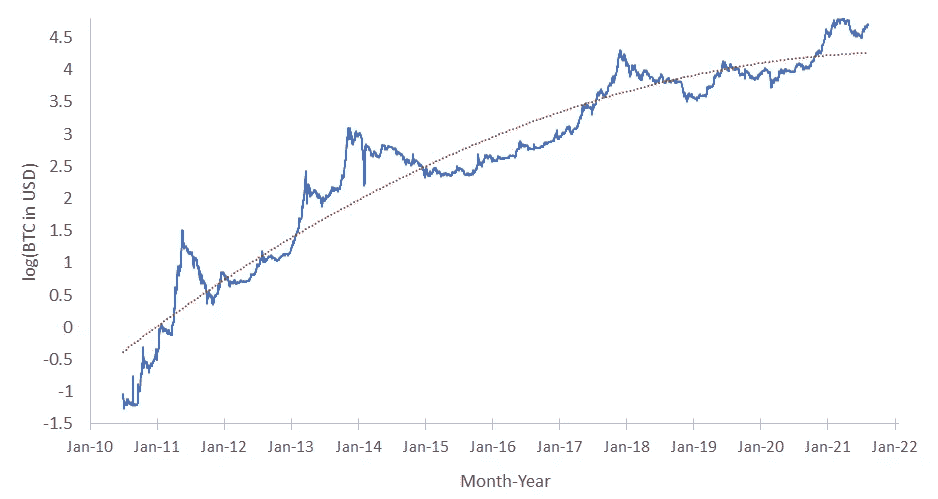

# 通过非常简单的 web 编程获得历史和实时加密数据

> 原文：<https://towardsdatascience.com/obtaining-historical-and-real-time-crypto-data-with-very-simple-web-programming-7b481f153630?source=collection_archive---------0----------------------->

在学习加密货币的过程中，我迫切需要可以操纵自己进行绘图和分析的数据。在这里，我将向您展示如何用最少的编程技巧在您的 web 浏览器中轻松获得实时和历史加密数据。包括源代码、链接和一些基本的图表和分析。

***免责声明:你在这里找不到任何金融建议，我也不是加密货币、加密艺术、非金融交易及其交易等方面的专家。我只赠送免费的 HTML+JavaScript 代码，通过 API 调用 CryptoCompare.com 获取数据；我展示了一些从这些数据中得出的图表，还有一些我自己的主观看法。***

***…如果您需要任何临时工作，例如为您的问题量身定制的 web 应用程序，只需*** [***联系我***](https://lucianoabriata.altervista.org/office/contact.html) ***！***

我最近对加密货币、加密艺术、NFT 等感兴趣。自然，作为一名一直与数据打交道的科学家，我首先想做的事情之一就是自己玩加密货币数据。我在网站、新闻、app 上到处看到剧情；但是，我怎样才能得到实际的数据来玩它，做我自己的计划和调查呢？尤其是，我如何确保每次我请求它时它都是最新的？

具体来说，我首先想接触的是各种加密货币和法定货币之间的汇率。我发现 CryptoCompare.com 网站提供了一个很好的 API，少量的调用是免费的，允许从它的基础上编程访问数据。我还在网上找到了各种 JavaScript 代码，我把它们放在了两个非常简单的 web 应用程序中:一个用来每 10 秒钟更新一次 BTC 对美元的汇率；另一个是检索比特币历史上每分钟、每小时或每天的历史 BTC 兑美元汇率。请随意复制我提供的代码，并根据您自己的目标进行修改。

# **网络应用 1:实时获取任何交流信息**

当然，你可以打开任何加密货币网站或应用程序，从那里获得这个数字，但假设你希望它总是在手边，并自动刷新，或者你可能希望它自动输入到你正在开发的计算系统中。

在 CryptoCompare 的 API 上简单访问此链接，就可以在您拨打电话时返回比特币(BTC)的美元汇率:

https://min-api.cryptocompare.com/data/price?fsym=BTC =美元

同样，另一个例子给出了调用时以太坊(ETH)对欧元的汇率:

[https://min-api.cryptocompare.com/data/price?fsym=ETH&tsyms =欧元](https://min-api.cryptocompare.com/data/price?fsym=ETH&tsyms=EUR)

很简单，不是吗？在此基础上，下面的代码每 10 秒钟返回一次您要求的任何换算(在本例中为 BTC 换算成美元),这是一个小网页，您可以将其设为私有，以便在自己的网站中跟踪您最喜欢的汇率:

```
<html><head>
    <title>Get crypto data in real time</title>
</head><body>
    <p id='info'></p>
    <p id='infotime'></p>
</body><script>
const getBtcData = async () => {
   fetch('https://min-api.cryptocompare.com/data/price?fsym=BTC&tsyms=USD')
  .then(response => response.json())
  .then(data => {
    console.log(data);
    document.getElementById("info").innerHTML = '<b>1 BTC = ' + data.USD + ' USD</b>'
  });
}getBtcData();tcount=setInterval(function(){
  tcount++
  if (tcount==10) {getBtcData(); tcount=0}
  document.getElementById("infotime").innerHTML = 'Next update in ' + (10-tcount) + ' seconds'
},1000);

</script>
</html>
```

您可以将这段代码复制粘贴到一个. html 文件中，然后用浏览器加载它，查看它的运行情况。或者，如果你觉得懒惰，只需在我的网站上打开这个演示示例:

[https://lucianoabriata . alter vista . org/tests/cryptogames/get BTC-real time . html](https://lucianoabriata.altervista.org/tests/cryptogames/getBTC-realtime.html)

您可以轻松地将其进一步开发成一个 web 应用程序，持续跟踪任何汇率，甚至将其存储在一个绘图中以便随时可视化，或者存储在一个变量中以供下载。

# **Web app 2:获取历史数据**

但是如果你想在网页启动前获取数据呢？你可以去专门的网站下载这些数据。但是我发现好用的网站只提供部分数据。例如，雅虎财经的 BTC 数据始于 2014 年 9 月 17 日，其记录是每月、每周或每天，但不是每小时或每分钟。此外，如果您正在开发一个需要自动更新的系统，手动数据下载是不可能的…您需要编程访问。

幸运的是，CryptoCompare 的 API 包括以分钟、小时或天为单位检索历史数据的方法。不仅是汇率，还有其他指标，如交易量。要了解更多关于 [API 的信息，请看它的文档](https://min-api.cryptocompare.com/documentation)并阅读下面的内容。

本例中的 API 调用将获取过去 20 小时的数据，每小时一次:

[https://min-api.cryptocompare.com/data/v2/histohour?fsym = ETH&tsym = USD&limit = 20&toTs =-1&API _ key = YOURKEYHERE](https://min-api.cryptocompare.com/data/v2/histohour?fsym=ETH&tsym=USD&limit=20&toTs=-1&api_key=YOURKEYHERE)

输出可以用 JSON 格式进行解析。看起来是这样的:



上面显示的 API 调用的输出示例。作者截图。

在 API 调用的 URL 中需要注意的几点(我们接下来将在 fetch() javascript 函数中使用):

1.  *toTs=-1* 表示您想要直到调用执行时的数据。
2.  *极限*是你想要的行数。
3.  您需要提供一个 API 密钥。

使用免费的 API 密钥(在[文档页面](https://min-api.cryptocompare.com/documentation)获取；是的，您可以购买具有更高级功能的密钥)您可以拨打的电话总数有限，每次通话最多只能拨打 2000 次。例如，如果你想知道 BTC 以美元计算的每小时汇率，你将得到的最大值是从提示时间向后 2000 分钟，这意味着大约 33 个小时，也就是一天多一点。或者你要求每小时的数据，你最多会得到连续 83.33 天的数据，刚好不到 3 个月。然而，这并不是一个大问题，因为您可以根据需要多次向后重复 API，以覆盖您感兴趣的时间间隔。例如，要获得 BTC 的每日数据，直到它的起源，你需要截至 2021 年 8 月(写这篇文章时)的 4000 多点(天)。这意味着你只需要连续打 3 个电话。如果你想要同一时期的小时数据，你是在 98400 点左右，这是由 50 个连续调用覆盖的。

让我向您展示这个 web 应用程序，您可以使用它来查询对美元的任何汇率的每日历史数据:

```
<html>
<head><title>Get historical crypto data</title></head>
<body>
  <h2>Crypto data in your web browser:</h2>
  <table width=80%><tr><td valign=top width=40%>
    <button onclick='getBtcData()'>Get latest data</button>
    <p><br>
    <b>From:</b>
    <input id='fromTime' value='XXXX' size=10></input>
    <p id='fromInfo'></p>
    <br>
    <b>To:</b>
    <input id='toTime' value='XXXX' size=10></input>
    <p id='toInfo'></p>
    <br>
    <button onclick='getBtcDataPrevious()'>Get previous period</button>
    <p>
    <hr>
    <p>
    <button onclick='document.getElementById("txtout").value = ""; getBtcData()'>Restart with:</button>
    <input id='cryptoCurr' value='BTC' size=5></input> (in USD)  </td><td width=60%>
    <textarea id="txtout" cols=60 rows=20></textarea>
  </td></tr>
</table>
</body>
<script>
const getBtcData = async () => {
  const response = await fetch('https://min-api.cryptocompare.com/data/v2/histohour?fsym=' + document.getElementById('cryptoCurr').value + '&tsym=USD&limit=2000&toTs=-1&api_key=YOURAPIKEY');
  const json = await response.json();
  const data = json.Data.Data
  const times = data.map(obj => obj.time)
  const prices = data.map(obj => obj.high)
  var txt=""
  for (var i=0;i<times.length;i++)
  {
    txt = txt + times[i] + "\t" + serialDateToNiceDate(times[i]/3600/24).toString().substr(0,24) + "\t" + prices[i] + "\n"
  }
  document.getElementById("txtout").value = txt
  document.getElementById("fromTime").value = times[0]
  document.getElementById("toTime").value = times[times.length-1]
  document.getElementById("fromInfo").innerHTML = "<i>(" + serialDateToNiceDate(times[0]/3600/24).toString().substr(0,24) + ")</i>"
  document.getElementById("toInfo").innerHTML = "<i>(" + serialDateToNiceDate(times[times.length-1]/3600/24).toString().substr(0,24)+ ")</i>"}
const getBtcDataPrevious = async () => {
  const response = await fetch('https://min-api.cryptocompare.com/data/v2/histohour?fsym=' + document.getElementById('cryptoCurr').value + '&tsym=USD&limit=2000&toTs=' + document.getElementById('fromTime').value + '&api_key=YOURAPIKEY');
  const json = await response.json();  const data = json.Data.Data
  const times = data.map(obj => obj.time)  const prices = data.map(obj => obj.high)
  var txt=""  for (var i=0;i<times.length;i++)  {    txt = txt + times[i] + "\t" + serialDateToNiceDate(times[i]/3600/24).toString().substr(0,24) + "\t" + prices[i] + "\n"
  }
  tmp=document.getElementById("txtout").value
  document.getElementById("txtout").value = txt + tmp
  document.getElementById("fromTime").value = times[0]
  document.getElementById("toTime").value = times[times.length-1]
  document.getElementById("fromInfo").innerHTML = "<i>(" + serialDateToNiceDate(times[0]/3600/24).toString().substr(0,24) + ")</i>"
  document.getElementById("toInfo").innerHTML = "<i>(" + serialDateToNiceDate(times[times.length-1]/3600/24).toString().substr(0,24)+ ")</i>"
}getBtcData()function serialDateToNiceDate(date) {
  return new Date(Math.round((date)*86400*1000));
}</script></html>
```

代码可能看起来有点复杂，但它可以简单得多。这里的事情是，我创建了一个完整的界面，让用户选择在什么时间范围内获取数据，然后将后续调用的结果连接到一个文本框中，以便于复制:



收集历史数据的界面，对应上面的代码。作者截图。

请注意，您必须调用 API 两次:一次是在调用直到执行时刻的数据条目列表的函数内部(getBtcData，当用户单击“Get latest data”时运行，并且在加载时自动运行)，另一次是调用在给定时间之前返回数据的函数(getBtcDataPrevious)。还要注意，这些函数会自动更新 From 和 To 时间，这些时间以原始的串行格式显示，并通过 serialDateToNiceDate 函数转换为人类可读的形式。

加载页面或单击“获取最新数据”后，右侧的文本框将填充过去 2000 个小时的条目，并且“从”和“到”时间会更新。然后，您可以通过点击“获取前期”从前期请求 2000 行数据块。引入线将被添加到文本框中，保持历史顺序。

**在看一些历史资料**

正如我在介绍中所说的，我非常渴望获得自比特币诞生以来 BTC:美元兑换的时间演变数据。只需对上面显示的 web 应用程序稍加编辑(只需将“histohour”改为“histoday”)，就可以得到一个返回每日记录的应用程序。然后点击三次“获取上一期”，你就可以获得比特币的每日数据，从 2010 年 7 月开始，一直到现在。

让我们画几幅这些数据的图。首先是汇率随时间的变化，这是你在大多数应用程序、网站和新闻中看到的图表:



BTC 图:自 2012 年 8 月至 2021 年 8 月的美元汇率，数据来自上述修改为检索每日记录的应用程序版本。作者的情节和人物。

该图显示了五个关键的上升时间:一个在 2013 年底左右，一个在 2017 年底-2018 年初，然后是 2019 年的另一个，然后是 2021 年上半年的一个更强的上升，然后是现在正在发生的新的快速上升。

有趣的是，该图中观察到的最大值与 Google Trends 测量的长期兴趣大致相符:



2012 年 8 月至 2021 年 8 月搜索词“比特币”的谷歌趋势图。作者截图。

我们检索到的 BTC:美元汇率数据的另一个图表比我们上面的图表更有趣，它是以对数(此处 log in base 10)形式处理价格的图表:



BTC 图:自比特币出现以来，美元汇率随时间的变化，数据来自检索每日记录的网络应用程序。作者图。

这个对数变换更清楚地指出上升阶段。检查从底部到顶部的相对峰高是否相差很大，并且似乎在缓慢衰减:第一个主峰需要大约 1.5 个数量级的增益(大约 30 倍)；第二第三第四都在 1 个数量级左右(10 倍左右)，最后一个只有 0.5 个数量级左右(3.2 倍左右)。因此，尽管历史最高值变得非常高，但对后来投资的人来说，获得巨额利润的机会正在逐渐减少。虽然那时用比特币发财已经太晚了，但 BTC:美元汇率的整体趋势似乎表明，它可能还会增长一段时间(不是告诉你在这里购买，只是天真地从情节中推断):



与上面的图相同，用红色拟合二次函数。作者图。

这些日志图包含更多的数据，其他人已经在下面的博客文章中分析了这些数据。由于不是专家，我无法评价它们，但它们确实非常有趣:

<https://medium.com/@100trillionUSD/modeling-bitcoins-value-with-scarcity-91fa0fc03e25>  <https://www.tradingview.com/chart/BLX/uYKn9Nrx-Bitcoin-longterm-chart/>  <https://www.lookintobitcoin.com/charts/bitcoin-logarithmic-growth-curve/>  <https://www.blockchaincenter.net/bitcoin-rainbow-chart/>  

**结论和精选的进一步阅读**

我希望你会喜欢使用这些和派生的脚本来获取和使用加密数据。这整个领域非常有趣，在过去两年里，在做我关于加密货币的研究时，我阅读了大量的论文、故事和帖子，我从中提取了这些内容，供您继续阅读，主要来自 Medium 及其相关出版物。

*   在这篇文章发表几个月后添加:检查这个不需要密钥的替代 API:

</obtain-unlimited-historical-crypto-data-through-simple-api-calls-without-keys-8a6f5ed55b43>  

*   现在推荐文章:

</forecasting-future-prices-of-cryptocurrency-using-historical-data-83604e72bc68>  <https://medium.com/@hamzaahmad86/exploratory-data-analysis-of-cryptocurrency-historical-data-d8ec719641e7>  <https://medium.datadriveninvestor.com/python-for-finance-cryptocurrency-analysis-661ebd410fac>  <https://medium.com/spreadstreet/how-to-perform-correlation-analysis-on-cryptocurrencies-in-google-sheets-640d45861dda> [## 如何在 Google Sheets 中对加密货币进行相关性分析

medium.com](https://medium.com/spreadstreet/how-to-perform-correlation-analysis-on-cryptocurrencies-in-google-sheets-640d45861dda) <https://medium.com/@eliquinox/cryptocurrency-data-analysis-part-ii-downloading-manipulating-and-analysing-bulk-data-e234a43e6259>  <https://medium.com/hackernoon/sentiment-analysis-in-cryptocurrency-9abb40005d15>  

喜欢这篇文章，想给我提示？【<https://www.paypal.me/LAbriata>**】-谢谢！**

**我是一个自然、科学、技术、编程和 DIY 爱好者。生物技术专家和化学家，在潮湿的实验室和电脑前。我写我广泛兴趣范围内的一切。查看我的 [*列表*](https://lucianosphere.medium.com/lists) *了解更多故事。* [***成为中等会员***](https://lucianosphere.medium.com/membership) *访问其所有故事和* [***订阅获取我的新故事***](https://lucianosphere.medium.com/subscribe) ***通过电子邮件*** *(我为其获得小额收入的平台的原始附属链接，无需向您支付特殊费用)。* [***通过各种方式在这里捐赠***](https://lucianoabriata.altervista.org/office/donations.html)**。* [***联系我这里***](https://lucianoabriata.altervista.org/office/contact.html) *为任何一种查询。****

****到* ***咨询关于小工作*** *(关于编程、biotech+bio info 项目评估、科学外联+交流、分子数据分析与设计、分子图形、摄影、私人课程与教程、私人课程、教学与辅导等。)查看我的* [***服务页面这里***](https://lucianoabriata.altervista.org/services/index.html) *。****