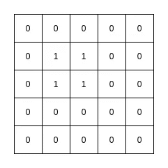

# 使用 Webots 和 ROS2 绘制占用网格图

> 原文：<https://towardsdatascience.com/occupancy-grid-mapping-with-webots-and-ros2-a6162a644fab?source=collection_archive---------11----------------------->

## 在 Webots 机器人模拟器上使用 ROS2 框架创建占位概率图。


Webots 模拟器上的 e-puck2(图片由作者提供)

# 概观

自主机器人必须执行的许多任务之一是绘制环境地图。拥有一个环境图是很重要的，因为许多其他任务可能依赖于环境图作为先决条件。

对于一些机器人来说，地图是作为输入给出的，但对于许多其他机器人来说，这是不可能的。机器人必须通过探索来自主绘制环境地图。

地图也是一个先有鸡还是先有蛋的问题，通常被称为 SLAM(同步定位和地图)，其中我们有两个相互关联的问题需要解决。定位需要地图来估计机器人[的姿态](https://en.wikipedia.org/wiki/Pose_(computer_vision))，而映射需要精确的姿态来映射环境。

因为 SLAM 是一个更难解决的问题，所以在本文中我们假设姿态是准确的，这样我们就可以专注于贴图任务。

此外，读者必须对机器人和机器人操作系统版本 2 (ROS2)有基本的了解。

# 机器人模拟器

当我们想学习为机器人编写软件时，好的一面是我们不必拥有“真正的”机器人硬件，因为它们可能相当昂贵。此外，您可能需要一些硬件知识来设置它，并在出现问题时进行故障排除。

出于学习或测试的目的，我们可以使用机器人模拟器。有许多免费和开源的机器人模拟器可供我们使用。查看维基百科页面，了解它们:

<https://en.wikipedia.org/wiki/Robotics_simulator>  

露台模拟器是机器人专家最常用的模拟器之一:

<http://gazebosim.org/>  

但我发现 Webots 对初学者来说更容易，因为它提供了许多现成的商业机器人，并支持多种编程语言，尤其是 Python，这是一种很好的原型语言。

<https://cyberbotics.com/>  

## 网络机器人

Webots 是本文中使用的开源三维移动机器人模拟器，因为它有许多可用的机器人可以用于我们的模拟，最重要的是，像 Gazebo 一样，它支持 ROS2。

# ROS2

机器人操作系统版本 2 或简称 ROS2，是一个开源的机器人软件框架。

它并不像它的名字所暗示的那样是一个操作系统，而是一个由社区支持的框架集合。这使得为机器人编写软件变得很容易，更重要的是，有许多开源的 ROS2 **包**可供我们在机器人软件应用中使用。

有了 ROS2，我们可以使用这些包来关注我们想要关注的领域，例如学习、研究等。

<https://docs.ros.org/en/foxy/index.html>  

## Webots ROS2 包

[Webots ROS2](http://wiki.ros.org/webots_ros2) 包是一个 ROS2 包，它提供了 ROS2 接口来模拟我们在 Webots 上的机器人和环境。

# 自主测绘任务

在我们开始写代码之前，我们应该在我们的系统上安装所有需要的软件。我们需要安装以下设备:

*   网络机器人
*   ROS2(目前使用 foxy 发行版)
*   Webots ROS2 包

如何设置软件超出了本文的范围，在他们的网站上有很好的文档。

## 占用网格映射

假设姿态是已知的，占据栅格映射是关于从传感器测量数据创建环境的 2D 地图。该图被表示为均匀间隔的二进制(随机)变量的网格。True 或 1 表示位置被一些对象占用，False 或 0 表示自由空间。



入住网格图(图片由作者提供)

上图是一张 5x5 的占用网格图。我们的占用网格图具有以下属性:

*   宽度
*   高度
*   解决
*   数据

宽度和高度帮助我们读取**数据**，它通常是一个 1D 数组，分辨率是像元的大小，例如，如果像元的分辨率是 1x1 厘米，我们的地图的高度和宽度是 5 厘米。

## 占据概率图

占据概率图表示地图中的位置被占据的概率。所以不是 1 或 0，每个单元格代表它被占用的概率。


入住概率网格图(图片由作者提供)

## 该算法

这个算法来自巴斯蒂安·特龙、沃尔弗拉姆·伯格德和迪特尔·福克斯的《概率机器人学》一书。该算法是在给定数据的情况下计算地图上的[后验](https://en.wikipedia.org/wiki/Posterior_probability):


给定测量数据和姿势的地图概率(图片由作者提供)

然而，这种计算是很难的，因为一个地图可以包含大量的单元。因此，我们计算每个单元的后验概率，而不是图上的概率。


给定测量数据和姿态的细胞概率(图片由作者提供)

地图上的后部是其细胞的产物:


后上方地图(图片由作者提供)

映射算法是:

```
Updata(map, range, pose):
 for cell in map:
  if cell in perceptual field:
   cell = cell + prob - prior
 return map
```

该算法采用机器人的当前地图、传感器测量和姿态。我们只对更新感知区域的细胞感兴趣，为此我们可以使用 [Bresenham 的直线算法](https://en.wikipedia.org/wiki/Bresenham%27s_line_algorithm)。所有小区的先验概率可以被设置为像 0.5 或其他值。行尾的单元格被占用，其他单元格是空闲空间(概率= 0)。


布雷森汉姆的台词(维基百科:【https://en.wikipedia.org/wiki/Bresenham%27s_line_algorithm】T2)

可以根据传感器制造商提供的传感器模型或我们自己的测量来计算被占用小区的概率。

## ROS2 节点

为了实现自主绘图任务，我们需要三个组件(节点):

*   制图人
*   任务控制器
*   随机保镖

以下视频展示了自主测绘任务的实际情况:

e-puck2 机器人通过弹跳自主绘制环境地图(视频由作者提供)

e-puck2 机器人通过弹跳自主绘制环境地图(视频由作者提供)

我已经实现了这三个节点，并在 Github 上提供了它们(见总结)。

任务控制器通过启动和停止随机弹跳器以及将地图转换为 PNG 文件并保存到给定的路径来控制整个任务。它控制任务应该运行多长时间。以上视频中任务的 PNG 文件如下。


生成的 PNG 文件—第一次任务(图片由作者提供)


生成的 PNG 文件—第二次任务(图片由作者提供)

随机弹跳器通过设置线速度和角速度并从激光扫描中检测障碍物来移动机器人。

映射器接收传感器测量数据和变换来计算机器人的姿态，并创建和更新占据概率图并发布它。

## 如何安装和使用代码

要使用该代码，首先如上所述，您需要安装 Webots、ROS2 和 Webots ROS2 包。假设您已经安装了所有这些软件，那么您可以:

*   克隆 git 存储库
*   建设
*   安装

```
cd /home/$USER/ros2_projects
colcon build --packages-select mapping_controller
. install/setup.bash
```

要运行它，您可以使用不同的参数执行启动文件:

```
ros2 launch mapping_controller mapping_controller_launch.py probability:=true rviz:=true mapping_time:=15 world:="test.wbt" path:="/home/$USER/Documents"
```

*   概率:运行概率占用映射器
*   运行 rviz
*   mapping_time:任务应该运行多长时间(分钟)，默认为 5 分钟
*   世界:网络机器人世界文件
*   路径:保存 PNG 文件的位置

# 摘要和代码

我们在上面已经看到，我们可以使用开源软件来学习为机器人开发软件，并在模拟器上测试我们的软件。

我在这里展示的一个简单的例子是机器人的自主地图任务，它绘制环境地图以用于不同的目的，例如定位。

正如你从视频中看到的，随机反弹效率不高，因为它可能需要很长时间来映射甚至正常大小的房间。更智能的运动模式会好很多。

此外，你可能会注意到地图不是很准确，这主要是因为我们只对机器人姿态使用里程计，这容易随着时间的推移积累误差。我们需要 SLAM 来给我们一个更准确的姿势。除此之外，误差也是由传感器本身的特性引起的。

## Github 上的代码

您可以通过在以下位置克隆我的存储库来尝试代码:

<https://github.com/debbynirwan/mapping_controller>  

如果你感兴趣的话，试着改进它，提高你的公关水平。感谢阅读。