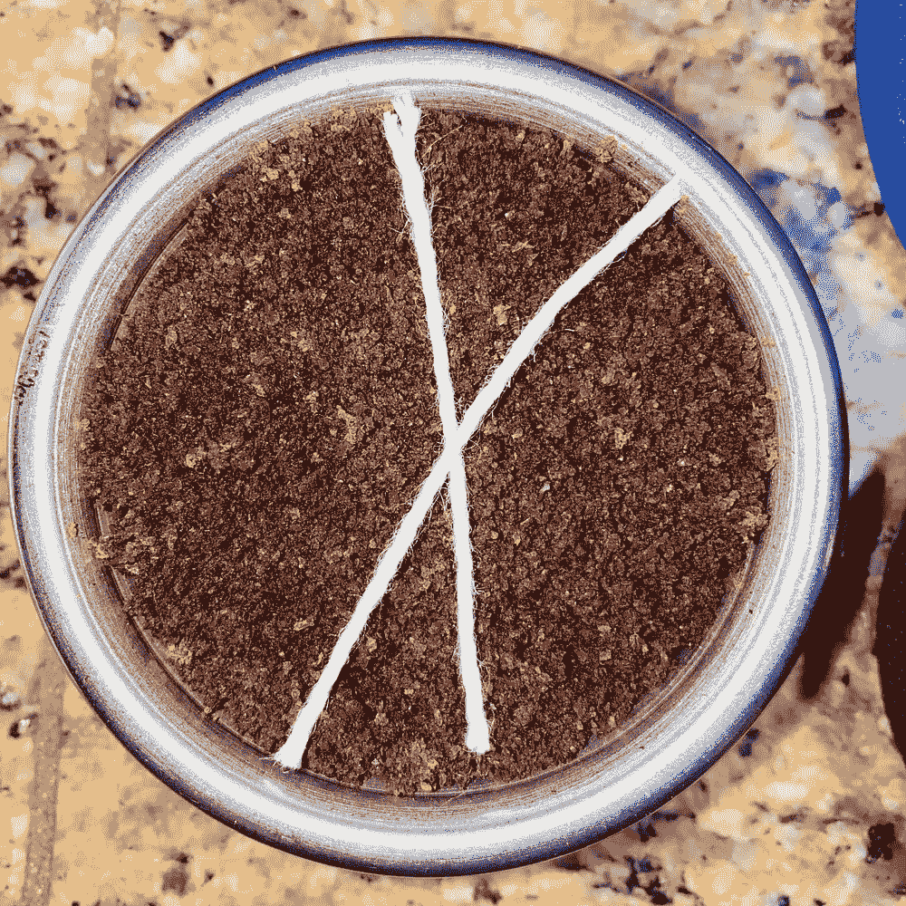

# 强迫症工具对浓缩咖啡不起作用

> 原文：<https://towardsdatascience.com/ocd-tools-dont-work-for-espresso-5b2f988af495?source=collection_archive---------19----------------------->

## 咖啡数据科学

## 你把他们引向了错误的方向

最近，我发布了一个带有玻璃杯子的视频,显示这种强迫症类型的工具只影响地面的顶部。我直观地争辩道，这个工具没什么价值。强迫症患者中的每个人都认为我转错了方向。我认为我转的方向是对的(逆时针)，因为反方向转除了把咖啡渣弄平之外，没什么作用。

在这篇短文中，我展示了顺时针转动 OCD 型分配器会使接地变平，但不会分配太多。逆时针旋转它会分配更多的地面，但就像在视频中一样，只有上半部分。如果你愿意，这里有一个[链接](https://youtu.be/tl9vXycr9VA)到这个实验的短片。

所有图片由作者提供

没有一项[研究](/espresso-preparation-grinding-distribution-and-tamping-50f452f78aa8)显示 OCD 工具改善了浓缩咖啡的提取。事实上，在多项研究中，该工具降低了提取物的产量。

# 实验设计

这个实验是为了观察有多少咖啡渣在上面移动。我决定用两根线，因为它们很容易拿出来放在同一个咖啡里，而不是用面粉、盐或糖来显示颜色对比。

此外，我用两根绳子与楔子排成一行。一根绳子在楔子的最深处，另一根在最浅处。

我的理论是，对于顺时针方向，楔子最深处的绳子不会移动太多，因为它会被捣得很好。另一根弦可能会移动一点。

> 我并不总是使用强迫症工具，但当我这样做时，我先逆时针再顺时针转动它。

# 顺时针方向的

我首先向下推，只是为了显示两根弦在哪里对齐。

然后我翻了几下。楔子最深处的绳子几乎不动。另一根弦会轻微移动。实际上，当顺时针转动时，它就像一个调平器。

左图:应用工具之前。右:顺时针应用工具后

# 逆时针方向

我使用了相同的设置，我期望琴弦移动得更多，但我没想到它们移动得这么多。

左图:应用工具之前。右:逆时针应用工具后

OCD 或楔形工具可以在两个方向上工作:一个是分配，一个是调平。无论哪种方式，如果你仍然认为我在我的视频中转动的方式是错误的，你可以自己用绳子或其他东西做这个实验。如果你发现有趣的东西，请告诉我。也许这种测试有助于显示校平机的差异。对我来说，它只是另一个应用程序，其中数据(在这种情况下是视觉数据)显示实际发生的事情。

附注:我不使用强迫症工具，除非我看到数据显示它不仅仅是看起来很酷，否则我不会使用。

如果你愿意，可以在 Twitter 和 YouTube 上关注我，我会在那里发布不同机器上的浓缩咖啡视频和浓缩咖啡相关的东西。你也可以在 [LinkedIn](https://www.linkedin.com/in/robert-mckeon-aloe-01581595?source=post_page---------------------------) 上找到我。也可以关注我[中](https://towardsdatascience.com/@rmckeon/follow)。

# [我的进一步阅读](https://rmckeon.medium.com/story-collection-splash-page-e15025710347):

[浓缩咖啡系列文章](https://rmckeon.medium.com/a-collection-of-espresso-articles-de8a3abf9917?postPublishedType=repub)

[工作和学校故事集](https://rmckeon.medium.com/a-collection-of-work-and-school-stories-6b7ca5a58318?source=your_stories_page-------------------------------------)

[个人故事和关注点](https://rmckeon.medium.com/personal-stories-and-concerns-51bd8b3e63e6?source=your_stories_page-------------------------------------)

[乐高故事启动页面](https://rmckeon.medium.com/lego-story-splash-page-b91ba4f56bc7?source=your_stories_page-------------------------------------)

[摄影启动页面](https://rmckeon.medium.com/photography-splash-page-fe93297abc06?source=your_stories_page-------------------------------------)

[一款价格实惠、简单透明的意式浓缩咖啡过滤器](https://medium.com/@rmckeon/a-cheap-transparent-portfilter-f60ee1824b52?source=your_stories_page-------------------------------------)

[浓缩咖啡过程中粉末不会迁移](/fines-dont-migrate-during-an-espresso-shot-1bb77e3252ca?source=your_stories_page-------------------------------------)

[为浓缩咖啡捣固的收益递减](/the-diminishing-returns-of-tamping-for-espresso-cac289685059?source=your_stories_page-------------------------------------)

[浓缩咖啡可以涡轮增压吗？](/can-espresso-be-turbo-charged-2c5e619abdb8?source=your_stories_page-------------------------------------)

[浓缩咖啡浸泡测试](/espresso-soak-test-f73989d1faca?source=your_stories_page-------------------------------------)

【Kompresso 能得到 9 巴压力的浓缩咖啡吗？

[浓缩咖啡透明移动式过滤器实验](/experiments-with-a-transparent-portafilter-for-espresso-ad6b79fdd6b6?source=your_stories_page-------------------------------------)

[浓缩咖啡预湿，而不是预浸](/espresso-pre-wetting-ecd9a895ed5f?source=your_stories_page-------------------------------------)