# OCR 101:你所需要知道的

> 原文：<https://towardsdatascience.com/ocr-101-all-you-need-to-know-e6a5c5d5875b?source=collection_archive---------4----------------------->

## OCR 中的研究、工具和挑战

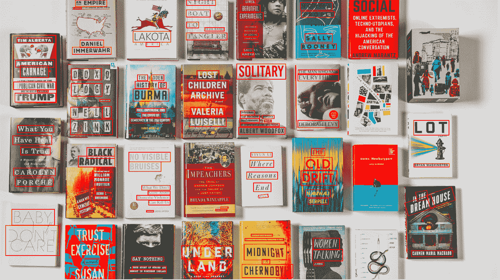

*作者图片*

## 介绍

我爱 OCR(光学字符识别)。对我来说，它代表了数据科学，特别是计算机视觉的真正挑战。这是一个现实世界的问题，它有许多方法，它涉及计算机视觉，管道调整，甚至一些 NLP。这也需要大量的工程。它概括了数据科学中的许多问题:破坏稳健的基准，过度强调方法的复杂性和“新颖性”，而不是现实世界的进步。

两年前，我在[发表了一篇关于 OCR 的文章](/a-gentle-introduction-to-ocr-ee1469a201aa)。和我的大多数文章一样，它的目的是**回顾**这个领域——研究和实践，**阐明**你能做什么和不能做什么，如何做和为什么做，并提供**实用的**例子。

它的本质是——当时深度学习 OCR 是**好**，但还不够**好**。如今后来 OCR**好多了**。但还是**不爽**。

然而，考虑到深度学习领域的活力，在我看来，它需要更新，甚至可能需要完全重写。这就是了。如果您到了这里，您可能对 OCR 感兴趣。要么是学生，要么是想研究这个领域的研究人员，要么是有商业兴趣。无论哪种方式，这篇文章应该让你跟上速度。

> 想了解更多？参观 Shibumi-ai.com

# 入门指南

首先，让我们理清我们的概念:

*   **OCR** — *光学字符识别*。这是一个常用术语，主要指文档中的结构化文本。
*   **STR** — *场景文字识别*。大多是指野外更有**挑战性的**文字。为了简单起见，我们将它们都称为 OCR。

如前所述，OCR 描述了深度学习和数据科学领域的许多成就和挑战。一方面，这是一个巨大的进步。也是一个令人印象深刻的年度改进。但是 **OCR 还是没有解决**。

仍然有一些非常令人讨厌的失败案例被解释为不同的原因，其中大多数都源于标准的深度学习根本原因——缺乏泛化能力，对噪声的敏感性，等等。因此，即使模型可以处理许多情况(不同的字体、方向、角度、曲线、背景)，也有一些偏差是行不通的(只要它们不是手动引入到训练集中):不流行的字体、符号、背景等等。

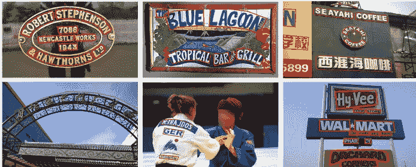

任意形状的文本-来自 ICDAR 2019 数据集

此外，已经出现了一个伟大而有用的库— [**Easy OCR**](https://github.com/JaidedAI/EasyOCR) ，它设定了一个目标，使最先进的 OCR 方法在开放源代码中易于访问和使用。作为额外的奖励，这个库还解决了 OCR 中的多语言问题(目前包括大约 80 种语言和更多语言)和模型的速度(仍处于早期阶段)。这个库并不完美，但它确实是一个很好的解决方案。稍后将详细介绍。

所以事不宜迟，让我们检查一下 OCR 的**状态。**

# 值得注意的研究

与往常一样，数据科学任务的边界通过研究得到扩展，而实践在创新方面落后，但在稳健性方面领先。

在我之前的文章中，我回顾了 3 种方法:

1.  经典计算机视觉的流行方法。
2.  **通用深度学习**方法，检测和识别，高效易用。
3.  **用于 OCR 的特定深度学习**方法，如 [CRNN](https://arxiv.org/abs/1507.05717) 和 [STN](https://arxiv.org/abs/1707.08831) 达到了良好的结果，但“太新而不可信”。

在这篇文章中，我们可以说**特定的深度学习**方法已经成熟，并成为研究和实践中的主导方法。

## 任务

在之前的帖子中，我们使用了一些在当前状态下看起来很简单的例子:*车牌识别*，*验证码识别*等等。今天的模型更加有效，我们可以讨论更加困难的任务，例如:

*   解析截图
*   解析商业手册
*   数字媒体解析
*   街道文本检测

## 管道

在 OCR 上应用标准的对象检测和分割方法后，方法开始变得更加具体，并且适合文本属性:

*   文本是同质的——文本的每个子部分仍然是文本。
*   可以在**不同级别**中检测文本——字符、单词、句子、段落等。

因此，现代 OCR 方法“隔离”特定的文本特征，并使用不同模型的*管道*来处理它们。

这里，我们将重点关注某个设置，实际上是一个模型管道，除了视觉模型(特征提取器)，还有一些更有用的组件:

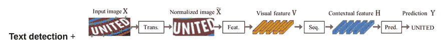

管线图—来自(1)

1.  **流水线的第**部分是**正文**检测——最直观的拆分。很明显，如果您要使用不同的部分，在识别实际字符之前检测文本的位置可能是一个好主意。这部分与其他部分分开训练。
2.  **管道的第二部分**是可选的——转换层。它的目标是处理各种扭曲的文本，并将其转换成更“规则”的设置(见管道图)
3.  **第三个**部分是视觉特征提取器，可以是你最喜欢的深度模型(不过好老的 ResNet 当然效果最好)。
4.  **流水线的第四个**部分是 RNN，用于学习重复出现的文本序列。
5.  **第五个**也是最后一个部分是 **CTC** 损失。最近的作品换成了**关注**。

除了检测部分之外，该流水线大部分是端到端训练的，以降低复杂性。

## 管道“疾病”

拥有不同组件的管道是一个好主意，但是它也有一些缺点。每个组件都有自己的一组偏差和超参数，这导致了管道中另一个层次的复杂性。

## 数据集

众所周知，所有好的数据科学工作的基础是数据集，而在 OCR 中，数据集是至关重要的:结果受到所选择的训练和测试数据集的严重影响。多年来，OCR 任务在大约十几个不同的数据集中得到了磨练。然而，他们中的大多数没有包括超过几千张带注释的图片，这似乎不足以扩大规模。另一方面，OCR 任务是最容易使用的合成数据之一。

让我们看看有哪些突出的数据集可用:

**“真实”数据集**

一些数据集利用了谷歌街景的大规模覆盖。这些数据集可以根据它们对规则或不规则(扭曲、有角度、圆形)文本的关注来划分。

图片来自(1)

SVHN——街景数字，我们在上一篇文章中用作例子。

**SVT** —街景文本—来自谷歌街景的文本图像

**ICDAR** (2003，2013，2015，2019)——一些为 ICDAR 大会和竞赛创建的数据集，侧重点不同。例如，2019 数据集被称为“任意形状的文本”，这意味着，尽管它变得不规则。

**合成数据集**

有两个流行的合成数据集，在大多数 OCR 工作中使用。不一致的使用使得作品之间的比较具有挑战性。

[**【MJ Synth】**](https://github.com/Belval/TextRecognitionDataGenerator)—包括相对简单的单词组成。数据集本身包含约 900 万张图像。

[**Synth****text**](https://github.com/ankush-me/SynthText)—一种更精细的机制，它在第一阶段应用图像的分割和深度估计，然后在推断的表面上应用“植物”文本。数据集本身包含约 550 万张图片。

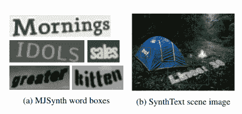

图片来自(1)

[DALL-E](https://openai.com/blog/dall-e/)——有点不确定，但文本图像生成(或许还有 OCR)的未来似乎更加无人监管。

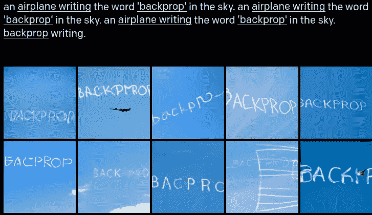

图片来自[https://openai.com/blog/dall-e/](https://openai.com/blog/dall-e/)

合成数据集还擅长生成不同的语言，甚至是困难的语言，如中文、希伯来文和阿拉伯文。

## 韵律学

在处理具体的研究论文之前，我们需要确定成功的衡量标准。显然不止一个选择。

首先，让我们把文本检测放在一边:它可以使用对象检测的标准度量，比如平均精度，甚至标准精度和召回率。

现在是有趣的部分——认知。主要有两个指标:单词级准确率和字符级准确率。特定任务可能使用更高的准确度(例如文本块准确度)。当前最先进的方法在具有挑战性的数据集上的准确率超过 80%(我们将在后面讨论)。

字符级别本身由“标准化编辑距离”包裹，该距离测量单词之间相似字符的比率。

## 研究论文

在本帖中，我们将重点放在最佳实践上，而不是提出想法。关于想法，我建议你去参加这两个调查中的一个，在那里你会发现有很多方法让你很难做出选择。

**场景文字识别有什么问题？**

这个非常有趣的作品有一个有点不寻常的名字，而[作品](https://arxiv.org/abs/1904.01906)本身也很出色。这是一种主动调查，它:

*   定义统一的训练和测试集(经过一些优化)。
*   测试和基准测试数据集上的最佳实践。
*   从逻辑上构建方法，并“帮助”读者理解使用什么。

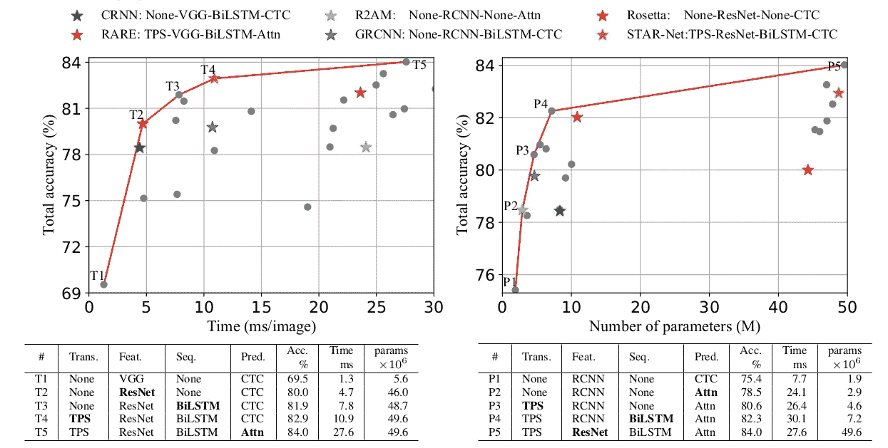

根据(1)对恒定测试集上的 OCR 管道进行分类

因此，本文的要点是:

1.  OCR 的训练数据集(可能被认为是“最好的”)是两个合成数据集— MJ 和 Synthtext。此外，重要的特征不是数量，而是多样性(减少数据量不会对模型的性能造成太大影响，但删除一个数据集会造成影响)
2.  测试数据集是大约 5 个真实世界的数据集。
3.  论文展示了每次管道更新后结果的逐步改善。从 60%到 80%的准确率的最显著的改进是将特征提取器从 VGG 改进为 ResNet。接下来增加的 RNN 和归一化将模型提高到 83%。CTC 对注意力的更新增加了 1%的准确率，但是增加了三倍的推断时间。

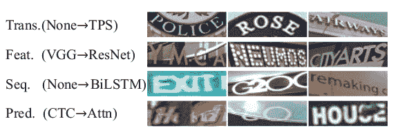

图片来自(1)

## 文本检测

在本文的大部分内容中，我们讨论了文本识别，但是您可能还记得，管道的第一部分是文本检测。达到当前一代的文本检测模型有点棘手。以前，文本检测被直观地认为是对象检测的一个分支。但是，对象检测有一些设置是通用的对象，如汽车，人脸等。当引入文本检测时需要一些重要的更新。

其实质是，文本既是同质的，又以其局部性为特征。这意味着，一方面，文本的每一部分都是单独的文本，另一方面，文本子项应该统一成更大的项(例如，字符到单词)。因此，基于分割的方法将比对象分割更适合文本检测。

**飞船**

我们最喜欢的对象检测方法，也被集成到 easy OCR 中，被称为[工艺](https://arxiv.org/pdf/1904.01941.pdf) —用于文本检测的字符区域意识。这种方法应用了一个简单的分割网络，很好地使用了真实图像和合成图像，以及字符和单词级别的注释。

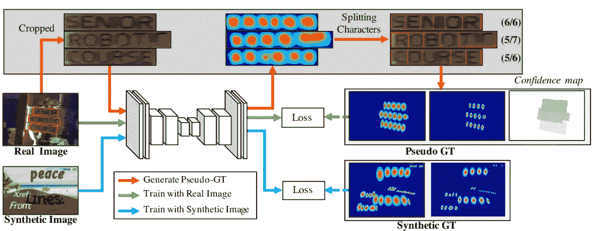

工艺模型方案—图片来自(2)

这个模型产生了大约 80%的 H-mean(在 P 和 R 上)和大多数数据集，并且在单词分离方面也做得非常好，使识别模型更容易。

# 实际例子

我们已经到了实用阶段。你应该用什么？所以我们在前面已经回答了这个问题(简单的 OCR…)，但是让我们检查一些流行的解决方案

## 开放源码

值得注意的一件非常重要的事情是，虽然 OCR 受到学术界缺乏鲁棒性的影响，但它享受着开源软件的蓬勃发展，这使得研究人员和从业者可以建立在彼此的工作基础上。以前的开源工具(例如 Tesseract，见下文)都是从数据收集和开发开始。最近的软件包，如 easy OCR，拥有一套构建模块，从数据生成，通过所有管道模型和更多的调整。

## 工具

[**宇宙魔方**](https://pypi.org/project/pytesseract/)

在很长一段时间里，Tesseract OCR 是领先的开源 OCR 工具(不考虑偶尔与纸张相关的存储库)。然而，这个工具是作为经典的计算机视觉工具构建的，并没有很好地过渡到深度学习。

**原料药**

OCR 是大型云提供商——谷歌、亚马逊和微软——的一些早期计算机视觉 API。这些 API 不共享它们能力的任何基准，所以测试就成了我们的责任

[**轻松 OCR**](https://github.com/JaidedAI/EasyOCR)

在某种程度上，Easy OCR 包是这篇文章的驱动力。从不同的构建块构建一个开源的、最先进的工具的能力是令人着迷的。

它是这样工作的:

1.  使用 [MJ-Synth](https://github.com/Belval/TextRecognitionDataGenerator) 包生成数据。
2.  工艺模型(见上图)用于检测。
3.  训练一个基于“什么是错的”论文的微调管道，(见上文)用于文本识别。
4.  其他优化。
5.  多语言:如前所述，OCR 包含一些 NLP 元素。因此，处理不同的语言有差异，但我们可以从 CRAFT 模型(可能还有其他检测模型)中受益的相似之处是多语言。识别模型是特定于语言的，但是训练过程是相同的，有些是相同的(例如希伯来语和阿拉伯语是 rtl 语，而不是从左到右)

这个难题的最后一块，也是使其成为现阶段“走向 OCR 技术”的一块，是性能。你可以在下面看到，它们甚至比付费的 API 结果还要好。

Easy OCR 需要改进的一点是调整能力:虽然语言选择很容易，但可以根据不同的目的改变模型和重新训练。在我们的下一篇文章中，我们将展示如何做到这一点。

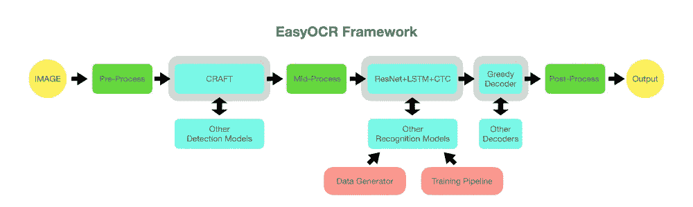

图片来自[https://github.com/JaidedAI/EasyOCR](https://github.com/JaidedAI/EasyOCR)

## 运行时呢？

OCR 的推断可能很慢，这并不奇怪。检测模型是一个标准的深度学习模型，在 GPU 上运行约 1 秒(每张图像)，而识别模型在检测中反复运行。一个有很多项目的图像，在 GPU 上可能要几十秒，更不用说 CPU 了。如果你想在手机或 PC 应用上运行 OCR，使用较弱的硬件会怎样？

简单的 OCR 可以帮你解决这个问题:首先，这个库归纳了一些技巧来加快推理速度(例如，更紧密的图像切片形状来识别物体)。此外，由于是模块化的，有可能(目前有一些代码调整)集成您自己的模型，这些模型可以更小、更快。

# 代码示例

所以在讨论了不同的套餐和模式之后，是时候见证实际效果了。去这个 [colab](https://colab.research.google.com/drive/1kNwHLmAtvwQjesqNZ9BenzRzXT9_S80W) 笔记本试试 Easy OCR vs Google OCR vs Tesseract。我选择了两张图片:

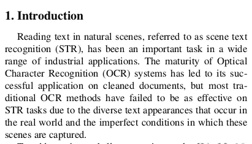

“PDF”——图片来自(1)

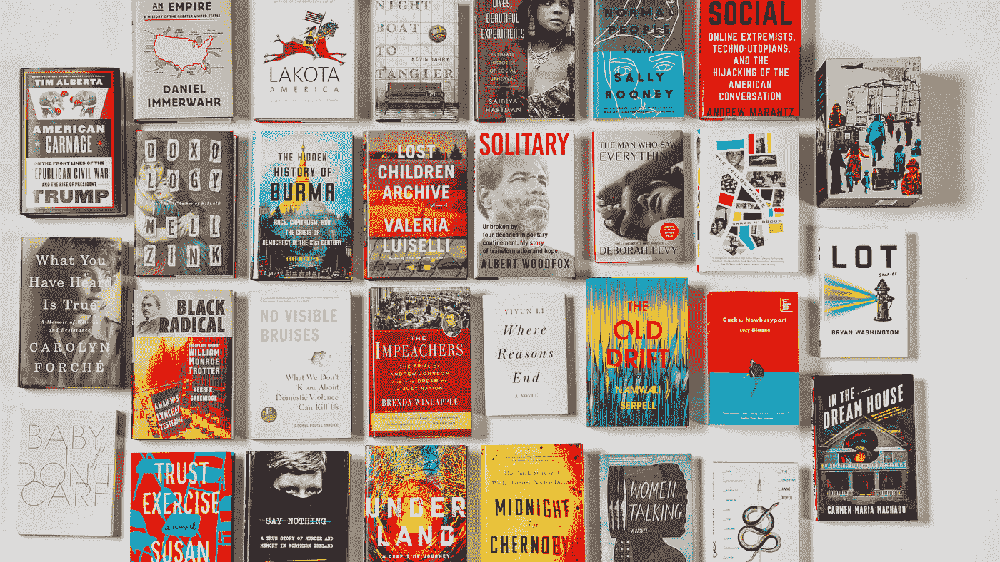

“挑战的形象”——作者笔下的*形象*

一个是常见的 OCR 案例—来自文档的标准结构化文本，第二个是具有挑战性的书籍封面集合:许多字体、背景、方向(没有那么多)等等。

我们将尝试三种变体:Easy OCR、Google OCR API(被认为是大型技术云 API 中最好的)和传统的 Tesseract。

## 便携文档格式

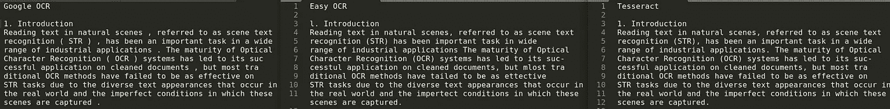

PDF 结果

在这类文本上，好的 ole' **Tesseract** 和 **Google OCR** 表现堪称完美。这是有道理的，因为谷歌 OCR 可能在某种程度上基于宇宙魔方。

注意 google OCR 对这类文本有一个特殊的模式——DOCUMENT _ TEXT_DETECTION，应该应用这个模式而不是标准的 TEXT _ DETECTION。

Easy OCR 的准确率在 95%左右。

## 挑战形象

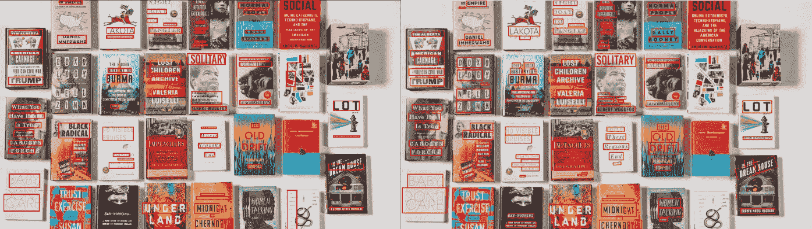

**左**:谷歌 OCR — — — **右**:简易 OCR

一般来说，简单的 OCR 结果是最好的。具体来说，检测组件捕获了大约 80%的项目，包括非常具有挑战性的对角线项目。

谷歌的 OCR 更差，大约 60%。

在认知度上，他们大致相当——大约 70%在字符水平上，这使得他们在单词或书籍水平上不那么好。看起来 Google OCR 对一本书不是 100%正确，而 Easy OCR 有一些。

我注意到的另一件事是，虽然 Easy OCR 在字符方面更好，但谷歌 OCR 在单词方面更好——这让我觉得它可能在幕后使用了 s dictionary。

# **总结与未来**

我希望你喜欢这篇文章。

我们已经看到，虽然已经做了很多工作，但 OCR 也遇到了深度学习的相同泛化问题，并且可能会继续遇到这种问题，直到一些范式发生变化。

最近的开放人工智能模型——Clip 和 Dall-e，显示了一些“无监督”的 OCR 理解

在接下来的文章中，我们将卷起袖子:

*   了解如何根据我们的目的定制简易 OCR 框架
*   为我们的目的训练一个定制的 OCR 引擎。

敬请期待！

## 参考资料:

1.  场景文本识别模型对比有什么问题？数据集和模型分析— Baek 等人。
2.  用于文本检测的字符区域意识。
3.  [https://github.com/PaddlePaddle/PaddleOCR](https://github.com/PaddlePaddle/PaddleOCR)——这个 OCR 包最近在 GitHub 上流行，但是我们还没有机会测试它。
4.  我之前关于 [OCR](/a-gentle-introduction-to-ocr-ee1469a201aa) 的帖子

> 想了解更多？结账[Shibumi-ai.com](http://www.shibumi-ai.com)