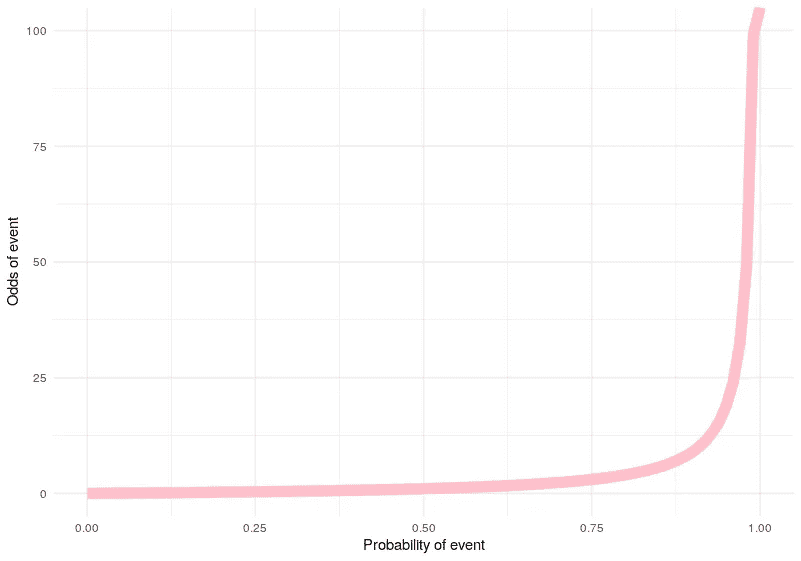
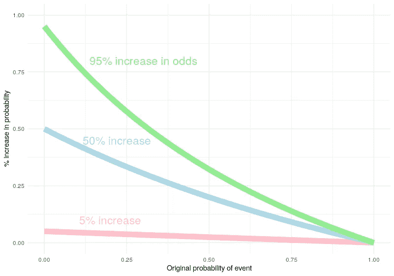

# 赔率！=概率

> 原文：<https://towardsdatascience.com/odds-probability-c9cf80405027?source=collection_archive---------11----------------------->

## 所以很多人觉得他们是一回事。这就是为什么它们非常不同，以及你需要注意的地方

许多人交替使用“odds”和“probability”两个词。这两个术语都意味着对可能性或机会的估计。对于外行人来说，我可以理解这一点，但我经常看到数据科学家和统计学家也混淆了这些概念，这很遗憾，因为从数学上来说，它们意味着不同的东西。

虽然它们都是相关的，但赔率和概率在规模和意义上是非常不同的。当在错误的环境中混淆时，这可能导致对机会的错误估计，从而导致错误的决策。

在这篇文章中，我想说明这些区别是什么，以及混淆这两者会如何影响分析和研究。

# 概率和赔率有什么区别？

想象你把手放进一个黑色的包里。在那个包里有五个红色的球，三个蓝色的球和两个黄色的球。

一个**概率**被定义为某一事件发生的次数，用所有可能发生的事件的*的比例来表示。*在我们的黑色袋子里有三个蓝色球，但总共有十个球，所以你抽出一个蓝色球的概率是三除以十，即 30%或 0.3。

**几率**定义为某一事件发生的次数，表示为该事件未发生次数与*的比例。在我们的黑色袋子里有三个蓝色的球，但是有七个球不是蓝色的，所以抽到一个蓝色球的几率是 3:7。赔率通常表示为，在这种情况下是 3 除以 7，约为 43%或 0.43，或者是 7 除以 3，约为 233%或 2.33。*

图 1:以事件概率的函数表示的事件概率(作者生成)

# 赔率和概率有什么关系？

赔率和概率之间的转换并不难，这里有两个简单的转换公式——看看你是否能理解为什么这些公式基于我上面给出的简单例子:

*   如果某件事发生的概率是 *P* ，那么它发生的几率就是 *P/(1 — P)* 。参见图 1 中的图表。
*   如果某事发生的几率是 *O，*那么它发生的概率是 *O/(1 + O)* 。

思考赔率和概率在属性上的不同也很有帮助:

*   概率有一个从零到一的有限范围。赔率的范围是无限的。
*   某事发生的概率总是小于它发生的几率(假设概率非零)。
*   概率越小，相似的概率和赔率就越多。比如英国国家彩票中奖概率是 0.0000000221938762。几率是 0.000000221938767。
*   概率越大，与赔率的差异越大。大概率有天文数字的赔率。90%的概率等于 900%的几率，99%等于 9，900%，99.999%等于 9，999，900%。

图 2:赔率增加 5%、50%和 95%对事件概率的影响(作者生成)

# 为什么这很重要？

这可能导致理解上的重大错误的一个领域是当*逻辑回归*被用于研究一个问题时。逻辑回归用于模拟某些输入变量如何影响二元(或多类)结果(例如是或否，组成员或非组成员)。例如，逻辑回归可用于确定许多生活方式因素如何影响疾病的五年生存结果。

逻辑回归模型使用*优势比*来量化给定输入变量的影响程度。优势比描述了基于输入变量增加一个单位的结果优势的百分比*变化。例如，你可能会计算出，一个人每增加一公斤额外的体重，患病的几率就会增加 5%。*

这并不意味着“体重每增加 1 公斤，患病的可能性就会增加 5%”。这完全取决于首先得这种病的概率是多少。赔率增加的影响根据事件的先验概率而减小。图 2 说明了这一点。

当*量化变量*的影响时，要注意的主要事情是混淆几率和概率。一般来说(除了完全确定或完全不可能的情况)，增加的几率意味着增加的可能性——通常术语*可能性*被用来包含两者。因此，在谈论方向效果时，将这些术语作为同义词使用通常是安全的。当你量化这些影响时，你必须小心你的语言。

最初我是一名纯粹的数学家，后来我成为了一名心理计量学家和数据科学家。我热衷于将所有这些学科的严谨性应用到复杂的人的问题上。我也是一个编码极客和日本 RPG 的超级粉丝。在 LinkedIn 或 Twitter 上找到我。也可以看看我关于[*drkeithmcnulty.com*](http://drkeithmcnulty.com/)*的博客或者我的* [*关于人物分析的教科书*](http://peopleanalytics-regression-book.org/) *。*