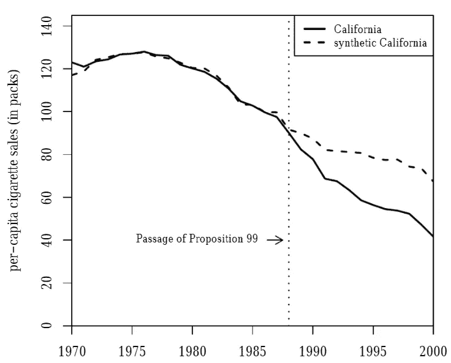

# 反事实和假设

> 原文：<https://towardsdatascience.com/of-counterfactuals-and-hypotheticals-6dacc6cd4871?source=collection_archive---------30----------------------->

## 理解综合控制方法背后的直觉——它的用途、优点和局限性。

[MediaPRO](https://www.mediapro.com/blog/two-paths-meeting-gdpr-training-requirements/) 上的照片

作为人类，我们总是倾向于在大脑中创造假设的场景。我们通常通过与做出相反决定的假想时间线进行比较来衡量任何决定的影响。因此，没过多久，政策制定者就开始通过提出几个“如果”来衡量政策干预的效果。场景。一种通过创造这种反事实情景来评估政策干预效果的技术是**综合控制方法(SCM)。由 Abadie 和 Gardeazabal 开发的**,*经济展望杂志*将其描述为*“可以说是过去 15 年政策评估文献中最重要的创新”。*

但是为了更好地理解这一点，我们来看一个案例研究

# 1.99 号道具

1988 年，加州通过了一项名为 99 号提案的烟草控制计划。到 1990 年，加州人的烟草消费显著下降。对这一突然下降的天真解释可以归因于该方案。但是当如此大规模的干预被执行时，结果很少只有一个原因。一个更怀疑的人会强调其他因素-

1.  甚至在该政策颁布之前，加州的吸烟率就已经在下降。
2.  更加重视健康教育方案和其他此类活动，这可能有助于稳步下降。

因此，一个简单的之前和之后的故事不会帮助我们充分理解“道具-99”的效果。对我们有帮助的是创造一个从未实施 Prop-99 的替代场景——而合成控制恰恰做到了这一点。它的正式定义如下-

> 这是一种在比较性病例研究中评估治疗效果的统计方法。它通过对控制组中的变量和观察值进行加权来创建处理单元的合成版本。

让我们将它分解并应用到我们的案例中:

1.首先，选择一批潜在候选人作为对照组(即没有实施这种烟草控制方案的其他州)。

2.在这些潜在的候选人之外，通过将干预前的结果和直接影响结果的其他变量(即香烟销售)与目标地区(即加利福尼亚)干预前时期的相同变量相匹配，形成一个合适的捐献者库。

3.该捐助者池+目标区域用于建立一个“合成州”,该州与政策干预前的加州烟草消费非常相似，并在政策颁布后作为目标区域的控制。

最终输出可以用如下图形表示:

[1]人均卷烟销售趋势:加利福尼亚州与美国其他地区

现在，使用这种技术，我们可以回答怀疑论者之前提出的问题。

1.  由于我们的捐助者群体由没有实施此类政策干预的州组成，因此很少有机会通过外推法来证明我们的反事实结果变量的合理性。
2.  由于合成状态是由从候选池中选择的供体区域的加权和构成的，因此在选择控制状态时没有偏差，这可能是传统差异中的差异方法的缺点之一。
3.  该模型的有效性反映在合成状态如何紧密地跟随政策干预之前的治疗状态的结果趋势线。

# 2.什么时候用？

1.  从上面的案例可以看出，供应链管理的实施通常发生在一个集合的层次上:国家、州、地区等。
2.  它适用于不存在合适比较的区域。举个例子，如果 A 和 B 是两个单位，A 实施了一些干预。我们可以比较干预对 B 组的影响，并找到感兴趣的反事实。但是，在没有 B 组的情况下，我们使用 SCM。
3.  只有一个治疗病例和几个对照病例。

# **3。局限性**

很容易理解为什么我们更喜欢使用这种技术来创建一个模型，该模型可以在总体水平上估计政策干预的效果。但是它也有自己的局限性。

供应链管理的主要挑战之一是在缺乏协变量信息的情况下选择合适的供体库——特别是对于可能需要大量领域专业知识的问题。因此，麻省理工学院的研究人员开发了**鲁棒综合控制(RSC)** ，这可以解释为一种更一般化的 SCM 方法

与 SCM 相比，使用 RSC 的主要优势是

1.  通过奇异值阈值对数据矩阵去噪；顾名思义，这使得它在多个因素上“稳健”。
2.  它会自动选择一个合适的供体库，因此我们只需要在没有足够的协变量信息的情况下关于结果变量的数据。
3.  因此，在使用 RSC 时，领域专业知识几乎成了一种奢侈品，而不是必需品。

*更多阅读，我推荐你查看以下链接-*

1.  [https://www . urban . org/research/publication/synthetic-control-method-tool-understand-state-policy](https://www.urban.org/research/publication/synthetic-control-method-tool-understand-state-policy)
2.  [*http://peerunreviewed . blogspot . com/2019/11/a-short-tutorial-on-robust-synthetic . html*](http://peerunreviewed.blogspot.com/2019/11/a-short-tutorial-on-robust-synthetic.html)

*参考文献-*

阿尔贝托·阿巴迪，亚历克西斯·戴蒙德，延斯·海因米勒。美国统计协会杂志。2010 年 6 月 1 日，105(490):493–505。doi:10.1198/jasa.2009.ap08746