# 2021 NHL 赛季官方预告

> 原文：<https://towardsdatascience.com/official-2021-nhl-season-previews-8c093f2898a0?source=collection_archive---------49----------------------->

## 赛季开始前你最后一分钟的冰球修正

我最近为 2021 年 NHL 赛季建立了一个投影模型。在这里可以找到这个模型的高层次概述，但它的要点是，我使用回归来确定每个 NHL 球员在他们所做的每件事情上有多好，以及他们会为他们的团队做多少事情，在团队层面上汇总这些值以确定每个团队在这些事情上的表现，然后模拟赛季 10，000 次以确定赛季最可能的结果。最终模拟将于 2021 年 1 月 6 日进行，届时将更新名册。

首先，对于那些喜欢图表的人来说:这里是所有球队按照他们预计的积分和进入季后赛的概率划分的:

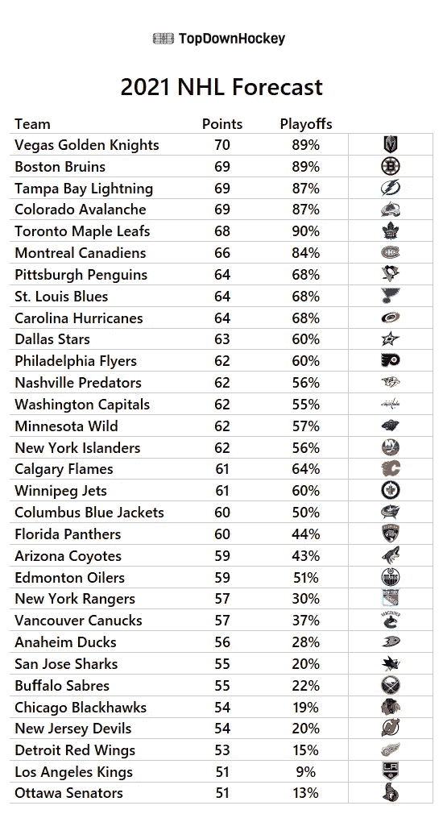

这些团队是按各自的部门划分的吗:

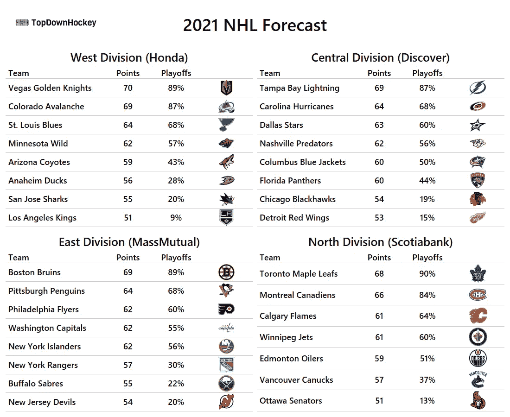

你可能会注意到的一个主题是，北部赛区的球队比北部赛区以外的球队更有可能进入季后赛，后者预计会获得类似的分数。这是因为北赛区只有 7 支球队。

> **目录**

## [**北师**](#500f)

*   [渥太华参议员](#500f)
*   温哥华加人队
*   [埃德蒙顿加油工](#e4e0)
*   [温尼伯喷气机队](#57be)
*   [卡尔加里火焰](#6ca9)
*   蒙特利尔加拿大人队
*   多伦多枫叶队

## [**西师**](#d312)

*   [洛杉矶国王队](#8474)
*   [圣何塞鲨鱼队](#de1a)
*   [阿纳海姆鸭子](#9b6e)
*   [亚利桑那郊狼](#c21d)
*   [明尼苏达野生](#c627)
*   [圣路易斯布鲁斯](#1dcf)
*   [科罗拉多雪崩](#66cb)
*   [维加斯黄金骑士](#7cc1)

## [**中央分部**](#50ab)

*   [底特律红翼](#615b)
*   [芝加哥黑鹰](#017b)
*   [佛罗里达黑豹](#427d)
*   [哥伦布蓝夹克](#e39c)
*   [纳什维尔掠食者](#6f04)
*   [达拉斯明星队](#d2bd)
*   [卡罗莱纳飓风](#3bba)
*   [坦帕湾闪电](#cf3f)

## [**东师**](#98bf)

*   [新泽西魔鬼队](#fe41)
*   [水牛刀](#3a0f)
*   纽约流浪者队
*   纽约岛民
*   [华盛顿首都](#bc09)
*   [费城传单](#4667)
*   [匹兹堡企鹅](#c50e)
*   [波士顿布鲁因斯](#7a6c)

# **北师**

这些分区彼此非常接近，有 7 支球队的分区不可避免地会是最容易进入季后赛的分区，但正巧北部分区也是球队实力最弱的分区。这个部门的弱点始于底层。这个分区的季后赛平均得分是 60.63 分。

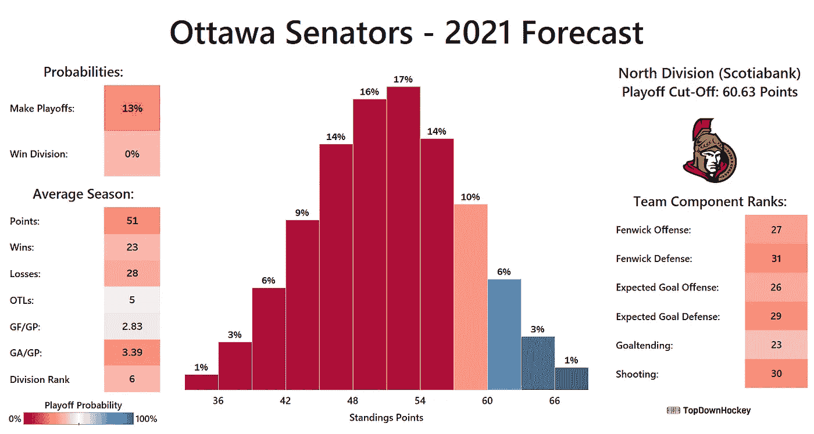

渥太华 13%的概率进入季后赛不是任何球队的最低估计，但这主要是由于加拿大分部的结构，因为渥太华确实是 NHL 中最差的球队。这应该不会让任何人感到惊讶，但有一部分人会不同意，因为渥太华在休赛期取得了进步。我强烈反对渥太华提高了他们的球队到足够好的程度。

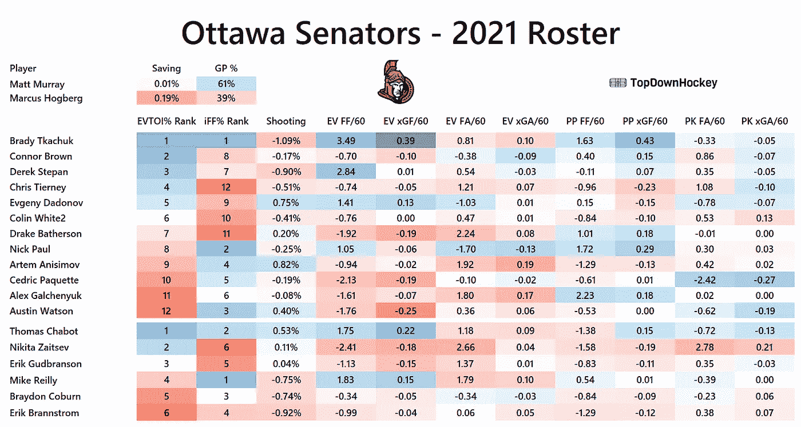

渥太华的名单上散落着可怕的深度球员，他们努力推动比赛，他们成功的希望很大程度上取决于三名球员:马特·穆雷，布雷迪·特卡丘克和托马斯·查博特。当穆雷作为新秀技术上赢得了两次斯坦利杯时，他看起来是 NHL 的下一个年轻的超级明星守门员，但从那以后就跌落悬崖，并且是 NHL 去年最差的守门员之一，这使得他作为一个大致普通的守门员的计划对他来说几乎感觉太好了。布雷迪·特卡丘克(Brady Tkachuk)已经巩固了自己作为 NHL 最有危险的进攻得分机会的车手之一的地位——当你考虑到他在实现这一壮举时所效力的球队的质量时，这一壮举变得更加令人印象深刻——但他在防守上给予了一些回报，更重要的是，他是 NHL 中最差的射手之一。有一个论点是，他创造的机会的危险被我的数据高估了，这反过来意味着他的投篮被低估了，但无论如何，结论仍然大致相同:他没有对他的球队的得分率产生重大的积极影响。尽管打了联盟中最艰难的几分钟(就冰上时间而言)，但托马斯·查博特在非常年轻的时候就已经是一名出色的进攻防守者，但他也在防守方面做出了很多贡献，除非他设法解决这个问题或将他的进攻带到另一个水平，否则他不能被认为是一名真正的精英进攻防守者。

如果没有这三名球员的出色表现，很难想象这支球队会有一条通往季后赛的道路。

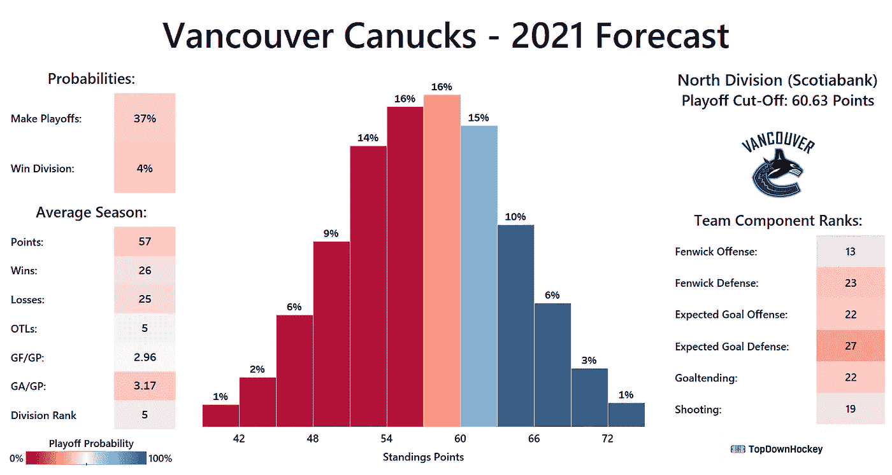

对于一支刚刚晋级 16 支球队季后赛，然后在附加赛中淘汰了斯坦利杯卫冕冠军的球队来说，这可能感觉很低。但这是一支在常规赛中表现平平的球队，失去了他们的首发守门员雅各布·马克斯特罗姆，许多球迷和媒体认为他是他们的 MVP。(我个人认为埃利亚斯·彼得森是他们的 MVP，但事实仍然是马克斯特罗姆也非常有价值。)此外，虽然他们光明正大地赢得了对圣路易斯的系列赛，并因此获得了荣誉，但有理由认为，尽管他们被大量淘汰出局，但他们还是有点幸运，我们不应该拿乔丹·宾宁顿是最大因素的六场比赛样本来说明这一切。

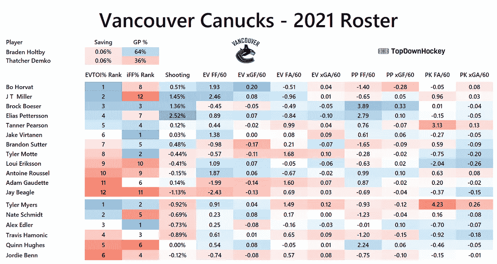

我个人喜欢温哥华做出的让 Markstrom 走人的决定，以及用 Braden Holtby 取代他的决定，即使他的表现像我预测的那样差，或者即使他的表现和上赛季一样差，他的合同也存在很小的风险。但在短期内，霍尔特比应该比马克斯特罗姆差得多，事实仍然是，这支球队存在重大的防守问题，他们的大多数球员预计会对他们球队的预期失球率产生负面影响。他们更擅长进攻而不是防守，但他们也不擅长防守。

这支球队有很大的机会进入季后赛——他们无论如何都不会死在水里——但即使我们认为埃利亚斯·彼得森将连续第三年在冰上取得另一个疯狂的投篮命中率，他们也需要霍尔特比恢复到韦齐纳的状态，德姆科恢复到 5-7 对拉斯维加斯的状态，或者如果他们想成为斯坦利杯的竞争者，他们整个球队的防守都需要迈出大步。

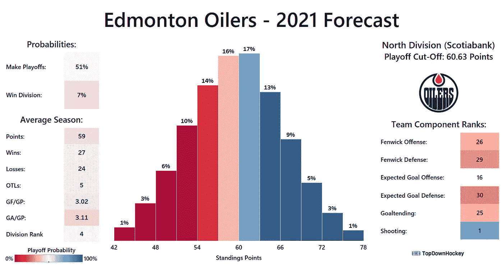

在他们的球队以 96 分的成绩完成 2019-2020 赛季常规赛后，Oilers 的球迷可能会觉得这个预测太低了，如果整个赛季都以传统的 16 支球队的形式进入季后赛，大约有 90%的机会，但如果更深入地看一看去年的表现，就会发现原因令人担忧。石油人享受了联盟最好的力量比赛——自 70 年代以来 NHL 看到的最好的比赛——和联盟第二好的点球。比赛的这些方面都不像力量比赛那样可重复，他们的净胜球差-16 是水牛城军刀队(-6)的两倍多，而领先洛杉矶国王队(-20)。那不是好伙伴。此外，未来的预测是建立在不止一个赛季的基础上的，埃德蒙顿有一个比去年弱得多的团队的记录。

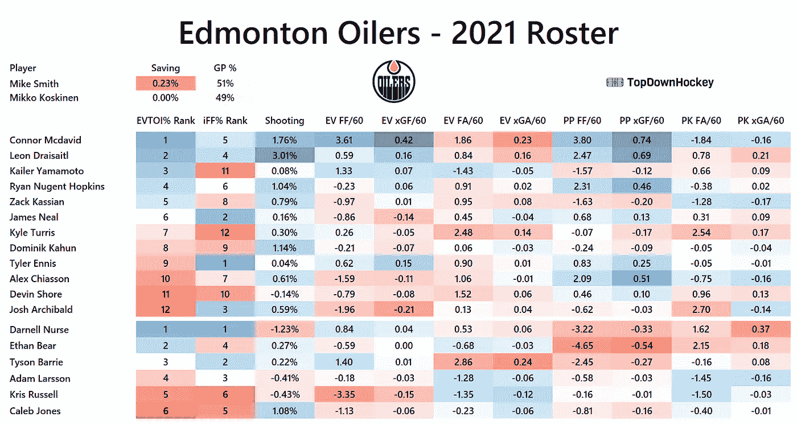

名单上的每个球员都被认为是擅长投篮的，德雷塞特被认为是联盟中最好的射手。他们也有一些球员预计将对权力游戏产生非常强烈的影响，所以尽管他们极不可能复制去年 29.5%的纪录，但他们也可能在权力游戏中远远高于平均水平。他们的前两名球员是联盟中最好的两名球员，虽然他们两个如果在防守上努力的话会更好，但埃德蒙顿的其余问题是他们阵容的其余部分。他们的守门员组合上赛季表现一般，但他们都比这差，而且他们现在大了一岁。山本和纽金特-霍普金斯都是优秀的球员——山本甚至可能在更大的样本量中被证明是伟大的——但与其他参赛球队的第三和第四名最佳前锋相比，他们远低于平均水平，而且他们在这四名之外的前锋非常弱。他们的防守不是联盟中最差的，但也远低于平均水平，如果冰上时间分配得更合理一点，情况可能会更糟。

这支球队很有可能进入季后赛，这要归功于他们的两名顶级球员和他们所在的球队，但他们很难做出任何真正的破坏。

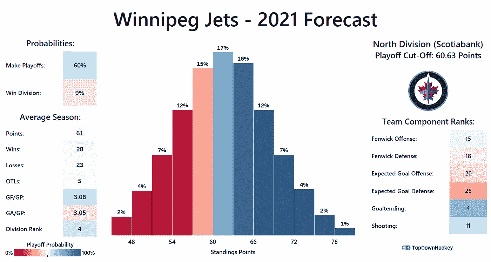

很明显，温尼伯在 2017-2018 年进入联盟决赛时所拥有的魔力早已不复存在，几乎他们的整个防守军团也是如此，但我不相信他们像上赛季一样糟糕，在上赛季[他们仅以比底特律](https://public.tableau.com/profile/topdownhockey#!/vizhome/Seasonal5-on-5xG2017-2020/Seasonal)更高的 5 对 5 xGF%结束了赛季，并在康纳·埃莱比克的一个巨大的、赢得维兹纳和值得哈特的赛季的支持下被带到了泡沫中。这并不是说他们也是一支优秀的球队——我会称他们为平均水平——但在 NHL 最弱的分区，如果他们错过了季后赛，那将是令人失望的。

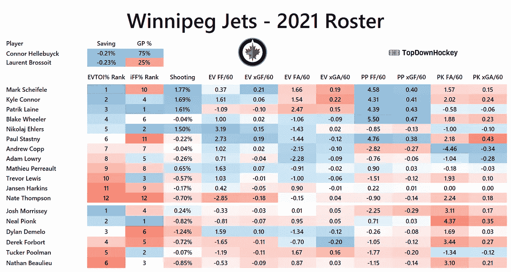

保罗·斯塔斯蒂尼上赛季可能没有得到很多分，他也不会成为一个伟大的射手，但他的潜在影响仍然很强，让他担任二线中锋应该对温尼伯的比赛有很大帮助。他们的倒数第六名在转换得分机会方面很挣扎，但他们在创造这些机会方面做得很好，他们作为一个整体实际上防守很强，所以我不认为他们是一个问题，或者至少不是温尼伯最大的问题。温尼伯最大的问题在于他们的防守队员不是迪伦·德梅洛，以及他们顶线的防守。

如果他们的顶线可以回到典型的防守差的第一线的水平，而不是像去年那样绝对的轮胎火，他们的总经理可以设法抓住一个半体面的防守者或两个弃权，这可能是一支相当不错的球队。如果这些事情没有发生，这支球队将不得不依靠康纳埃莱比克的另一个哈特奖杯级别的赛季。如果他们也没有得到，他们就有大麻烦了。

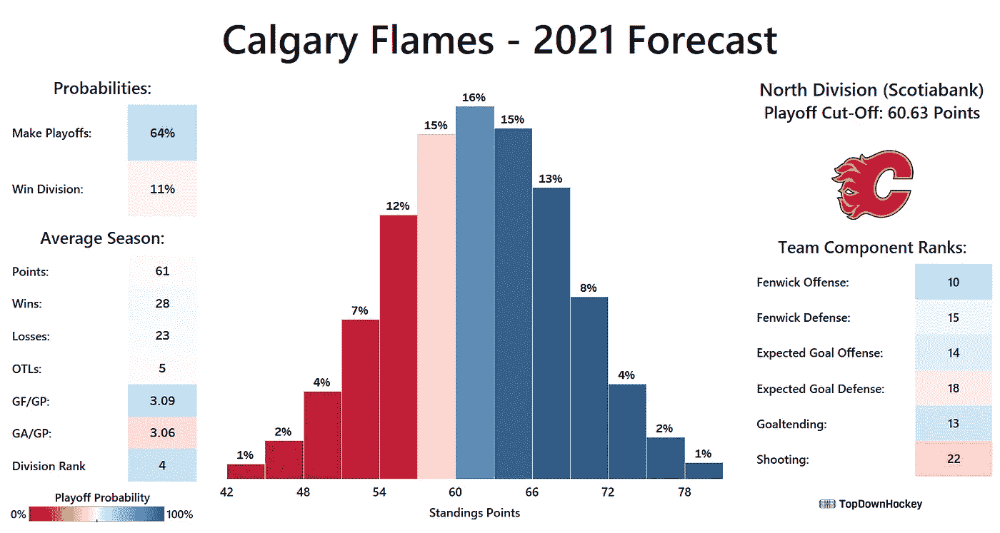

一个赛季卡尔加里以积分百分比排名西部第八，并在对温尼伯的泡沫系列赛中获胜，这充分说明了这一点，这被认为是一个巨大的失望。这不是一支性感的冰球队，我不认为艾伯塔省的任何人对他们本赛季的斯坦利杯赔率感到非常兴奋。但他们也不是一支糟糕的曲棍球队，在比赛的几乎每个方面都表现平平，这与他们去年的表现大致一致，尽管他们的大多数顶级球员今年都有所下降。在联盟中最差的分区，作为一个普通的球队应该足以让卡尔加里火焰队在不到 2/3 的时间里进入季后赛。

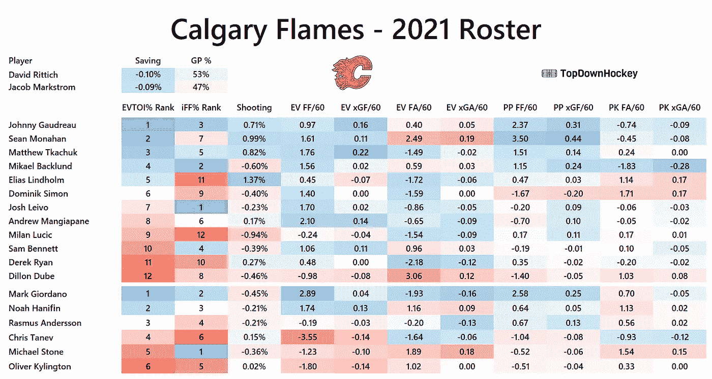

守门员在过去几年里一直是卡尔加里的一个问题，但雅各布·马克斯特罗姆的加入意味着这可能会成为他们的对手前进的一个问题。这支球队的顶级球员上赛季后退了一步，可能永远不会达到他们在 2018-2019 年达到的巅峰水平，但他们仍然表现良好，卡尔加里阵容的底部通常由驾驶技术相当好的球员组成，如果他们的顶线能够达到收支平衡，这应该会让他们在竞争中占据优势。

他们的防守不怎么样，但是如果迈克尔·斯通换成一个还算不错的人，并且奥利弗·凯林顿能够向前迈进一步的话，他们会看起来更好。最终，这个团队的天花板看起来并不太高，但是地板看起来也不太低。

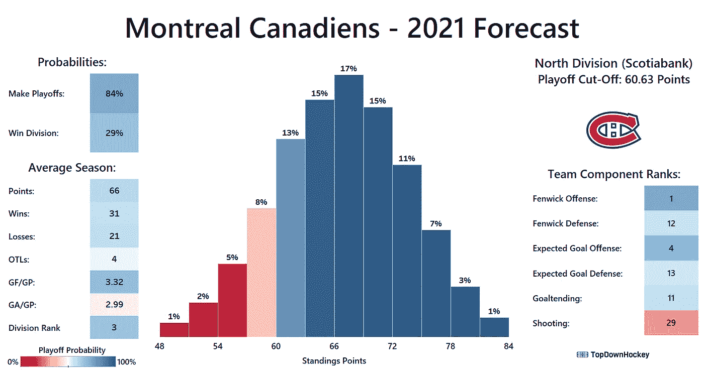

我的预测不是唯一的，因为我对蒙特利尔的排名远远高于他们在过去几个赛季的实际排名。在很大程度上，每个人的预测大致反映了前几个赛季的团队表现，这些赛季中量化和权衡表现的方式决定了谁的预测比其他人更准确，每个人的预测都相当准确。那么为什么蒙特利尔的每个人都比过去的实际排名高那么多呢？我怀疑是替补守门员和一球比赛的糟糕记录。蒙特利尔在过去两个赛季的净胜球只有-2，这表明他们更像是一支普通的球队，而不是一支真正糟糕的球队。但更重要的是，这个数字被替补门将压得很低；他们比凯里·普莱斯的样本高出 33 分。值得注意的是，如果你只计算他们在比赛中表现最好的守门员的净胜球，大多数球队会看起来更好，但蒙特利尔的情况差异是惊人的。此外，他们在这个样本上 5 对 5 的潜在指标与所有没有被评为全美曲棍球联合会第二好的拉斯维加斯队相匹敌。

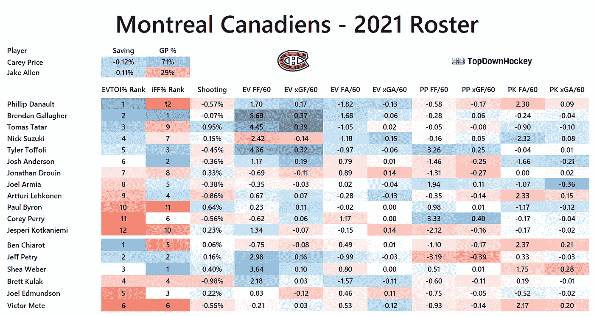

不像蒙特利尔在过去几年中使用的替补守门员，杰克艾伦去年表现很好，预计明年也会很好。如果这能让凯里·普莱斯得到更多的休息，并在他首发的比赛中打得更好，那将是一件大事。但是除了守门之外，这个名单的其他部分都很不错。尽管仅仅由于低动力比赛冰上时间和这些分钟内的糟糕表现而导致的总积分令人印象深刻，但鞑靼-达诺-加拉格尔线已经花了整整两个赛季面对 NHL 中最激烈的竞争，并通过各种措施(包括进球)消灭了他们。他们名单的其余部分有不少问号，但他们的两个新成员泰勒·托弗利和乔什·安德森都是强大的球员，他们的总得分因冰上投篮不佳而下降，他们的倒数第六名表现良好，他们的防守也是优秀的进攻球员。

如果本·基亚罗、乔尔·埃德蒙森和乔纳森·德鲁因能够拿出符合蒙特利尔管理层对他们的看法的结果，或者克劳德·朱利安能够限制他们的冰上时间，这支球队就可以制造一些严重的噪音。

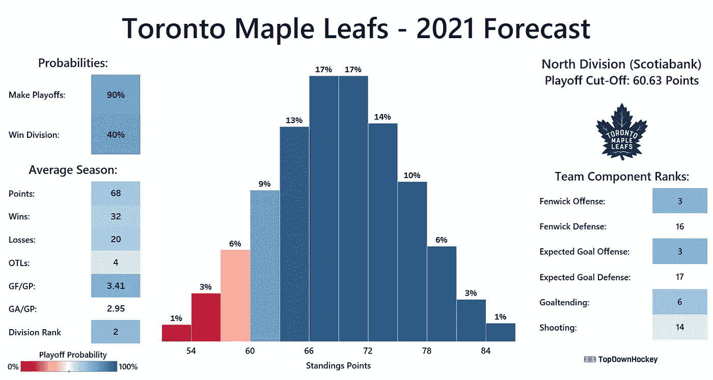

说到被替补守门员和一球不佳记录拖累的球队:见见多伦多枫叶队。在过去的两个赛季中，他们与弗雷德里克安德森的净胜球差为+72。这可能有点刺激，因为多伦多通常在背靠背的上半场让安德森首发，并把他们的替补晾在一边，但这仍然清楚地证明了这是一支强大的球队，只要他们的守门员表现出色。我在上面列出的这个 90%的数字是所有团队中最高的，这理所当然地在 Leaf Nation 中引发乐观和兴奋。但需要注意的是，这是一把双刃剑，另一面写着，如果多伦多*真的*无缘本赛区季后赛，甚至在前两轮中的一轮失利，他们就没有更多的借口可以制造了。这是连续三年在第一轮面对波士顿和华盛顿这样的球队的 180 度大转弯；在这里，失败的可能性较低，但如果失败真的发生，那么由此产生的羞辱和自我反省会高得多。

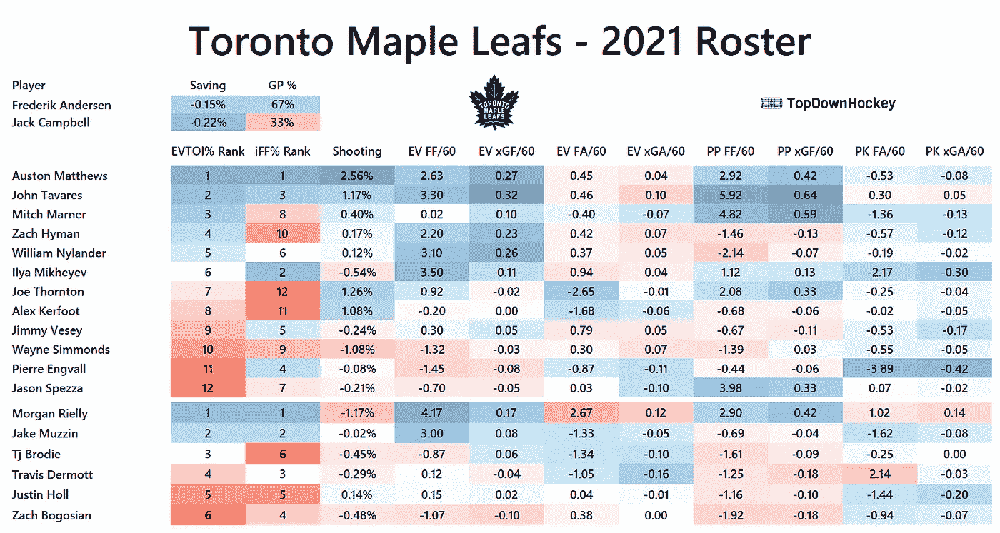

虽然这支球队的防守多年来一直被视为一个主要问题，但布罗迪的加入和特拉维斯·德莫特的出现意味着这六个人的防守应该高于平均水平，即使摩根·里利在冰上领先他们。然而，由于他们前锋的弱点，球队整体防守仍然低于平均水平。但防御不是成功的先决条件；这支球队的守门能力很强，他们的进攻接近联盟顶级，预计得分最多(部分原因是他们部门的弱点，但主要是因为他们的技术)。

这是一个非常强大的阵容，如果不是因为令人费解的决定，以七位数的工资增加韦恩西蒙兹和扎克博格斯安的替补球员，并给予他们一个名单上的位置，这将是一个更加领先的阵容。如果年轻人能够尽早占据这些位置，即使在最糟糕的情况下也能保持体面，这支球队可能会更好。

# 西区分局

西部赛区头重脚轻，形成了独特的平衡，三支优秀的球队在顶端，三支弱队在底端，两支平庸的球队在中间。这个赛区可能不是整体上最好的，但肯定是防守最强的，斯坦利杯冠军代表的赛区最聪明的选择可能就是这个。这个分区的季后赛平均得分是 62.34 分。

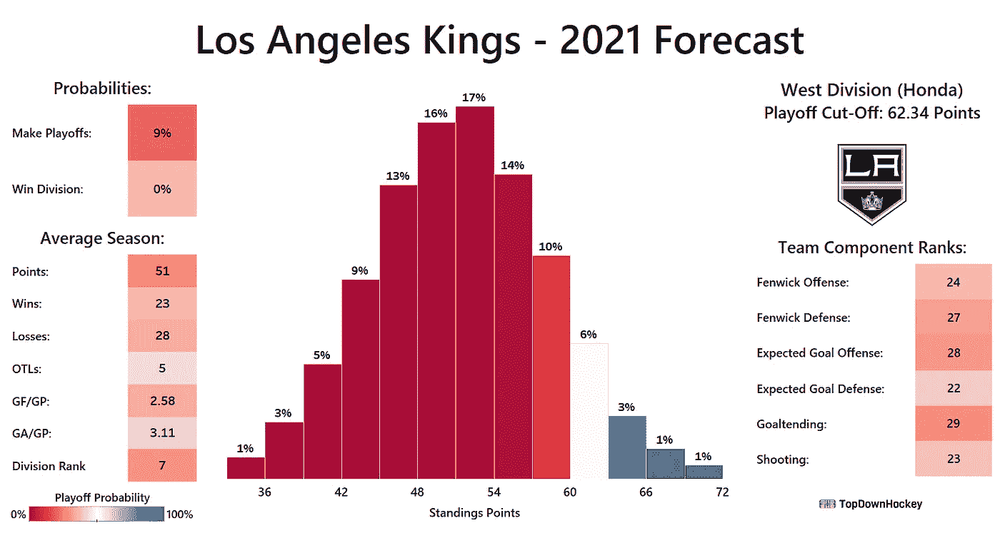

洛杉矶国王队并不是 NHL 中最差的球队，但由于他们所在的分区，他们进入季后赛的概率最低。他们的未来看起来肯定是光明的，许多人认为他们的前景池是继中锋昆顿·拜菲尔德之后 NHL 中最好的。但截至目前，这支球队进入季后赛的概率非常渺茫；他们的进攻和防守都非常糟糕，无论是进球数还是进球数都接近联盟垫底。托德·麦克勒朗似乎总是从他的球队那里得到比他应该得到的更多的东西，因此我可以看到这支球队在推动比赛方面比我预计的要好一些，但很难看到他们在这方面甚至是平均水平，即使他们是，他们的守门员和射门仍然应该是一个主要问题。

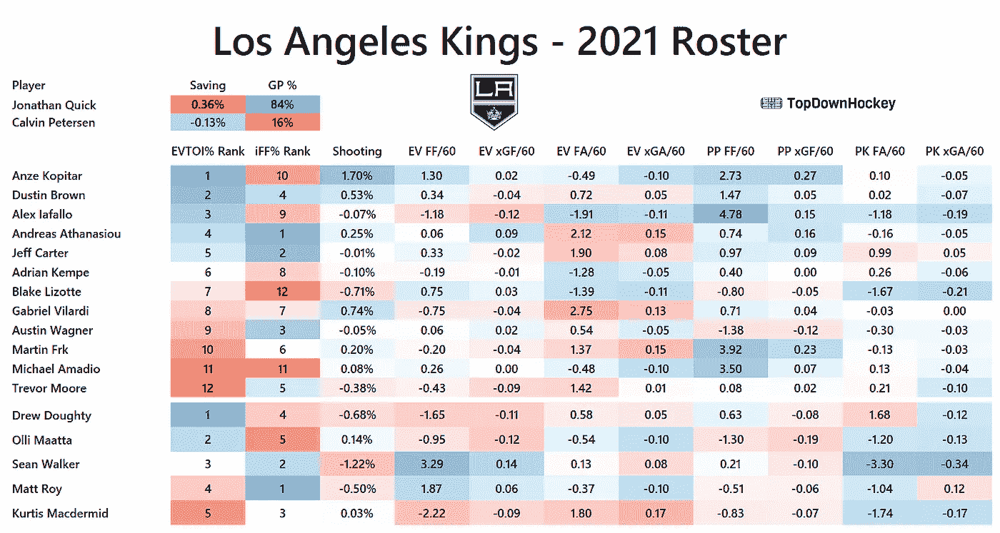

由于德鲁·多尔蒂和乔纳森·奎克可能会反弹，因此很容易忽视这些预测；两者在 2017-2018 年都是强劲的参与者。但预测是基于结果的，尽管使用了 3 年的样本，但他们两人都预测如此之差的事实恰恰表明，在过去两年中，他们对他们的团队造成了多么可怕的伤害。

Anze Kopitar 仍然很强大，但即使他保持这种状态，并且前面提到的二人组在本赛季回到了令人尊敬的水平，这份名单仍然很弱，很难想象今年会有任何形式的破坏。如果这支球队能增加一个像样的第六防守队员，也许还有一个第五防守队员来代替库尔提斯·麦克德米德，然后让多尔蒂休息几分钟，这也会有所帮助；这也可能帮助他变得更好。

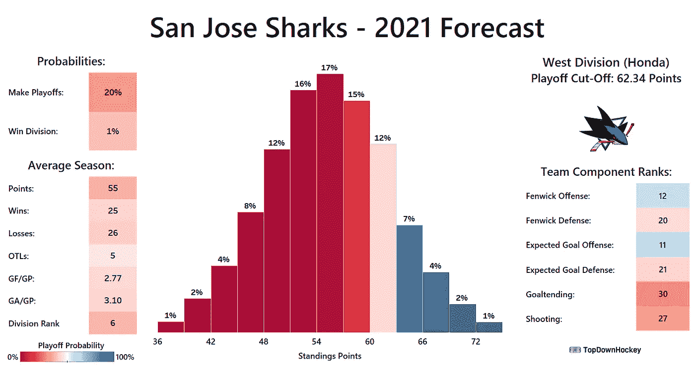

圣何塞鲨鱼队被认为是本赛季的反弹候选人，这是有充分理由的:他们一直是一支强大的球队，有理由相信去年是一个异数，而不是证明他们是什么。此外，他们预计是一个大致平均的比赛驱动团队，他们最大的弱点是他们的守门员和他们的投篮；每年最不可重复的组件。然而，这个团队的上限也不是很高；由于运动员的年龄，他们的比赛驱动力更有可能下降而不是提高，他们已经失去了一些两年前使他们成为主导比赛驱动团队的人才，几乎他们保留的每一个球员都预计会比他们当年的表现差得多。人们很容易陷入这样一个陷阱，即这支球队的上升空间应该与他们两年前的水平大致相当，但事实是它要低很多。

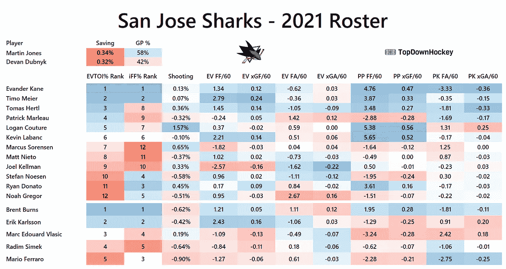

与普遍的看法相反，圣何塞鲨鱼队上赛季最大的问题实际上并不是守门；他们的滑冰运动员表现异常糟糕。道格·威尔逊(Doug Wilson)尽了最大努力，确保圣何塞的滑手们明年不会成为他们最大的问题，当时他解雇了亚伦·戴尔(Aaron Dell)，他无疑是圣何塞上赛季的最佳守门员，也可以说是他们的 MVP(这是糟糕的一年)，并从明尼苏达获得了德文·杜布尼克(Devan Dubnyk)。决定离开戴尔的一个像样的替补，并在 Dubnyk 加入联盟中最差的守门员之一，以一支已经有琼斯联盟中最差守门员之一的球队，几乎可以肯定的是，糟糕的守门员管理将比他们潜在的半像样的滑球员群体更难拖垮这支球队。

现在，任何时候任何人谈论守门，应该注意的是守门是足够随机的，甚至没有超出一个合理的可能性范围，其中一个家伙有一个*好*赛季。但即使在守门员之外，这个名单也相当令人印象深刻，这支球队需要他们的守门员进行一场维兹纳式的运动，才能制造任何真正的噪音。

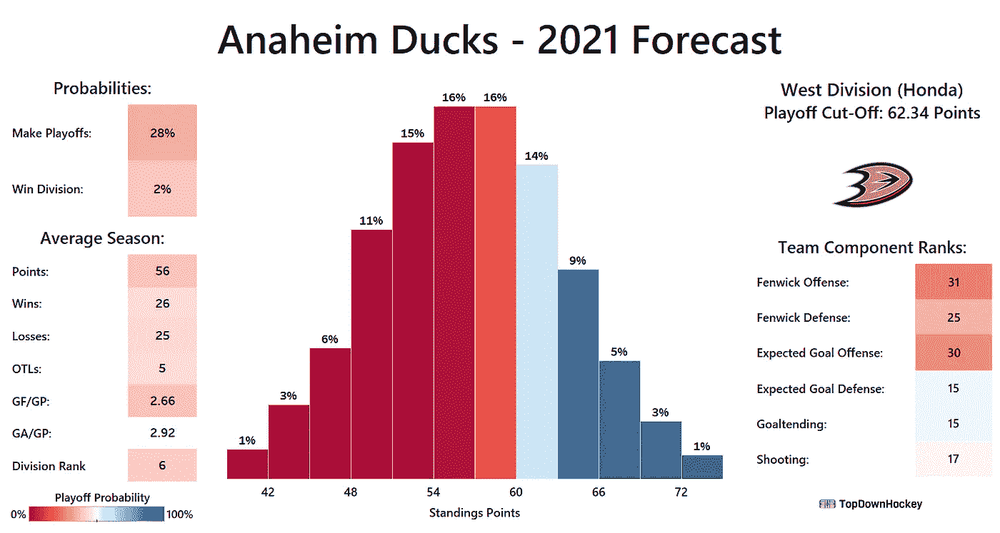

阿纳海姆鸭队计划成为一支还算过得去的防守球队，尽管允许高射门量，但在守门和预期进球防守方面的排名略高于平均水平。他们被建造来放弃大量的投篮而不放弃大量的进球，并在反击中获得足够的分数来赢得相当多的比赛。这是另一支很可能没有潜力在季后赛中制造任何严重噪音的球队，但这绝对可以在短暂的 56 场比赛样本中取代一支优秀的球队，并有可能在季后赛中淘汰另一支优秀的球队。他们本赛季的目标可能是重建，这可能是将要发生的事情，但他们也是一支令人讨厌的球队，赢得比他们应该的更多。

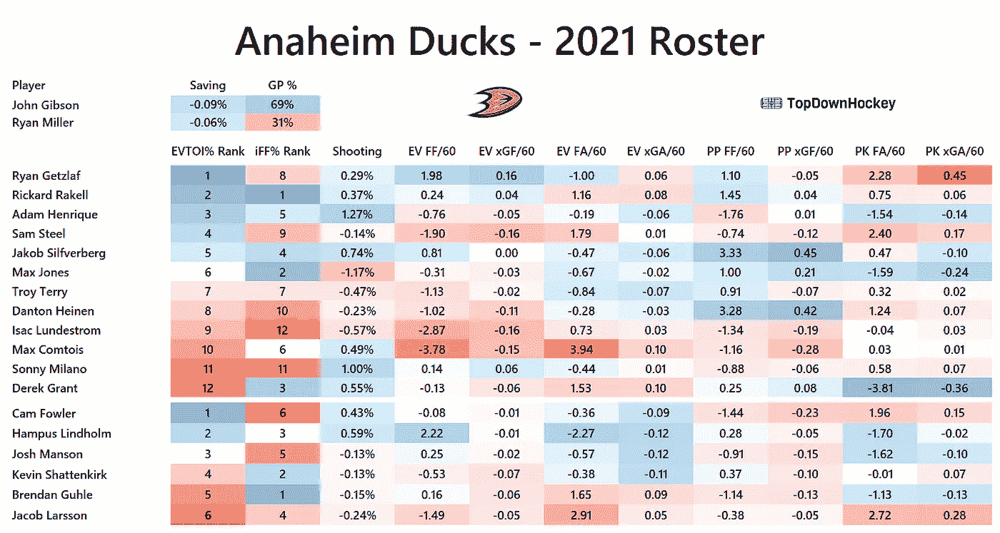

在经历了一个艰难的 2019-2020 赛季后，约翰·吉布森仍然预计将高于平均水平，但人们不得不怀疑去年在筋疲力尽后是否更像是一个侥幸，他多年来作为一名真正的精英守门员更像是他真正的样子。如果是这样的话，这支球队会比平时更让人讨厌。他们的进攻很糟糕；当你上下看看他们的花名册，盯着他们花名册上几乎每个成员糟糕的进攻驱动时，你不会看到他们的排名如此之低。

但有可能他们的一些年轻球员，即马克斯·孔托伊斯、伊萨克·伦德斯特伦和萨姆·斯蒂尔，都可以显著提高他们的进攻能力，并将阿纳海姆提升到一个令人尊敬的团队水平。在他们过去两个赛季的表现之后，很容易忘记阿纳海姆，但他们远不是联盟中最差的球队，季后赛也不是完全的白日梦。

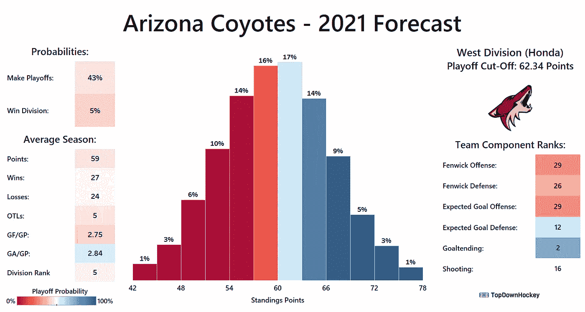

亚利桑那郊狼队的概况基本上是一个富人版的阿纳海姆鸭队:他们在进攻方面很糟糕，他们放弃了大量的投篮，但大多数都是低质量的，他们的守门员是精英，他们的射手足够体面，可以在反击中得分。富人版的烂冰球队仍然是烂冰球队，但就像阿纳海姆一样，这支球队生来就是让人讨厌的，赢了一堆他们不该赢的比赛，而且这些比赛的百分比比阿纳海姆略高。

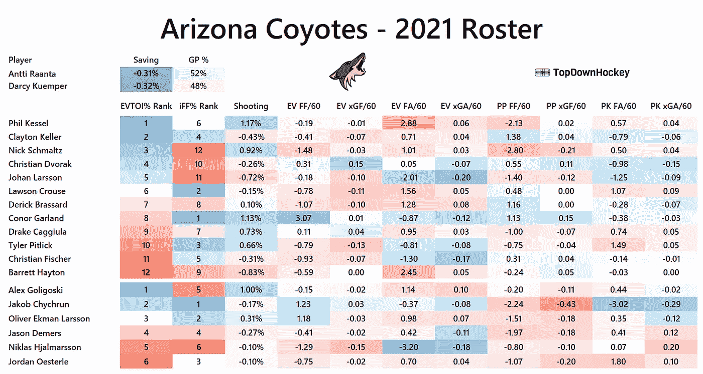

理论上，这支球队的守门能力就像你能建立的守门组合一样完美:两个都是精英的家伙将会以大约 50/50 的比例分担比赛。但是曲棍球不是纸上谈兵，Raanta 和 Kuemper 都在过去与伤病作斗争，这可能会损害他们在比赛中的表现，或者更有可能迫使第三个守门员代替他们比赛，如果他们错过时间的话。这支球队的其他球员甚至不能应付守门员的一般表现，所以如果他们不能有出色的表现，他们就会有麻烦。

他们的滑冰运动员还有进步的空间；像克莱顿·凯勒和劳森·克劳斯这样的年轻球员可以设法改善他们过去的比赛方式，被低估的#7D 伊利亚·柳布什金可以抢走乔丹·奥斯特勒的首发位置，如果他们有强大的守门员，这两件事应该足以推动这支球队进入季后赛。但是这支球队的生死取决于他们的守门员，如果他们得不到，他们就完蛋了。

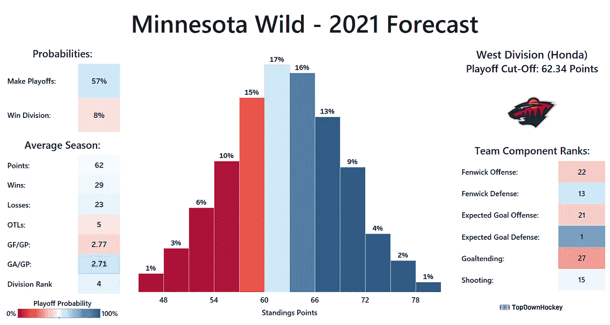

明尼苏达州野生动物比赛所在地 Xcel 能源中心的记分员显示出一种趋势，即错误地报告击球距离球网比实际距离更远，这一点[我已经详细写过](/building-venue-adjusted-rapm-for-expected-goals-the-origin-the-process-and-the-results-part-1-1c12f68df0cc)。这导致他们允许拍摄和拍摄的照片质量被低估。但即使建立了一个模型来调整这一点，我仍然得出结论，这是一支精英防守球队，进攻糟糕，投篮一般。这听起来像是一支还算过得去的季后赛球队的完美配方，直到你开始谈论他们最大的弱点:守门。他们上赛季的守门员组合是联盟中最差的，如果他们只是接受了一般的联盟守门员，他们就会成为真正的季后赛球队和斯坦利杯的竞争者。

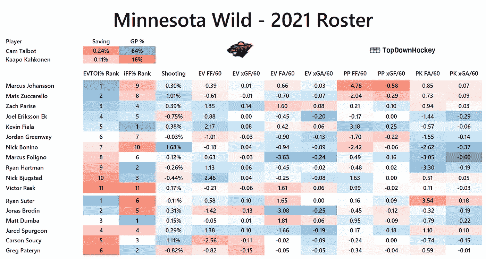

由于亚历克斯·斯塔洛克的受伤和德文·杜邦克的交易，明尼苏达将更换上赛季的两名守门员——他们最大的两个问题——但他们增加的球员并不比他们失去的球员好多少。然而，在他们之外，这份名单看起来相当不错。前锋擅长预测对手的屈服，这在他们的防守中表现出来，他们的蓝线可以说是联盟中最好的。(如果 Greg Pateryn 和 Matt Dumba 恢复前几年的良好状态，不会有任何人提出异议。尼克·博尼诺的分析是一个迷因，但据我所知，明尼苏达队从纳什维尔得到了一个非常好的全能前锋，同时用第二轮选秀权交换了卢克·库宁。

再加上基里尔·卡普里佐夫，你会看到一支有潜力成为斯坦利杯黑马竞争者的球队，如果他们的守门员还算过得去的话，考虑到这个位置的波动性，这并不是很长远。

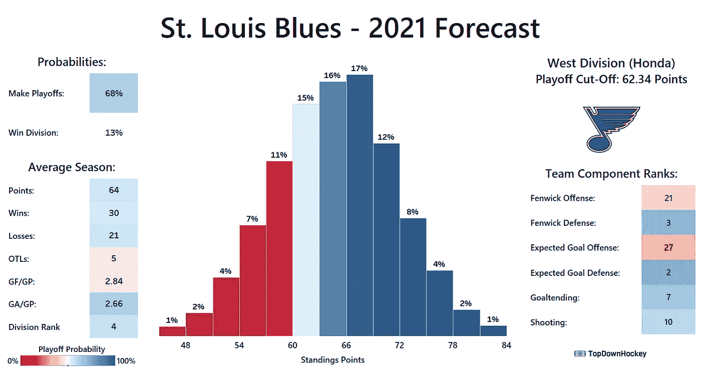

圣路易斯队在 2019 年斯坦利杯之后，在常规赛中领先西部联盟。他们确实在泡沫时期的 6 场比赛中输给了温哥华，但这更多的是 PDO 的侥幸，而不是他们能力的真实指标，甚至不是他们在那些比赛中的表现。通常，我刚才说的一切都表明我在谈论一个真正的斯坦利杯竞争者，他有超过 80%的季后赛赔率，应该在 82 场比赛的赛季中至少得到 100 分。而这个团队*是*还是该死的好。但他们不是完成这些壮举的同一支队伍。

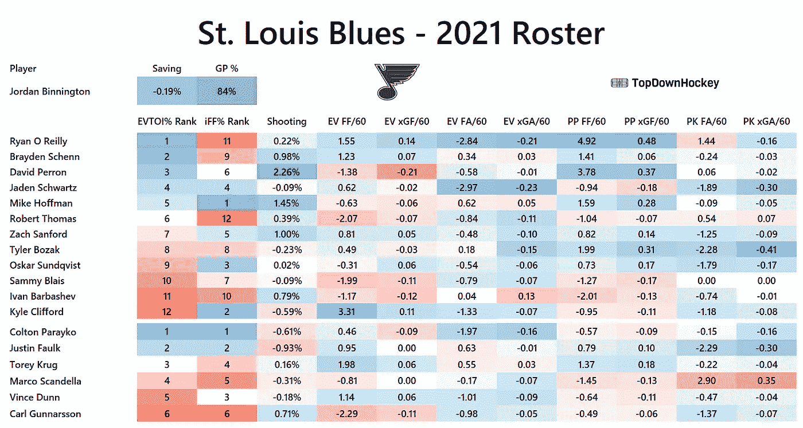

亚历克斯·皮特兰杰洛的离去已经引起了很多人的关注，球迷和媒体这样做没有什么不对；他是一个优秀的防守者，联盟中最好的之一，失去他会伤害圣路易斯。但是亚历克斯·斯汀和杰克·艾伦的损失，他们两人去年都非常出色，也会对这支球队造成一点伤害。迈克·霍夫曼和托雷·克鲁格都是很好的球员，他们会增加很多价值，但如果圣路易斯想从他们身上提取尽可能多的价值，他们需要他们集中力量打球并在那里取得成功，这说起来容易做起来难，如果没有足够的冰球，他们有可能走向南方；他们实际上并不是强大的进攻球员，这是这支球队的普遍弱点。

这应该仍然是一支优秀的防守球队，有一个强大的守门员在大部分时间里发挥出色，但如果宾宁顿的表现更像他在泡沫中的表现，或者维尔·胡索的表现低于他预计的联盟平均水平，他们可能会发现自己处于危险之中，因为在一个强大的防守部门中，作为一个弱进攻球队总是有一些风险。

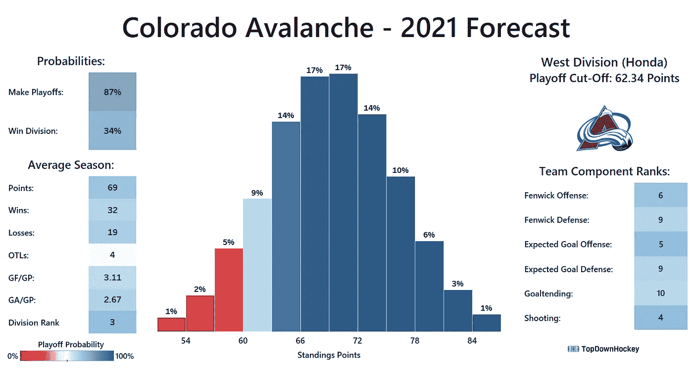

对科罗拉多州雪崩队的合理预期是，他们本赛季的排名会有所下降，这将源于他们联盟领先的 PDO 队比上赛季的下降。但后来乔·萨基奇用尼基塔·扎多罗夫和两个第二轮选秀权换来了布兰登·萨德和德文·托尤斯(在两次单独的交易中)。现在这支队伍是 NHL 中从上到下最强、最平衡的队伍之一，在比赛的每个方面都排名前十。守门被认为是这支球队的一个问题——显然我不同意这一点，因为我已经把他们排在了第十位——但这支球队在各个方面都足够强大，他们有足够的装备来管理联盟中最差的守门，如果他们有这种能力的话。

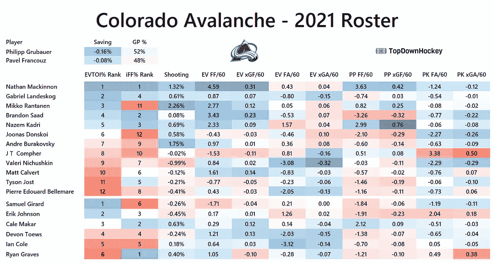

科罗拉多队的名单由内森·麦金农打头阵，这位超级巨星中锋只是有点落后于联盟中真正的最佳球员，但与两年前不同的是，这绝不是他一个人的独角戏。这份名单在董事会上下都非常强大；甚至第五防守队员和第九前锋瓦列里·尼丘什金·伊恩·科尔也是优秀的双向球员。当你看到排名第十的守门员背后的名字时，就更容易理解为什么人们会关注两个有伤病困扰的家伙，并把他们的成绩放在更容易的位置上，但我仍然觉得恐惧是被误导了。

在我看来，这支球队最大的问题不是守门，而是他们的两名顶级防守队员。塞缪尔·吉拉德对联盟中任何球员的点球差异都有最好的影响，这个模型中忽略的点球肯定低估了他，但仍然令人担忧的是科罗拉多预计将把最多的冰上时间给一个净消极比赛驱动的防守队员。把吉拉尔和约翰逊的上场时间换成托沃斯和马卡也许会让这支球队更有统治力。

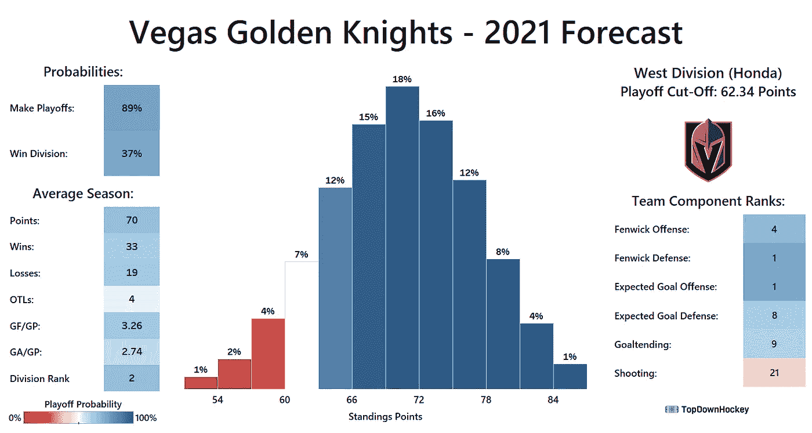

维加斯可能不会像他们预计的那样赢得总统奖杯，但有些事情将会严重出错，他们不会超过绝大多数对手，他们的投篮不会比他们允许的投篮更靠近球网。这是他们在过去的两年里所做的，在他们从第一个赛季的良好的比赛驱动和精英转型进攻团队转型后。但不管出于什么原因，这种方法并没有转化为实际目标或反对目标，也没有转化为预期目标。在过去的两个赛季中，他们的净胜球仍然很高，但相对于他们在预期净胜球中的排名，他们的得分低得令人怀疑。对阵的进球可以用糟糕的守门员来解释——马克-安德烈·弗勒里有点下滑，他们的替补都很糟糕——但射门是一件更复杂的事情。有可能预期目标模型低估了他们在繁重的预检中创造的机会的质量，从而低估了他们排名第 21 的投篮。底线是，这无疑是一支非常强大的球队，但如果他们不能抓住危险的机会，他们可能无法达到精英球队的预期。

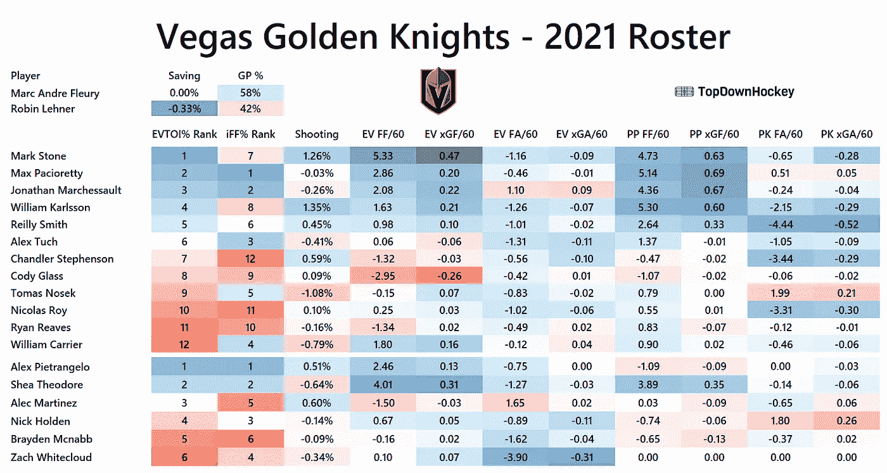

除了几名球员之外，这支球队的阵容上下非常均衡。他们最差的球员看起来是科迪·格拉斯，他去年在一个小样本中挣扎，但仍然年轻，有潜力成为一名普通球员，其他球员看起来最差也不错。这支球队即使在糟糕的守门员和投篮的情况下也能进入季后赛；他们已经这样做了几年，现在只是增加了一个诺里斯奖杯口径的防守球员亚历克斯·皮特兰杰洛。

但是，如果罗宾·莱纳能够击败马克-安德烈·弗勒里预计要参加的一些比赛，并在过去几个赛季中表现出色，这支球队应该可以轻松进入季后赛，并有可能赢得总统奖杯，即使他们很难转换得分机会。如果他们能够设法以正常的速度转换得分机会，这将是 NHL 中最好的球队——无与伦比。

# 中央分部

中部赛区有去年的斯坦利杯冠军，去年最差的球队，还有一支更差的球队，以及其他四支都有机会进入季后赛的球队。这个分区的季后赛平均得分是 62.11 分。

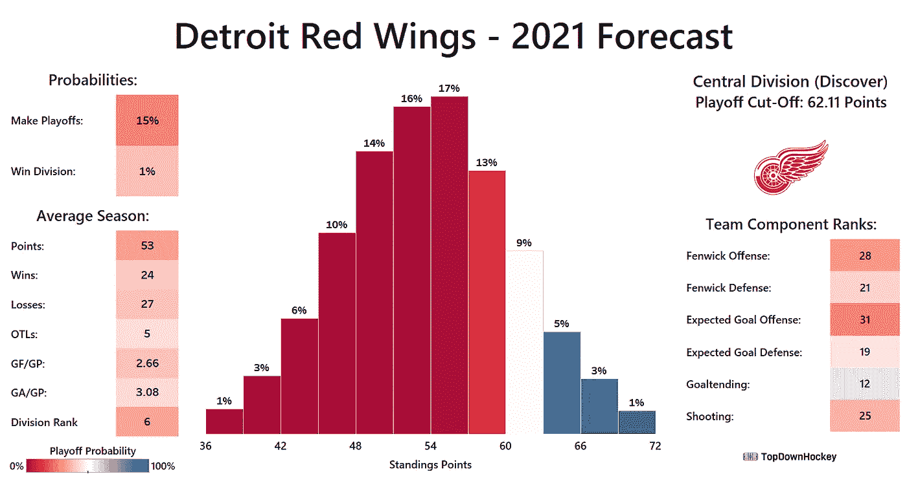

底特律灾难性的 2019-2020 赛季使人们很难调和他们有 1.5%的机会进入季后赛的想法，更不用说有 15%的机会进入季后赛和 1%的机会赢得分区冠军。但这支球队上赛季最大的问题是吉米霍华德，他走了，他们采取了许多其他措施来改善他们的球队。没有人说他们是一支优秀的球队——嗯，我不是——但他们肯定没有去年那么差，我也不认为他们有想象的那么差。

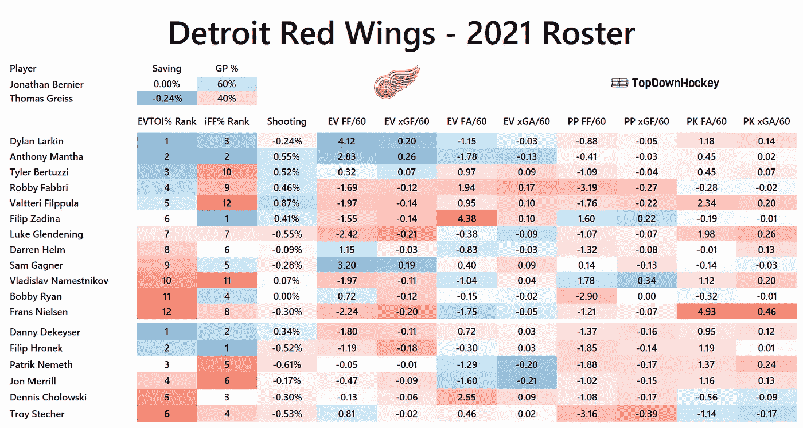

可以理解的是，在去年灾难性赛季的混乱中失去了一些积极因素:当三人都健康时，贝尔图齐-拉金-曼塔线的强劲表现，帕特里克·内梅特的强劲防守，以及乔纳森·伯尼尔的不太好的守门员表现。在一个理想的世界里，内梅特并不是你蓝线上最激动人心的名字，但是一个刚刚经历了几十年来最糟糕赛季的球队必须在他们能得到的地方接受积极的东西。

底特律季后赛的渺茫希望取决于像扎迪娜这样潜力巨大但在 NHL 水平上表现不佳的球员的进步，山姆·加格纳、乔恩·梅里尔和托马斯·格雷斯这样低调的球员的强劲表现，以及他们上赛季保持或建立在这种表现基础上的几个亮点。这可能又会是痛苦的一年，但是我们会看到的。

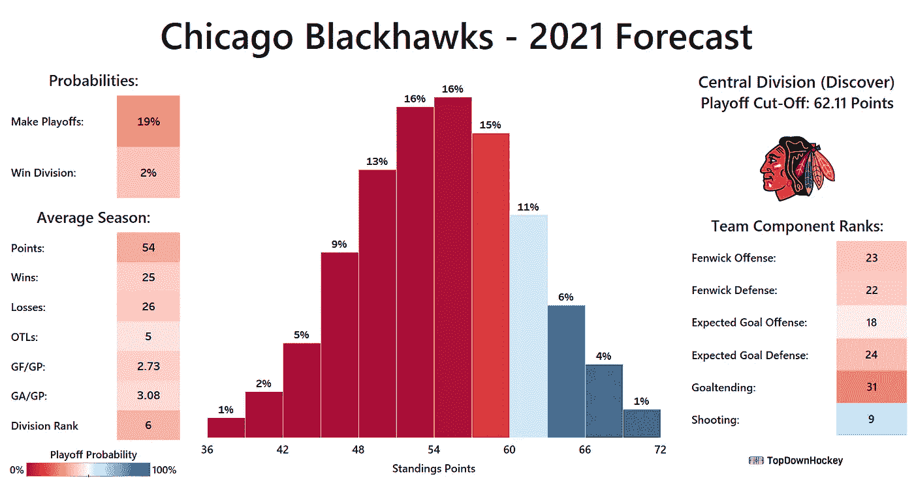

感觉芝加哥黑鹰队这个赛季并没有真的想要赢，我也不能真的责怪他们。Jonathan Toews 和 Kirby Dach 将错过本赛季的大部分或全部比赛，他们的守门技术预计将是联盟中最差的。如果这两件事不是真的，他们可能真的有泡沫球队的素质，但他们不能控制这些伤病，获得良好的守门员是可能的，但说起来容易做起来难。对这支球队来说，最好的行动可能是让赛季结束，然后在交易截止日期决定球队想要采取的长期方向，这正是管理层似乎满意做的事情。

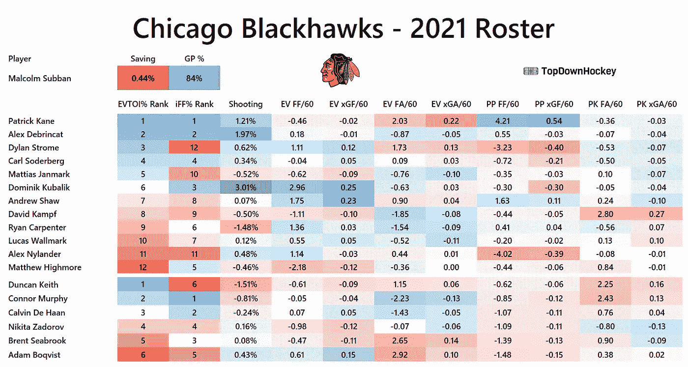

张秀坤·库巴利克在 24 岁时进入 NHL，从第一天起就将联盟撕裂，以每小时 5 对 5 的进球领先 NHL，并拥有强大的基础指标。我预计他明年的个人投篮不会那么幸运，但如果他仍然不是一个该死的好球员，我会感到震惊。他也不是名单上唯一有趣的年轻球员；博奎斯特和德布林卡特现在都是好球员，他们都有很高的潜力。

不幸的是，对于黑鹰队来说，他们名单上的其他人相当弱，他们唯一的 NHL 守门员是一个历史记录在联盟中最差的家伙。完全有可能苏班或科林迪利亚(他们预计的替补)在网上组织了一场像样的比赛，这对这支球队来说还有很长的路要走，但他们要成为下赛季的合法竞争者还需要更多的努力。

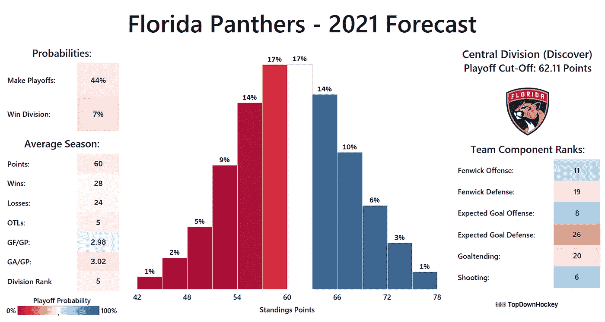

佛罗里达黑豹队确实是一支奇怪的队伍。每年，都有很多人预测这一年他们会向前迈进一步，成为一支季后赛球队，但这似乎永远不会发生。公平地说，他们通常比最后一名更接近季后赛，所以这些预测在任何一年都不会严重失误，也不会产生于一个糟糕的过程。如果有人在 2019-2020 赛季之前告诉我，他们认为谢尔盖·博布罗夫斯基(Sergei Bobrovsky)将创造一个体面的赛季，我不一定会说他们是白痴，因为这没有发生。有时一个好的猜测是错误的，公平地说，这支球队现在已经准备好向前迈出一步了。他们是一支进攻很强的球队，投篮很好，但是糟糕的防守和糟糕的守门能力意味着他们今年只有 44%的机会向前迈进，进入季后赛。

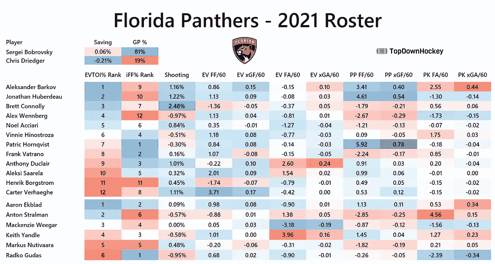

失去迈克·霍夫曼和叶夫根尼·达多诺夫令人伤心，但比尔·济托收购了姚一奇·伊诺斯特罗萨、帕特里克·霍恩奎斯特、卡特·维尔海吉和拉德科·古达斯，这对他的球队有利，并减轻了这些损失带来的损害。总的来说，这应该是一支强大的进攻团队，他们如入无人之境地埋葬着自己的机会。谢尔盖·博布罗夫斯基(Sergei Bobrovsky)距离 2017-2018 赛季不远，在那里他可以说是美国曲棍球联合会(NHL)最好的守门员，甚至在 2018-2019 赛季，他仍然很稳定。他的良好记录意味着他得到了怀疑的好处，尽管去年很糟糕，但预计下赛季他只会比平均水平低一点。克里斯·德里杰上赛季只首发了 11 场比赛，但他在这些比赛中足够强大，他预计下赛季在替补席上会做得很好。

如果 Driedger 可以偷走 Bobrovsky 的一些时间，并保持这种表现，或者 Bobrovsky 可以反弹到他过去的水平，这支球队有很大的机会进入季后赛，但他们的防守缺陷可能会使他们成为真正的竞争者，即使真的发生了。

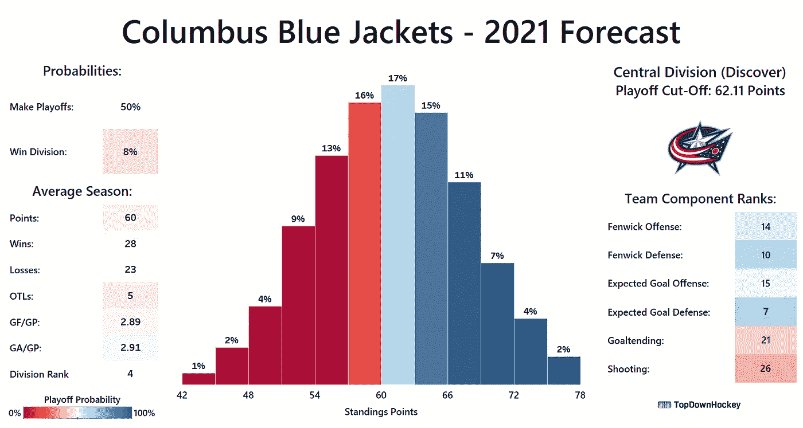

去年的哥伦布蓝夹克队与佛罗里达黑豹队在过去几年的表现有些相反:每个人都预测他们会在无数个赛季后错过季后赛，但他们还是做到了。约翰·托托雷拉驾驶着一个平庸的球员名单达到了预期的进球份额，远远高于平均水平，理所当然地获得了杰克·亚当斯奖杯。这是可能的，甚至很有可能，托托雷拉的影响是“烤”成这种预测的方式名册充满了平均最好的发挥司机看起来明显高于平均水平。但这支球队缺乏天赋，这一点在他们的守门员和投篮的估计影响中表现出来，这两项都低于平均水平。他们的优势和劣势相互平衡，创造了一支有机会进入季后赛的球队，这在我看来是完全正确的。

每当“赛斯·琼斯的分析”这个话题出现时，我总是听到人们说哥伦布的系统不利于良好的高级统计。这一直困扰着我，因为根据分析，哥伦布防守队员像萨瓦德，加夫里科夫和库坎在历史上都是非常优秀的球员。他们前锋的防守也很受重视。鉴于尤纳斯·科尔皮萨洛在《泡沫》中的表现，守门员预测可能很难协调，但他在过去几个常规赛季中实际上是一个相当糟糕的守门员，这代表了一个更大的样本，应该给予更多的重视。即使今年他们的守门水平有所提高，达到联盟平均水平，这支球队仍然存在其他问题。他们的投篮预计是最差的，尽管我提到过托托雷拉效应，但他们的比赛驾驶预计不会远高于平均水平。

他们很有可能进入季后赛，但感觉这支球队并没有太多的上升空间成为真正的斯坦利杯竞争者。

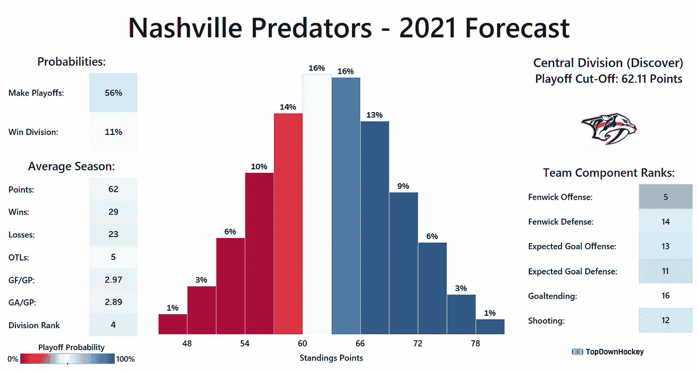

纳什维尔掠夺者队让我想起了卡尔加里火焰队，他们都以积分百分比排名联盟前 8，他们都被谈论着，就像他们刚刚度过了糟糕的一年。这并不是因为这些赛季真的很糟糕，而是因为人们对这些球队的期望更高，因为他们在过去一直都是这样。就目前的情况来看，纳什维尔在比赛的各个方面都比平均水平高一点点，除了守门员以外。这对于 62 分的预计得分和 56%的季后赛概率来说已经足够好了，但对于一支在任何一点上都不是精英的老龄名单来说，很难对斯坦利杯的机会过于兴奋。

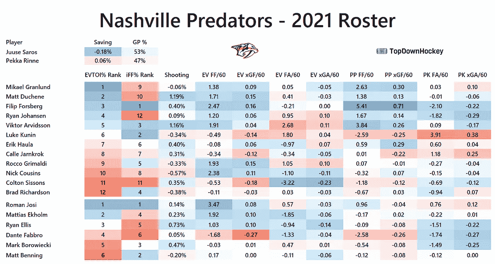

我早些时候提到过，明尼苏达州的野生动物可能拥有 NHL 中最好的蓝线。我被迫使用可能这个词的原因是因为纳什维尔掠夺者蓝线也存在。由卫冕诺里斯杯冠军罗曼·乔西率领，由两名可以说比他更好的防守队员支持，这是一条优秀的蓝线，正在争夺最佳，如果 Dante Fabbro 能够找出他可怕的进攻影响，就可以轻松地抢到那个位置。不幸的是，前锋有点低于平均水平，因为失去了被低估的倒数第六名克雷格·史密斯和尼克·博尼诺，他们上赛季与罗科·马尔迪一起轻松得分。

这是另一支球队，他们的大部分球员已经达到或超过了他们传统上的巅峰年龄，所以很难看到他们会从哪里迈出另一大步并成为竞争者。但最坏的情况是，他们仍然有机会进入季后赛——如果朱尔斯·萨洛斯能获得 53%以上的首发，他们会很轻松。

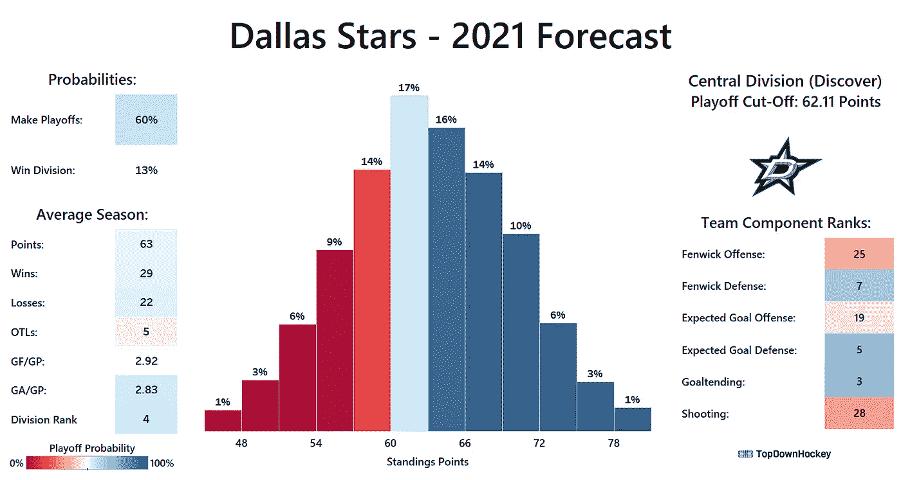

达拉斯明星队去年进入了斯坦利杯决赛，他们今年怎么只有 60%的机会进入季后赛？答案是双重的:他们的阵容已经被伤病摧毁，更重要的是，他们从一开始就没有那么好。抛开花哨的数据不谈，他们以+4 的净胜球结束了常规赛，以+1 的净胜球结束了季后赛(不包括循环赛)。在平均竞争更加激烈的季后赛中挤掉一球比赛并达到收支平衡是有道理的，但这些仍然不是一支精英球队的标志。公平地说，他们的一些糟糕的成绩是由于上赛季不走运的投篮，但这大致被精英守门员抵消了，没有理由相信如果运气真的“正常化”，这支球队甚至会有平均的投篮成绩，因为他们预计下赛季将是第 28 名。这绝对是一支优秀的球队，这反映在他们尽管受伤，但仍有 60%的概率进入季后赛，但他们远不如你所相信的那样好，如果你听到的只是他们去年进入了杯赛决赛。

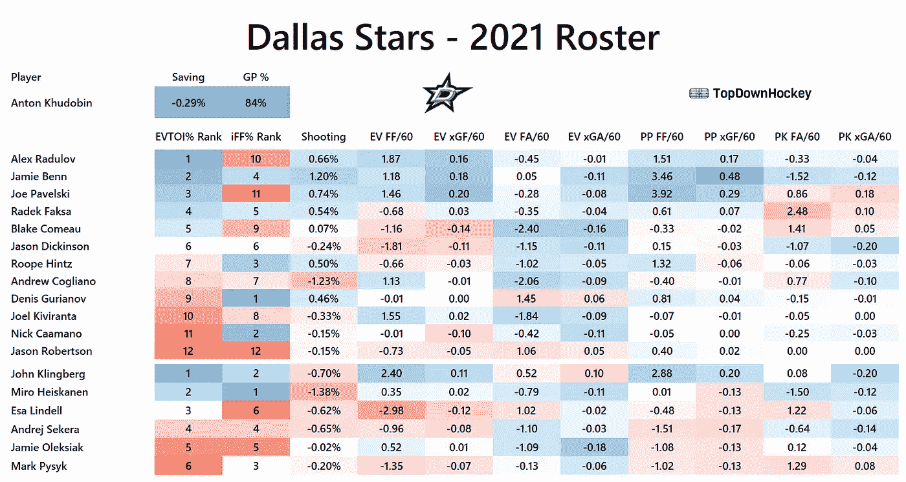

不管是因为他们的比赛体系还是因为这些球员拥有的天赋，这份名单上有相当数量的球员，他们的防守效果在下赛季预计会很好。但是除了他们的前三名前锋和顶级防守队员之外，名单上几乎没有多少球员的进攻效果是积极的。这部分可以归咎于泰勒·塞古因的缺席，如果不是因为手术，他将缺席整个赛季，他将会打很多分钟，并很好地推动进攻。但不管怎样，这支球队的进攻并不好，尽管他们可能会减轻这些痛苦，如果他们改变他们的系统，让他们的前锋更多地投篮，因为他们的防守队员比前锋差得多。

最后，虽然在过去的几年里这是一个优势，并且预计将成为这里的优势，但守门是一个很大的问号。安东·胡多宾预计会非常出色，这是有道理的，因为他在过去几年中一直非常出色，但他的出色表现总是出现在替补角色中。他是一个 34 岁的小守门员，很难说他会在首发位置上做得如何，更不用说杰克·厄廷格在他第一次看到 NHL 比赛时会做得如何。如果这些人真的在挣扎，这支队伍可能会从外面往里看。

经过多年的分析社区声嘶力竭地尖叫，卡罗莱纳飓风队已经准备好成为一支优秀的曲棍球队，他们终于在 2018-2019 年做到了，并在 2019-2020 年证明了这不是侥幸。现在是时候让这支球队迈出下一步，证明他们不仅仅是一支优秀的冰球队，而是一支伟大的球队。如果他们能提高他们的投篮命中率，他们才有可能达到这些高度，目前他们的投篮命中率预计是联盟中最差的。有一种观点认为，像拉斯维加斯一样，他们实际上并不擅长投篮(或擅长进攻)，因为预期的进球模型和原始投篮次数高估了他们的投篮质量。这可能是事实，但不管怎样，这是一支真正的好球队，他们仍然能够产生足够好的实际进球，有超过 2/3 的机会进入季后赛。如果他们真的成功了，他们还可以避免他们的氪石，波士顿布鲁因斯，至少两个回合，这对他们来说是个好兆头。

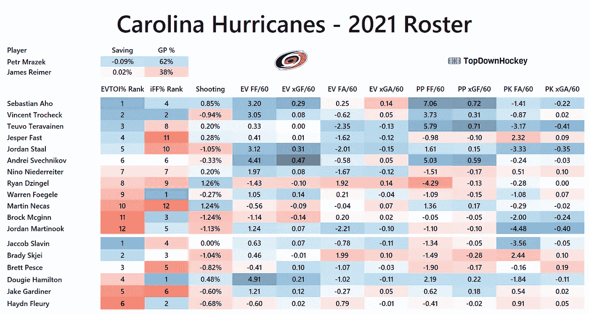

这个图表没有添加任何上一个图表没有明确的新信息；这支球队有不错的守门技术，出色的进攻战术，不错的防守战术，和糟糕的投篮。即使像杰克·加德纳和尼诺·尼德雷特这样去年没有得到很多分数的恶意球员也仍然被认为是高于平均水平的球员。具有讽刺意味的是，这支球队投篮如此糟糕的很大一部分原因是新球员布雷迪·斯克杰和文森特·特罗切特在历史上一直很差。他们有一些在这方面也很糟糕的留任者，如乔丹·斯塔尔、布洛克·麦吉恩和乔丹·马丁努克，但有趣的是，他们两个新的大人物的加入只会让他们在他们已经陷入困境的游戏的一个方面变得更糟。投篮是相当随机的，所以也许这两个人的投篮会有所不同，或者一旦卡罗莱纳的体系控制了他们的球棍，情况只会变得更糟。

守门员是这个名单中最有趣的部分，因为赖默在今年之前一直很差，然后在有限的时间里表现出色。他仍然表现得一般，但如果他恢复到糟糕的水平，这支球队可能会有麻烦。另一方面，如果赖默保持他的强势，这支球队最终以与预期目标相似的速度取得实际进球，他们是斯坦利杯的合法竞争者。不管怎样，他们可能是一体的。

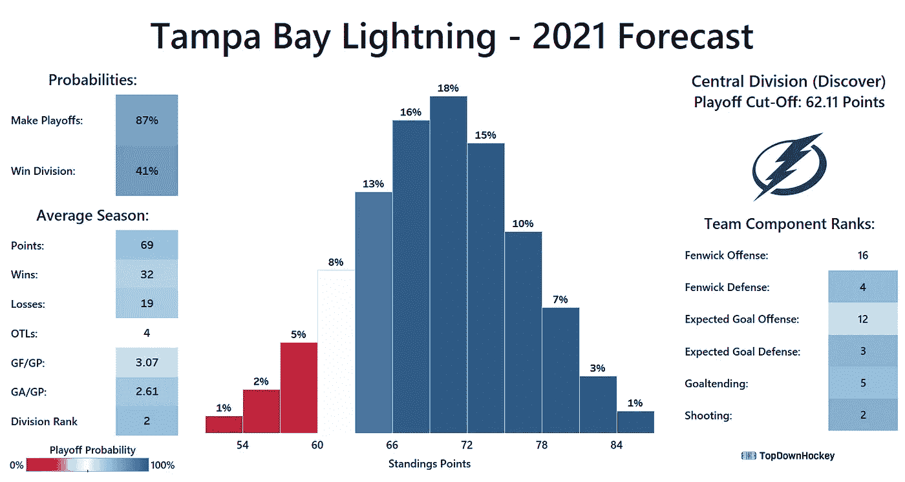

NHL 中有多少球队可能失去他们整个赛季的最佳球员，但仍有 41%的机会进入季后赛？也许十个？现在考虑坦帕湾闪电队没有 41%的机会进入季后赛；他们有 41%的机会赢得分区冠军，有 87%的机会进入季后赛。2019-2020 斯坦利杯冠军在每个人都健康的情况下，就团队实力而言，他们有一个自己的岛屿，即使没有他们最好的球员，他们也有一个最佳球队的合理论点。他们是防守精英，他们的守门员最终取得了几乎与其声誉相符的结果，他们的进攻没有产生大量的数量，但用质量和射门弥补了这一点。

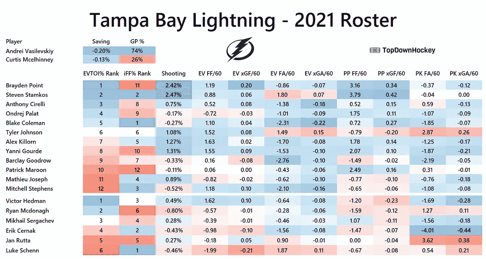

安德烈·瓦西里夫斯基多年来一直被吹捧为联盟的顶级守门员之一，但直到最近，分析才支持了一个接近那个的结论。不过，现在最重要的是，他和麦克尔希尼有望组成一对前五的守门员组合。这个名单最大的优势在于它的投篮天赋，布雷登点和史蒂文斯塔姆科斯作为联盟最好的射手领先。我有一部分想知道，如果没有尼基塔·库切罗夫的努力，这两个人和名单上的其他人是否会努力取得超出预期的成绩，但即使他们没有达到过去的水平，他们也应该非常出色。同样令人印象深刻的是这支球队的防守；从上到下，他们都是优秀的防守球员。如果他们设法签下一个比卢克·谢恩好一点的人，用泰勒·约翰逊交换你的典型替补级别的前锋，他不是泰勒·约翰逊，在防守上，他们会和明尼苏达竞争全国曲棍球联盟最好的防守球队。就目前的情况来看，他们还没有完全达到目标，但由于他们的守门能力，他们最终可能会丢更少的球。

这支球队可能会发生很多不同的事情，但是很难想象一个赛季他们不是联盟中最好的球队之一。

# 东区

最后但肯定不是最不重要的——实际上是最好的——是东区。这是 NHL 最强的部门，它的设计完美地创造了一场血战，将一些渴望季后赛经验的年轻球队排除在外。这个分区的季后赛平均得分是 62.09 分。

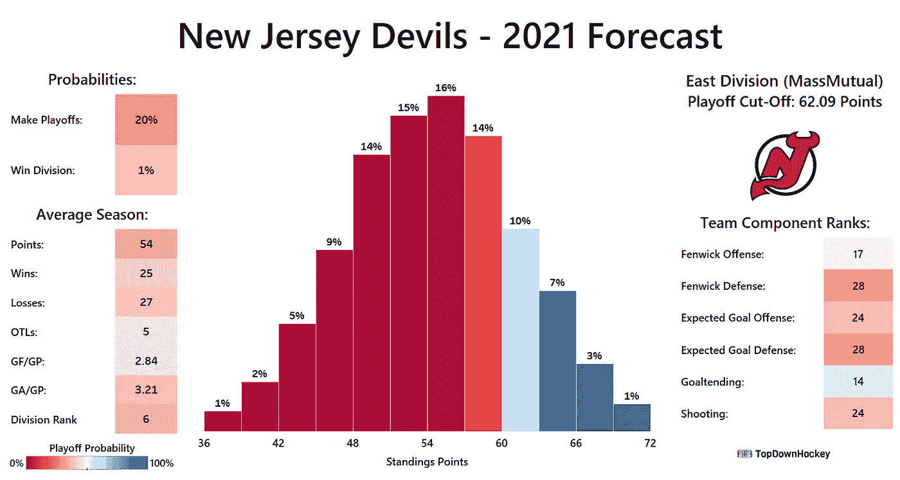

毫无疑问:这是一支糟糕的曲棍球队。但这不是一支糟糕的冰球队，更重要的是这是一支年轻的球队，有很大的成长空间。20%的机会进入季后赛足以激励这支球队去拼搏，

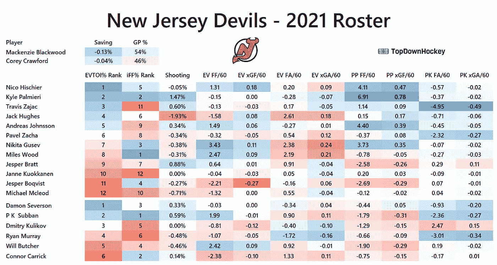

正如我在介绍中提到的，这份名单包括不会上场的科里·克劳福德，不包括会上场的萨米·瓦塔宁。我想吸收这些球员会稍微改变一些事情，对球队造成伤害，但不会到极端的程度。不管怎样，如果他们的球员能保持他们的表现，这支球队应该有强大的特殊球队，但即使是在实力上，他们的进攻应该很差，他们的防守应该很糟糕，因为有很多防守拖后腿的球员，如帕维尔·扎哈，迈尔斯·伍德，P.K .苏班，康纳·卡里克，尼基塔·古塞夫和杰克·休斯。休斯的新秀赛季尤其有趣；他是联盟中最差的射手之一，防守很糟糕，但实际上进攻很好。他不是进攻的精英，但即使在 18 岁的时候在一个矮小的框架下做得很好，也预示着他的长期发展。然而，我们并没有在这里进行超长期的工作，明年他预计会像今年一样表现出色，成为一个强大的进攻发动者，但由于他糟糕的投篮和防守，他的净负面影响很大。

总的来说，这不是一个性感的花名册，但如果麦肯齐·布莱克伍德能够在一个合法的首发角色中匹配去年的表现，他们可以制造一些噪音。

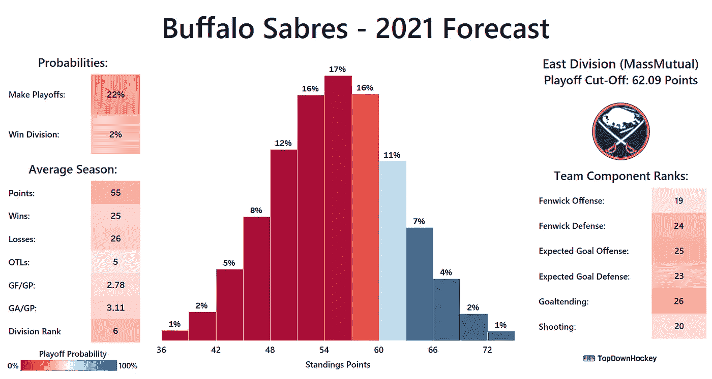

本赛季对水牛城军刀队的宣传与预计只领先新泽西魔鬼队一分的球队不匹配，我相信这是因为宣传是建立在看似合理的场景上，而预测是建立在过去实际发生的事情上。也许泰勒霍尔可以回到他的哈特奖杯形式，而拉斯穆斯达林向前迈出一步，成为一个高于平均水平的防守队员，但这两件事也可能不会发生，这支球队真的站在斗争，如果是这样的话，这是目前没有预计到的。此外，这支球队增加了一些预计会对他们的球队造成重大伤害的球员。

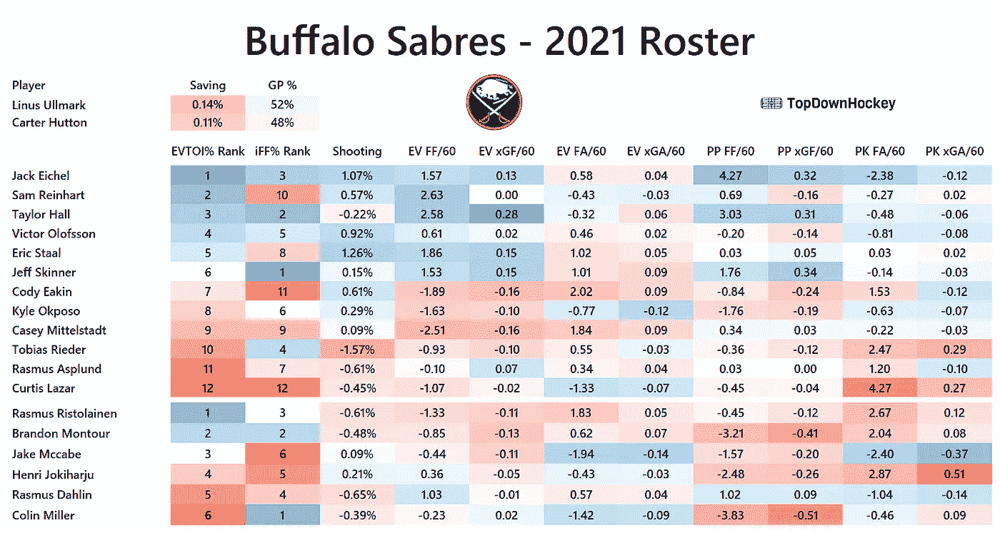

新加入的泰勒·霍尔预计将为这支球队做很多好事，这太棒了。但是新加入的科迪·埃金和托拜厄斯·里德预计会造成同样大的伤害。如果这些名单上的位置只是交给像乔什·何桑或阿图·鲁特索莱宁这样未经证实的赌博，我会对这支球队更加乐观，但把这些位置交给这些球员是一个问题。这种防守也非常丑陋，六个防守者中有五个预计会产生负面影响。如果这种预测与现实相符，这真的会损害他们前锋的进球输出。说到前锋，很少有人能提供任何防御价值。大部分都远低于平均水平。如果你可以忍受这种进攻驱动的弱点，但是在这支球队的情况下，这两种情况都不会发生。

我可以看到一些球员迈出了巨大的步伐:泰勒·霍尔，拉斯穆斯·达林，莱纳斯·乌尔马克，甚至拉斯穆斯·里斯托莱宁，仅举几例。曲棍球很奇怪，Ristolainen 完全可以将他的物理工具转化为像样的冰上成绩。但是，除非这些主要的进步中的一个，或者最好是几个，被真正采取，这支球队将会为季后赛席位进行一场艰苦的战斗。

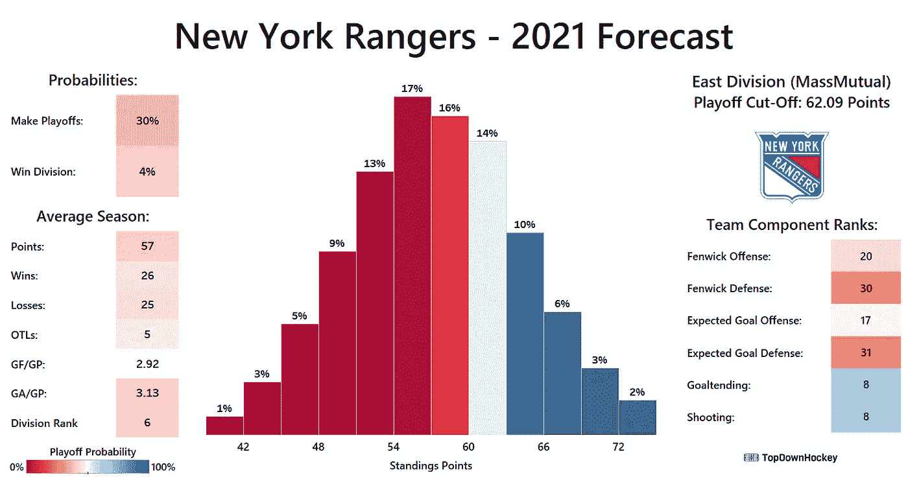

为什么流浪者队预计会在分区中接近最后一名而不是季后赛席位？团队防守。成为 NHL 中防守最差的球队并进入季后赛是非常困难的。你可能会说流浪者去年做到了，但我会反驳说，他们去年并不是最差的，当赛季结束时，他们并没有进入季后赛，他们在附加赛中被横扫，最重要的是，当他们失去了杰斯珀·法斯特和杰克·约翰森时，他们变得更差了。尽管事实上他们有着阿尔特米·帕纳林和米卡·齐巴内贾德难以置信的幸运赛季，但这两位球员都不可能复制前进。另一方面，防守是最容易改进的地方，他们在赛季后期确实表现出了一些改进的迹象。这支队伍有足够的乐观空间，但可能需要谨慎。

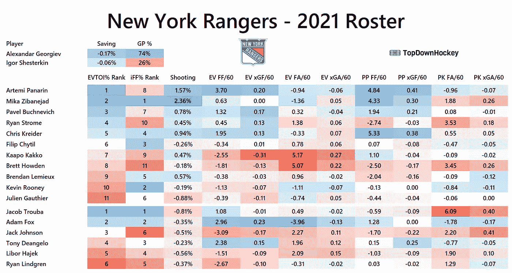

我知道流浪者队已经与健康的挠痒杰克·约翰森调情，在他们的粉丝群中引发了兴奋，但基于每支 NHL 球队都向他们支付七位数薪水的老兵防守队员的方式，我非常怀疑他们真的会这样做——至少在新赛季开始时。如果我错了，约翰逊从来没有打过一场比赛，他们应该会有很大的进步；他目前预计会打很长时间，并在其中造成很大的伤害。此外，几乎不可避免的是，卡卡波将在他灾难性的新秀赛季中有所改善，但这将被亚当·福克斯从他自己出色的新秀赛季中崩溃所抵消，他的新秀赛季完全违背了相反的方向。也有可能谢斯特金推出了一个精英新秀赛季，并开始了比预期更大比例的比赛，甚至没有预测的亚历克西斯·拉弗雷尼埃最终组建了一个精英考尔德队。

但在这个团队中，每当我发现一些值得乐观的事情时，我就会眨眼，并在旁边发现一些值得悲观的事情，比如齐巴内贾德和帕纳林更有可能低于他们的预计投篮命中率。对于这支球队来说，事情可能会有很多方式，无论如何，它们都会让一些人看起来非常愚蠢。但球迷们可以感到安慰的是，这支球队不久前宣布了他们重建的意图，他们已经提前完成了计划。

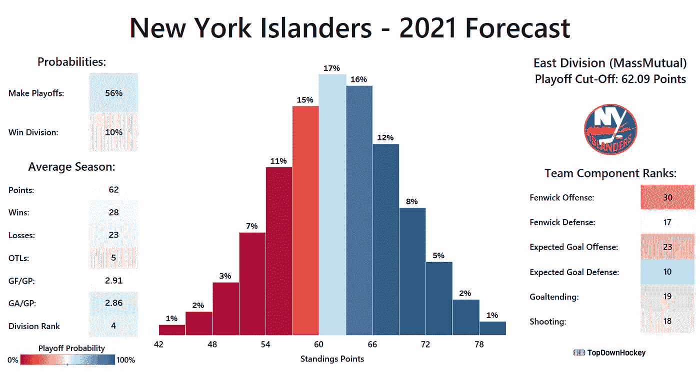

这支纽约岛民队两年前成为了分析界的敌人，当时他们出乎意料地连续两年进入季后赛，第一次赢了一轮，第二次赢了两轮。事实上，没有人指望他们第一次就能成功，也很少有人指望他们第二次能重复，但现在事情已经发生了变化，分析已经意识到这是一支强大的防守球队，可以在这里或那里取得一些进球。很难看到这支球队的优势比他们刚刚享受的进入西部决赛的运气更高，即使这听起来像是一个非常高的标准，但它保证这支球队在每晚的比赛中都将是一个痛苦的屁股。

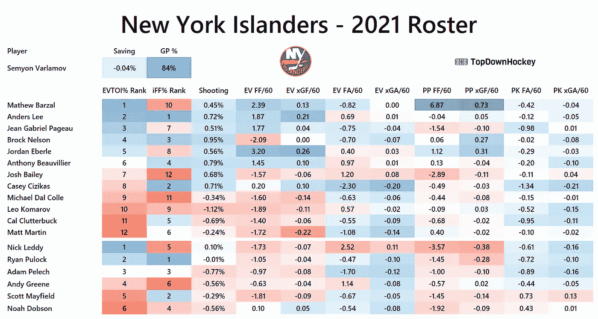

不管你怎么说卢·拉莫里洛和他的倒数第六名前锋的合同期限，但现在他们仍然是非常强大的防守球员，每晚都预测对手的表现。德文·托尤斯的离开，我相信会真正伤害到这支球队，特别是如果他的大部分时间都被尼克·莱迪占用，但在莱迪之外，这种防守在他们自己的一端是相当深入和有能力的。前 6 名还拥有强大的射手，所以如果他们能够调整他们的系统，让他们的前锋获得更大比例的投篮机会，并且瓦拉莫夫能够像预计的那样打球(或者更好，就像他去年在米奇·科恩的第一年所做的那样)，这支球队将赢得一系列比赛，他们在这些比赛中得分超过对手。

不过，最终，这种策略在季后赛中并不能战胜顶级球队；对坦帕没有成功，对卡罗莱纳也没有成功。如果岛民们想赢得斯坦利杯，他们需要想出一个办法把比赛打得更好。

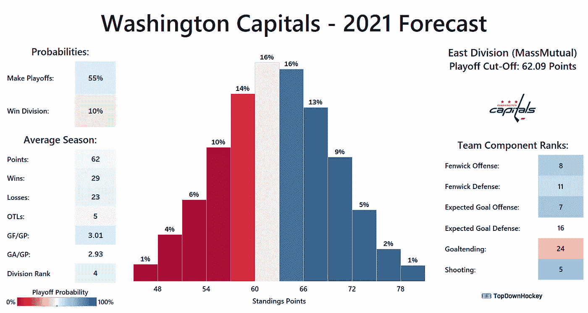

华盛顿首都队不如连续赢得总统奖杯以及次年赢得斯坦利杯的球队。在某些方面，他们实际上更好。他们大多更差，因为他们的守门项目低于平均水平，他们的投篮项目仅排在第五位。(以他们的标准来看，这是很低的。)但这支球队比他们的对手有更好的机会射门，并获得更高质量的射门，根据公众预期的进球模型，这是他们在 Trotz 时代的后期没有做到的事情。让他们如此成功的比赛风格的转变可能更多的是出于需要，而不是有意识的决定，他们最终变得更差，但有趣的是看到他们被描述为一个高于平均水平的比赛驱动团队。

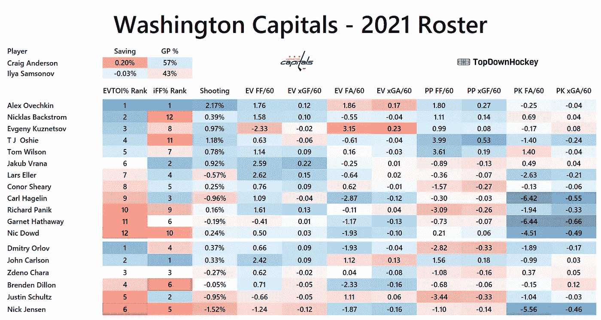

亚历克斯·奥韦奇金仍然是一名优秀的射手，即使在力量和力量上也是一名非常好的进攻发动者。只是不要问他(或叶夫根尼·库兹涅佐夫或约翰·卡尔森或贾斯汀·舒尔茨)如何以均匀的力量防守，你很可能会和一个非常可靠的防守球员交谈。这支球队充满了他们，以他们的精英点球手的数量，如果他们没有被这四个打大分钟的人拖累，他们可能会和明尼苏达在一起。但是他们作为一个整体仍然是一支强大的防守球队。他们的弱点在网上，这可能会因为伊利亚·萨姆索诺夫比他预计的更多地参加他们的比赛而得到缓解。然而，失去亨里克·伦德奎斯特无论如何都会受到伤害，因为克雷格·安德森在他这个年龄不太可能甚至还算过得去。

这个队有他们的长处和短处。他们坚持了一个梦想，这个梦想他们已经坚持了 15 年，并且实现了一次。考虑到这一点，他们实际上建设得相当好——在联盟最艰难的分区有 56%的机会进入季后赛不是开玩笑的。

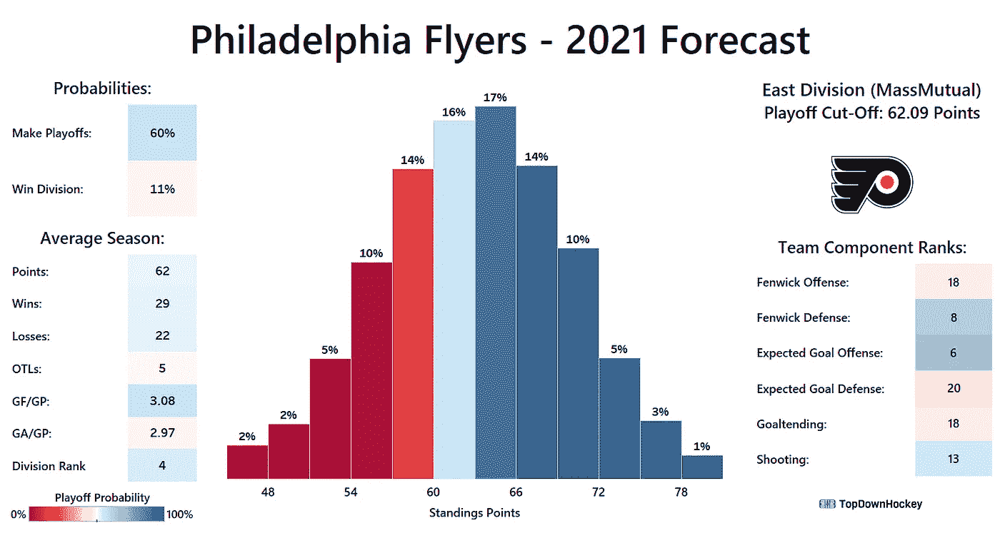

费城飞人队活着就是为了挫败数据科学家。每隔一年，他们以大约 95-100 分进入季后赛，第二年，他们以大约 85-90 分错过了季后赛。在某种程度上，你可能会认为一个聪明的人会说“奇数年，传单会很糟糕”并抢劫世界各地的赔率制造者，但我还没有足够的信心这样做。相反，我估计飞人队有 60%的概率进入季后赛，并且应该以平均 62 分结束。他们是一个奇怪的团队，他们在创造投篮数量方面很弱，但在创造投篮质量方面很棒，相反，他们在抑制投篮质量方面很弱，但在创造投篮数量方面很棒。总的来说，他们看起来在进攻和防守上略高于平均水平，在一个艰难的分区中，只有 60%的机会进入季后赛。

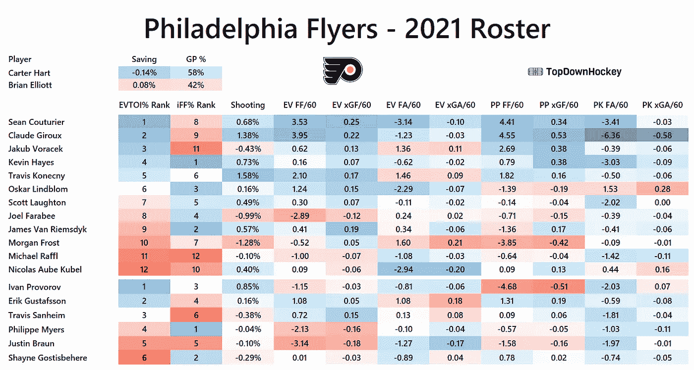

从一开始，我就很清楚 Ivan Provorov 不应该成为第一号权力游戏的四分卫。也许这就是埃里克·古斯塔夫松的签约目的，如果是这样，他真的可以在那里有所帮助——但不足以抵消他在均匀强度下的粗略影响。另一个可以改善这支球队的阵容决定是给卡特哈特比过去更多的首发机会；布赖恩·埃利奥特不是一个可怕的替补，但他肯定不好，58%对像哈特这样的年轻明星来说是不够的。即使在这些阵容决定之外，像乔尔·法拉比、摩根·弗罗斯特、菲利普·迈尔斯这样的球员也有更大的进步空间，他们可以效仿伊万·普罗沃罗夫和特拉维斯·科尼克尼的道路，在早期发布糟糕的结果，然后在后来提高。Shayne Gostisbehere 也有一个反弹赛季的空间，但我认为更有可能的是，他最终会有一个健康的刮痕，并最终被交易，因为他似乎不适合 Alain Vigneault 的体系。

从乐观的另一面来看，这是费城飞人队在奇数年的表现，他们不再有阿兰·维格诺特的新教练带来的强劲势头。Flyers 的球迷完全有权利对他们的球队保持谨慎乐观，特别是在他们去年常规赛表现出来之后，但这支球队无论如何都不是成功的保证。

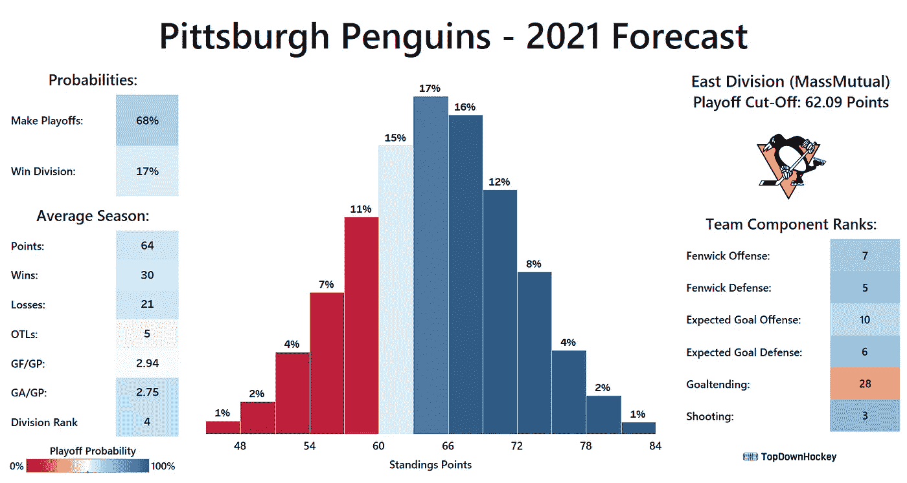

匹兹堡企鹅队在附加赛中尴尬的输给了蒙特利尔加拿大人队。但他们的得分率在联盟排名第七，这意味着如果他们在西部，他们甚至不会打一场附加赛，更重要的是，奇怪的事情发生在 4 场比赛的样本量中。上赛季，在一半队员受伤之前，他们有着优秀的基本指标，即使在遭受这些伤害之后，他们也有着强大的基本指标。他们是一支非常好的曲棍球队，在淡季摆脱了他们最大的问题，虽然他们的顶级球员不是毛头小子，但他们仍然是精英球员，应该期待这支球队不低于竞争。

你可能会注意到，我对企鹅的评价比数据显示的要高一些。这完全是因为他们的守门员。特里斯坦·贾里(Tristan Jarry)在 2017-2018 和 2019-2020 赛季表现良好，但在 2018-2019 赛季的两场比赛中表现糟糕。这真的拖累了他的预测——大大超过了预期。这已经发生的事实表明，我可能应该根据冰上时间或未来玩的游戏来衡量我的回归。我没有做出任何武断的决定来改变任何人的预测，但我为 Jarry 测试了这样做，并从他的样本中删除了 2018-2019，企鹅平均跳了大约 3 点。我对企鹅队的官方预测是 64 分，但如果他们最终得到 67 分，我保留说我告诉过你的权利。

然而，在贾里之外，你可以看到是什么让这个阵容如此之好。我并不喜欢他们的新成员卡斯佩里·卡帕宁、科迪·颜后君和迈克·马西森，但如果你把他们放在杰克·约翰森旁边，我也绝对喜欢这三位球员，我也喜欢贾森·祖克。我认为这是一支去年被伤病拖垮的好球队，我认为他们变得更好了。但最终，他们不会因新人而生或死；他们将由冈泽、克罗斯比、马尔金、马里诺、唐乐和杜穆林决定生死；我认为他们都很优秀。

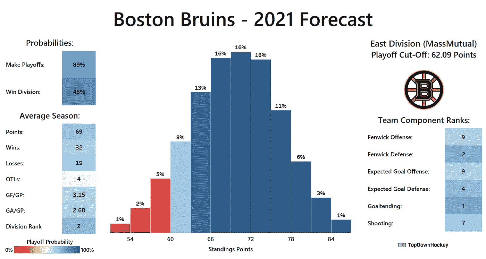

很多人似乎对波士顿布鲁因斯队在所有球队中赢得分区冠军的概率最高感到惊讶，但当你赢得总统奖杯，然后带来一支比赢得奖杯的球队更好的球队时，就会发生这种情况。是的，波士顿就是这么做的。去年他们的特点是精英守门员，精英团队防守，精英力量型打法，强有力的投篮，但在平均实力上相当平庸的进攻。今年，他们已经做了一些改进，并且做得足够成功，以至于他们过去最大的弱点是他们现在排名第九的领域。

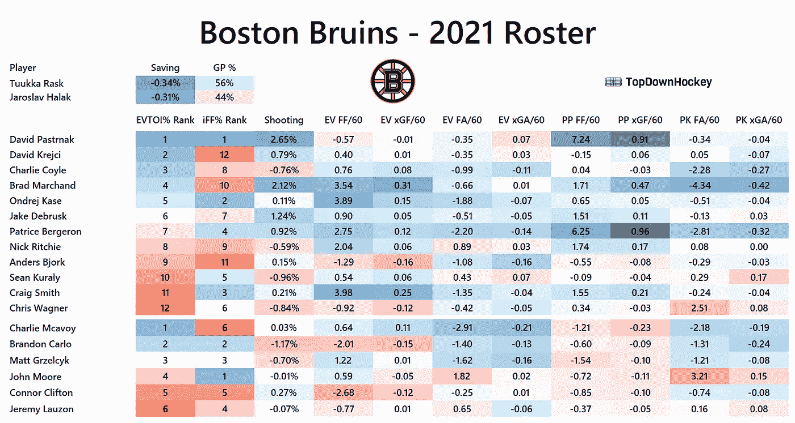

说布鲁因斯变得更好似乎有些过火，但我很乐意为它辩护。前锋比防守更重要，翁德雷·卡斯和克雷格·史密斯是比兹德诺·查拉和托雷·克鲁格更好的冰球运动员。关于他们失去的球员，最大的担忧是，没有托雷·克鲁格，权力游戏将难以进行，尽管我的回归分析表明，克鲁格实际上对权力游戏并不那么重要，但我仍然认为这种担忧是完全合理的。曲棍球中的力量比赛不仅仅是插上球员的 RAPM xGF/60 并以那样的速度发动进攻那么简单，我可以看到帕斯特拉克和贝吉龙的表现受到克鲁格的损失超过了回归分析所表明的。

也就是说，这支球队可以在比赛的某些方面受到一两次打击，但仍然表现出色。它们构造得太好了。他们的防守可能看起来很肤浅，但这是由联盟中可以说是最好的防守队员组成的，并由一个被低估的宝石 Grzelyck 支持，他的作用肯定会增加。这支球队错过季后赛需要他们联盟最好的守门员掉下悬崖，一些糟糕的投篮运气，以及可能在一个真正的灾难赛季中的一些伤病。与此同时，几乎没有什么不可能的事需要去做，使这支球队成为一个真正的斯坦利杯竞争者。

# 结论

正如纯粹主义者常说的，曲棍球不是在电子表格上玩的。(或者更准确地说，是在 r 的戴尔上。)随着新冠肺炎在美国肆虐，这一季的疫苗时间表刚刚出炉，没有人能保证这一季会完成并结束。见鬼，这些模拟是用一个已经推迟了几场比赛的时间表来运行的。

这一切只是增加了这些预测的不确定性。曲棍球的部分魅力在于，即使是最强大的、最精细的预测也可能被纯粹的运气力量完全否定。即使你尊重并相信我的预测，你也不应该停止观看你最喜欢的球队，直到他们被数学淘汰，不管我说什么。

我希望你喜欢读这篇文章。不管你是否同意或不同意我的预测和我用来创建它们的方法，让我们都希望每个人都有一个有趣、健康的 2021 NHL 赛季！