# 哦，我的 dbt(数据构建工具)

> 原文：<https://towardsdatascience.com/oh-my-dbt-data-build-tool-ba43e67d2531?source=collection_archive---------8----------------------->

## 我的经验和使用这个超级工具一个月的一些注意事项

# 介绍

我一生都在和数据打交道。不知何故，当我这么说的时候，听起来很戏剧化。基本上，作为一名业务分析师，我已经用 SQL 做了一些分析和基本工作，但是没有需要模板的地方。所谓的 BI 生涯我是从 2013 年开始的。作为一名顾问，并且在多个类似的项目中主要使用 MSSQL，如果有 dbt 这样的东西(或者至少在那个时候了解 Jinja)会是一件幸事；就当是经验不足吧。

有趣的是，我现在才尝试 dbt。老实说，我已经用了~个月了，所以请记住我不是专家，只是传播知识和分享我的发现。您可以找到许多关于某些细节的其他媒体文章，或者直接找到 [dbt](https://docs.getdbt.com/) 的来源。

# 先决条件

首先，要实现这一点，你需要 Docker。如果你不熟悉 docker，我将推广我不久前写的关于 docker 的旧的[博客文章](/docker-101-ee3d2b8ace11)。当在 docker 创建的环境中工作时，我更喜欢使用带有 dev 容器选项的 VSCode，它基本上创建了一个包含我的所有配置、挂载等的隔离环境。如果您对现有的 docker 映像进行了任何更改，您可以选择 rebuild image 选项，它将为您合成并打开包含所有更改的映像。如果你正在开发东西，可以跳过手工编写 docker-compose **，这将非常方便。**

在我的 docker 映像中，我创建了一个特定的 docker-compose 文件，包含两个组件——简单的 postgres:13-alpine 和 python 3.8。选择 python 3.8.11 而不是 3.9 —由于兼容性问题，在尝试安装 dbt 时遇到了一些问题。我还使用 docker-compose 文件中的 mount 选项来为这个特定项目传递正确的 profiles.yml 文件。

Postgres Dockerfile 文件:

```
FROM postgres:13-alpine
ENV POSTGRES_PASSWORD=nopswd
ENV POSTGRES_DB db
COPY init.sql /docker-entrypoint-initdb.d/
```

在 **init.sql** 文件中，我刚刚创建了一个名为 **db** 的数据库。

Python Dockerfile 文件:

```
FROM python:3.8
COPY requirements.txt requirements.txt
RUN pip install -r requirements.txt
```

没有什么花哨的要求，只是 dbt 库。

> 如果您已经有了一个使用 dbt 的生产环境，并且正在设置一个本地环境，那么请始终使用与生产环境中相同的 dbt 版本。在 dbt run 上遇到了麻烦，但我的同事没有。根本原因—每个人都在使用 0.19.0，我当时安装了最新的 0.19.2，我们在 packages.yml 文件中的 dbt deps 出现了一些兼容性问题。

正如我提到的，Docker-compose 有更多的东西，但没有什么新奇的东西:

您可能想知道为什么我要打开 8001 端口——稍后您将看到一些 dbt 特性需要它。

# dbt 入门

好的，你可能想知道这个 dbt 是什么。基本上，它是一个令人惊叹的工具，可以简化 ELT 流程中的转换部分，如果中间某个模型中的一些底层数据发生了变化，它可以为您提供数据沿袭、文档和对数据刷新的完全控制。我真的不想(通常也不喜欢)谈论产品细节，因为我是一个更技术性的人，而不是一个产品专家。

好的，dbt 中有几个重要的文件。

*   profiles.yml —设置所有连接以及如何使用它们的文件
*   dbt-project.yml —包含该文件的特定 dbt 项目的特定配置。

让我们看一下 profiles.yml 文件:

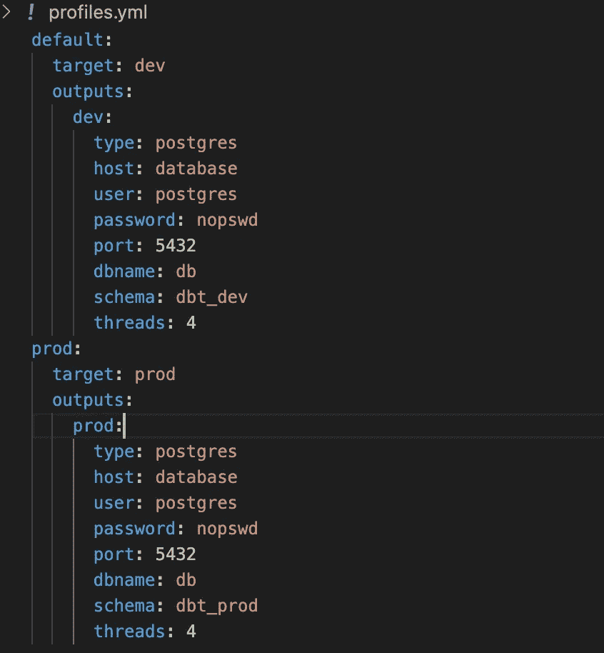

我们必须有一个默认的配置文件；如果没有指定其他内容，这将是运行所有内容的地方。不同的概要文件将允许您在不同的环境中轻松测试管道(即测试和生产):

```
# Running on default:
dbt run# Running on prod:
dbt run --profile prod# Running on default with specified profile:
dbt run --profile default
```

在使用 VSCode 打开开发容器中我的文件夹后，有趣的是看看是否一切都如预期的那样工作。

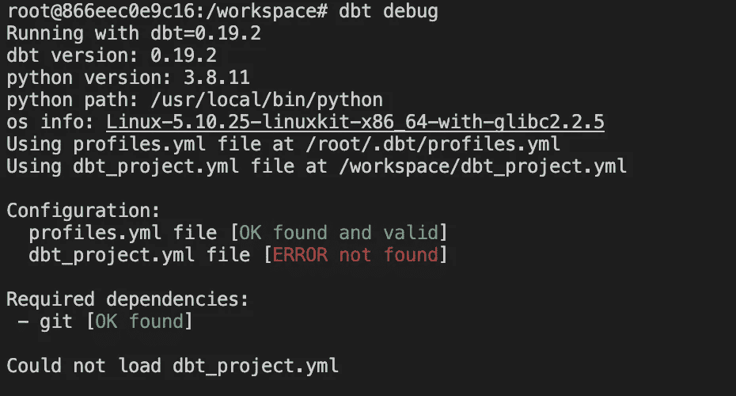

如您所见，我们在 dbt_project.yml 上有一个错误。让我们修复它。

为了简单和保持原来的 dbt 结构，我们可以初始化它。为此，让我们运行以下命令:

```
dbt init MY_DBT_PROJECT_NAME
```

现在我们可以看到 dbt 期望我们采用什么样的结构，以及它是如何工作的:

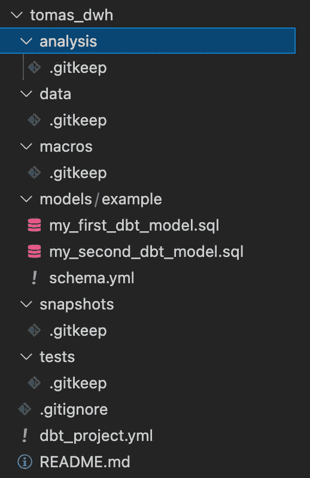

已初始化 dbt 项目结构。作者图片

让我们检查一下这个文件夹和正确创建的 profiles.yml 中的其他内容是否正常

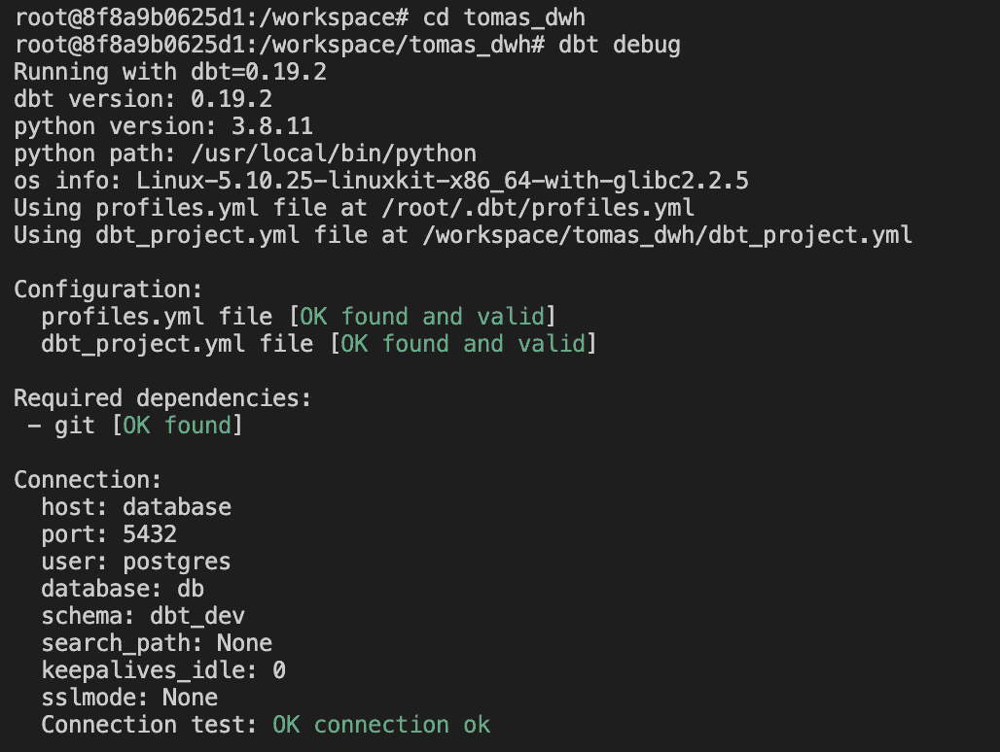

dbt 调试结果。作者图片

大获成功！我们的环境功能齐全，随时可以检查一切。

让我们尝试在默认概要文件上运行 dbt:

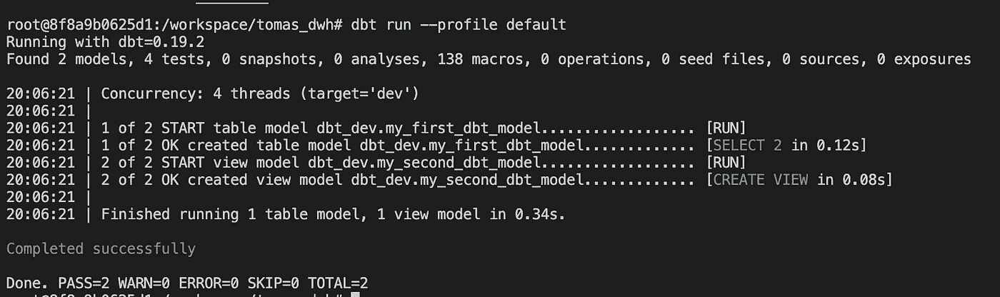

dbt 在默认配置文件上运行。作者图片

我们看到我们有两个模型(分别对应两个名为 my_first_dbt_model.sql 和 my_second_dbt_model.sql 的文件)，但是这些测试是什么呢？他们从哪里来？让我们更深入地研究模型的文件夹。

我们可以看到 schema.yml 文件包含内容

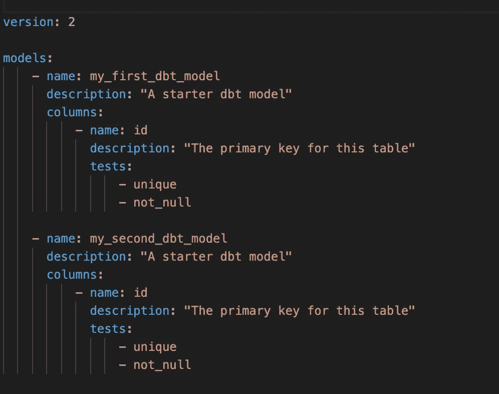

Schema.yml 文件。作者图片

我们可以看到，我们描述了两个列和测试——一个列必须是惟一的，不能为空。

我发现我的同事正在为每个模型创建一个 yml 文件。在我看来，这是一个更好的选择:

*   视觉上看起来更清晰
*   没有合并冲突，因为最有可能的是，每个模型有一个开发人员！

如果我们看看他们的查询直截了当。创建一个包含 1 和 null 的表，从 id = 1 的第一个表中创建一个视图。但是等等——我们的测试并没有说我们失败了。我们有一个空值！这是因为它没有任何数据可以测试。所以在我们运行模型之后，我们需要测试它。

要运行测试:

```
dbt test --model example
```

控制台中的输出如下所示:

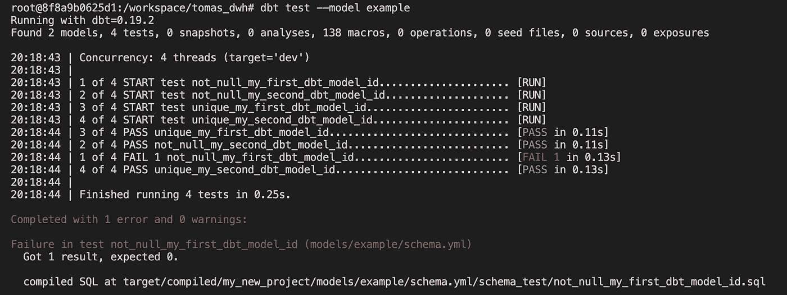

测试失败。作者图片

显然，我们可以看到我们这边存在一些问题，我们需要解决它们。

修复很容易。让我们从 null 转换到某个数字，然后再测试一次。如果我们在修复后直接运行“dbt test ”,我们仍然会看到相同的状态。我们没有运行模型，所以底层数据没有改变。我们需要运行并测试它。

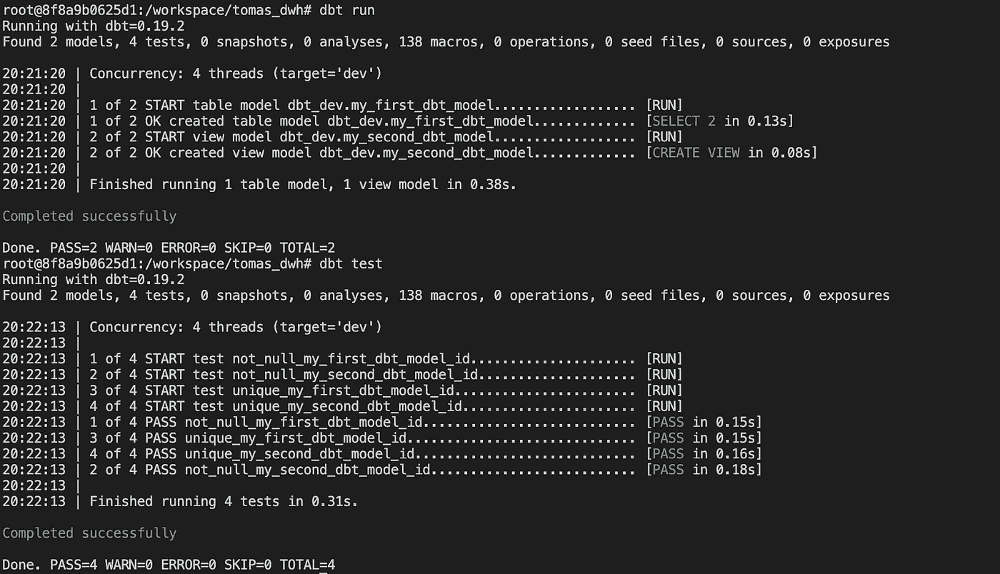

终端中的 dbt 运行和 dbt 测试视图。作者图片

万岁，我们刚刚成功地修复并运行了我们的模型！

如果我们在 dev/default 和 prod 上运行 dbt run，我们会在 DB 中看到所有这些

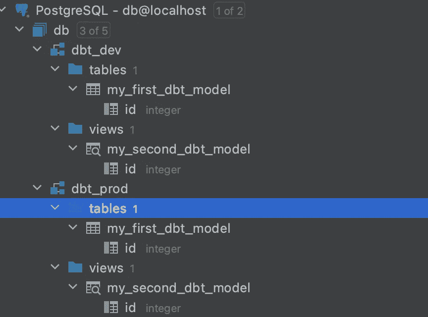

在默认和生产模式下运行 dbt 后的数据库视图。作者图片

# dbt 细节

## 目标文件夹

在我们的 **dbt 运行之后，**我们创建了这个文件夹。其内容:

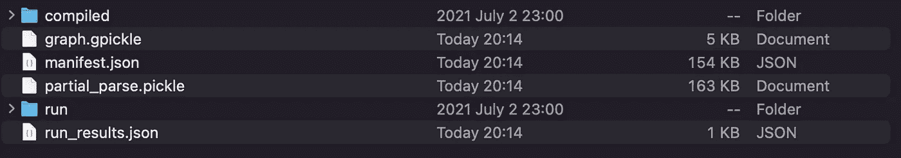

目标文件夹结构。作者图片

对我来说，有趣的文件都在**编译/运行**目录下。如果我们深入兔子洞，我们可以发现我们的 SQL 查询被解析。

我们还可以通过执行以下命令来编译我们的文件:

```
dbt compile
```

运行会在**编译的**和**运行的**文件夹中创建或更新文件。您还将编译测试 SQL，这样您就可以了解在您指定的测试中运行了什么。

## 日志

如果出现任何问题，并且不太清楚是什么，请检查 logs/dbt.log。例如，在工作中，我得到“数据库错误:数据库 x 的权限被拒绝”。我不知道我缺少什么权限。得到一个 dbt 的[调试页面链接，](https://docs.getdbt.com/docs/guides/debugging-errors)同事说查日志。从那里，我找到了我所缺少的权限。

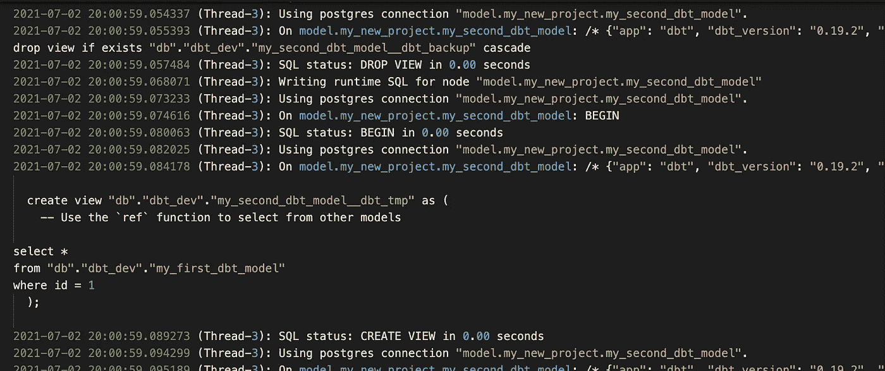

日志文件的片段。作者图片

## 增量模型

假设我们有这样一种情况，驻留在数据库中的数据很大，我们希望增加负载。一般来说，如果一个表存在，我们就编写一个脚本—从头开始创建它，否则—插入和(或)更新它。所以基本上，我们有重复的代码部分，我们必须在两个地方维护它。不符合干(不重复自己)。幸运的是，dbt 有一个惊人的特性，比如增量加载。为此，我们将使用 [Mockaroo](https://www.mockaroo.com/) 创建一个额外的源表。我已经在本地 Postgres 数据库上执行了 01_mock_users_data.sql。我还做了一个小小的改动，将 created_at 列转换为时间戳列，而不是日期。

创建了一个简单的模型来使用 is_incremental 宏:

如果我们现在运行它并检查目标/运行:

```
create  table "db"."dbt_dev"."mock_users"
as (
select  * from "db"."operational_db"."mock_users_data"
);
```

让我们运行**02 _ more _ mock _ users _ data . SQL**并再次运行 dbt。在目标/运行中，我们可以看到不同的输出！

```
select  * from "db"."operational_db"."mock_users_data"
-- this filter will only be applied on an incremental run
where created_at >= (select max(created_at) from "db"."dbt_dev"."mock_users")
```

虽然这里的细微差别是，它将完全按照您指定的过滤器运行。第一轮将是所有的历史；下一次运行将只针对新行。最初的查询甚至可能没有完成，或者在执行过程中遇到一些其他问题(超时、对查询运行时间的一些硬性限制，等等。).因此，您可以创建一个上限过滤器，只需几天/几周/几个月，就可以轻松地分几批刷新。虽然这很乏味，而且您必须手动运行它才能赶上进度。

## 宏+按周期插入

> **免责声明:** insert_by_period 仅适用于红移，dbt-vault 创建的 vault_insert_by_period 适用于雪花。所以基本上，我只是在解释我的旅程，我一路上尝试和检查了什么。

我在增量加载中提到了“宏”，您可能想知道它是什么？这是一些自定义代码，执行这些代码是为了添加一些缺失的功能或更复杂的逻辑。即在冗长的增量加载之前提到的。在我们的例子中，是一个简单的条件插入，它将在多个批次中加载我们的初始数据。你可以在最初关于这个宏[的讨论中查看这里](https://discourse.getdbt.com/t/a-materialization-for-problematic-initial-builds/60)。总而言之，它被捆绑在 dbt-utils 包中。我们可以通过在 packages.yml 文件中指定它来导入。版本 0.7.0 与我的 dbt 版本 0.19.2 不兼容(我要求的是 0.20，在我写这篇博文的时候这只是一个候选版本)，所以我使用了 0.6.4。

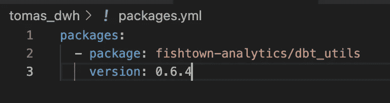

packages.yml 内容。作者图片

我们可以安装依赖项

```
dbt deps
```

如果我们遵循 Postgres 用例版本的所有信息，它将不起作用，因为正如注释中所写的——它只适合红移！在这之后，我进入兔子洞，检查 [dbt-vault](https://dbtvault.readthedocs.io/en/latest/) ，做一些调整，并在 GitHub 中使用[注释](https://github.com/dbt-labs/dbt-utils/issues/192#issuecomment-761029060)创建自己的宏。但是我想我对宏这个高级话题太陌生了，我不能让它工作。我将不得不深入研究这个问题。

## 快照模型

它的名字并不能真正解释它的作用。至少对我来说，快照意味着数据的当前状态。虽然在 dbt 的情况下，如果我们创建一个快照模型(他们建议将它放在“快照”文件夹中)，我们将拥有 SCD 类型 2(顺便说一下，我前段时间在 spark 上写了一篇关于 SCD2 的[文章，其中涵盖了什么是 SCD)。](/slowly-changing-dimension-type-2-in-spark-7d5865ac915b)

因此，让我们在这个例子中使用相同的模拟用户数据。让我们添加 updated_at 列，并使其与 created_at 列(03_update_at.sql)相匹配。让我们按照 dbt 文档中的基本示例，运行 **dbt 快照**。我们可以看到快照的样子(只对新添加的列感兴趣):

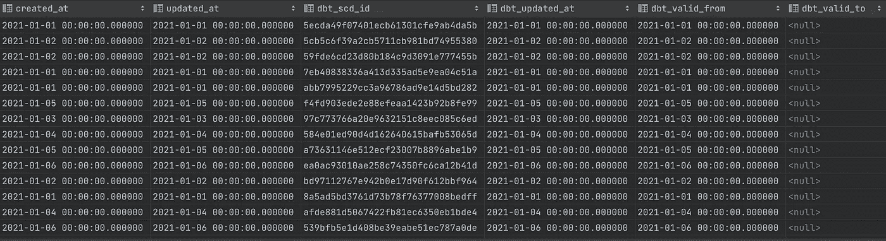

模拟用户数据的 SCD 类型 2。作者图片

我们可以看到我们有 **dbt_scd_id** 和 **dbt_valid_from** 和 **dbt_valid_to** ，对应于变更。让我们执行 04_change_some_names.sql 并运行 **dbt 快照。**

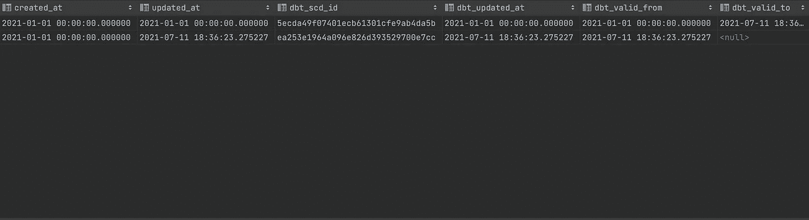

SCD 类型 2。作者图片

好的，所以基本上，我们只是设置了什么是独特的，dbt 负责剩下的。对我来说，这已经方便很多次了。在目标/运行/快照文件夹中，我们可以看到我们的快照代码也是为我们生成的！

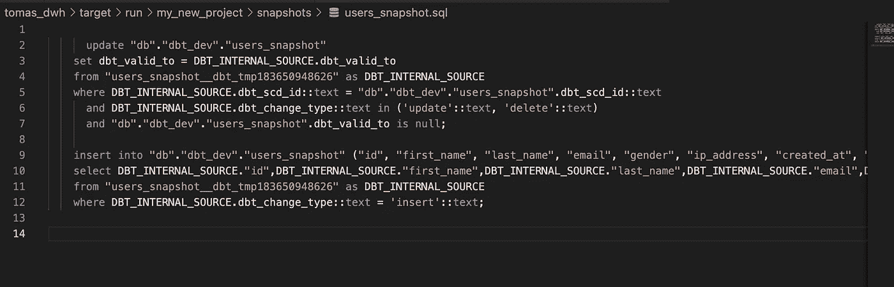

所以基本上，我们可以看到它创建了一个临时表，然后为我们进行了所有的比较！

## 生成文档

数据沿袭和文档。如果您在 yml 文件中指定了所有相关的元数据，并使用了对模型和源的引用，那么您就可以生成文档了！

```
dbt docs generate
```

这个方法将在您的**目标**目录中生成一个 **catalog.json** 文件。要检查它在 web 上的外观:

```
dbt docs serve --port 8001 // or any other port you prefer
```

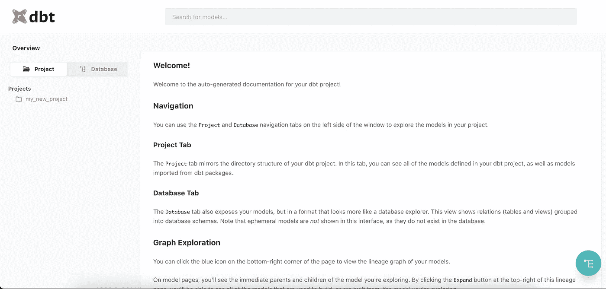

dbt 生成的文档页面。作者图片

如果我们点击右下角的绿色图标，我们会看到血统！

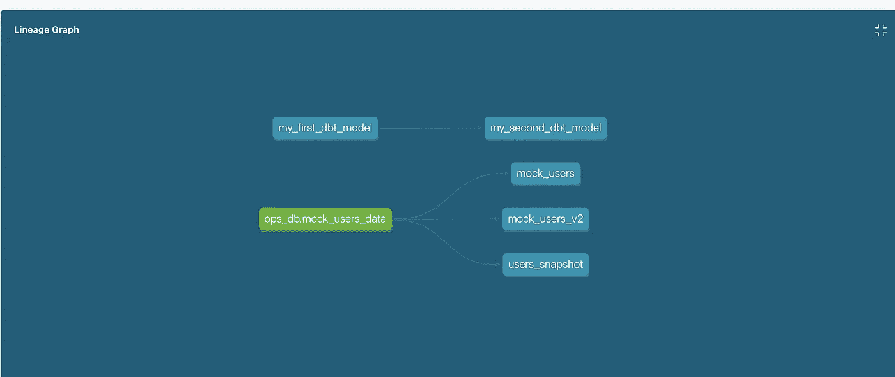

数据血统！作者图片

请记住，这里我展示的是基础知识。官方 dbt 页面上有很多东西( [dbt-docs 页面](https://docs.getdbt.com/reference/commands/cmd-docs))！

# 摘要

所以我们涵盖了大部分基本的东西(我发现了一个感兴趣的领域->宏)。强烈建议任何使用 ELT 方法的人尝试 dbt。这将允许您充分利用它:完全刷新、下游重新运行、文档和数据沿袭。

你可以在我的 [GitHub repo 里找到我的代码。](https://github.com/TomasPel/workshops/tree/main/dbt_101)