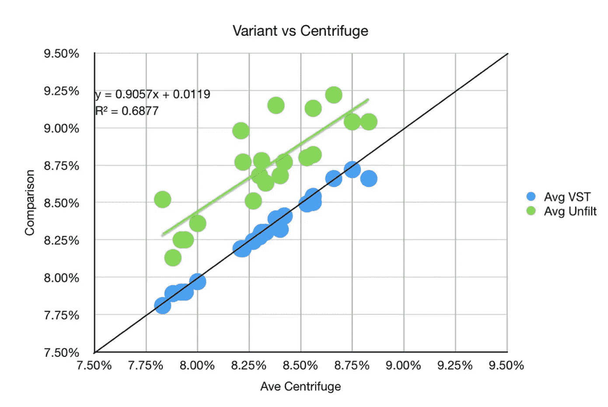
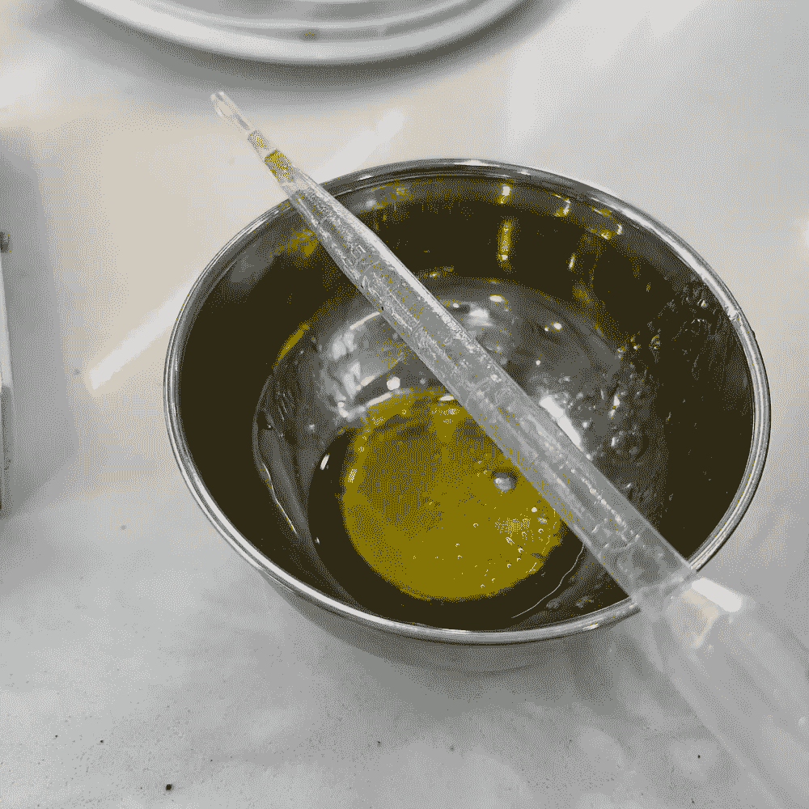
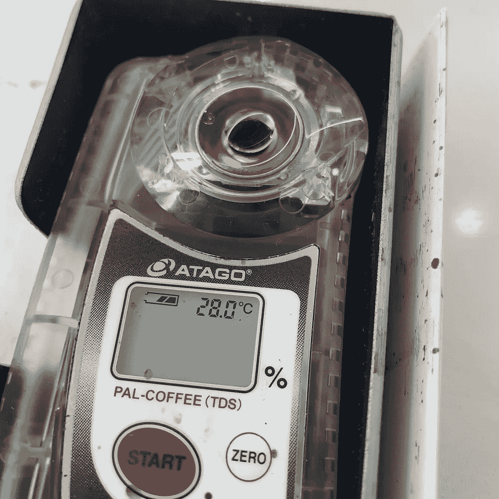
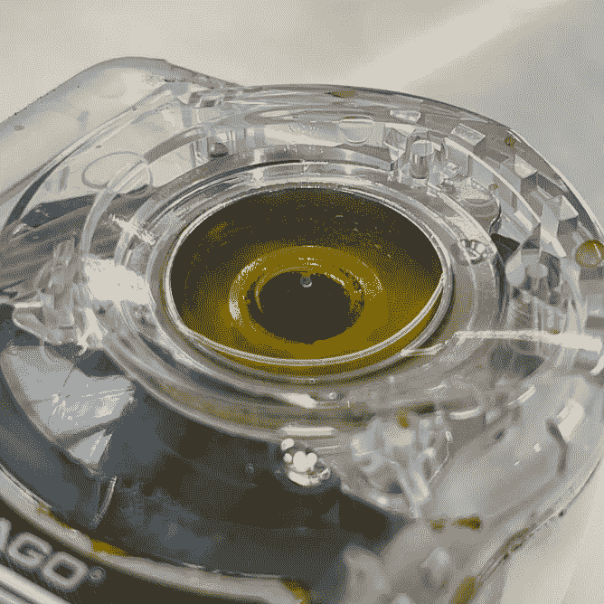
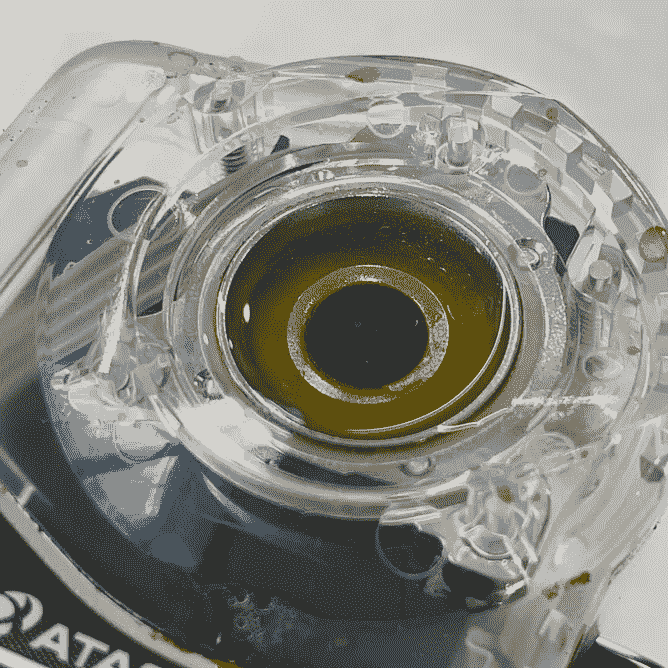
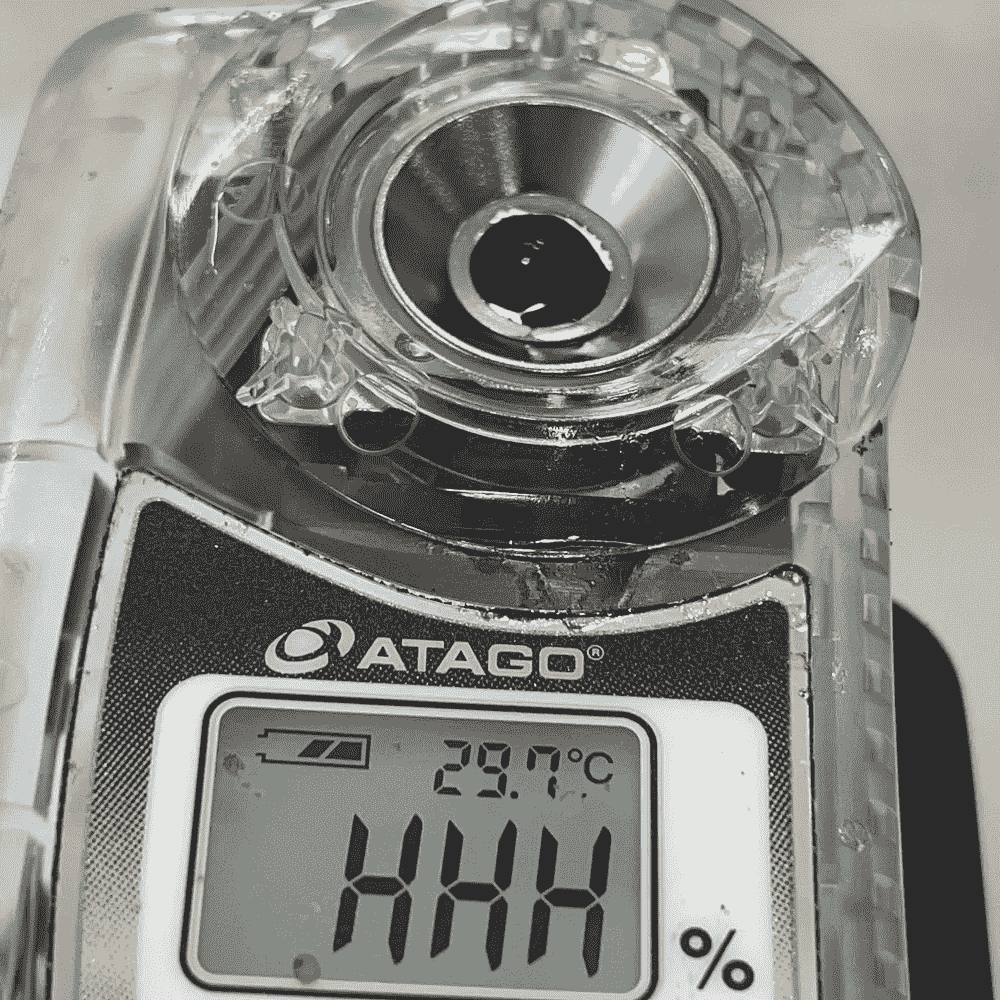
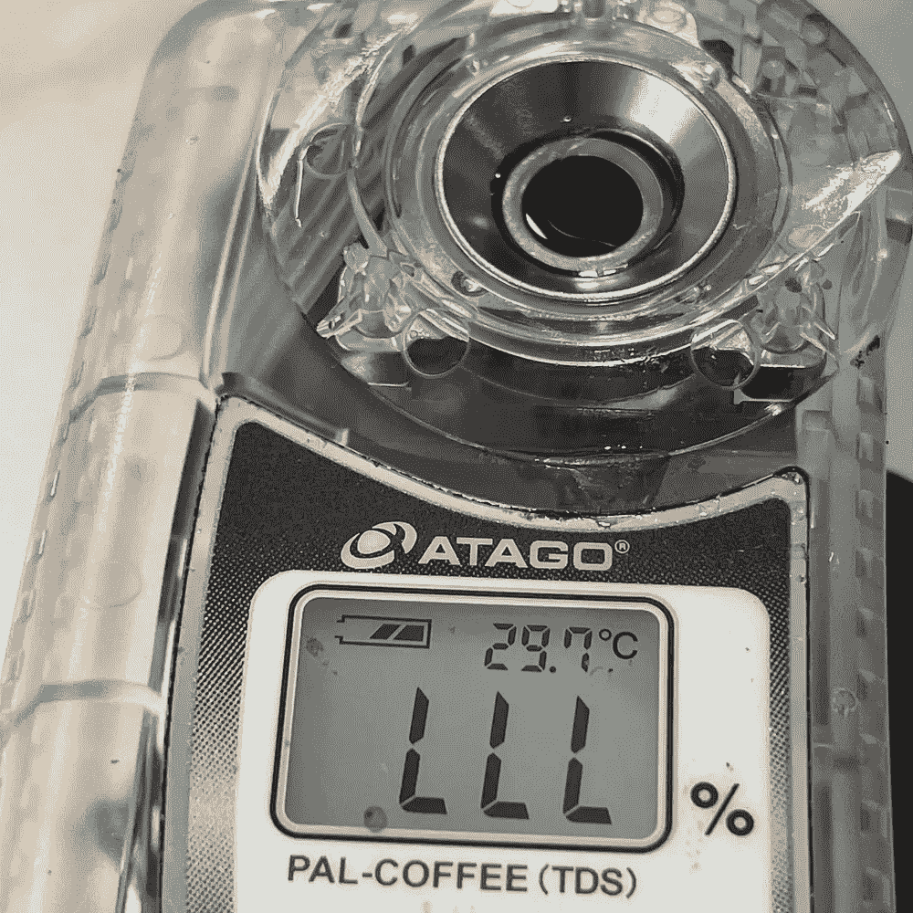
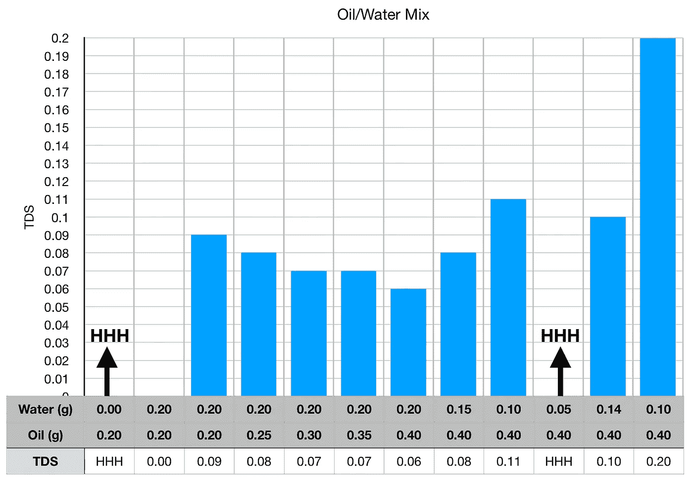
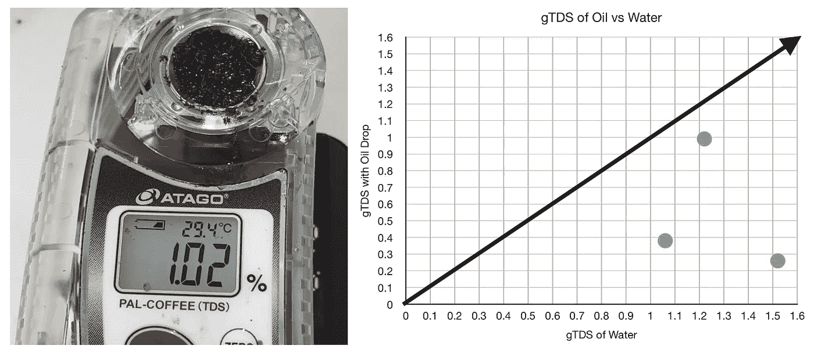

# 咖啡中总溶解固体(TDS)读数的油分析

> 原文：<https://towardsdatascience.com/oil-analysis-for-tds-readings-in-coffee-23279b4d7551?source=collection_archive---------46----------------------->

## 咖啡数据科学

## 寻求理解

在一些关于在测量总溶解固体(TDS)之前过滤样品的讨论中，出现了浓缩咖啡中油的话题。TDS 用于计算提取率(EY)，是量化咖啡提取的主要工具。咖啡中的油可能会改变 TDS 的测量方式，因为 TDS 是使用折射仪测量的，而油与水的折射率不同。为了有更深入的了解，我收集了一些数据，我很惊讶。

[之前](/filter-syringes-for-tds-coffee-measurements-seem-to-be-unnecessary-e52aded77ac4)我看了别人的数据，显示滤波导致线性偏移约 0.5%。

从那以后，我一直主张不要对 TDS 样品使用过滤器，因为它们很贵，而且根据现有的数据，它们如何影响样品还不确定。离心机很可能将油从水中分离出来，这就是为什么测量结果接近注射过滤样品。

如果过滤样品改变了 TDS 读数，可能是过滤器将油从样品中分离出来。这很容易测试，只需在同一个样品中加入一些油，看起来与过滤样品相反。

所有图片由作者提供

我开始在过滤水中放一些油，然后逐渐增加油和水的比例。

起初，读数略有下降。然后突然，读数达到最大值(HHH)，这意味着折光仪读数超过 24% TDS。

所以我收集了更多的数据，但是只用了少量的油。这是一滴。

左图:一滴油。右图:加入几滴水

少量的油仍然会溢出，一旦你加入一两滴水，读数就会达到 LLL，这意味着没有足够的液体来获取有效读数。

# 更多数据

我看着重复，我改变了油和水。

然后，我在咖啡[渣](/other-coffee-measurements-using-a-refractometer-85d0fb28d3d7)中加入油，以了解油被过滤后会发生什么。

[gTDS](/other-coffee-measurements-using-a-refractometer-85d0fb28d3d7) 是地面加少量水的 TDS

我预计一些油会稍微改变读数，但我没想到读数会变化如此剧烈或非常小。我不确定注射器过滤器是否过滤掉了油或微粒或其他东西，但我确定油会导致数字折光率仪的测量结果失真。

如果你愿意，可以在推特、 [YouTube](https://m.youtube.com/channel/UClgcmAtBMTmVVGANjtntXTw?source=post_page---------------------------) 和 [Instagram](https://www.instagram.com/espressofun/) 上关注我，我会在那里发布不同机器上的浓缩咖啡照片和浓缩咖啡相关的视频。你也可以在 [LinkedIn](https://www.linkedin.com/in/robert-mckeon-aloe-01581595?source=post_page---------------------------) 上找到我。也可以关注我在[中](https://towardsdatascience.com/@rmckeon/follow)和[订阅](https://rmckeon.medium.com/subscribe)。

# [我的进一步阅读](https://rmckeon.medium.com/story-collection-splash-page-e15025710347):

[我未来的书](https://www.kickstarter.com/projects/espressofun/engineering-better-espresso-data-driven-coffee)

[浓缩咖啡系列文章](https://rmckeon.medium.com/a-collection-of-espresso-articles-de8a3abf9917?postPublishedType=repub)

[工作和学校故事集](https://rmckeon.medium.com/a-collection-of-work-and-school-stories-6b7ca5a58318?source=your_stories_page-------------------------------------)

个人故事和关注点

[乐高故事启动页面](https://rmckeon.medium.com/lego-story-splash-page-b91ba4f56bc7?source=your_stories_page-------------------------------------)

[摄影飞溅页面](https://rmckeon.medium.com/photography-splash-page-fe93297abc06?source=your_stories_page-------------------------------------)

[改善浓缩咖啡](https://rmckeon.medium.com/improving-espresso-splash-page-576c70e64d0d?source=your_stories_page-------------------------------------)

[断奏生活方式概述](https://rmckeon.medium.com/a-summary-of-the-staccato-lifestyle-dd1dc6d4b861?source=your_stories_page-------------------------------------)

[测量咖啡磨粒分布](https://rmckeon.medium.com/measuring-coffee-grind-distribution-d37a39ffc215?source=your_stories_page-------------------------------------)

[浓缩咖啡中的粉末迁移](https://medium.com/nerd-for-tech/rebuking-fines-migration-in-espresso-6790e6c964de)

[咖啡萃取](https://rmckeon.medium.com/coffee-extraction-splash-page-3e568df003ac?source=your_stories_page-------------------------------------)

[咖啡烘焙](https://rmckeon.medium.com/coffee-roasting-splash-page-780b0c3242ea?source=your_stories_page-------------------------------------)

[咖啡豆](https://rmckeon.medium.com/coffee-beans-splash-page-e52e1993274f?source=your_stories_page-------------------------------------)

[浓缩咖啡用纸质过滤器](https://rmckeon.medium.com/paper-filters-for-espresso-splash-page-f55fc553e98?source=your_stories_page-------------------------------------)

[浓缩咖啡篮及相关主题](https://rmckeon.medium.com/espresso-baskets-and-related-topics-splash-page-ff10f690a738?source=your_stories_page-------------------------------------)

[意式咖啡观点](https://rmckeon.medium.com/espresso-opinions-splash-page-5a89856d74da?source=your_stories_page-------------------------------------)

[透明 Portafilter 实验](https://rmckeon.medium.com/transparent-portafilter-experiments-splash-page-8fd3ae3a286d?source=your_stories_page-------------------------------------)

[杠杆机维护](https://rmckeon.medium.com/lever-machine-maintenance-splash-page-72c1e3102ff?source=your_stories_page-------------------------------------)

[咖啡评论和想法](https://rmckeon.medium.com/coffee-reviews-and-thoughts-splash-page-ca6840eb04f7?source=your_stories_page-------------------------------------)

[咖啡实验](https://rmckeon.medium.com/coffee-experiments-splash-page-671a77ba4d42?source=your_stories_page-------------------------------------)