# 基于机器学习的钻井数据油田岩性预测

> 原文：<https://towardsdatascience.com/oilfield-lithology-prediction-from-drilling-data-with-machine-learning-520ee9ff6e7c?source=collection_archive---------23----------------------->

## 实际工作流程和经验教训

丹尼尔·史密斯在 [Unsplash](https://unsplash.com/s/photos/drilling?utm_source=unsplash&utm_medium=referral&utm_content=creditCopyText) 上的照片

最近，在石油和天然气行业，我们发现了相当多的机器学习应用。我去年写了[另一篇关于声波测井预测的文章](/prediction-of-p-sonic-log-in-the-volve-oil-field-using-machine-learning-9a4afdb92fe8)，令人惊讶的是获得了如此多的回应，这项工作传播非常迅速。另一个 ML 应用是岩性预测。岩性是指岩石的类型。例如，岩性分为砂岩、粘土岩、泥灰岩、石灰石和白云石。

通常根据地球物理测井预测岩性，因为这些测井直接代表岩性。在这个应用领域已经有了无数的作品，甚至已经有了两个公开的比赛[这里](https://agilescientific.com/blog/2016/12/8/seg-machine-learning-contest-theres-still-time) (2016)和[这里](https://www.npd.no/en/force/Previous-events/machine-learning-contest-with-wells-and-seismic/) (2020)。

在本文中，我们想做一些不同的事情，即从钻井数据预测岩性**。这是不同的，因为岩性和钻井测量值(如扭矩、钻头转速或泵冲程)之间的关系仍未得到很好的理解。**

基于钻井数据的岩性预测将有助于石油和天然气行业的**实时地质导向**。地质导向是一种控制定向钻井的过程，以使其保持在产油层中，产油层是地下的一个区域，具有作为碳氢化合物生产者的经济价值。这需要了解钻头周围的岩性。实际上，这些信息可以通过随钻测井(LWD)来提供。然而，在通过 LWD 的测量和钻头的当前位置之间存在深度滞后，并且 LWD 传递到地面存在时间延迟。因此，我们需要一个准确实时的岩性描述。

现在，让我们把手弄脏。

> 本文提供了源代码以供复制。**访问它** [**这里**](https://github.com/yohanesnuwara/volve-machine-learning/blob/main/notebook/lith_prediction_from_drilling.ipynb) 。

# 数据概述

我们使用 Equinor 为公众提供的 Volve 字段的数据集。我们将要使用的数据集已经过预处理。在这里找到数据[。来自特定井的数据集有 33 列；2 列(深度和时间)被称为标识符，因为我们实时获得每个深度的测量值，30 列是从钻井数据获得的被测变量，在 ML 术语中我们称之为特征，最后 1 列是从泥浆测井数据获得的岩性标签。](https://github.com/yohanesnuwara/volve-machine-learning/blob/main/Realtime_Drilling_F_15.csv)

在岩性栏中有 5 个岩性类别:砂岩、粘土岩、泥灰岩、石灰石和白云石。由于石灰石和白云石的观察次数最少，我们将只使用**砂岩、粘土岩和泥灰岩**进行分类。此外，请注意观察数量的不平衡。在这种情况下，我们有一个不平衡的分类。稍后，我们将在做出预测之前先处理这个问题。

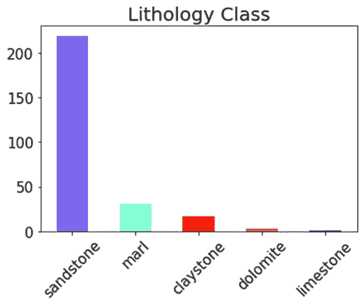

岩性分类分布— Yohanes Nuwara

你可能会对这些钻井数据中的大量被测变量感到惊讶。所有这些被测变量都是缩写的，但我们不会逐一描述每个被测变量是什么，因为当然，**我们不需要所有这 30 个特征来进行预测！**它们中的一些是错误的和无用的，这就是为什么我们将进行特征选择。

# 特征选择

当我们进行机器学习时，我们会尽最大努力减少过多特征的数量，因为较少的特征可以使我们的预测模型训练得更快。基本上，我们有两种方法可以做:移除错误特征和移除冗余特征。

## 1.埃罗纽斯特征

一个错误的特征不能帮助我们对目标进行分类。它**包含常量或统一值**。同样，当我们对水果进行分类时，例如，苹果、橘子和西瓜，仅用“形状”作为预测指标是不够的。所有这些水果当然都是“圆形”的。如果有 1000 个观察值被标记为苹果、桔子或西瓜，那么我们的“形状”列中的所有值都将是“圆形”。在这种情况下，我们需要一个更鲜明的预测因子，比如“颜色”。

水果分类时的错误特征示例

然而，错误的特征并不总是由常量值引起的。有时，特征上可能有常量值，因为该特定特征是一个**注释**。

在某些情况下，我们不需要删除某个特征。由于任何数据都容易出现测量误差，因此异常值会使要素看起来不正确。通常，**我们可以使用我们的领域知识**发现异常值。如果这个特性看起来仍然有用，我们可以只移除离群值，而**保留它，而不是**。

> 我们需要明智地发现错误的特征。

有一些方法可以识别。第一，汇总统计。在 Pandas 中，我们使用`dataframe.describe()`来打印汇总统计数据。以下是一些功能的精选摘要统计数据。

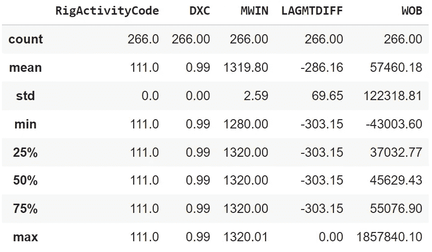

钻井数据的错误特征

**RigActivityCode** 和 **DXC** 都具有恒定值，因为平均值、最小值、最大值和百分位数相等。这些功能是错误的，因此不能使用。我们看到“RigActivityCode”只是一个没有任何意义的注释。接下来， **MWIN** 显示所有相等的百分位数和最大值，而 **LAGMTDIFF** 显示所有相等的百分位数和最小值。我们可以得出结论，这两个也是错误的。

现在，看看 WOB。百分位数看起来不错，但是最小值是负的，最大值非常大。由于 WOB 是钻压，负的钻压不可能是真的。此外，非常大的最大值意味着存在异常值。然而，**我们保留 WOB，而不是**，因为我们可以仅移除异常值，即移除 WOB 小于 0 且小于 1，000，000 的数据部分。

另一种发现错误特征的方法是识别具有零的数据的百分比**。这里，我们计算了百分比。**

**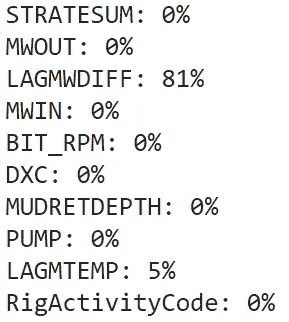**

**数据中零的百分比**

**在上面的计算结果中，**lagwdiff**有 81%的值为零。这也是我们需要放弃这个特性的一个重要原因。**

## **2.冗余功能**

**冗余特征具有在它们之间具有高相关性的特征。我们可以绘制出这些变量之间相互关系的热图。使用了斯皮尔曼相关性。我们的特征选择规则是**高度相关的特征将不被使用**。**

**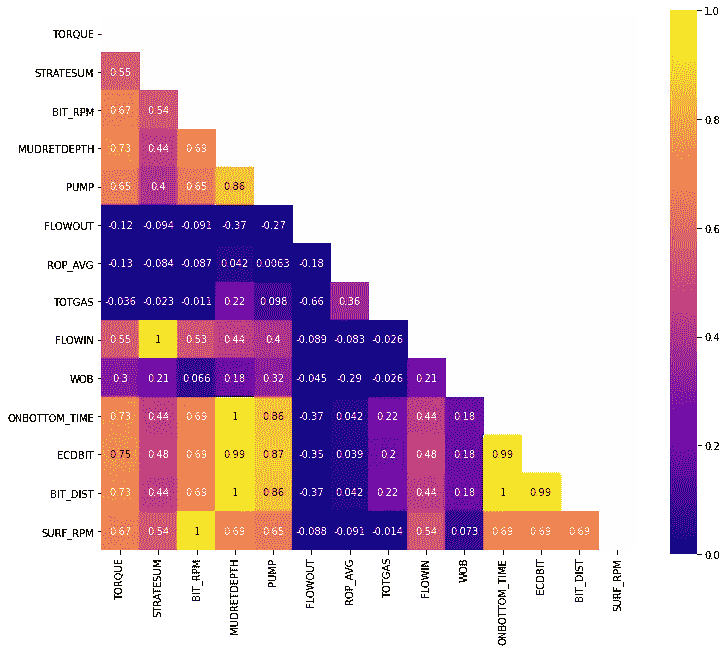**

**Spearman 相关特征的热图——yo hanes nu wara**

**在发现一些高度相关的特征之后，我们现在可以移除这些特征。**

> **但是请记住，我们需要使用我们的领域知识来证明为什么我们需要删除它。**

**SURF_RPM(表面上每分钟的转数)与 BIT_RPM(钻头上每分钟的转数)相关，因为当我们使用钻头时，钻头上测得的转数将总是等于表面上测得的转数。我们将**移除 SURF_RPM** 。**

**我们还**移除了 MUDRETDEPTH、BIT_DIST、ONBOTTOM_TIME** ，因为这三者都是相关的。**

**流入(泥浆流入)与 STRATESUM(泵总冲程速率)相关，因为当泥浆流入时，钻井工程师会获得泵的测量值。我们选择**移除流入**。**

**然而，我们看到流出量(泥浆流出量)与 STRATESUM 不相关，因为泥浆流出量不受泥浆流入量的控制。所以，我们**保留这两个**。**

## **3.选定的功能**

**令人惊讶的是，经过紧张的试镜，我们已经将 30 个特征减少到只有 9 个！功能如下:**

*   **扭矩:平均表面扭矩(N.m)**
*   **STRATESUM:泵总冲程速率(Hz)**
*   **BIT_RPM:钻头每分钟的转数(c/s)**
*   **泵:泵压(Pa)**
*   **流出量:泥浆流出量(m3/s)**
*   **ROP_AVG:深度平均每分钟转数(米/秒)**
*   **TOTGAS:总气体含量(ppm)**
*   **WOB:钻压(N)**
*   **ECDBIT:钻头有效循环密度(kg/m3)**

**我们希望这些特征有助于对砂岩、粘土岩和泥灰岩岩性进行分类。以下是我们减少特征后的数据。**

**我们可以以日志的形式显示数据，x 轴为特征，y 轴为深度。右边的日志是岩性栏；红色是泥灰岩，绿色是粘土岩，紫色是砂岩。**

**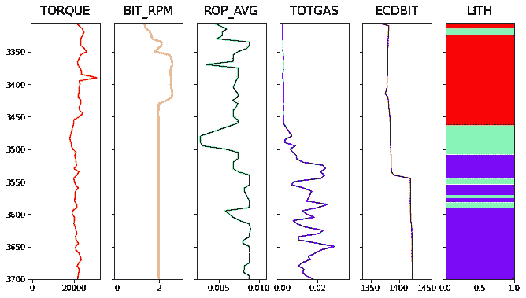**

**测井显示中的钻井数据和岩性图— Yohanes Nuwara**

**Pairplot 也是一种有用的探索性数据分析技术。下面是使用`seaborn`库的所有特征的配对图。**

**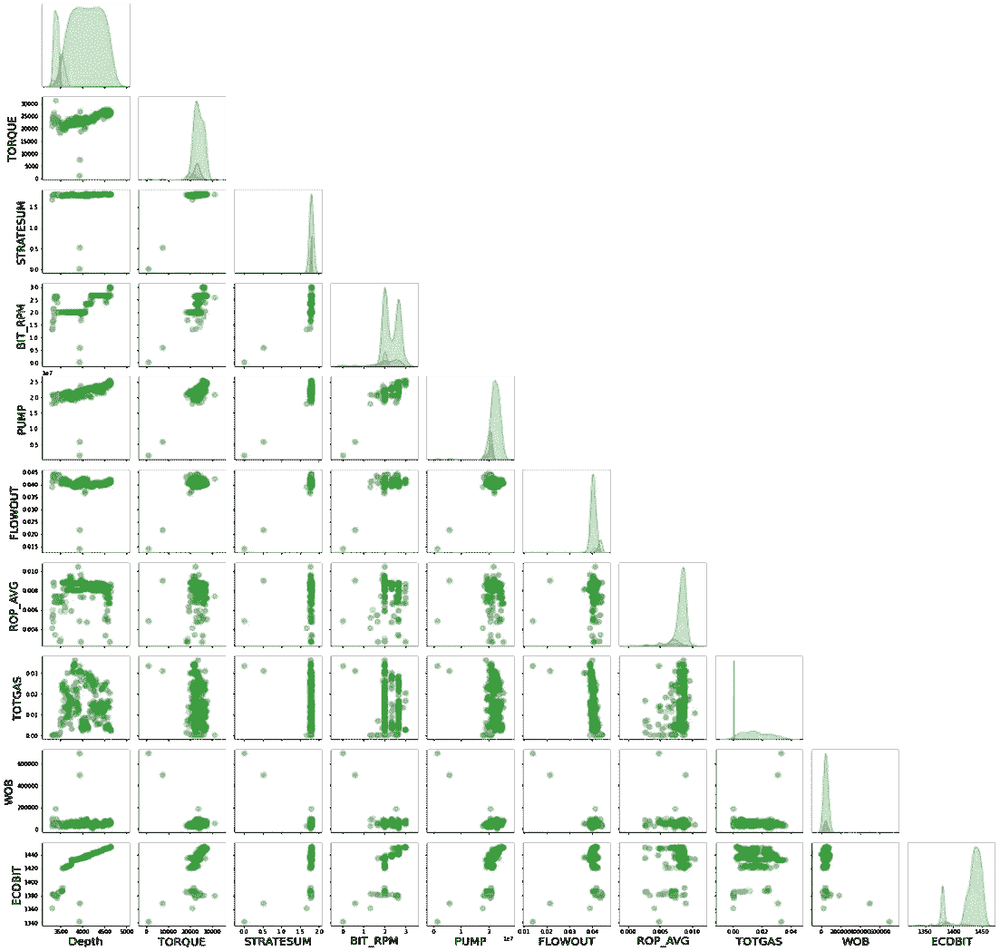**

**钻井数据特征对绘图——yo hanes nu wara**

# **对不平衡类进行过采样**

**我们知道我们班的观测数是不平衡的。有一个不平衡的类将使我们的预测模型具有高精度但低召回率。为了纠正这一点，我们需要对数据进行重新采样。许多重采样技术中有 3 种；欠采样、过采样以及两者的组合。**

**在[这篇文章](/multi-class-metrics-made-simple-part-i-precision-and-recall-9250280bddc2)中，Boaz Shmueli 博士更深入地解释了精度和召回，而[另一篇文章](/how-to-deal-with-imbalanced-data-in-python-f9b71aba53eb)解释了为什么我们应该关注不平衡类以及上述技术。**

**这里，我们将使用`imblearn` Python 库中提供的 [SMOTE](https://www.cs.cmu.edu/afs/cs/project/jair/pub/volume16/chawla02a-html/chawla2002.html) (合成少数过采样技术)进行过采样。最初，我们有 219:30:17 的砂岩、粘土岩和泥灰岩样品。击杀后，我们将拥有所有 219:219:219。**

**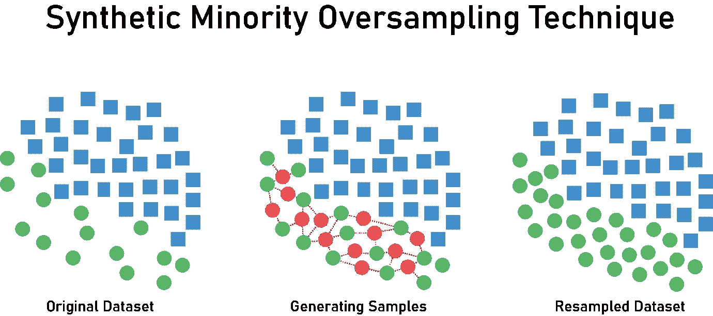**

**[Zaki Jefferson](https://medium.com/analytics-vidhya/bank-data-smote-b5cb01a5e0a2) 对 SMOTE 过采样过程的说明**

# **预言；预测；预告**

**我们以 30%的测试规模执行训练和测试数据分割，其中`train_test_split`在`scikit-learn`中。注意，我们应该**通过定义`stratify`参数来使用分层抽样而不是随机抽样**，因为分层对于不平衡的情况是有用的。然后我们应用标准化来转换数据。这里，标准缩放技术用于归一化。最后，我们使用 AdaBoost 分类器训练数据。**

**为了简化我们的训练过程，我们构建了一个包含`StandardScaler`归一化、`SMOTE`过采样器和`AdaBoostClassifier`模型的流水线。**

**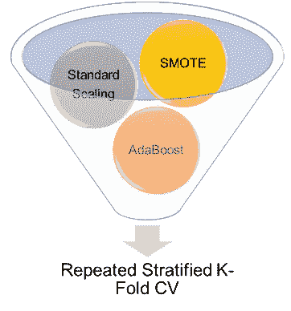**

**管道结构——约哈内斯努瓦拉**

**我们需要评估我们的分类器的性能，所以我们将做交叉验证(CV)。在这几种 CV 中，我们选择使用 10 次分割和 3 次重复的重复分层 K-Fold CV。再次，分层。**

**正如我们已经讨论过的，我们使用准确度、精确度和召回率作为我们的衡量标准。使用 AdaBoost 分类器，我们实现了 96%的准确度、86%的精确度和 89%的召回率。这是一个很好的性能，因为这些指标表明该模型可以很好地预测每个类别。**

**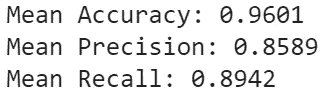**

**我们还绘制了混淆矩阵，以帮助我们了解 AdaBoost 模型对来自我们的测试集的每个真实类和每个预测类的分类情况。我们看到 65 个样本中的 61 个粘土岩、60 个泥灰岩和 64 个砂岩样本被成功预测。**

**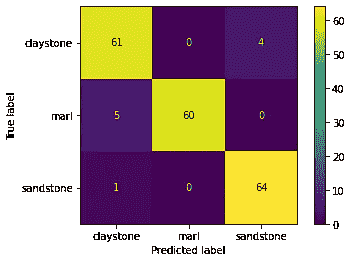**

**混淆矩阵——约哈内斯·努瓦拉**

**以下是我们的分类报告，显示了每个类别的指标。这表明该模型对每个类别的预测都一样好。**

****

**模型的可解释性也很重要。这里，我们制作了 AdaBoost 预测中使用的所有特征的特征重要性图。只有 ECDBIT、TOTGAS 和 ROP_AVG 这三个功能表现突出，重要性几乎相当，分别为 30%和 35%。这意味着这三个特征对预测岩性的能力贡献最大。**

**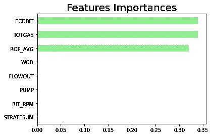**

**特征重要性图— Yohanes Nuwara**

# **总结和结论**

**我们的数据集包括钻井测量值和来自泥浆测井的岩性。我们通过剔除错误和冗余的功能，经过严格选择，将 30 个功能减少到 9 个。我们数据中的岩性类别不平衡，砂岩是主要类别，因此我们使用 SMOTE 进行过采样。数据集以分层的方式分成 30%的测试集。在流水线中，我们从标准缩放归一化、SMOTE 和 AdaBoost 模型开始。接下来，我们进行分层重复 K-Fold 交叉验证，并拟合我们的数据。事实证明，我们的 AdaBoost 模型可以预测砂岩、粘土岩和泥灰岩岩性，准确率为 86%，召回率为 89%。在解释我们的模型后，3 个特征，ECDBIT、TOTGAS 和 ROP_AVG 对预测贡献最大，同等重要性为 30%至 35%。**

**我们试图从钻井数据中预测岩性，这仅仅是利用更多数据创建更强大的预测模型的更令人兴奋的机会的开始。如前所述，基于钻井数据的岩性预测可以应用于实时地质导向。每当来自钻井的测量值到来时，模型就预测岩性。机会向我们所有人开放。所以，请让我知道，如果你有任何想法来改善这项工作！再见！**

****领英:**【https://www.linkedin.com/in/yohanesnuwara/】T2**

**GitHub:[https://github.com/yohanesnuwara](https://github.com/yohanesnuwara)**