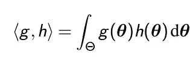
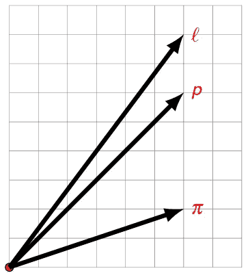
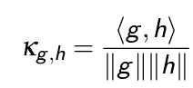

# 论贝叶斯几何

> 原文：<https://towardsdatascience.com/on-bayesian-geometry-7755abf9f4d2?source=collection_archive---------27----------------------->

## 概率分布的几何解释

由 [Unsplash](https://unsplash.com?utm_source=medium&utm_medium=referral) 上的 [Shubham Dhage](https://unsplash.com/@theshubhamdhage?utm_source=medium&utm_medium=referral) 拍摄的照片

贝叶斯推断的基础是我们往往不知道数据的底层分布，所以我们需要建立一个模型，然后随着数据的增多而迭代调整。在参数贝叶斯推理中，你从选择概率分布的一般形式**f(x；θ)** 由参数 **θ** 定义。一个很好的分布例子是具有两个参数 **μ** 和 **σ^2** 的正态分布。假设独立数据示例，假设分布下的数据概率为:

这个函数叫做*似然函数*。参数 **θ** 本身是一个随机变量，其概率分布可以用贝叶斯定理求出:

这里 **p(θ)** 称为*后验分布*， **π(θ)** 是*先验分布*，表达了我们在看到任何数据之前对参数 **θ** 的信念。分母中的术语称为*证据*，代表数据的概率。更容易把它想成一个归一化常数，以确保 **p(θ)** 是一个有效的分布。

# 贝叶斯几何

贝叶斯几何背后的思想很简单:如果我们将参数空间中的任何函数表示为某个向量空间中的向量，会怎么样。这些函数的例子可以是先验和后验分布以及似然函数。然后，我们可以在该空间上定义一个*内积* *积*，这将帮助我们计算两个分布之间的*角度*，并将该角度解释为分布彼此相差多少的度量。在我关于这个主题的讨论中，我将遵循 de *Carvalho 等人*【1】的一篇论文以及这个[幻灯片组](https://sheffieldmlnet.github.io/downloads/decarvalho-geometric-aspects-bayesian-inference-slides.pdf)。

参数空间中两个函数之间的*内积*定义为:

来源[https://sheffieldmlnet . github . io/downloads/decarvalho-geometric-aspects-Bayesian-inference-slides . pdf](https://sheffieldmlnet.github.io/downloads/decarvalho-geometric-aspects-bayesian-inference-slides.pdf)

函数的范数是:

我们把函数的选择限制在存在规范的函数上。这种情况通常是不能保证的，因为有一些概率分布的范数是发散的。

有一点我们可以立即看出，上面定义的*证据*是先验分布和可能性之间的内积。下面是先验分布、似然性和后验分布之间相互作用的示意图。先验分布和似然性之间的大角度表明先验分布具有较差的数据对齐。

来源:[https://sheffieldmlnet . github . io/downloads/decarvalho-geometric-aspects-Bayesian-inference-slides . pdf](https://sheffieldmlnet.github.io/downloads/decarvalho-geometric-aspects-bayesian-inference-slides.pdf)

[1]中的主要贡献叫做*相容性*，可以解释为参数空间中两个函数之间夹角的余弦:

来源:[https://sheffieldmlnet . github . io/downloads/decarvalho-geometric-aspects-Bayesian-inference-slides . pdf](https://sheffieldmlnet.github.io/downloads/decarvalho-geometric-aspects-bayesian-inference-slides.pdf)

相容性是介于 0 和 1 之间的值，可用于判断先验分布与似然性、两个先验分布、两个似然性等的对齐程度。对于某些情况，它可以以封闭形式计算，对于更复杂的分布，它可以使用马尔可夫链蒙特卡罗算法计算。

# 讨论

关于这种方法，我想讨论几个方面:

1.  本文在参数空间的函数上定义了一个希尔伯特空间。这意味着两个函数的线性组合也属于希尔伯特空间。这种线性组合被解释为两种概率分布的混合。然而，为了成为合适的分布，必须对其进行归一化，使得所有参数值的积分为 1:

非规格化混合物有什么意义吗？顺便说一下，似然函数不需要归一化。

2.关于概率分布的标准化概念，可能会出现一些混乱。为了正确，需要使用上面的等式进行归一化。然而，希尔伯特空间增加了额外的范数，它不是 PDF 的积分，而是其平方的积分。除了支持与希尔伯特空间相关的构造，我很难理解第二个规范的任何意义。

3.可能性不是一个加法值，而是一个乘法值。如果我有一批可能性为 L1 的数据和另一批(独立的)可能性为 L2 的数据，那么 4 个组合的可能性是 L1 和 L2 的乘积，而不是它们的和。这让我相信，也许更好的方法是在对数域中引入一个向量空间，或者使用比希尔伯特空间更复杂的代数结构。

# 参考

[1]德卡瓦略，m .，佩奇，G. L .，&巴尼，B. J. (2019)。贝叶斯推理的几何学。*贝叶斯分析*， *14* (4)。【https://doi.org/10.1214/18-BA1112 