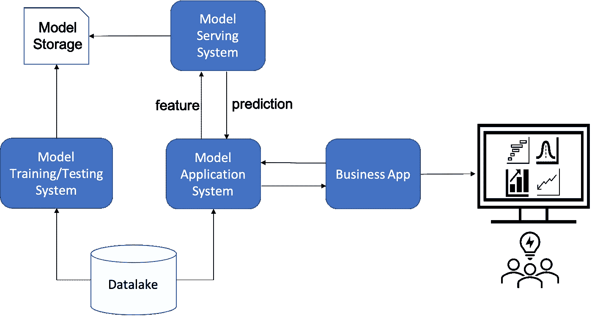
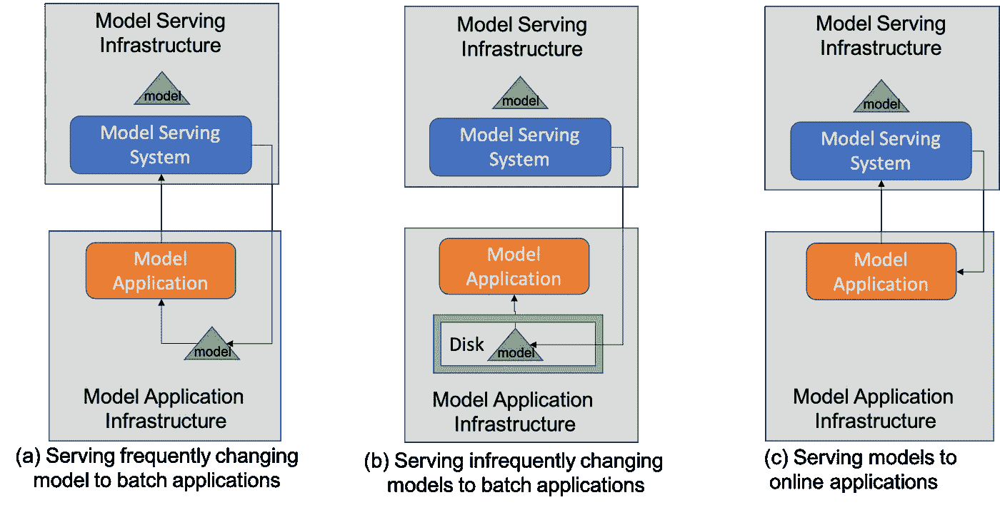
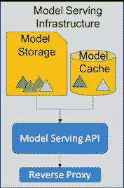
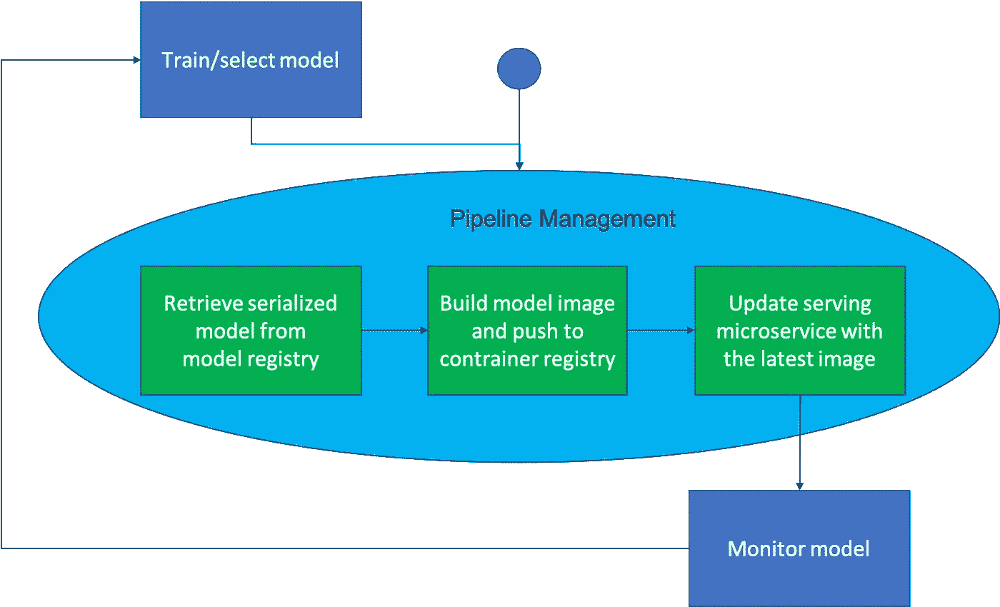

# 机器学习中的连续交付

> 原文：<https://towardsdatascience.com/on-continuous-delivery-in-machine-learning-71a1afebdf54?source=collection_archive---------20----------------------->

## 对用于高级分析系统的机器学习模型的持续交付过程的设计和实现方法的概念性理解

图 1:高级分析系统概述。作者图。

现代高级分析系统广泛使用机器学习(ML)模型。这些系统日复一日地为复杂的业务决策提供支持。随着业务现实的不断变化，这些模型需要失效和重新培训，如果不是以同样的速度，而是定期进行。这个讨论的一个关键部分是如何在很少或没有专家干预的情况下有效地服务模型。在本文中，我们将介绍一些概念和一些解决方法，需要理解这些概念和方法才能实现一个高效的模型服务系统。这种系统的设计和实施对于持续实现全年高级分析能力至关重要。

# 包装机器学习模型

在基于 ML 的分析系统中，模型被创建，然后以特定的文件格式存储。这些文件稍后在不同平台之间移动，加载到内存中，并用于预测作业。这需要一种有效的序列化和反序列化格式，允许以可移植的方式有效地处理模型文件。不幸的是，模型文件格式的前景是分散的，不同的框架使用不同的文件格式。下面的列表提供了几个例子。

*   [Scikit-Learn](https://scikit-learn.org/stable/modules/model_persistence.html) : pickle(。pkl)
*   [TensorFlow](https://www.tensorflow.org/tutorials/distribute/save_and_load) :协议缓冲区(。pb)
*   [Keras](https://www.tensorflow.org/tutorials/keras/save_and_load) : HDF5 (.h5)
*   [火花 ML](https://combust.github.io/mleap-docs/spark/) : MLleap(。zip)
*   [PyTorch](https://pytorch.org/tutorials/beginner/saving_loading_models.html) : PyTorch 文件格式(。pt)

标准化方面有努力。许多基于 Python 的 ML 库支持 pickle 格式。一些 ML 库也支持目前失宠的[预测模型标记语言](https://en.wikipedia.org/wiki/Predictive_Model_Markup_Language)(。pmml)格式。[开放神经网络交换](https://onnx.ai/)(。onnx)由不同的主要库支持，但是它还没有达到广泛的覆盖范围。

为了处理这样一个碎片化的空间，现代模型管理平台，如 [MLflow](https://mlflow.org/docs/0.2.0/index.html) ，支持广泛的[序列化/反序列化方法](https://www.mlflow.org/docs/latest/models.html#h2o-h2o)。事实上，当一个模型在 MLflow 中被[记录](https://www.mlflow.org/docs/latest/models.html#storage-format)时，它实际上创建了一个包含模型文件的目录，一个名为 MLmodel 的 YAML 文件，它提供了关于反序列化模型文件的各种信息。

# **模型服务的架构**

图 2:不同类型的模型服务架构。作者图。

应该如何服务模型在很大程度上取决于模型应用系统的性质。从架构设计角度来看，有两种类型:*批量*和*在线服务*。首先，模型可应用于*批次* *作业*，其中大量数据用于预测大量目标值。这些工作可以容忍一定程度的延迟，可能长达数天。第二，模型可以应用于*在线* *作业*，其中仅使用小数据集来预测少量目标值。这些作业只能容忍非常小的延迟，即不超过几秒钟。

图 2 展示了三种不同的高级架构，它们解决了此类应用程序的模型服务问题。前两个处理批处理作业，而最后一个处理在线应用。在批处理作业的情况下，需要在应用程序代码运行的执行环境中将模型加载到内存中。图 2(a)显示了一种设计，其中当应用程序请求模型时，模型被下载到应用程序的执行环境的存储器中。一旦加载完毕，应用程序中的预测任务就可以开始了。这主要适用于模型规模很小或频繁刷新或两者兼有的情况。如果模型很大，那么每次发出请求时都加载模型可能会违反服务级别协议，即使它们是宽松的。此外，在这种情况下，在任何执行之前在应用程序的执行环境中烘焙模型将是理想的。这可以通过在应用程序的计划运行之前，将模型放入安装在执行环境中的文件系统中，作为模型部署过程的一部分来完成。图 2(b)显示了这样一种设置。最后，图 2(c)给出了在线服务架构的简化视图，其中模型保持在服务应用程序附近，而与应用程序的交互仅限于数据集请求和响应。

# 实现模型服务系统

图 3:模型服务系统的设计。作者图。

图 3 展示了一个模型服务系统的高层架构。直到最近，Rest(或其他类型的)API 在这些类型的架构中扮演着重要的角色。对于基于 Python 的设计来说， [Flask](https://flask.palletsprojects.com/en/2.0.x/tutorial/index.html) 和 [FastAPI](https://fastapi.tiangolo.com/tutorial/) 是非常好的选择。API 应该与管理(打包的)模型文件的模型存储系统集成在一起。有很多存储选项，包括网络文件系统( [Azure 文件](https://docs.microsoft.com/en-us/azure/storage/files/))、数据库( [Azure SQL 数据库](https://docs.microsoft.com/en-us/azure/azure-sql/))和 Blob 存储( [Azure Blob 存储](https://docs.microsoft.com/en-us/azure/storage/blobs/))。请注意，其他云供应商在这一领域提供了大量其他解决方案和平台。在 API 和存储层之间，服务系统可能需要一个缓存层。Redis 是一个流行的数据库系统，用于管理缓存。在 API 的前面，可以放置一个反向代理，以便于处理请求/响应。Nginx 是实现这种组件的一个众所周知的平台。整个解决方案可以使用 Kubernetes 服务来部署，比如 [Azure Kubernetes 服务](https://docs.microsoft.com/en-us/azure/aks/)。在这样的设计中，API 组件可以使用能够有效平衡负载的副本集来部署。

使用上述方法构建一个模型服务系统适合于具有坚实工程能力的团队。这种能力可以在支持 ML 产品团队的中央平台团队中获得。挑战不在于开发这样一个系统，这需要有时间限制的努力。交付商业价值的团队需要优先考虑产生价值的任务，远高于系统的维护和改进工作。对于团队来说，最好采用一个平台，即使不能完全消除，至少部分消除这种努力。例如，团队可以通过集成模型服务框架，如 [Seldon-core](https://docs.seldon.io/projects/seldon-core/en/v1.1.0/) 来减少上述设计的开销。这种类型的选择允许在为模型服务时进行充分的定制，例如 AB 测试，而不需要付出太多的努力。喜欢香草模型服务需求的团队应该考虑使用更多电池实现服务系统，包括平台即服务，如 [Azure 机器学习](https://docs.microsoft.com/en-us/azure/machine-learning/)、[托管在 Azure Databricks](https://docs.microsoft.com/en-us/azure/databricks/applications/mlflow/) 中的 MLflow 等。

# **连续部署**

ML 模型的持续部署基本上意味着如何将模型放入服务环境中，以自动用于操作目的。我们避免讨论如何选择操作使用的模型。这样的讨论走向 ML 模型的持续集成。为了简单起见，假设解决了这样一个问题。

如果您使用 MLflow 进行其他模型管理活动，如跟踪、编码、生命周期变更，使用 MLflow 服务可能是最简单的入门方式。如果模型需要更好的 SLA，即更便宜、更快，或者在复杂的场景中，即 AB 测试，请考虑替换或集成更健壮的框架，如 Seldon-core。

虽然将几个脚本放在一起建立一个专家驱动的方法更容易，但一个更大胆的想法是采用一个闭环系统，使用基础设施作为代码和管道，很少或没有人类专家的参与。参见图 4，了解这种系统的概况。该系统的核心是一个由绿色方框表示的持续部署管道。管道从模型注册表中以序列化形式检索所选模型，构建(Docker)容器的[映像](https://docs.docker.com/engine/reference/commandline/image/)并将该映像推入容器注册表，并使用该映像更新服务微服务。这样的管道可以使用工作流管理平台开发为代码，如 [Airflow](https://airflow.apache.org/docs/apache-airflow/stable/) 、 [Kubeflow](https://www.kubeflow.org/docs/about/kubeflow/) ，或 DevOps 平台，如 [Azure Pipelines](https://docs.microsoft.com/en-us/azure/devops/pipelines/?view=azure-devops) 。可以通过监听标记模型被训练和选择使用的事件来触发流水线。当模型的性能下降或模型过期时，可以触发模型的训练和后续选择。在前一种情况下，监控系统可以生成这样的警报，而在后一种情况下，人类专家可以按照时间表启动该过程。

图 4:模型服务的持续部署。作者图。

# 强大的持续部署

对于高可用性，可以考虑更健壮的部署策略。受 web 服务部署的启发，可以采用以下策略:

*   蓝绿色部署:新部署(蓝色)与旧部署(绿色)并行部署，两者共享相同的设置。有限份额的流量被路由到蓝色部署。一旦部署显示在有限的负载下达到可接受的 SLA，绿色部署就会过期，蓝色部署将成为新的绿色部署。
*   金丝雀部署:蓝色和绿色部署并行运行，但是蓝色部署的流量份额会根据预定义的约束随着时间的推移而逐渐增加。一旦违反此类限制，此类部署可以回滚到旧模型以获得全部流量份额。

Kubernetes 服务和 Seldon-core 微服务是我们可以采用的推荐解决方案。组装这样一个平台比实现全部功能要容易得多。

# 评论

实现闭环持续部署系统的所有构件都在那里等着我们去抓取。将所有这些整合在一起以轻松实现 ML 模型持续部署的平台服务还处于早期阶段。但是，基于公有云的平台，如 [Google](https://cloud.google.com/vertex-ai/docs) 、 [Amazon](https://docs.aws.amazon.com/sagemaker/latest/dg/whatis.html) 、 [Azure](https://docs.microsoft.com/en-us/azure/machine-learning/) ，以及 ML/大数据平台服务，如 [Databricks](https://docs.databricks.com/) 、 [Neptune AI](https://docs.neptune.ai/) 等。，正在为实现这样的愿景而大步前进。请务必定期检查这些平台的版本，看看这些平台发展到什么程度了。

有趣的是，我们可以看到，在您的高级分析之旅中，您更喜欢和考虑哪一种选择。让我们知道你对此事的经验和看法。