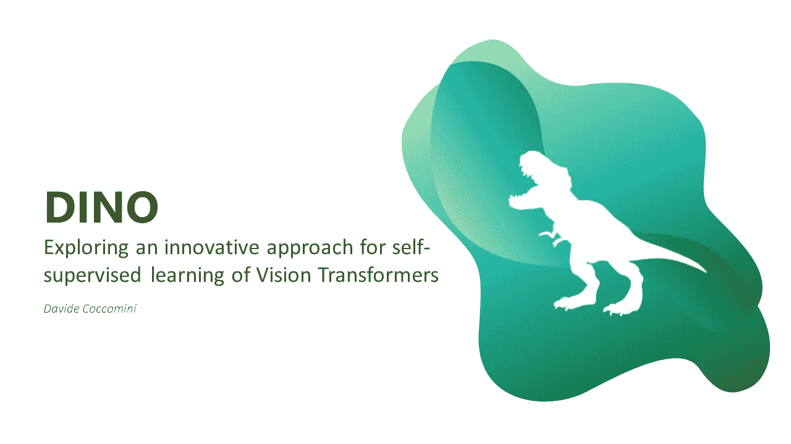
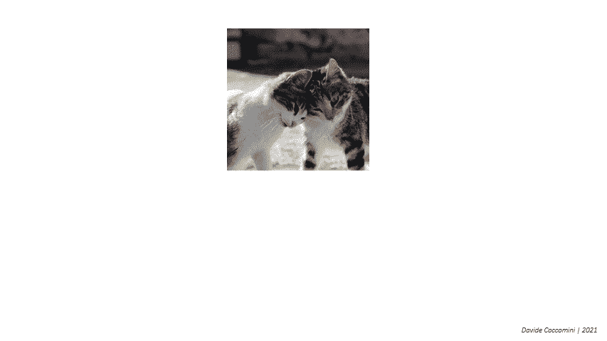
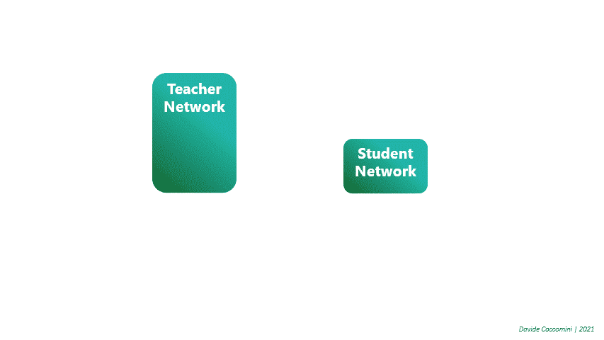
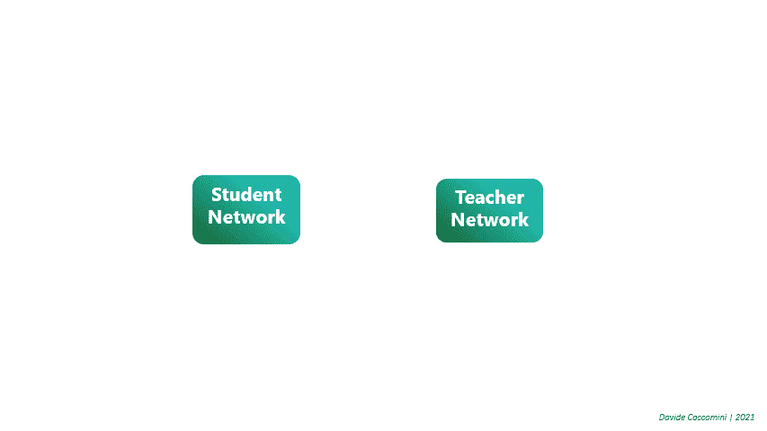
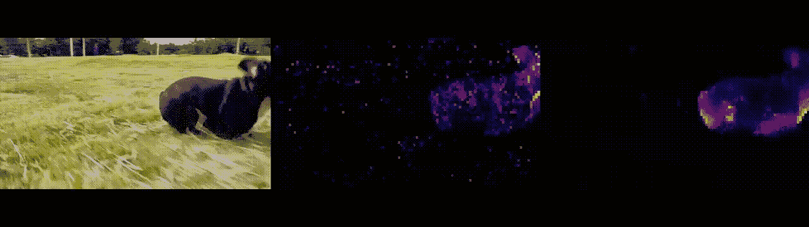
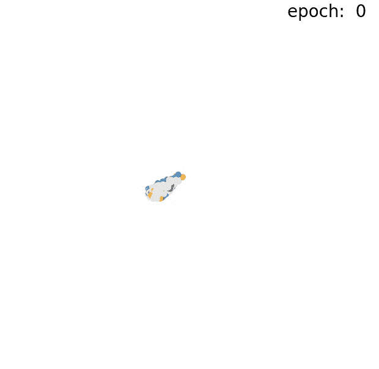

# 在迪诺上，没有标签的自动蒸馏

> 原文：<https://towardsdatascience.com/on-dino-self-distillation-with-no-labels-c29e9365e382?source=collection_archive---------12----------------------->

## [思想和理论](https://towardsdatascience.com/tagged/thoughts-and-theory)

## 开发一种用于视觉变形器的自我监督学习的创新方法

一段时间以来，变形金刚已经进入计算机视觉领域，令人惊叹，但几乎没有人能够想象视觉变形金刚在首次应用后的如此短的时间内产生如此惊人的效果。在这篇文章中，我们讨论了计算机视觉领域最有趣的进展之一，DINO，几天前由脸书·艾在他们的最后一篇出版物“DINO:自监督视觉变形金刚中的新兴属性”中宣布[2]。这项研究提出了一种称为 DINO 的自我监督方法，定义为一种无标签的自我蒸馏形式，用于训练视觉转换器。

如果你从来没有听说过视觉变形金刚或变形金刚，我建议你 [*看看我的第一篇文章*](/transformers-an-exciting-revolution-from-text-to-videos-dc70a15e617b) ，它从头到尾都非常深入地讨论了这个话题。

# 视觉变压器

简单介绍一下这个主题，transformers 是一种深度学习架构，多年来已经成为自然语言处理领域中最广泛使用的架构之一，并且自 2020 年以来一直应用于计算机视觉领域，取得了非凡的成果。

正常的转换器的工作方式是将一系列代表句子单词的向量作为输入，自我注意机制被应用于这些向量。将这种架构引入计算机视觉领域的直觉是，将图像视为一系列不重叠的小块，通过线性变换，这些小块被转换为向量，并被视为句子中的单词。

# **迪诺:无标签自蒸馏**

脸书人工智能研究人员想知道变形金刚在计算机视觉中的成功是否源于监督训练，以及是否有办法建立一个可以在无标签数据集上训练的自我监督系统。

这一想法似乎很有趣，因为它能够利用视觉转换器实现不仅可与卷积网络相媲美，而且明显优于卷积网络的结果，并且在标签较差的数据集环境中，从而使转换器的计算需求及其对大量数据的需求更有意义。
灵感来自于变形金刚在自然语言处理领域的成功，自我监督预训练的使用导致了伯特或 GPT 等极其有效的模型的出现。

为了在自我监督的环境中工作，有必要找到从可用数据中提取相关信息的智能方法，在这种情况下，研究人员选择的方法是使用两个具有相同架构的网络，一个定义为学生，另一个定义为教师。

这两个网络将把同一图像的两个表示作为输入。具体而言，对于训练集中的每个图像，应用多裁剪扩增来从中提取两组图像。获得两个大尺寸并且部分重叠的补片，能够给出所考虑的图像的全局概念，以及一系列其他较小的补片，它们将给出图像的局部表示。所有视图都被传递给学生网络，而只有全局视图被传递给教师。

以两只小猫的图像为例，将从中提取两个全局视图，表示图像的好的部分，从而使其内容更容易解释，以及三个局部视图，表示图像的各个区域，这些区域对于网络来说明显更难解释。这些视图还使用不同的技术进行增强，例如随机旋转和颜色抖动。

在训练过程中，只有学生受到训练，我们想要实现的是，这组网络能够理解局部和全局表示，尽管表面上不同，但表示相同的主题。

但是这两个网络为什么叫学生和老师呢？为什么只有学生接受训练？这来自于自我升华方法，一种用于将训练期间积累的知识从大型模型转移到更简单模型的技术。在传统的自我升华方法中，我们试图训练一个学生网络来匹配给定教师网络的输出。

在这种情况下，自我升华以一种完全不同的方式被使用，事实上，两个网络具有相同的规模，教师不是先天创造的，而是由学生训练的！在学生训练期间，学习到的一些信息被传播给教师，教师逐渐从学生看到的视图中学习，但是它必须仅基于给予它的全局视图来执行分类。

# 迪诺的结果

计算机视觉中最大的挑战之一一直是分割，这在大量不同的任务中非常有用，并要求网络能够完全理解图像中的内容。通常这个任务是用有监督的方法来处理的，但是如果你尝试使用 DINO，你会发现得到的分割比有监督的方法得到的分割更干净、更正确，而且完全不需要标签！

原始视频(左)、由监督模型获得的分割(中)和由 DINO 生成的分割(右)之间的比较[来源:[脸书·艾](https://ai.facebook.com/blog/dino-paws-computer-vision-with-self-supervised-transformers-and-10x-more-efficient-training/)

通过使用 DINO 算法训练视觉转换器，还发现该模型能够学习识别场景中的主要对象，就像任何人一样，并且以极其精确的方式，甚至处理部分减少对象视野的障碍物，如海浪。

将 DINO 应用于 Image-Net，研究人员看到了它如何能够使用它所学习的特征来进行极其精确的聚类划分。

【来源:[脸书艾](https://ai.facebook.com/blog/dino-paws-computer-vision-with-self-supervised-transformers-and-10x-more-efficient-training/)

变形金刚再一次被证明是伟大的新奇事物的承载者，由于迪诺的创新方法，结果比以往任何时候都更令人兴奋，这一年已经给了我们这个领域相当多的新奇事物。

[如果你想了解更多关于变形金刚、视觉变形金刚、时间创造者和自我关注的知识，让我们来看看我的第一篇文章](/transformers-an-exciting-revolution-from-text-to-videos-dc70a15e617b)！

# 参考文献和见解

[1]《脸书艾》。"[通过自我监督的变形金刚和 10 倍的高效培训，推进计算机视觉的发展水平](https://ai.facebook.com/blog/dino-paws-computer-vision-with-self-supervised-transformers-and-10x-more-efficient-training/)"

[2]《玛蒂尔德·卡隆等人》。"[自监督视觉变压器的新兴特性](https://arxiv.org/abs/2104.14294?fbclid=IwAR0m6wq-2eAkenMXV2lu_hU0KYSajFv9Gb6_k_giMKQGW38_6tJouPXVIkU)"

[3]《扬尼克·基尔彻》。"[迪诺:自我监督视觉变形金刚的新兴特性(脸书人工智能研究所解释](https://www.youtube.com/watch?v=h3ij3F3cPIk))"

[4]“Antti Tarvainen 等人”。"[意味着教师是更好的榜样](https://arxiv.org/abs/1703.01780)"

[5]《大卫·柯考米尼》。[关于变压器、定时器和注意事项](/transformers-an-exciting-revolution-from-text-to-videos-dc70a15e617b)