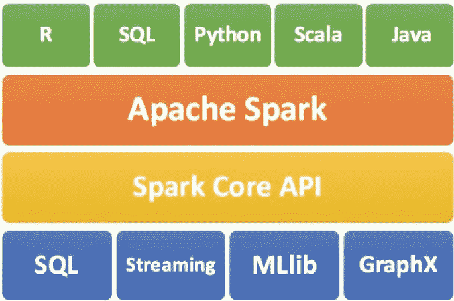

# 分布式数据科学

> 原文：<https://towardsdatascience.com/on-distributed-data-science-65b5f2a3d37f?source=collection_archive---------25----------------------->

## 我如何看待数据科学中不同的分布式框架

图片由[皮克斯拜](https://pixabay.com/?utm_source=link-attribution&utm_medium=referral&utm_campaign=image&utm_content=2853022)的 Gerd Altmann 提供

我第一次看到包含超过 10 亿行数据的数据集时，我认为我的计数(*)是错误的。

不是的。

这并没有阻止我分析数据的需要。企业有数据(显然很多)，企业需要从这些数据中获得洞察力，但企业不知道如何获得这些数据。因此，我咽下了喉咙里的硬块(这是我第一份真正的数据科学工作)，做了当时任何初级数据科学家都会做的事情，将数据集移植到企业分析巨兽中…SAS 企业指南(例如:现在在和自己约会)。

我的焦虑不止于此。更不用说服务器上用于支持我们的点击式 SAS EG 软件的垂直大容量内存了。它仍然不够强大，无法处理我试图执行的过于复杂的集群分析。记忆错误比比皆是。所以我采取了任何初级数据科学家在他们项目的这个阶段都会采取的下一步，我开始谷歌搜索。

这是我第一次接触分布式数据科学。

从那时起，我在职业生涯中花了相当一部分时间来支持利用不同分布式框架的大数据分析。尽管今天当面对不断变大的数据集时，我的焦虑有所缓解…感谢物联网【https://www.iotacommunications.com/blog/iot-big-data/】T4psht…分布式数据科学的世界至今仍在快速变化和发展。

因此，今天我想提供我对这些不断发展的框架如何适应分布式数据科学工作流的思考方式。我们开始吧！

# **分布式数据输入与分布式数据输出**

考虑分布式数据科学框架时，最大的区别是探索性数据分析(EDA)和数据科学部署。或者分布式数据输入与分布式数据输出。先说 EDA 吧。

明确地说，我对首字母缩写“EDA”做了一些改动，将数据科学家在最终确定新数据部署的训练模型之前需要做的所有事情归为一类。典型的管道包括访问数据源、特征工程和发现以及模型训练。

2001 年，微软的两位研究人员 [Banko 和 Brill](https://aclanthology.org/P01-1005.pdf) 证明了更多的数据比选择特定类型的模型对模型性能有更大的影响。这一概念已经被商业领袖所接受，尽管在一些情况下，这并不一定适用于[真实的情况](/why-more-data-is-not-always-better-de96723d1499)。

因此，企业让他们的数据科学家在工作时利用越来越大的数据集，从而在数据科学的 EDA 阶段产生越来越大的数据集。

换句话说，几乎所有的数据科学家都将在 EDA 阶段面临问题，而这些问题将受益于分布式框架。

处理大型数据集的典型代表是 Apache Spark 框架，它支持 Python ( [数据科学的](https://flatironschool.com/blog/data-science-programming-languages)语言)😊)通过 PySpark 实现。虽然 Spark 允许数据科学家通过在核心(垂直)和服务器(水平)之间分布数据集来处理大型数据集，但在训练模型方面，我们仍然存在问题。

为了解决模型训练问题，Spark 发布了 SparkML，这是一个机器学习算法库，可以在这些大规模数据集上跨集群训练有限的模型类型。除了 SparkML，Spark 生态系统还包括许多其他工具，以支持数据科学管道中“EDA”的所有方面。

Aoulad Abdelouarit，k .和 Sbihi，Boubker 和 Aknin，Noura。(2017).Spark 和 Solr:大数据环境下在线搜索的强大和符合人体工程学的组合(阿联酋案例)。

虽然 Spark 是开源的，但配置 Spark 在服务器集群上正常运行并不容易，企业安全和补丁协议使其更难实现。对于企业数据科学家来说，这导致了分布式数据科学平台的兴起，如 DataBricks 和 Watson Studio。如今，这些平台大部分都是基于云的，因此 Spark 在后端的实施是完全受管的，从而使 IT 团队无需计算内部服务器集群上的 Spark 配置。

Dask 不太受欢迎，但它是一个 Python 原生的分布式框架。Dask 是一个轻量级(就计算资源而言)的并行数值计算框架。Dask 使用常见的 Python 库，如 numpy 和 Pandas，但缺少 Spark 中的一些数据工程功能，如 SparkSQL。更多关于两者区别的细节可以在[这里](https://docs.dask.org/en/latest/spark.html)找到。

像 Spark 一样，Dask 也有一套 ML 模型，可以使用 Dask 框架进行并行化，毫不奇怪，这就是 Dask-ML。

Spark 和 Dask 允许数据工程和模型训练，但也有其他分布式框架只用于并行模型训练。最受欢迎的是 TensorFlow 和 PyTorch。事实上，PyTorch 刚刚[发布了](https://pytorch.org/blog/pytorch-1.9-released/) 1.9，其中包含了对分布式模型训练的更多支持。

使用这些更加以模型为中心的框架的主要好处是，它们使得在使用 GPU 的集群中训练模型变得更加容易。

分布式数据科学领域的新成员是[雷](https://ray.io/)。Ray 与 Python 无缝协作，包含高度专业化的库，用于处理其他框架没有处理的两个主要用例；强化学习和模型服务。前者是 Ray 解决的一个特例，数据科学家可以利用聚类来训练强化模型。Ray 还集成了 PyTorch 和 TensorFlow，使其成为一个有趣的开发框架。

事实上，Ray 还允许使用 RayServe 进行无缝建模服务，这使得 Ray 成为从“EDA”到部署的独特库。

# **转向分布式数据输出(又名分布式部署)**

处理数据和训练模型是一回事，但是部署这些模型来处理新数据可以使用不同的分布式工具包来管理。数据科学家需要考虑的关键问题是，他们是希望他们的部署作为大批量数据的作业运行，还是以更按需的方式作为服务运行，或者是两者的某种混合。

批量部署是指在数据存储环境中刷新新数据，并且模型需要在刷新时对所有新数据进行评分。换句话说，模型评分经常处理在模型训练期间经历的类似负载。在这些批量部署场景中，我们可以使用构建管道的相同后端框架，因为计算需求是相似的。因此，可以在部署中使用 Spark 或 Dask，并且使用任意数量的调度工具，通过调度器或 API 调用来调度代码运行。

更有趣的是当数据需要被按需评分时。例如，假设你训练了一个模型，它可以使用 Kafka 等数据流服务从手机接收传感器数据，并预测某人刚刚摔倒的可能性。该模型需要非常快速地对少量数据进行评分，因此不需要大批量作业所需的计算资源。现在想象一下，这个模型正在从 100 万部智能手机中获取数据。在这种情况下，我们如何最好地部署我们的模型来处理速度和计算需求？

在这种情况下，Docker 容器和 Kubernetes 成为有价值的工具，允许模型代码和基础设施支持模型代码快速并行化。容器就像虚拟环境，但不依赖于特定的操作系统，因为它们在运行时运行自己的操作系统。Kubernetes 是一个管理和复制容器的框架，可以在多台机器上运行。

与 Spark 一样，Kubernetes 的缺点是配置复杂。但像 DataBricks 一样，其他云平台也部署了 Kubernetes 或类似 Kubernetes 的服务的完全托管实现。这些是 AWS Lambda 等无服务器功能背后的一些基本概念，代表了在这些独特情况下部署我们的数据科学的新选项。

# **用例越多，复杂性也越大**

在这篇文章中，我提供了一种组织如何思考分布式数据科学框架的方法，以及这些流行的框架如何在数据科学管道中运行的一些基础知识。毫无疑问，在更复杂的混合场景中，我们需要在跨 Kubernetes pods 的容器中运行更大的分布式计算环境，如 Spark，这些容器可以并行化已经并行化的容器，以管理更大的数据需求。

我希望这种组织你对这些复杂的数据科学问题的思考的方式对你有所帮助，并且一如既往，我欢迎反馈。

比如参与学习更多关于数据科学、职业发展或糟糕的商业决策的知识？[加入我](https://www.facebook.com/groups/thinkdatascience)。