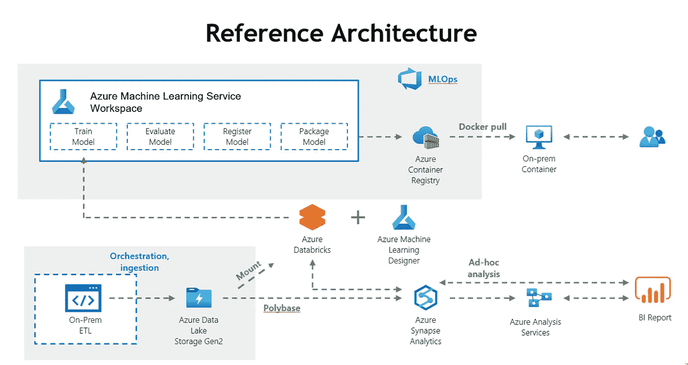

# 内部部署还是云？制造商应该在哪里实现机器学习平台？

> 原文：<https://towardsdatascience.com/on-premise-or-cloud-where-should-manufacturer-implement-machine-learning-platform-155b84253870?source=collection_archive---------30----------------------->

## [行业笔记](https://towardsdatascience.com/tagged/notes-from-industry)

## 构建 ML 平台时的财务和应用前景

一位客户最近就机器学习平台联系了我。作为经理，他不仅管理平台的运营和维护，还管理合规性和用户请求。有时，满足不同利益相关者的期望是具有挑战性的。此外，企业转向云有一个显著的趋势。“对于企业来说，在内部部署或云之间进行选择有什么最佳实践吗？”他说。

在本文中，我们将讨论以下主题

*   什么是机器学习
*   实现机器学习有什么好处？
*   制造业有哪些场景？
*   从财务角度比较内部部署和云
*   从应用角度比较内部部署和云
*   摘要

# 什么是机器学习？

机器学习是人工智能的一部分。它是对计算机算法的研究，可以根据大量的样本数据进行预测和决策。该算法随着数据量的增长而发展。例如，Instagram 等社交媒体根据我们的观点和喜欢预测我们的偏好，甚至在我们的个人资料上贴标签。随着时间的推移，Instagram 将拥有更全面的标签和客户资料，从而进行更精确的预测。

# 实现机器学习平台有什么好处？

和大多数技术一样，ML 帮助我们以两种方式创造更多的价值。首先是通过增加容量、创造新的服务或产品以及提高客户参与度来增加收入。另一个角度是通过简化业务流程和提高效率来降低成本。

让我们看看机器学习可以帮助制造商的场景有哪些。

# 制造业有哪些场景？

从原材料到最终产品，制造过程可能非常复杂。总的来说，有几个大的阶段，包括原材料提取、制造生产、运输、处理回收。如果我们更仔细地研究制造生产，它包含产品设计、调度、制造本身和供应链管理。在本文中，我们将重点讨论如何使用机器学习来减少错误和增加容量。如果你有兴趣了解更多关于不同场景的信息，请随意查看这里的。

# 从财务角度比较内部部署和云

企业在评估是否转向云时，最重要的因素可能是财务方面。对于快速成长的公司、成熟的公司和保守的公司有不同的看法:

# 快速成长的公司关注收入增长

快速成长的公司关注如何获得更多的客户。许多公司将通过筹资获得更多资源，包括人才和资本，以实现他们的目标。例如，Shopify 需要扩大其全球足迹，以获得更多客户。此外，在 R&D 上投资新功能，使自己在竞争对手中脱颖而出。这些都需要资源。投资者将对公司进行评估，以决定他们应该投资多少。对于现阶段的公司来说，更重要的是专注于业务发展，而不是担心全球范围内的 it 基础设施规划。云服务提供商是很好的合作伙伴，因为他们的数据中心覆盖全球。

# 成熟的公司希望保持利润

成熟的公司有相当稳定的商业模式。高管们首先想到的是保持利润。让我们以富士康为例，当其电子元件的销售一直稳定时，接下来的问题将是:如何保持低成本？云计算的本质之一是灵活的成本结构，这将有助于公司在销售额下降时降低成本，从而保持利润。

# 保守公司优化自由现金流

风险管理对保守的公司至关重要，尤其是在特殊情况下。该公司更希望有足够的自由现金流来应对不确定性，以便能够继续在市场上运营。例如，许多公司在疫情期间受到影响。由于封锁，他们无法继续营业。如果他们没有足够的现金来支付账单，如工资或租金，这将是一个警报。云计算将资本支出转化为运营成本，以避免前期成本并保持手头现金。

# 从其他角度比较内部部署和云

考虑转向云还有其他好处:

# 灵活性

过去，IT 支出被视为资本支出，即公司用于购买、升级和维护技术或设备等实物资产的资金。该公司需要提前计划未来的需求，例如来自业务方面的存储和计算能力。这种方法的结果是闲置机器和预算的浪费。以世界杯为例，当比赛进行时，广播公司将投入巨资来满足全球的流媒体需求。然而，这些资源在赛季结束后就过时了。如果广播公司利用云计算，预算分配会更有效，因为机器可以每小时开关一次。当机器不使用时，广播公司不需要付费。这种策略也适用于电子商务的购物节或制造商的激增需求。

# 上市时间

TTM，或上市时间，是描述从最初的想法到最终产品所需时间的同义词。在海外拓展业务时，公司需要快速供应应用程序，以通过利用云服务提供商的全球足迹来加快上市时间，从而节省购买财产、设备和建筑的时间。

# 安全性

很多公司自己管理数据安全。然而，考虑利用云服务提供商的见解是值得的，因为他们长期以来一直是黑客的目标。这些可操作的见解来自大量来源，包括数十亿的网页、电子邮件、更新和认证。收集数据后，数千名全球网络安全专家使用机器学习来分析和生成见解，以帮助公司更快地检测威胁。我们过去常常把贵重物品放在当地银行的保险箱里，为什么不把同样的策略应用到您有价值的数据上呢？

# 个案研究

我的一个客户最近刚刚将其机器学习平台(包括数据仓库)迁移到了云上:

# 问题陈述

一些行业生产多种多样的小批量产品，或高混合低产量产品(HMLV)，以应对客户的大量订单。相对于另一个极端，低混合高容量，大数量并不等于高利润。生产线变得更加繁忙，但利润并没有因为缺陷损失或转换而增长。最重要的是，制造商正在寻找一种新的商业模式，旨在实现产品组合的多样化，并为公司创造更多价值。为了应对这些挑战，客户将机器学习平台转向云作为第一步。

# 解决办法

我们使用 C#和 Azure Storage SDK 进行数据拆分和上传。PolyBase 允许使用来自外部数据源的本地 SQL 查询来处理数据。Databricks 为构建、训练、管理和部署机器学习模型提供了一个现成的环境。最后一步是通过 Azure 机器学习服务和容器注册，这简化了整个模型训练过程，包括容器化和部署。下一步，客户计划实施 Azure 分析服务和 Power BI 以实现可视化。

微软关于 [Azure 图标](https://docs.microsoft.com/en-us/azure/architecture/icons/)的参考架构

# 结果

随着项目上线，我收集了如下用户反馈:

首先是优化的用户体验。过去，由于内部法规的原因，数据科学家在训练数据或发布模型时需要请求数据访问。这个过程可能会很麻烦。现在，通过简化的流程，数据科学家可以在一个地方实时收集、下载、分析和推送模型。

上市时间显著缩短。在平台转向云之前，数据科学家花时间等待数据下载和上传。计算能力也受到个人电脑的限制。结果花了好几天才完成一个模特培训。随着平台在云上上线，数据科学家可以在几个小时内接收、训练、测试和部署模型。这使得客户能够更快地对根本原因做出响应，从而提高生产能力。

随着更多的数据来源可用，该团队现在进行更全面的分析。随着时间的推移，各种数据源在工厂中使用，如 web 服务、数据库或虚拟机。我们建立了吸收不同数据的平台，并训练用户轻松地进行分析。除此之外，云上还有很多用户以前没有意识到的服务，比如 API 管理和 Kubernetes 服务。这有助于客户更好地理解其数据并进行质量分析。

最后，该项目还在招聘和员工保留方面对雇主品牌产生了积极影响。世界已经大规模数字化，公司必须支持他们的技术人才，包括为他们提供有意义的工作和学习机会。技术人才认为，在转向云计算的过程中，自己在职业生涯中更有影响力。

# 挑战

回顾过去，项目实施过程中遇到了挑战:

# 重写作业和脚本

现有的本地数据仓库有许多工作和脚本，并且没有多少本地咨询公司可以维护。幸运的是，客户有工程师和我们一起工作。有一个理解逻辑和代码的人是很重要的。该团队花了额外的时间与客户一起重写并把所有东西放到云上。

# 并行处理

在原样环境中，许多 python 代码不是为并行处理而设计的。为了享受云上并行化的强大功能，我们需要重新设计代码。我们举办了研讨会，向客户介绍并行处理和 spark 的概念和实践。这是从单台机器迁移到集群的必要步骤。

# 网络带宽决定了数据上传的速度

我们计算了数据上传的速度，以赶上项目时间表。有不同的解决方案可以将数据从您的内部环境传输到云中。一种是上传或网络传输，另一种是使用可运输设备的离线传输。考虑数据大小、传输频率和网络，以确定哪种解决方案适合您。更多详情请查看[天蓝色盒子](https://azure.microsoft.com/en-es/services/databox/)。

# 复杂的内部系统集成

并非每个内部系统都适合云计算。例如，当所有相关或链接的系统都在本地时，考虑到复杂的体系结构或内部法规，建议分阶段实施。在这个项目中，我们选择了一个特定的制作，并将其作为其余制作的模型。

# 学习曲线

工程师通常很忙，因为他们被不同的任务所占据，如跨团队会议、产量分析、整体设备有效性分析、优化计划和系统开发。尽管云上的工具链是全面的，但工程师通常使用有限的功能。随着实践经验的增加，他们的熟练程度逐渐提高。

# 摘要

对于服务器制造商或原始设计制造商等一些公司来说，转向云的成本并不是最具成本效益的方式，因为他们拥有存储或计算能力的成本远低于其他公司。换句话说，转向云的 TCO 或总成本优化对他们来说不一定是理想的。但是，有许多关键因素需要考虑，例如灵活性、上市时间和安全性。这些因素的影响通常不容易转换成美元金额。总的来说，我建议公司尝试云计算来降低成本、改进流程、满足合规性要求、获得灵活性，甚至创造新的服务。

# 下一步

这个项目只是旅程的开始。首席数字官计划收集工厂内部的实时数据，包括设备、环境和遥测数据，以及工厂外部的实时数据，如销售数据。中长期目标将是数据治理和公共数据平台。更多信息，请查看[公共数据模型](https://docs.microsoft.com/en-us/common-data-model/)。

# 保持联系

*   关注我在[媒体](https://medium.com/@wanchunghuang)上的更多类似的故事
*   在 [LinkedIn](https://www.linkedin.com/in/wanchung-huang/) 上连接