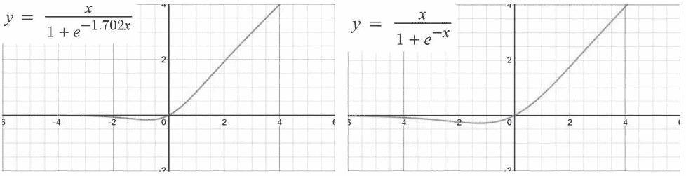
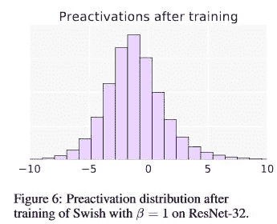
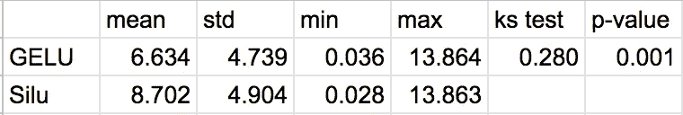
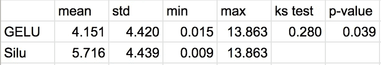
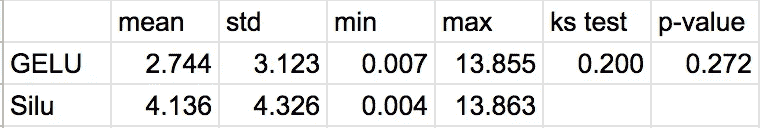
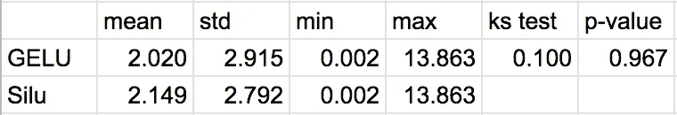

# 论“嗖嗖”与“格鲁”的差异

> 原文：<https://towardsdatascience.com/on-the-disparity-between-swish-and-gelu-1ddde902d64b?source=collection_archive---------10----------------------->

## 为什么两个相似的函数会产生非常不同的结果

由 [Unsplash](https://unsplash.com?utm_source=medium&utm_medium=referral) 上的 [Pietro Jeng](https://unsplash.com/@pietrozj?utm_source=medium&utm_medium=referral) 拍摄

# 介绍

近年来，Swish 已经在几个高性能图像分类模型(例如，Efficient-Net)中取代了 Relu。然而，它并没有在所有的机器学习任务中表现出明显的优势。一个非常相似的激活函数，高斯误差线性单位(GELU)，被用在 OpenAI 的 GPT 中。有趣的是，当对 GELU 使用快速近似时，两种非线性都落在 sigmoid 线性单位的保护伞下。他们唯一的区别是 GELU 的输入是由一个常数因子缩放的。在本文中，我将探讨这两种功能，并阐明为什么在实践中一种功能可能比另一种功能更好。

# 什么是 Swish 和 GELU？

对于本文的其余部分，我将按照他们论文中的建议使用固定权重为 1 的 Swish，但是后面的结论很容易扩展到其他值。

GELU(左)与 Swish-1(右):作者图片

两次激活并排进行，很容易看出它们看起来有多相似。最能区分这类激活的特征是它们的连续非单调凸起。但是这个凸起的意义是什么呢？它实际上允许在输入坐标空间上进行折叠，不同大小的凸起直观地对应于不同大小的折叠。

*我们看到了凹凸的作用，但是它为什么有用呢？*

这种折叠操作实际上可以以多种方式使用。最引人注目的是它解开类的能力，或者更一般地说，简化输入向量空间的能力(如后面所见)。

来源:[1]开放存取档案

我们还可以从 Swish 论文的观察中看出模型正在利用这种操作。在这里，他们注意到，在训练之后，大部分的预激活都落在这种颠簸的范围内。然而，他们对这种行为的分析最终表明，这表明非单调颠簸是 Swish 的一个重要方面。当您想到凹凸启用的折叠操作时，这种行为很容易解释。

# 用 Swish & GELU 学习

有了上面的直觉，我们现在就可以考虑训练时的这些操作，以及它们能学到什么。我提出 GELU 和 Swish-1 网络具有相同的表征能力。直观地说，一个网络类上的任何解决方案都可以转换为另一个网络类的解决方案，只需通过大约 1.702 的因子来缩放权重即可:

格鲁层

Swish-1 层

上述变换将导致相同的决策边界和相同的损失。通过这种方式，我可以说，GELU 网络与其 Swish-1 网络具有相似的损耗情况，不同之处仅在于传播(即，Swish-1 网络的损耗情况是 GELU 网络的拉长/拉伸版本)。在这种情况下，它们相应的峰值和谷值也将是相同的幅度。

*注:需要进行正式分析来巩固该提案*

# 格鲁和路斯的区别

现在我已经在这两者之间建立了一些联系，让我们看看它们在玩具数据集上是如何表现的。为了探索 GELU 和 Swish-1 网络的收敛行为，我在 2 类 circle 数据集上重复训练了 4 层 MLP，每层有 2 个隐藏单元，训练次数不同。所有的网络都在 SGD 上使用 0.001 的学习率进行训练，动量的批量大小为 20。每个班有 200 个样本。报告的统计数据来自给定训练长度的每次试验中达到的最小损失。针对 3000、6000、10000 和 20000 个时期进行了 50 次试验。

3000 个时代:作者图片

6000 个时代:作者图片

10，000 个时代:作者图片

20，000 个时代:作者图片

通过这些结果，我可以看到，在这个玩具数据集上，GELU 平均会比 Swish-1 收敛得更快；但如果给足够的时间，它们会类似地收敛。双样本 Komogorov-Smirnov 检验用于检查两个模型对同一分布的拟合程度。这让我们知道他们的表现有多大的不同。

# 为什么

现在，如果一类模型具有相同的表示能力，为什么它们会比另一类收敛得更快？在这种情况下，最有可能的原因是输入数据和初始化模式。在 PyTorch 线性层的明凯一致初始化之后，网络权重被限制在~ -0.70710 和+0.70710，并且偏差相同。在这个玩具问题上，可以说 GELU 可能比 Swish-1 有更短的距离到达最优解。

然而，尽管简短明了，这种解释并没有考虑到损失景观的形状。如前所述，它们的分布各不相同。然后，在原点，我可以说这两个损失场景是局部相似的。但是，对于给定的初始化，两者不会在相应的位置，因此不能保证景观在局部是相似的。那么，也不能保证它们将沿着相同的相对路径到达相同的相对最小值。在这种情况下，收敛的速度和质量取决于更广泛的因素，这些因素构成了整体损失状况以及如何应对。

虽然这是一个有点乏味的结论，但我希望上述见解将引发有希望的讨论和进一步的研究，以更好地理解我们网络的核心组件以及它们如何协同工作。

# 摘要

在这篇文章中，我介绍了两种类型的 Sigmoid 线性单元，并试图解释它们的行为。我演示了它们显著的非单调区域如何对应于沿着坐标空间的褶皱。虽然这两个函数具有相同的表示能力，但我给出了一个例子，说明它们的收敛行为会因数据和初始化而有所不同。进一步的工作检查损失景观需要在这里作出更广泛的索赔，并继续是一个有趣的方向正在进行的研究。

# 评论

虽然这篇文章把 Swish-1 放在十字线上，但 Sigmoid 加权线性单元的功劳应该归于 Elfwing 等人。

所有的可视化都是通过开源软件 manim 的定制版本以编程方式产生的。

[1](唰)[https://arxiv.org/pdf/1710.05941](https://arxiv.org/pdf/1710.05941.pdf)

[2](西尔)【https://arxiv.org/abs/1702.03118】T2

[3](葛鲁)【https://arxiv.org/abs/1606.08415】T4