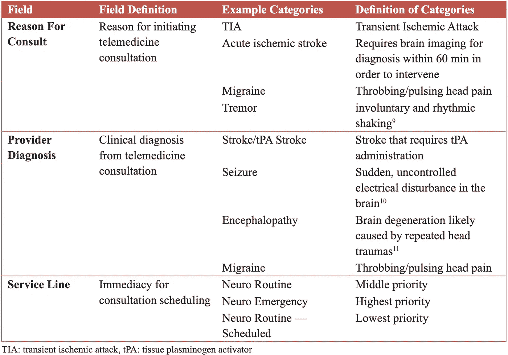

# 远程医疗伦理与服务需求预测模型

> 原文：<https://towardsdatascience.com/on-the-ethics-of-telemedicine-and-predictive-modeling-for-service-demand-d52243db6ac2?source=collection_archive---------41----------------------->

## [公平和偏见](https://towardsdatascience.com/tagged/fairness-and-bias)

## 技术如何补充临床护理决策

图片由[爱德华](https://www.pexels.com/@edward-jenner)在[像素](https://www.pexels.com/photo/woman-having-a-video-call-4031818/)上拍摄

远程医疗很普遍。服务范围从实时咨询、远程监控到电子病历数据传输。

> 远程医疗具有改变医疗保健的潜力，但确保它在伦理上可以接受需要预测和解决潜在的陷阱。

这些问题包括试图采用“一刀切”的实施方式的影响、患者隐私问题、医患关系的恶化，以及认为新的远程医疗服务技术一定有效的诱惑。

# 远程神经病学

紧急远程神经病学护理在规模、影响和有效性方面都有所增长。在美国，中风是导致死亡的主要原因，及时治疗中风会给患者带来更好的结果。远程神经病学为患者提供循证护理，即使委员会认证的神经科医生不在现场。

> 确定特定时间段内远程医疗咨询的人员需求是紧急护理远程医疗服务提供者的决策活动的组成部分。

在这里，我们描述了预测模型的建立，以预测咨询需求，优化远程医疗提供者的人员配备[0]。

# 医学伦理学

伦理学在医学中有很强的地位，反映了义务论的原则，认为一个行为本身的对错取决于它是否符合道德规范，而不是它的后果。这又被功利主义伦理所覆盖，功利主义伦理追求善的最大化，为最大多数人带来最大的幸福。

医学传统是基于病人的权利，医生的职责，并试图平衡不同的利益。在某种程度上，它也反映了亚里士多德对美德和职业价值的解释；广为人知的医学承诺声明包括希波克拉底誓言和世界医学协会的国际医学伦理准则[6]。然而，尽管建立在这些看似稳定的系统之上，医学伦理还是受到科学、社会和政治的更广泛趋势的影响。

# 计算建模

多样化、廉价且可靠的技术的发展和可用性、医疗保健部门的财政压力以及公众对普遍获得高质量医疗保健的日益增长的需求导致了远程医疗服务的快速增长。远程医疗是一个有百年历史的概念，描述了使用信息技术和电信平台提供医疗服务的过程，包括咨询、教育、交换患者记录数据、研究等[1]。最近，远程医疗市场增长预计为 418 亿美元，从 2018 年到 2022 年增长超过 19%，但目前仅满足 0.1%的全球需求[5，6]。

## 交付的分散化

保健服务和保健预算的分散化也鼓励了许多独立的远程保健项目。这些项目通常是小规模、自下而上的，由来自不同学科的卫生专业人员组成的小团队推动，例如，使用当地医生的手术和医院顾问之间的视频链接。据观察，医学传统在大多数此类项目中占主导地位，术语“远程医疗”(相对于“远程医疗”)的流行反映了对医疗保健提供的医学方面的关注。

## 请求预报

在构建一个计算模型来预测随着时间的推移对远程医疗服务的需求，以帮助医院和远程医疗服务提供商更好地了解现场和通过远程医疗医生的分布方面的人员配备需求时，我们认为这是一个过于狭隘的焦点。

我们假设，与我们以某种方式将与远程医疗活动增长相关的特定问题的观点编码到模型中相比，下面执行的需求预测并不尽如人意。然而，我们注意识别和理解哪些客观的、可量化的特征最有助于预测远程医疗服务需求，并讨论将参与方的特定伦理困境包含到之后的预测逻辑中。

## 远程神经病学和远程中风

在本分析中，我们将远程医疗称为利用技术在患者和提供者之间远程提供护理。我们具体分析 ***远程神经病学*** ，这是一种远程医疗的应用，用于治疗需要神经病学专家的患者，例如急性缺血性中风、偏头痛或癫痫。

在这种情况下， ***咨询需求*** 是来自医院的咨询请求的数量和频率。全国的医院都对预测特定时间内(即一周或一个月内)的未来就诊次数感兴趣。这一信息很有价值，因为它影响了过度拥挤、医院人员不足和床位不足等方面的医院成本评估[2]。

***远程治疗*** 和远程神经病学是基于电信的服务，专门用于治疗需要神经科医生护理的中风和神经疾病患者。在一项随机、盲法和前瞻性试验中，远程卒中比传统的电话咨询更具患者特异性、敏感性和更高的预测价值[19]。这些设备通常部署在缺乏全天候中风专业知识的医疗机构[2，13，15]。

## 背景

先前的研究表明，通过比较指定的 NIHSS(美国国立卫生研究院中风)评分，远程卒中服务与床边神经科医生的表现一样可靠，这些评分来自现场神经科医生和通过远程医疗进行治疗的神经科医生[4]。该研究得出结论，通过远程医疗执业的医生可以帮助急诊医生施用组织纤溶酶原激活剂(tPA)，这是一种溶解血栓的药物，用于治疗缺血性中风[2，4，6]。

远程卒中也具有成本效益，在 90 天的范围内，增量成本效益比为 108，363 美元/QALY(质量调整寿命年)，在寿命期内为 2，449 美元/QALY[14]。QALY 是疾病负担的通用衡量标准，包括对生活质量和数量的影响，用于经济评估；一 QALY 相当于完全健康的一年。类似的研究发现，轴辐式远程治疗的成本效益可以增加患者出院人数[16]。

需求预测可以进一步改善这些服务，预测有多少临床医生应该在医院，有多少应该通过远程医疗计划远程提供。

# 以前的建模工作

出于各种原因，许多医院部门都对护理需求预测感兴趣。例如，美国的急诊科(ED)经历了广泛的过度拥挤问题，这对患者护理质量和医院成本产生了负面影响[7]。在 EDs 上使用泊松模型进行的预测研究显示，一周中访问量最高的时间是周一，从早上 7:00 开始增加，直到中午达到峰值，置信度高达 90%[2，18]。另一项研究通过分析预测技术来预测医院床位需求:每小时历史平均值、季节性自回归综合移动平均值(ARIMA)和具有自回归(AR)结构误差项的正弦曲线。ARIMA 表现最好，能够提前 4 到 12 小时估计床位需求[7]。

然而，就目前所知，还没有研究通过预测不同客户的咨询需求来评估远程神经病学实施的成本效益。这是真的，因为远程医疗服务根据各个医院的需求在全国范围内有所不同，这些需求可以是可用床位数、医院类型、基于价值的护理或按服务收费的护理、医院人员配备等。我们在这里提出的研究可以帮助阐明哪些因素影响医院和提供商的远程医疗服务的投资回报。

# 数据和方法

自 2015 年 7 月以来，该数据集拥有 411 家医院和 97，593 次咨询。咨询数量主要集中在中风，其次是短暂性脑缺血发作(TIA)、脑病、癫痫发作和需要 tPA 给药的中风(组织纤溶酶原激活剂，tPA 中风)。

虽然不太常见，但 tPA 卒中是临床上最优先考虑的。医院客户的床位数量从 10 张到 1432 张不等。从地理上看，数据显示东南部的医院比例更高，约占客户总数的 35%。它们在*图 1* 中，显示了用于运行模型的字段。在远程神经病学领域，约有 53 000 名女性接受了咨询，而男性为 43 000 人，女性占 55%。由于咨询的数量取决于提供者的诊断，绝大多数咨询是基于中风，其次是 TIA，然后是 tPA 中风，后者更严重且危及生命。

***图 1****:**数据集中表示的各种医院*

*tPA 给药与包括性别和年龄在内的多种因素的关系是高度相关的。尽管性别之间没有相关关系，但年龄和 tPA 之间的关系符合正态分布模式(*图 2* )。*

****

***图 2、图 3** :按患者年龄(左)和提供者诊断(右)分列的远程医疗咨询数量*

*数据显示，tPA 给药主要集中在新泽西州，为 278 例，其次是宾夕法尼亚州，为 165 例(*图 4* )。有趣的是，尽管纽约对远程神经病学有相似的需求，但其 tPA 管理机构的数量还不到北卡罗琳或新泽西的一半。*

****

***图 4、图 5** :按州(左)和患者年龄(右)列出的 tPA 管理局的咨询次数*

*使用多项式回归拟合，tPA 给药和一年中的月份遵循三次关系，相关系数( *r* 值)为 0.76。*

**

***图 6:** tPA 给药根据一年中的时间多项式变化*

# *结果*

*OLS 线性回归和多项式回归模型用于发现特征和需求之间的强相关性。岭回归和套索也在数据集上进行测试，以找到最佳拟合模型。*

*岭回归用于通过正则化项微调模型的复杂性，而 lasso 回归通过强制回归系数的绝对值之和小于固定值来适应稀疏数据，导致某些系数被设置为零，并将问题简化为不包括这些系数的更简单的模型[12]。*

*下面的图表描述了在大约一年的时间内，所有合作医院的每周和每月的远程医疗服务需求。每周需求(*图 7* )似乎集中在利用远程医疗服务的 850-950 名患者。这些计数以大约 1.5 周为基础围绕这个中心振荡，并且在假期和新年期间需求会略有上升。*

**

***图 7** :每周远程医疗服务需求*

*下面的月度需求图(*图 8* )证实了上述观察结果，其中每个月观察到一次或两次下降和峰值(图中左侧和右侧突然向下倾斜的线是由于所提供的数据在月中开始和结束)。*

**

***图 8** :每月远程医疗服务需求*

*对数据集进行了 OLS 线性回归和多项式回归(*图 9* )，其中生成的趋势分别用绿色虚线和红色实线表示，覆盖在每周汇总的需求散点图上。*

*OLS 回归输出如下结果，直线斜率为 0.21，*y*-截距为 845.71， *r* 值为 0.04。输出的低相关系数促使运行具有额外输入变量的模型。在用各种阶次的拟合多项式进行实验之后，执行训练、测试和交叉验证以生成准确度分数，由于系统中设置了增强的独立变量，准确度分数在每次运行之间不再高度可变。*

**

***图 9** :每周总需求的线性和多项式拟合*

*以下特征用于训练新的回归模型:“时区”、“就诊开始”、“州”、“性别”、“年龄”、“服务线”、“咨询原因”、“提供者诊断”、“医院类型”、“床位数”、“中风中心”、“高级综合中风中心”和总急诊室就诊数(*图 10* )。*

**

***图 10。**实测需求和预测需求之间关系的可视化*

*对这些特征进行线性回归，大多数数据点与预测值匹配，其中 *r* = 0.78 ( *表 1* )。对相同的特征应用套索回归， *r* = 0.77，这比 OLS 线性回归更差。所有输入的岭回归产生了稍好的结果，r*= 0.78(*表 2* )，总体表现最好。**

****

****表 1** :线性、岭和套索回归模型的结果**

**仅使用“供应商诊断”运行每周预测线性回归模型，该模型得出 *r* = 0.74。使用具有服务线的相同模型代替“供应商诊断”，准确度增加到 *r* = 0.77。甚至与训练所有特征以及 *r* = 0.79 ( *表 1* )相比，仅具有“咨询原因”的每周预测表现最佳。有趣的是，带有“咨询原因”和“供应商诊断”的每周预测将准确率提高到了 *r* = 0.81。预计“咨询原因”和“提供者诊断”将产生强有力的结果，但令人惊讶的是，“服务线”也是一个同样好的预测因素。**

****

****表 2** :数据分析中使用的关键字段、示例字段和描述**

**该数据集的稀疏性使得目标变量的微小变化会导致计算权重的巨大差异。下面的图分别用于岭回归(*图 11* )和套索(*图 12* )，设置了某种正则化(α)来减少这种变化。**

**当α非常大时，正则化效应支配平方损失函数，导致系数趋于零。在路径的末端，随着α趋向于零，解趋向于普通最小二乘法，系数表现出大的振荡。在输出为这项研究建立的模型的准确性统计数据时，我们设置了一个α值来获得最高分。**

********

****图 11、图 12** :作为正则化函数的山脊(左)和套索(右)系数**

# **计算结论**

**该分析旨在合理预测未来的咨询需求，以优化医院人员配置并分析双方的投资回报，并证明远程医疗咨询请求的周数或月数与预测的咨询次数之间存在很强的相关性。我们已经发现，输入特征的某些组合，包括医院特征和某些咨询特征(即“提供者诊断”、“服务线”和“咨询原因”)，产生预测的远程医疗咨询需求，总体准确率约为 78%。**

## **模型精度提高**

**正在进行的工作包括提高当前预测模型的准确性，方法是在模型中添加按服务项目分类、咨询原因和供应商诊断组件，以便进一步细分所提供的预测需求输出。我们将继续解决数据集的局限性，其中包括数据集完全由来自一个远程医疗提供者及其客户的数据组成，仅在一年的时间内进行一次实践。**

## **数据限制**

**理想情况下，我们希望获得更多信息，了解远程医疗在各个医院的咨询中的使用程度、患者人口统计数据(以分析哪些医院获得了更大的远程医疗服务需求，以及这是否与患者人口统计相关)，以及哪些合作医院专门从事哪些服务项目。**

**注意到一年中需求的上升和下降并不显著，我们希望在模型中建立一个异常检测组件，以专门搜索在特定时间点上哪些点和微趋势最影响远程医疗服务需求。我们还寻求扩大数据集，扩大训练和测试集的规模，以进一步解决预测模型的优化问题。**

## **解决伦理困境**

**随着远程医疗领域的进一步发展，我们也认识到，远程保健中伦理问题的处理需要被视为超越个别项目或临床情况，并被视为与整个社会和社会中各种利益群体的关系。**

**我们注意到远程医疗的应用给参与者带来了许多实际的道德难题。例子包括远程医疗服务对医生-病人关系的影响、医生和病人之间的利益平衡、可及性问题、数据安全和病人保密、创新但未经证实的技术的使用、稀缺资源和机会成本的分配、医疗实践、就业和工作满意度。**

## **频繁的服务评估**

**也许这些问题的出现是因为远程医疗应用涉及到来自多个学科的伦理和评估传统，导致了相互冲突的价值观和不可行或不完整的评估框架。这就是为什么远程医疗服务应该越来越多地从增强患者和社区的能力、促进社会凝聚力和服务提供民主化的角度进行评估，而不是加剧社会排斥(信息丰富和信息贫乏)和医疗服务的非人性化(提供治疗，而不是护理)[4，6]。**

**我们认为远程医疗不仅需要被理解为一种医疗技术或治疗方法，还需要被理解为一种真正改善健康的服务。许多远程保健的支持者认为，它提供了一种方式来遵循为个人尽最大努力的义务和以尽可能好的方式为全体人口的利益分配有限资源的功利主义目标，并且这种趋势可以相对容易地通过计算建模。然而，对于预测远程医疗服务需求的未来工作，我们主张在评估远程医疗的不断变化的前景时，采用更加亚里士多德式的方法，重点关注健康人过上满足生活的成就。**

# **道德考量**

**值得注意的是，远程医疗的发展暴露了几个问题:涉及患者数据的隐私问题，数据库中存在不准确和过时的数据，安全漏洞，信息过载，缺乏用户友好性，以及链接患者医疗和个人信息以实现个人记录互操作性的标准薄弱[6]。新的应用程序如何适应医疗保健服务和健康信息基础设施的变化，以及在线信息的质量和准确性，也是人们深切关注的问题。**

## **患者数据隐私**

**远程医疗的发展寻求“通过使用信息和通信技术来改善本地、区域和全球的卫生保健”[8]。然而，在许多远程医疗使用的情况下，病人并不能决定是传统医疗还是远程医疗更适合他们的需要，也不知道他们所关心的问题是如何融入这些技术的。因此，可能会出现与开发这些系统的人(例如 [SOC Telemed](https://www.soctelemed.com/) ，我们在本报告中分析其服务需求数据的健康咨询公司)的意图和他们寻求的目标相关的伦理问题。**

**远程医疗服务的设计可能比病人或老年人更有利于服务提供者和临床医生，这要求更多地关注制定伦理设计和评估原则。我们考虑了几个额外的研究途径:了解如何以提供者为中心与以患者为中心的远程医疗服务，向远程服务的转变是否以牺牲传统护理的核心价值为代价促进了合理性和效率，如何最好地处理新技术取代人类接触的问题，以及在何种程度上远程医疗服务的目的不是为了改善健康或福祉，而是为了创造市场需求。**

## **护理质量**

**此外，经常会出现远程医疗护理无意中导致护理质量下降的情况。例如，在医生参与为偏远社区提供无障碍环境和解决医院过度拥挤或人员不足问题的举措的情况下，远离患者并被来自多个来源的大量报告和医学图像淹没会导致误诊[15]。**

**此外，远程临床医生在没有直接了解患者的情况下解读信息时，往往会缺乏信息，这可能会导致处方不完善。在这种情况下，知情同意也成为一个道德挑战。虽然在药物试验等情况下通常理解被告知(在医学意义上，了解益处和负担)，但新的远程保健技术涉及新类型的风险，通常是无法预测的。**

## **标准化服务评估**

**实际上，设计远程医疗服务很困难，因为不同的人对同一技术赋予不同的含义。(例如，患者可能会认为基于电话的饮食和锻炼咨询计划是服务公司降低成本和减少与医生联系的一种方式，而其他用户可能会将该应用视为依赖人类顾问的一种赋权替代方式。因此，评估远程保健服务的标准是必要的；评估不仅应包括技术和经济方面，还应包括新技术的伦理和社会方面，以解决对个人福祉的长期影响。**

**总之，技术应该基于医疗保健实践的基本价值观——同情、护理和人道——来补充临床和护理决策，而不是将其作为目的来追求。**

# **参考**

**[0] Kumar，a .，Hung，n .，Wu，y .，Baek，r .，& Gupta，A. (2020).远程医疗服务需求的预测建模。*今日远程医疗*、 *5* (2)。[https://doi.org/10.30953/tmt.v5.186](https://doi.org/10.30953/tmt.v5.186)**

**[1] Moore，M. (1999)。远程医疗的发展。*下一代计算机系统*，15(2)，245–254。**

**[2] Schwamm，L. H .，Rosenthal，E. S .，Hirshberg，a .，Schaefer，P. W .，Little，E. A .，Kvedar，J. C .，Levine，S. R. (2004).为急诊科评估急性卒中提供虚拟远程卒中支持。*学术急救医学*，11(11)，1193-1197。**

**[3]美国卒中协会。(n.d .)。关于中风。检索自**

**[4] Hess，D. C .，Wang，s .，Hamilton，w .，Lee，s .，Pardue，c .，Waller，J. L .，Adams，R. J. (2005 年)。REACH:农村远程卒中网络的临床可行性。*笔画*，36(9)，2018–2020。**

**[5]伍顿，R. *为发展中国家提供远程医疗支持*。远程医疗和远程护理杂志，14(3)，109–114，2008。**

**[6]美国医院协会。远程保健:帮助医院提供经济有效的护理。*发布简报*，2016 年 1-7 日。**

**[7] Schweigler，L. M .，Desmond，J. S .，McCarthy，M. L .，Bukowski，K. J .，Ionides，E. L .，Younger，J. G. (2009 年)。急诊拥挤预测模型。*学术急救医学*，16(4)，301–308。**

**[8]斯豪滕，p .更好的患者预测和日程优化改善患者护理并控制人员成本，2014。**

**[9]梅奥诊所。(2016 年 4 月 20 日)。慢性创伤性脑病。检索于 2018 年 5 月 15 日，来自[https://www . mayo clinic . org/diseases-conditions/chronic-traumatic-脑病/症状-原因/syc-20370921](https://www.mayoclinic.org/diseases-conditions/chronic-traumatic- encephalopathy/symptoms-causes/syc-20370921)**

**10 梅奥诊所。(2018 年 03 月 03 日)。癫痫发作。检索于 2018 年 5 月 15 日，来自[https://www . mayo clinic . org/diseases-conditions/癫痫/症状-原因/syc-20365711](https://www.mayoclinic.org/diseases-conditions/seizure/symptoms-causes/syc-20365711)**

**11 梅奥诊所。(2016 年 4 月 20 日)。慢性创伤性脑病。检索于 2018 年 5 月 15 日，来自[https://www . mayo clinic . org/diseases-conditions/chronic-traumatic-脑病/症状-原因/syc-20370921](https://www.mayoclinic.org/diseases-conditions/chronic-traumatic-encephalopathy/symptoms-causes/syc-20370921)**

**[12]范德普拉斯法官(未注明)。深度:线性回归。检索自[https://jakevdp . github . io/python datascience handbook/05.06-linear-regression . html](https://jakevdp.github.io/PythonDataScienceHandbook/05.06-linear-regression.html)**

**[13]亚当斯，H. P .，德尔佐波，g .，艾伯特，M. J .，巴特，D. L .，布拉斯，l .，弗尔兰，a .，莱登，P. D. (2007)。成人缺血性卒中早期治疗指南。*循环*，115(20)，e478-e534。**

**[14] Nelson，R. E .，Saltzman，G. M .，Skalabrin，E. J .，Demaerschalk，B. M .，Majersik，J. J. (2011 年)。远程卒中治疗急性缺血性卒中的成本效益。*神经病学*，77(17)，1590–1598。**

**[15]辛格，r .，马蒂亚森，l .，米什拉，A. (2015 年)。技术创新中的组织路径构成:来自农村远程医疗的证据。 *Mis 季刊*，第 39 卷第 3 期。**

**[16] Switzer，J. A .，Demaerschalk，B. M .，Xie，j .，Fan，l .，Villa，K. F .，Wu，E. Q. (2012 年)。从医院角度看轴辐式远程卒中网络治疗急性缺血性卒中的成本效益。*循环:心血管质量和结果*，CIRCOUTCOMES-112。**

**[17] Ali，S. F .，Viswanathan，a .，Singhal，A. B .，Rost，N. S .，Forducey，P. G .，Davis，L. W .，Schwamm，L. H. (2014 年)。远程卒中模拟(TM)-评分:一种用于识别远程卒中网络中评估的卒中模拟的预测规则。*美国心脏协会杂志*，3(3)，e000838。**

**[18] McCarthy，M. L .，Zeger，S. L .，Ding，r .，Aronsky，d .，Hoot，N. R .，Kelen，G. D. (2008 年)。预测急诊服务需求的挑战。*学术急救医学*，15(4)，337–346。**

**[19] Capampangan，D. J .，Wellik，K. E .，Bobrow，B. J .，Aguilar，M. I .，Ingall，T. J .，Kiernan，T. E .，Demaerschalk，B. M. (2009 年)。远程急诊卒中会诊的远程医疗与电话的比较:一个重要的评价主题。*神经学家*，15(3)，163–166。**

**[20] Ali，S. F .，Hubert，G. J .，Switzer，J. A .，Majersik，J. J .，Backhaus，r .，Shepard，L. W .，Schwamm，L. H. (2018 年)。验证远程卒中模拟评分:通过远程卒中网络评估识别卒中模拟的预测规则。*冲程*，49(3)，688–692。**