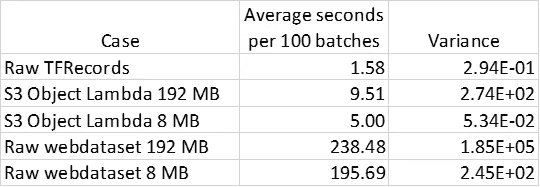

# 使用亚马逊 S3 对象 Lambda 动态转换训练数据

> 原文：<https://towardsdatascience.com/on-the-fly-transformation-of-training-data-with-amazon-s3-object-lambda-9402e400f912?source=collection_archive---------16----------------------->

## [理解大数据](https://towardsdatascience.com/tagged/making-sense-of-big-data)

## 通过在检索期间处理数据，减少训练实例的 CPU 负载


由[艾琳·明斯金](https://unsplash.com/@erinw?utm_source=medium&utm_medium=referral)在 [Unsplash](https://unsplash.com?utm_source=medium&utm_medium=referral) 上拍摄的照片

两个月前(2021 年 3 月)AWS [宣布](https://aws.amazon.com/blogs/aws/introducing-amazon-s3-object-lambda-use-your-code-to-process-data-as-it-is-being-retrieved-from-s3/)亚马逊 S3 对象λ功能，这一新功能使人们能够在数据到达调用应用程序之前处理从[亚马逊 S3](https://www.google.com/aclk?sa=L&ai=DChcSEwiR2tuq2rXwAhUEnNUKHYnoAWIYABAAGgJ3cw&ae=2&sig=AOD64_0mYO_J-0ovo666nDL7ZUOBOjtcGA&q&adurl&ved=2ahUKEwih0dKq2rXwAhVQyxoKHZLnBi0Q0Qx6BAgCEAE) 检索的数据。[公告](https://aws.amazon.com/blogs/aws/introducing-amazon-s3-object-lambda-use-your-code-to-process-data-as-it-is-being-retrieved-from-s3/)强调了如何使用该功能为不同的客户提供不同的数据视图，并描述了其在复杂性和成本方面优于其他解决方案的优势:

> 为了向多个应用程序提供不同的数据视图，目前有两种选择。您要么创建、存储和维护额外的数据衍生副本，以便每个应用程序都有自己的自定义数据集，要么构建和管理基础架构作为 S3 前端的代理层，以便根据请求拦截和处理数据。这两种选择都增加了复杂性和成本，所以 S3 团队决定建立一个更好的解决方案。
> 
> —引自功能发布。

这一新功能的前景让我们兴奋不已，我们决定评估它在深度学习培训场景中的使用。

# 使用亚马逊 S3 对象 Lambda 训练数据转换

我们将评估的训练场景是，我们有一个非常大的训练数据集，驻留在[亚马逊 S3](https://aws.amazon.com/s3/) 中，我们将它流式传输到一个或多个训练实例上的一个或多个 GPU 上运行的训练会话中。在典型的设置中，输入的训练数据在被馈送到 GPU 之前，可能在训练设备的 CPU 核心上经历一系列的变换、扩充、扭曲、混洗、批处理和其他操作。这一系列操作通常被称为*预处理流水线*。计算密集型预处理管道可能会导致训练管道中的 *CPU 瓶颈*，这是一种 GPU 在等待 CPU 处理时未得到充分利用的情况。这种常见的情况是非常不可取的；GPU 是最昂贵的培训资源，我们的目标应该是最大限度地利用它，以便将我们的整体培训成本降至最低。

在之前的一篇博文[中，我们扩展了数据预处理瓶颈，并回顾了一些克服它们的方法。尽管您做了所有的尝试，您可能会发现您的 CPU 处理继续使您的可用资源负担过重。通过为我们提供机会，在训练数据到达设备之前对其进行一些处理，亚马逊 S3 Object Lambda 功能看起来就像是医生订购的一样。](/overcoming-data-preprocessing-bottlenecks-with-tensorflow-data-service-nvidia-dali-and-other-d6321917f851)

我选择展示的具体用例是，我们正在对一个 TensorFlow 模型进行训练，该模型基于以[*web dataset*](https://github.com/tmbdev/webdataset)*文件格式存储在亚马逊 S3 的训练数据。[*web dataset*](https://github.com/tmbdev/webdataset)*是一种文件格式，专为使用大型数据集进行训练而设计，其中的样本存储为 POSIX tar 档案的集合。通过使用 [*webdataset*](https://github.com/tmbdev/webdataset) ，样本特征可以以其原始格式进行存储和处理，例如图像为 *jpg* s，音频文件为 *wavs，* python 结构为 *pkl* 文件等。关于 webdataset 的更多信息，请参见 Github 项目页面、pip 安装页面和这篇文章。虽然 *webdataset* 包包含用于定义 pytorch 兼容数据集的 API，但在撰写本文时，*没有*包含对 TensorFlow 的内置支持。为了与 TensorFlow 培训课程保持一致，我们将动态执行*数据到 TensorFlow 友好[*TF record*](https://www.tensorflow.org/tutorials/load_data/tfrecord)*格式的*转换。这个用例的选择有些武断。人们可以很容易地选择用任何其他类型的数据转换来评估亚马逊 S3 对象 Lambda。***

**为了评估亚马逊 S3 对象 Lambda 对我们所选用例的适用性，我们需要考虑替代解决方案。以下是一些选项:**

1.  **在 S3 创建并维护一个 *TFRecord* 格式的数据集副本，用于模型训练。这种方法有几个缺点，包括需要额外的存储资源，以及在底层数据发生变化时需要重新创建训练数据。**
2.  **将 *webdataset* 格式的数据输入训练设备。建立一个接收该格式的 [*TensorFlow* 数据集](https://www.tensorflow.org/api_docs/python/tf/data/Dataset?version=nightly)，或者在训练设备上进行格式转换。这种方法的危险在于增加了对 CPU 资源的争夺，并有可能导致 GPU 利用率不足。**
3.  **创建一个专用的 CPU 核心集群，该集群将从 S3 获取数据，执行格式转换，并将结果提供给训练设备。**

**我们对在这个场景中使用亚马逊 S3 对象 Lambda 的评估将涵盖两个方面:**

1.  ****成本**——与其他选择相比，使用亚马逊 S3 对象 Lambda 的成本意味着什么？**
2.  ****训练吞吐量** —使用亚马逊 S3 对象 Lambda 如何影响训练吞吐量(通过每秒输入模型的样本数来衡量)？**

**虽然我写这篇文章的个人兴趣是演示和评估该特性的性能，但由于马上就会明白的原因，我们将从讨论使用该特性的成本影响开始。然后，我们将演示使用亚马逊 S3 对象 Lambda 将存储在[*web dataset*](https://github.com/tmbdev/webdataset)*格式中的数据转换为 *TFRecord* 格式。为了完成我们的评估，我们将比较使用亚马逊 S3 对象 Lambda 对训练吞吐量的影响和一些替代解决方案。***

**我要感谢我的同事马克斯·拉宾，他帮助我建立并运行了这篇文章中描述的实验。**

# **亚马逊 S3 对象 Lambda 成本分析**

**使用亚马逊 S3 Object Lambda 的费用可以在[亚马逊 S3 定价](https://aws.amazon.com/s3/pricing/)页面的 S3 Object Lambda 标签下找到。如前所述，该特性的成本由三部分组成:从亚马逊 S3 获取数据的典型成本、运行 AWS Lambda 函数的成本，以及基于传递给调用应用程序的数据量的额外成本。以下是定价页面的摘录(2021 年 5 月 8 日拍摄)。**

> **当您使用 S3 对象 Lambda 时，您的 S3 GET 请求会调用您定义的 AWS Lambda 函数。这个函数将处理您的数据，并将处理后的对象返回给您的应用程序。在美国东部(N. Virginia)地区，您需要为 AWS Lambda 功能的持续时间支付 0.0000167 美元/GB/秒，并为每 1M AWS Lambda 请求支付 0.20 美元。对于 Lambda 函数调用的所有 S3 GET 请求，每 1000 个请求您还需要支付 0.0004 美元，对于 S3 对象 Lambda 返回到您的应用程序的数据，每 GB 需要支付 0.005 美元。**
> 
> **—摘自[https://aws.amazon.com/s3/pricing/](https://aws.amazon.com/s3/pricing/)**

**假设我们的数据集大小为 100 TB，分成 1，000，000 个文件，每个文件大小为 100 MB。单次数据遍历(一个*时期*)的典型成本仅为 **$0.40** 。通过亚马逊 S3 对象 Lambda 提取数据的额外成本将是 100，000 x 0.005 = **$500** ！而且这还是在考虑运行 Lambda 函数本身的成本之前。显然，应该全面评估这一成本——即它如何影响总体培训成本。但是，除非有任何算术错误(不应该排除)，否则该功能的当前定价模型似乎不适合机器学习等数据密集型应用。至少，它保证了对替代解决方案的成本进行更仔细的研究。**

****在亚马逊 S3 创建和维护数据的衍生产品**:尽管这种解决方案不方便且“丑陋”，但它可能更具成本效益。数据存储相对便宜，虽然我们仍然需要计算资源来应用数据转换，但是每个训练任务只运行一次(而不是每次数据遍历都运行)。问题是这种解决方案并不总是一种选择。通常，深度学习训练会话需要对输入数据应用随机增强。虽然通过随机转换创建数据的许多副本是可能的，但这是非常不切实际的。并且这种固定扰动的集合尽管可能很大，但可能不会对训练产生与在预处理流水线上应用随机操作相同的影响。**

****转换训练设备上的数据**:尽管我们希望最大限度地利用 GPU 资源，但我们的成本分析迫使我们重新审视资源利用不足的代价。显然，成本将取决于许多因素，包括:1 .训练器械的种类和数量。遍历数据所需的时间。让我们考虑如何评估成本的以下示例:假设我们的 GPU 培训资源每小时花费 28 美元，我们的数据转换将利用率从 100%降至 25%，遍历 100 TB 数据需要 20 小时。我们发现，在训练设备上运行转换的每次数据遍历的额外成本是 0.75 x 20 x 28 = 420 美元。在这个例子中，成本低于亚马逊 S3 对象 Lambda 函数的成本，但不难理解这是一个不太有吸引力的解决方案。**

****在专用 CPU 集群**上执行数据转换:在前面提到的[关于解决 CPU 计算瓶颈的帖子](/overcoming-data-preprocessing-bottlenecks-with-tensorflow-data-service-nvidia-dali-and-other-d6321917f851)中，我们展示了使用 [tf.data 服务](https://www.tensorflow.org/api_docs/python/tf/data/experimental/service)将数据预处理卸载到辅助 CPU 机器上。如果现有的框架如 [tf.data service](https://www.tensorflow.org/api_docs/python/tf/data/experimental/service) 或 [AIStore](https://github.com/NVIDIA/aistore) 支持你的数据转换需求，那么使用它可能比亚马逊 S3 Object Lambda 更具成本效益。否则，您可能需要设计和创建自己的解决方案。虽然这种努力从长远来看可能会有好处，但无论怎么想象，这都不是一件小事。**

**我们在此部分执行的成本分析不完整。全面的成本评估应考虑运行 AWS Lambda 功能的成本。它还应该考虑使用亚马逊 S3 对象 Lambda 如何影响训练吞吐量，从而影响整体训练运行时间和成本。以下是更多相关信息。**

# **构建亚马逊 S3 对象 Lambda 解决方案**

**正如在 [AWS 文档](https://docs.aws.amazon.com/AmazonS3/latest/userguide/transforming-objects.html)中描述的，设置亚马逊 S3 对象 Lambda 需要两个主要步骤:[定义和部署 AWS Lambda 函数](https://docs.aws.amazon.com/AmazonS3/latest/userguide/olap-writing-lambda.html)和[创建对象 Lambda 访问点](https://docs.aws.amazon.com/AmazonS3/latest/userguide/olap-create.html)。我们假设训练数据已经以 *webdataset* 格式准备好了。你可以在本文的附录中找到一个数据创建的例子。**

## **AWS Lambda 函数创建**

**我们选择使用 [AWS 无服务器应用程序模型](https://docs.aws.amazon.com/serverless-application-model/index.html) (AWS SAM)来定义、构建和部署 Lambda 函数。类似于[“Hello World”教程](https://docs.aws.amazon.com/serverless-application-model/latest/developerguide/serverless-getting-started-hello-world.html)中描述的例子，我们创建了一个名为 *convert_wds2tf* 的 Lambda 函数。该函数的定义由四部分组成:**

1.  **一个 *TFRecord* 作家类， *TFRecordWriter* ，改编自[此处](https://github.com/vahidk/tfrecord/blob/master/tfrecord/writer.py)。**
2.  **一个 *webdataset* 文件解析器， *wds_iter。***
3.  **一个格式转换器类，接收一个 *wds_iter* 并返回相应的 *TFRecord* 文件。转换器可以返回单个 *TFRecord* 文件(通过 *read* 函数)或一个遍历 *TFRecord* 样本块的迭代器。当前的 *__iter__* 实现被硬编码为每个块返回 100 个样本。**
4.  **从 S3 拉 *webdataset* 文件的 *lambda_handler* 函数，创建一个 *wds_iter* 用于遍历它，并使用*转换器*类将其转换为 *TFRecord* 输出。**

```
**import boto3, requests, struct, imageio, io, re
import tarfile, crc32c, numpy as np
from botocore.config import Config
# python code generated by the [protocol buffer compiler](https://developers.google.com/protocol-buffers/docs/reference/python-generated#invocation)
from pb import example_pb2# TFRecordWriter adapted from [here](https://github.com/vahidk/tfrecord/blob/master/tfrecord/writer.py)
class **TFRecordWriter**:
    def __init__(self, data_path=None,file_obj=None):
        self.file = open(data_path, "wb") if data_path 
                                          else file_obj def write(self, datum):
        record = TFRecordWriter.serialize_tf_example(datum)
        length = len(record)
        length_bytes = struct.pack("<Q", length)
        self.file.write(length_bytes)
        self.file.write(TFRecordWriter.masked_crc(length_bytes))
        self.file.write(record)
        self.file.write(TFRecordWriter.masked_crc(record)) @staticmethod
    def masked_crc(data):
        mask = 0xa282ead8
        crc = crc32c.crc32c(data)
        masked = ((crc >> 15) | (crc << 17)) + mask
        masked = np.uint32(masked)
        masked_bytes = struct.pack("<I", masked)
        return masked_bytes @staticmethod
    def serialize_tf_example(datum):
        feature_map = {
            "byte": lambda f: example_pb2.Feature(
                bytes_list=example_pb2.BytesList(value=f)),
            "int": lambda f: example_pb2.Feature(
                int64_list=example_pb2.Int64List(value=f))
        } def serialize(value, dtype):
            if not isinstance(value, (list, tuple, np.ndarray)):
                value = [value]
            return feature_map[dtype](value) features = {key: serialize(value, dtype)
                    for key, (value, dtype) in datum.items()}
        example_proto = example_pb2.Example(
            features=example_pb2.Features(feature=features))
        return example_proto.SerializeToString()# iterate over a wds dataset
def **wds_iter**(path):
    def my_png_decoder(value):
        return imageio.imread(io.BytesIO(value))
    def my_cls_decoder(value):
        return int(value.decode("utf-8").strip('][')) stream = tarfile.open(fileobj=path, mode="r|*")
    record = {}
    count = 0
    for tarinfo in stream:
        filename = tarinfo.name
        key, suffix = re.split('\.',filename)
        if not record or record['key'] != key:
            if 'data' in record and 'label' in record:
                count += 1
                yield record['data'], record['label']
            record = {'key':key}
        value = stream.extractfile(tarinfo).read()
        if suffix == 'cls':
            record['label'] = int(
                            value.decode("utf-8").strip(']['))
        elif suffix == 'png':
            record['data'] = imageio.imread(io.BytesIO(value))
    if 'data' in record and 'label' in record:
        yield record['data'], record['label']class **Converter**:
    def __init__(self, dataset):
        self.dataset = dataset def read(self, size=None):
        transformed_object = io.BytesIO()
        record_writer = TFRecordWriter(
                         file_obj=transformed_object)
        for data, label in self.dataset:
            record_writer.write({"image": (data.tobytes(),"byte"), 
                                 "label": (label,"int")})
        transformed_object.seek(0)
        return transformed_object.read() def __iter__(self):
        transformed_object = io.BytesIO()
        record_writer = TFRecordWriter(
                             file_obj=transformed_object)
        count = 0
        for data, label in self.dataset:
            if count>0 and count%100 == 0:
                transformed_object.seek(0)
                yield transformed_object.read()
                transformed_object = io.BytesIO()
                record_writer = TFRecordWriter(
                          file_obj=transformed_object)
            record_writer.write({"image": (data.tobytes(),"byte"),
                                 "label": (label, "int")})
            count+=1
        transformed_object.seek(0)
        yield transformed_object.read()def **lambda_handler**(event, context):
    **stream_chunks** = False
    object_get_context = event["getObjectContext"]
    request_route = object_get_context["outputRoute"]
    request_token = object_get_context["outputToken"]
    s3_url = object_get_context["inputS3Url"]
    # Get object from S3
    r = requests.get(s3_url, stream=**stream_chunks**)
    original_object = r.content
    # Transform object
    convert_to_tfrecord2 = Converter(                                      
                       wds_iter(io.BytesIO(original_object)))
    if **stream_chunks**:
        s3 = boto3.client('s3', 
                  config=Config(
                           signature_version='s3v4', 
                           s3={'payload_signing_enabled': False}))
        body = convert_to_tfrecord2
    else:
        s3 = boto3.client('s3')
        body = convert_to_tfrecord2.read()
    # Write object back to S3 Object Lambda
    s3.write_get_object_response(
        Body=body,
        RequestRoute=request_route,
        RequestToken=request_token
    )
    return {'status_code': 200}**
```

**我们的实现演示了通过*stream _ chunks**标志*将分块数据流回调用应用程序的选项。*在许多情况下，您会发现这将提高解决方案的效率，减少延迟，提高吞吐量。由于我们的客户端应用程序将使用 *TensorFlow* 来读取数据文件，并且 *TensorFlow* 目前不支持来自 S3 的分块数据流，因此我们将 *stream_chunks* 设置为 *false。****

**由于这段代码是为了演示的目的而创建的，所以我们没有投资于优化实现。优化 Lambda 函数对于降低成本和潜在减少延迟都非常重要。**

## **按范围提取数据文件**

**亚马逊 S3 提供的一个重要特性是一个用于在数据文件中提取特定字节范围的 API。具体来说，该功能支持*多部分数据下载*，其中数据文件被分成多个部分并行下载。Needles 说，这可以对下载速度产生有意义的影响，进而对数据吞吐量产生影响。如[用户指南](https://docs.aws.amazon.com/AmazonS3/latest/userguide/olap-writing-lambda.html#range-get-olap)中所述，S3 对象*支持根据*范围*和*零件号*检索数据，尽管这需要特殊处理。在数据转换的情况下，正如我们在这里演示的，支持对对象内任意范围的访问可能是非常低效的。一个简单的实现需要转换整个数据文件(或者至少是所有数据，直到我们生成请求的范围)。更有效的实现要求我们能够将 Lambda 响应的范围映射到源文件的范围。这样的映射并不总是存在的。即使这样，除非调用应用程序被编程为请求与数据样本边界完全一致的范围，否则我们最终仍然会执行比拉动整个对象更多的工作。我们的例子*不*包括对拉取特定范围的支持。***

## *S3 对象 Lambda 客户端应用程序示例*

*在下面的例子中，我们展示了如何编程一个 tensor flow[TFRecordDataset](https://www.tensorflow.org/api_docs/python/tf/data/TFRecordDataset)，它通过对象 Lambda 端点指向 S3 对象。因为我们只对测量训练数据吞吐量感兴趣，所以我们放弃构建训练模型，而是直接在数据集上迭代。*

```
*import os, tensorflow astf
#replace with your access_point and paths in s3
**ap_path**='s3://arn:aws:s3-object-lambda:us-east-1:<id>:accesspoint'
**path_to_s3_wds_folder**='<path-to-webdataset-folder>'
**path_to_s3_tfr_folder**='<path-to-tfrecord-folder>'
**s3_path_to_wds**='s3://'+path_to_s3_wds_folder
**s3_path_to_tfr**='s3://'+path_to_s3_tfr_folder
**ap_path_to_wds**=os.path.join(ap_path,path_to_s3_wds_folder)def get_dataset(batch_size, folder_path):
    autotune = tf.data.experimental.AUTOTUNE
    def parse_image_function(example_proto):
        image_feature_description = {
            'image': tf.io.FixedLenFeature([], tf.string),
            'label': tf.io.FixedLenFeature([], tf.int64)
        }
        features = tf.io.parse_single_example(
                   example_proto, image_feature_description)
        image = tf.io.decode_raw(features['image'], tf.uint8)
        image.set_shape([3 * 32 * 32])
        image = tf.reshape(image, [32, 32, 3])
        label = tf.cast(features['label'], tf.int32)
        return image, label options = tf.data.Options()
    options.experimental_deterministic = False
    records = tf.data.Dataset.list_files(folder_path + '/*',
                            shuffle=True).with_options(options) ds = tf.data.TFRecordDataset(records, 
                           num_parallel_reads=autotune).repeat()
    ds = ds.map(parse_image_function, num_parallel_calls=autotune)
    ds = ds.batch(batch_size)
    ds = ds.prefetch(autotune)
    return ds# get converted dataset via object lambda access point
ds = get_dataset(batch_size=1024, **folder_path**=**ap_path_to_wds**)# uncomment to get raw tfrecord dataset
#ds = get_dataset(batch_size=1024, **folder_path**=**s3_path_to_tfr**)round = 0
start_time = time.time()
for x in ds:
    round = round + 1
    if round % 100 == 0:
        print("round {}: epoch time: {}".
                format(round, time.time() - start_time))
        start_time = time.time()
    if round == 2000:
        break*
```

*注意，从 *webdataset* 数据源创建由 Lambda 函数生成的 *TFRecord* 数据集与从原始 *TFRecord* 数据创建 *TFRecord* 数据集之间的唯一区别在于传递给 *get_dataset* 函数的 *folder_path* 。*

*不幸的是，如果您试图用默认安装的 *TensorFlow* 包运行上面的应用程序，它将会失败。需要对 *TensorFlow* 源代码进行一些小的更改，包括更新 AWS CPP SDK 的版本，增强 S3 URL 解析器，以及禁止从 S3 进行多部分和基于范围的下载。这篇博文的附录中详细介绍了所需的更改。*

*出于性能比较的目的，我们包含了一个基于原始 *webdataset* 数据构建 *TensorFlow* 数据集的简单实现。*

```
*def get_raw_wds(batch_size):
    autotune = tf.data.experimental.AUTOTUNE
    options = tf.data.Options()
    options.experimental_deterministic = False
    dataset = tf.data.Dataset.list_files(**s3_path_to_wds**+'/*',
                           shuffle=True).with_options(options)
    def gen(path):
        g = io.BytesIO(tf.io.read_file(path).numpy())
        images = []
        labels = []
        for x, y in wds_iter(g):
            images.append(x)
            labels.append(y)
        return images, labels
    def make_ds(path):
        images, labels = tf.py_function(func=gen, inp=[path], 
                                    Tout=(tf.uint8, tf.uint8))
        return tf.data.Dataset.from_tensor_slices((images, 
                                                   labels))
    ds = dataset.interleave(make_ds, num_parallel_calls=autotune,
                            deterministic=False)
    autotune = tf.data.experimental.AUTOTUNE
    ds = ds.batch(batch_size)
    ds = ds.repeat().prefetch(autotune)
    return ds*
```

*我们再次强调，这里给出的代码没有经过任何优化。代码和测量值仅用于演示目的。*

# *结果*

*由于与通过 Lambda 函数提取数据相关的延迟以及对多部分下载的限制，基于 S3 对象 Lambda 的解决方案可能会导致比读取原始 *TFRecord* 文件时更低的吞吐量。挑战在于试图通过并行处理等方法来克服这种潜在的延迟。这里，我们比较了以下五个实验的数据遍历速度，以每 100 批训练数据的秒数来衡量:*

1.  *读取每个大约 150 MB 大小的原始 TensorFlow 文件。*
2.  *通过我们的 S3 对象 Lambda 访问点读取转换后的数据，其中的 webdataset 文件每个大约有 192 MB。*
3.  *通过我们的 S3 对象 Lambda 访问点读取转换后的数据，其中 *webdataset* 文件每个大约有 8 MB 大小*
4.  *读取每个大约 192 MB 大小的原始 *webdataset* 文件*
5.  *读取每个大约 8 MB 大小的原始 *webdataset* 文件*

*我们的实验不包括在辅助 CPU 集群上执行 *webdataset* 到 *TFRecord* 转换的选项。如上所述，这种选择有几个优点，值得评估。我希望在未来的帖子中填补这一空白。*

*所有实验都在一个 c5.4xlarge [Amazon EC2 实例类型](https://aws.amazon.com/ec2/instance-types/)上运行。*

**

*实验结果(平均秒数越低越好)*

*结果显示，与原始的 *webdataset* 遍历相比，通过使用 S3 对象 Lambda 特性，我们能够将数据集遍历速度提高大约 20 倍。同时，它仍然比使用原始的 *TFRecord* 文件慢三倍以上。我们还可以看到，在速度和一致性方面，文件大小对基于 S3 对象 Lambda 的解决方案的性能有重要影响。很有可能，通过调整并行进程的数量、调整文件大小以及对解决方案实施其他优化，我们可以提高基于 Lambda 的解决方案的性能，并接近 raw *TFRecord* 读取器的吞吐量。基于我们目前的发现，出于性能和成本的考虑，对我们用例的明确建议是在 S3 以 *TFRecord* 格式创建和维护我们数据集的副本。*

# *摘要*

*关于将亚马逊 S3 对象 Lambda 用于输入训练数据的动态转换，我们已经发现，该解决方案的成本模型以及它的使用对训练吞吐量的潜在影响使得它不是最优的解决方案。然而，在所有其他选项被证明不切实际、太困难或更昂贵的情况下，亚马逊 S3 对象 Lambda 选项可能会派上用场。*

# *附录 1-web dataset 创建示例*

*在下面的代码块中，我们演示了流行的 [cifar10](https://www.cs.toronto.edu/~kriz/cifar.html) 数据集到 *webdataset* 格式的转换。数据集碎片的大小由 *maxsize* 和 *maxcount* 配置设置决定。*

```
*import webdataset as wds
from tensorflow.keras import datasets
from PIL import Imagedef convert_to_wds():
    (train_images, train_labels), _ = datasets.cifar10.load_data()
    pattern = f"cifar10-%06d.short.tar"
    temp_file = '/tmp/wds.png'
    **max_file_size** = 1000000000
    **max_samples** = 20000
    with wds.ShardWriter(pattern, **maxsize=max_file_size**,
                         **maxcount=max_samples**) as sink:
        for i in range(len(train_labels)):
            im = Image.fromarray(train_images[i])
            im.save(temp_file)
            with open(temp_file, "rb") as stream:
                png = stream.read()
            cls = train_labels[i]
            sample = {"__key__": "%07d" % i, "png": png, "cls": cls}
            sink.write(sample)*
```

*可以创建数据集的多个副本来模拟任意长度的数据集。*

# *附录 TensorFlow 源代码的变更*

*在这里，我描述了为了修改和重新编译 TensorFlow 以使用亚马逊 S3 对象 Lambda 解决方案而采取的步骤。为了拉动和重建张量流，我遵循了[从源](https://www.tensorflow.org/install/source)构建张量流的说明。我在 TensorFlow 源代码的“2.4”分支上执行了此操作。我所做的改变决不是最佳的。你甚至会认为他们有点粗鲁。如果您选择这种解决方案，我当然会推荐一种更谨慎的方法:*

***步骤 1 —更新** [**AWS C++ SDK**](https://github.com/aws/aws-sdk-cpp) :当前的 TensorFlow 代码用 [AWS C++ SDK](https://github.com/aws/aws-sdk-cpp) 的一个版本编译，该版本的*不*支持访问亚马逊 S3 对象 Lambda 端点。要更新 SDK 版本，需要修改位于 [workspace.bzl](https://github.com/tensorflow/tensorflow/blob/5dcfc51118817f27fad5246812d83e5dccdc5f72/third_party/aws/workspace.bzl) 的 AWS bazel 构建依赖项。我选择了 SDK 版本 1.8.186:*

```
*tf_http_archive( 
  **name** = "aws", 
  **urls** = [
"[https://storage.googleapis.com/mirror.tensorflow.org/github.com/aws/aws-sdk-cpp/archive/1.8.186.tar.gz](https://storage.googleapis.com/mirror.tensorflow.org/github.com/aws/aws-sdk-cpp/archive/1.8.186.tar.gz)", 
"[https://github.com/aws/aws-sdk-cpp/archive/refs/tags/1.8.186.tar.gz](https://github.com/aws/aws-sdk-cpp/archive/refs/tags/1.8.186.tar.gz)", 
  ], 
  **sha256** = "749322a8be4594472512df8a21d9338d7181c643a00e08a0ff12f07e831e3346", 
  **strip_prefix** = "aws-sdk-cpp-1.8.186", 
  **build_file** = "//third_party/aws:BUILD.bazel"
)*
```

***步骤 2 —修改 S3 URI 解析器以支持亚马逊 S3 对象 Lambda 端点:**在文件[tensor flow/](https://github.com/tensorflow/tensorflow/blob/5dcfc51118817f27fad5246812d83e5dccdc5f72/tensorflow/core/platform/s3/s3_file_system.cc)[core/platform/S3/S3 _ file _ system . cc](https://github.com/tensorflow/tensorflow/blob/5dcfc51118817f27fad5246812d83e5dccdc5f72/tensorflow/core/platform/s3/s3_file_system.cc)的 *ParseS3Path* 函数中添加以下代码块，用于寻址亚马逊 S3 对象 Lambda 端点:*

```
*if (bucket->rfind("arn:aws", 0) == 0) {
  bucket->append("/");
  size_t pos = object->find("/");
  bucket->append(object->substr(0, pos));
  object->erase(0, pos + 1);
}*
```

***步骤 3 —禁用多部分和基于范围的对象下载:**这需要更改文件[tensor flow/](https://github.com/tensorflow/tensorflow/blob/5dcfc51118817f27fad5246812d83e5dccdc5f72/tensorflow/core/platform/s3/s3_file_system.cc)[core/platform/S3/S3 _ file _ system . cc](https://github.com/tensorflow/tensorflow/blob/5dcfc51118817f27fad5246812d83e5dccdc5f72/tensorflow/core/platform/s3/s3_file_system.cc)中的两个函数。下面的代码块突出显示了这些更改。(注意我们是如何重载使用***use _ multi _ part _ download _***字段来指示使用亚马逊 S3 对象 Lambda 端点的。这不是干净的，但它的工作，因为这个设置的默认值是*真。*)*

**NewRandomAccessFile:**

```
*Status S3FileSystem::NewRandomAccessFile(
    const string& fname, TransactionToken* token,
    std::unique_ptr<RandomAccessFile>* result, 
    bool use_multi_part_download) {
  string bucket, object;
  TF_RETURN_IF_ERROR(ParseS3Path(fname, false, &bucket, &object));**// in case of S3 object lambda endpoint overwrite 
  // multipart download
  if (bucket.rfind("arn",0) == 0){
    use_multi_part_download = false;
  }**bool use_mpd = this->use_multi_part_download_ &&
                                 use_multi_part_download;
  result->reset(new S3RandomAccessFile(
      bucket, object, use_mpd,
      this->GetTransferManager(
                   Aws::Transfer::TransferDirection::DOWNLOAD),
      this->GetS3Client()));
  return Status::OK();
}*
```

**reads 3 客户端:**

```
*Status ReadS3Client(uint64 offset, size_t n, StringPiece* result,
                      char* scratch) const {
    VLOG(3) << "ReadFile using S3Client s3://" << 
                          bucket_ << "/" << object_;
 **if (!use_multi_part_download_ && offset > 0) {
      n = 0;
      *result = StringPiece(scratch, n);
      return Status(error::OUT_OF_RANGE, 
                     "Read less bytes than requested");
    }**    Aws::S3::Model::GetObjectRequest getObjectRequest; 
    getObjectRequest.WithBucket(bucket_.c_str()).
                            WithKey(object_.c_str());
    if (use_multi_part_download_) {
      string bytes = strings::StrCat("bytes=", offset,
                                      "-", offset + n - 1);
      getObjectRequest.SetRange(bytes.c_str());
    }
    getObjectRequest.SetResponseStreamFactory([]() {
      return Aws::New<Aws::StringStream> 
                             (kS3FileSystemAllocationTag);
    });auto getObjectOutcome = this->s3_client_->GetObject(
                                          getObjectRequest);
    if (!getObjectOutcome.IsSuccess()) {
      auto error = getObjectOutcome.GetError();
      if (error.GetResponseCode() ==
           Aws::Http::HttpResponseCode::
               REQUESTED_RANGE_NOT_SATISFIABLE) {
        n = 0;
        *result = StringPiece(scratch, n);
        return Status(error::OUT_OF_RANGE,
                       "Read less bytes than requested");
      }
      return CreateStatusFromAwsError(error);
    } else {
      n = getObjectOutcome.GetResult().GetContentLength();
 **if (use_multi_part_download_) {
        getObjectOutcome.GetResult().GetBody().read(scratch, n);
        *result = StringPiece(scratch, n);
        return Status::OK();
      } else {
        getObjectOutcome.GetResult().GetBody().read(scratch, n);
        *result = StringPiece(scratch, n);
        return Status::OK();
      }**    }
  }*
```

***步骤 4——扩大收集缓冲区的大小，以捕获完整的文件:**这一更改应该适应您的文件大小。由于我们的文件都在 200 MBs 以下，将缓冲区的大小加倍就足够了。在文件[tensor flow/core/kernels/data/TF _ record _ dataset _ op . cc](https://github.com/tensorflow/tensorflow/blob/5dcfc51118817f27fad5246812d83e5dccdc5f72/tensorflow/core/kernels/data/tf_record_dataset_op.cc)中增加 *kCloudTpuBlockSize:* 的大小*

```
*constexpr int64 kCloudTpuBlockSize = 127LL << **21**;  // 254MB.*
```

***步骤 5** :按照[构建来自源的张量流](https://www.tensorflow.org/install/source)页面上的说明创建张量流轮子并安装更新的包。*