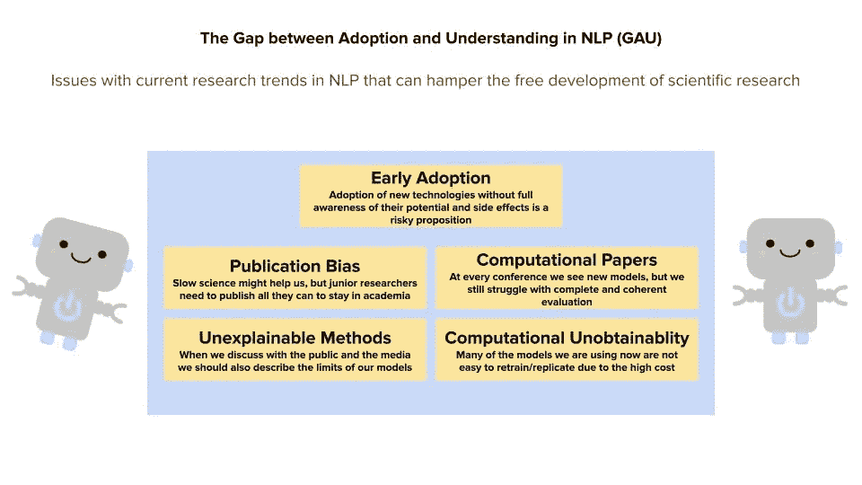

# 关于采纳和理解之间的差距

> 原文：<https://towardsdatascience.com/on-the-gap-between-adoption-and-understanding-971c3d63f524?source=collection_archive---------28----------------------->

## [思想和理论](https://towardsdatascience.com/tagged/thoughts-and-theory)

## 自然语言处理中当前研究趋势的问题会阻碍科学研究的自由发展

这篇博文描述了我们最近的论文:

费德里科·比安奇和德克·霍维(2021)。 [**关于 NLP**](https://aclanthology.org/2021.findings-acl.340.pdf) 中采用与理解的差距。计算语言学协会的发现。计算语言学协会(即将出现)。

这项工作的主要重点是描述目前影响 NLP 研究和阻碍科学发展的问题。NLP 是由方法学论文驱动的，方法学论文产生更快，因此满足了研究人员尽可能多地发表论文的动机。然而，模型发布和应用程序使用的速度可能会超过发现其风险和局限性的速度。随着它们规模的增长，复制这些模型来发现这些方面变得更加困难。

Dirk 和我探讨了其中最受关注的 5 个问题:模型的早期采用(T8)、计算论文(T10)在我们社区的流行(T11)、发表偏倚(T12 )( T13)、模型的计算不可获得性(T14 )( T15)和方法的不可解释性(T16 )( T17)。

下图简要总结了这些问题:

当前自然语言处理研究中的问题。图片作者。

简而言之，随着产出(模型、出版物、数据集)的增加，我们创造了一个这些方法在被完全理解之前就被广泛使用的局面，以及一个让这种局面永久化的激励体系。

# 早期采用

> 我们不能完全控制语言模型。在没有充分意识到副作用的情况下采用新技术是一种冒险行为。

从研究到工业应用的时间在最近一年大大缩短了。例如，今天任何人都可以在 HuggingFace 知识库上发布一个模型，一旦完成，它就可供世界上任何研究人员使用。然而，这种现成的可用性可能会带来很高的成本。

我们知道像 GPT-3 这样的模型包含了对少数民族的系统性偏见。Abid 等人(2021)表明，GPT-3 的反穆斯林偏见*在该模型的不同使用中一致且创造性地出现。*

因此，使用这些模型构建的应用程序有多可靠呢？

在最近的一份报告中，Buchanan 和他的同事提出，虽然 GPT-3 不能自己制造错误信息，但它可以作为一种工具，以一种前所未有的方式产生高质量的错误信息。

广泛采用和完全理解(或 GAU)之间的差距受到我们将在这篇博文的下一部分看到的不同方面的影响。

# 计算论文

> 如果我们不评估源代码，我们就不能确定论文的质量。

自然语言处理作为一门计算科学，充斥着计算论文。新的模型或方法往往会受到社区的高度赞赏，因为它们为给定的任务提供了更好的解决方案。

然而，对这些论文的后评估考虑有限。一旦论文发表，是否有可能用代码复制结果？做到这一点有多容易？

这个问题在机器学习中已经知道了。例如，Musgrave 等人(2020)报告说，由于实验中的方法缺陷，度量学习的准确性增加在几篇论文中被错误地报告。

为了快速发现方法错误，访问代码是很重要的。代码发布在我们的社区中是一个问题，因为它碰巧看到代码以 jupyter-notebook 的形式发布，很少有评论。

事实上，这类论文的评估方式缺乏系统性。举一个例子，代码审查并不是一个强制性的实践，许多发表的论文完全没有代码。

关于如何设计和发布代码的更好的指导方针可以帮助减轻这个影响我们——以及一般的 ML——社区的复制问题。我们已经知道易于使用的代码实现的巨大优势:HuggingFace 就是一个明显的例子。

# 出版偏差

> 出版或灭亡。不幸的是，这句话往往是对的，所有的学者都必须遵守，直到终身任职。

发表论文和同行评议是现代科学的基础；如果你不能提供实质性的证据证明一个新的模型是新颖的和/或比其他研究者过去所做的更好，你就不能提出新的模型。事实上，研究人员的质量主要是通过他们研究成果的质量来评估的。

然而，论文评审需要很多的关心和注意，并且由于有大量的论文提交给我们的会议，这个任务经常落在 3 个评审者和 1 或 2 个地区主席的肩上。他们必须评估几十篇论文，决定哪些是好的，哪些不是。

但是这条规则对科学有帮助吗，或者只是给初级研究人员带来压力？

随着这种对发表的推动，在该领域的主要会议上发表论文变得越来越困难。为了简化这个过程，像 ArXiv 这样的服务可以用来发布研究。ArXiv 没有错，但是作为一个没有进入障碍的可变场所，它有局限性:仅仅建立在 ArXiv 上的出版记录是建立在流沙上的，可能会倒下。

# 计算不可获得性

> 我们大多数人可以使用预先训练的 BERT 模型，有些人可以微调 BERT，很少人可以从头开始训练 BERT。更不用说 GPT 3 号了。

你能从零开始多次训练你自己的 BERT 模型来评估你的新假设吗？可能不会:训练 BERT 一次就需要很大的计算能力，重复做这件事对除了少数研究机构之外的所有人来说都太费力了。即使是 BERT 微调，有时候也是一个成本很高的操作。

通过要求不可能的实验来评估论文是我们需要注意的一种守门方式。

当我们回顾和分析论文时，我们需要意识到，并不是每个人都可以像伯特一样重新培训模型，而且资源匮乏的大学可能无法提供必要的资源，甚至无法进行微调。

# 无法解释的方法

> 技术的局限性并不比它们所能带来的进步更重要。我们应该描述 GPT-3 的极限和它的能力。

GPT-3 去年出现在《卫报》上。这篇文章是 GPT-3“写”的，引起了公众对人工智能和人类劳动未来的强烈抗议。但是，尽管所有关于可能性的争论都值得讨论，但许多人不知何故忘记了描述这种方法的局限性。

极限的描述没有出现在报纸上；相反，他们在专业期刊上找到了自己的位置，而这些期刊并不一定面向大众(本德&柯勒，2020；Floridi 和 Chiriatti，2020 年)。

虽然一些科技新闻来源描述了与 GPT-3 相关的问题，但这些新闻并没有出现在主流报纸上。

我们拥有的方法通常无法解释它们是如何工作的:告诉人们 GPT-3 可以写文章可能会引起恐慌，因为非专家的第一个假设是机器会反抗人类劳动。当我们向公众传达这些无法解释的方法时，我们还需要描述这些技术的局限性。

# 其他问题

显然，这些并不是我们这个领域要处理的唯一问题。为了提到我们在这里没有涉及的两个问题(但是在其他论文中涉及了)，我建议读者参考这些论文:

*   双重用途问题(Lau 和 Baldwin，2020 年)。我们是否应该检查我们所使用的技术是否以及如何以一种不好的方式被使用？
*   环境可持续性(Strubell 等人，2020 年)。我们将如何处理我们正在开发的模型不可持续的事实？

# 结论

这篇博文探讨了 NLP 中当前出版趋势已经恶化到不可忽视的程度的一些问题。我们不断将越来越大的模型推向市场，却没有确保我们理解它们的风险，传达它们的局限性，或者让它们可以广泛复制。如果我们希望我们的社区在未来取得积极的成果，采取行动并提供解决这些问题的方案是很重要的。

有兴趣的话可以在 [twitter](https://twitter.com/fb_vinid) 上找我。

# 承认

感谢 Dirk 对本文的编辑和改进建议。

# 参考

本德，e . m . &柯勒，A. (2020 年 7 月)。向 NLU 攀登:论数据时代的意义、形式和理解。在*计算语言学协会第 58 届年会论文集*(第 5185–5198 页)。

弗洛里迪和奇里亚蒂(2020 年)。GPT-3:它的性质，范围，限制和后果。*头脑与机器*， *30* (4)，681–694。

刘，J. H .，，鲍德温，T. (2020 年 7 月)。给我便利，给她死亡:应该由谁来决定 NLP 的哪些用途是合适的，在什么基础上？。《计算语言学协会第 58 届年会论文集(第 2908–2913 页)。

斯特鲁贝尔，e .，加内什，a .，&麦卡勒姆，A. (2019 年 7 月)。自然语言处理中深度学习的能源和政策考虑。《计算语言学协会第 57 届年会论文集》(第 3645-3650 页)。

Abid，m . Farooqi 和 j .邹(2021)。大型语言模型中持续的反穆斯林偏见。 *arXiv 预印本 arXiv:2101.05783* 。

k .马斯格雷夫、s .贝隆吉和 S. N .林(2020 年 8 月)。度量学习现实检查。在*欧洲计算机视觉会议*(第 681–699 页)。斯普林格，查姆。