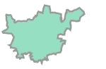
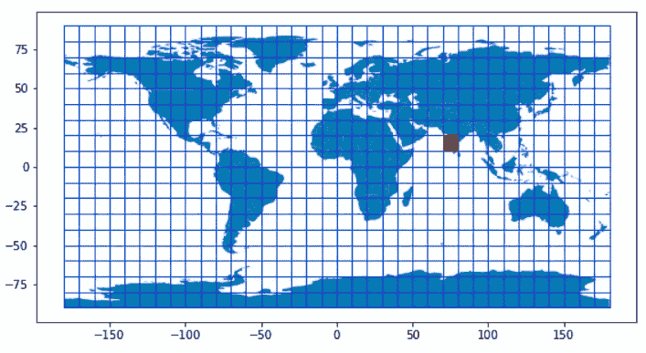
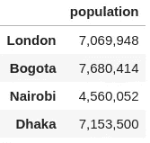
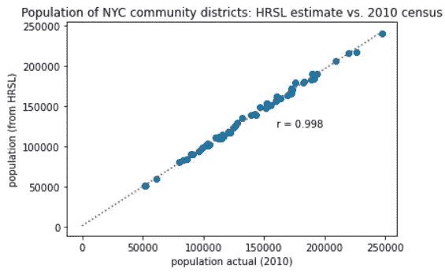
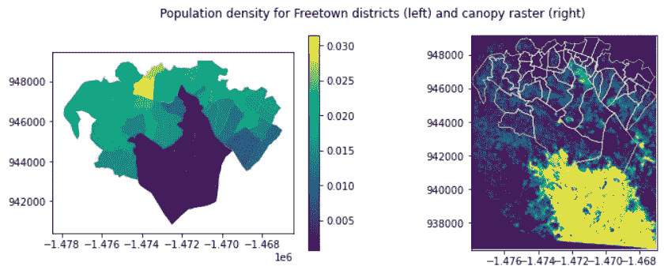
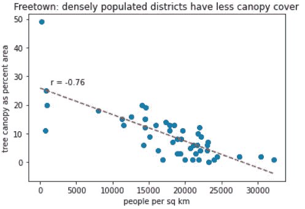
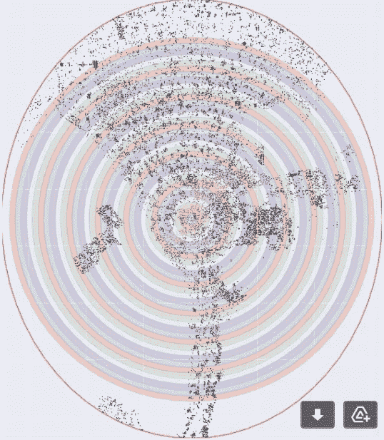
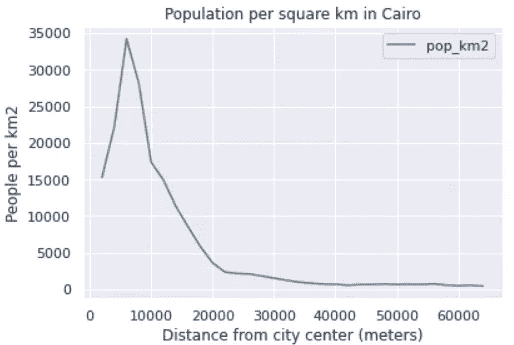

# 在网格上:估计地球上任何地方的人口密度

> 原文：<https://towardsdatascience.com/on-the-grid-estimating-population-density-for-anywhere-on-earth-a33008d723f8?source=collection_archive---------15----------------------->

## [理解大数据](https://towardsdatascience.com/tagged/making-sense-of-big-data)、[行业笔记](https://towardsdatascience.com/tagged/notes-from-industry)

“这里住了多少人？”这是公共政策分析中许多问题的基本出发点:从估计自然灾害影响到规划疫苗分发。然而，这个问题仍然令人惊讶地难以回答，分析师们花了很多时间搜寻当地的人口数据集，并找出它们背后的假设。

幸运的是，有一种更简单的方法。几十年来，像 WorldPop 和 CIESIN 这样的组织一直在稳步提高网格人口数据集的可用性，这些数据集本质上是大型光栅图像，显示了给定时间地球表面每个点上的估计居住人数。

这一领域的最新参与者是[高分辨率定居层](https://research.fb.com/downloads/high-resolution-settlement-layer-hrsl/) (HRSL):一个大型且巧妙制作的数据集，描绘了地球大部分地区每个 30 米网格单元中的人口数量。在本文中，我们将展示如何用几行代码高效地查询这个庞大的数据集，以返回居住在任何地理单元内的估计人数。

## 网格人口数据集:无价的，不完美的，改进的

首先，一些背景。什么是网格化人口数据集，为什么不直接使用原始人口普查数据？

起源于古罗马的全国人口统计(人口普查)的思想对公共管理仍然至关重要。历史上规模最大的一次是印度 2011 年的人口普查，当时需要不少于 250 万人口普查工作人员来准确统计 12 亿人口。大多数国家大约每 10 年进行一次人口普查，并公布每个普查地区的人口数量。但是这些地理区域可能很大，人口普查已经过时了。分析人员经常需要一个可信的估计值，以确定目前有多少人居住在特定的地点。

网格化人口数据集填补了这一空白。哥伦比亚大学的 CIESIN 在 1995 年发布了它的第一个网格化世界人口(GPW)产品，类似的产品已经激增——现在至少有七种高质量的替代品可用。他们每个人都使用两个基本程序。首先，分析师估计今天的人口——通常通过从上次人口普查数据中推断。接下来，每个地理区域被划分为网格单元，人口总数“分布”在这些网格单元上。

作为这种数据测图的一个基本例子，考虑一个三分之一是湖的县。分配群体的第一步是遮蔽所有为水的像素，然后将群体分配给剩余的像元。使用更大范围的“共变图层”(预测人口密度的地理空间要素，例如夜间灯光影像)，可以放心地将总人口分配到细粒度的格网单元。

随着时间的推移，随着信息(特别是卫星图像)可用性的增加，这些产品变得越来越严格。延续这一趋势，HRSL 数据集([于 2016 年](https://arxiv.org/abs/1712.05839)推出)使用来自高分辨率影像的建筑物足迹，以 30 米的分辨率分布估计人口密度。HRSL 继续被完善:最近发布的[版本 1.5](https://ai.facebook.com/blog/how-maps-built-with-facebook-ai-can-help-with-covid-19-vaccine-delivery/) 使用了巧妙的技术(和强大的计算能力)来清除底层建筑层中的“误报”。

尽管网格化的人口数据集是非常宝贵的，但它们也是不完美的——尤其是在基础人口普查数据陈旧或有缺陷的情况下。在使用它们之前，明智的做法是[比较产品之间的](https://sedac.ciesin.columbia.edu/mapping/popgrid/)，了解原始普查中的空间单位是大还是小，并检查给定国家上次进行普查的时间。关于这个问题，联合国统计司提供了一个有用的[网页](https://unstats.un.org/unsd/demographic-social/census/censusdates/)供参考。注意上次人口普查是在很久以前(例如，根据最近对联合国统计页面的观察，马里和吉布提是在 2008 年和 2009 年)。

## **大规模开放数据:高效的 HRSL 查询**

如何高效利用这个庞大的数据集？首先，打个比方:将下载地理空间图像的需求与在网飞看电影的需求进行比较。想象一下，网飞以超高分辨率视频提供所有新电影，但每次都要求你下载整部电影。现在想象一下，你用的是一部旧手机，网络连接很差。

幸运的是，视频和音乐服务都使用云优化格式来共享数据，允许用户快速恢复他们停止的内容，并以适合他们设备的分辨率访问材料。开源数据社区越来越多地以类似的方式思考，因此出现了像云优化 GeoTiff (COG)这样的格式:一种允许用户只请求他们需要的精确像素的图像文件。

当分析 HRSL 影像时，好处很快变得非常明显:在手动裁剪所需的小地理区域之前，下载 [100MB 影像文件](https://data.humdata.org/dataset/southasia_as42-high-resolution-population-density-maps)所花费的时间相当可观。幸运的是，整个 HRSL 已经转换为 COG，并托管在亚马逊网络服务(AWS)开放数据平台上。

# 有效查询 HRSL 数据的步骤

## 1.构建一个世界网格

以下步骤需要用于地理分析的基本 Python 库:Geopandas、Rasterio 和 Boto3(亚马逊用于访问其 S3 文件存储的工具)。HRSL 数据存储在一系列 COG 文件中，每个文件覆盖 10 度经度和纬度。我们将创建一个网格来模拟该结构:

请注意，数据采用 Web 墨卡托投影(WBS84)。我们的 HRSL 网格如下所示:

**2。为您的分析找到正确的单元格**

你需要相关图像芯片的纬度和经度来查询 AWS 上正确的[文件名](https://registry.opendata.aws/dataforgood-fb-hrsl/)。这里我们以印度的浦那市为例，检索 OpenStreetMap 上记录的行政边界，并检查它属于哪个格网单元:

印度浦那的边界是一个形状优美的多边形

这将允许我们使用正确的纬度和经度值来查询 AWS:

覆盖有 HRSL 格网的世界地图，突出显示了印度浦那的右侧格网单元。

**3。访问 HRSL 数据**

现在我们开始做生意了。下面的函数获取任意多边形，从相关的 HRSL 芯片中检索像素，并计算总人数:

简单说明一下:在这里，我们将获得四个主要城市的边界，并提取 HRSL 对每个城市的估计人口总数，这一过程使用手动下载和 GIS 软件将花费更长的时间:

HRSL 四个城市(OSM 边界)的估计人口

**4。使用纽约市社区区进行验证**

我们的程序运行良好吗？为了验证这一点，让我们使用一组细粒度的地理单元，我们有最近的人口普查数据:纽约市的社区区。这个城市被分成 59 个这样的单元。

行政边界在这里[可用](https://services5.arcgis.com/GfwWNkhOj9bNBqoJ/arcgis/rest/services/NYC_Borough_Boundary/FeatureServer/0/query?where=1=1&outFields=*&outSR=4326&f=pgeojson)和他们的 2010 人口普查人口[在这里](https://data.cityofnewyork.us/api/views/xywu-7bv9/rows.csv?accessType=DOWNLOAD)；请注意，HRSL 提供了 2015 年的估计人口，因此我们预计两个数字密切相关，但不匹配。

获取纽约市边界地理数据框架中每个区的 HRSL 估计值既快速又简单。估计值非常接近，相关系数(Pearson r)为 0.998。

同样，请根据具体情况评估 HRSL 的适用性，尤其是对于统计能力较弱的国家。然而，该产品的高空间粒度是一个优点。

# **两个应用:人均树冠；城市密度梯度**

来自网格数据集的人口估计可以支持多种类型的城市政策分析:特别是在一个地理尺度上存在关于生活设施、自然灾害或卫生设施的数据，但没有相同尺度上的人口数据的情况下。以下是最近工作中的两个例子:

1.  *GIS 分析的人口密度基线:塞拉利昂*

在塞拉利昂的弗里敦，城市当局正在种植大量的树木，以解决山体滑坡和洪水的根本原因以及其他好处。我们支持他们开发一套高分辨率的树冠层；但缺乏弗里敦各区人口分布的相应详细数据。

有了一组行政边界，获得 HRSL 对每个地区的人口密度的估计又是一件简单的事情:

我们清楚地看到，人口最稠密的地区树木覆盖较少，也许应该成为城市林业努力的目标。

2.*城市密度梯度:埃及开罗*

HRSL 等网格化人口数据的一个关键用途是描述城市空间中人口密度的变化:这是城市经济学家最感兴趣的话题。考虑到住房成本和通勤时间，人们如何决定在哪里生活和工作？

一类经济模型深入解决了这些问题——参见单中心城市模型的文献——并有助于诊断分区、房地产法规和交通设施如何塑造城市，是好是坏。使用 HRSL 并以 2 公里的间隔叠加一组同心“甜甜圈”,我们可以测量人口密度如何随离市中心的距离而变化——这是本文献中广泛使用的度量标准:

开罗:从市中心提取同心 2 公里环的 HRSL 人口估计。

请关注未来更深入探索这一用例的博客；目前，我们的观点是说明以有效的方式查询 HRSL 数据允许进行一系列的分析，并且与过去研究中所需的手工工作相比节省了时间(例如 Alain Bertaud 和 Stephen Malpezzi 的这篇出色的[论文](http://mcrit.com/scenarios/files/documents/Bertaud%20and%20Malpezzi%20Part%20One.pdf))。

# 网格化人口数据集:下一步是什么？

这些数据集的下一步是什么？我看到了两个大趋势:一些分析师正在部署更多的计算资源来提高他们通用产品的粒度和准确性；其他人则通过关注狭窄的问题(如支持特定国家的疫苗部署)来“耍小聪明”。

WorldPop 提供了第二个很好的例子:以其与盖茨基金会的[合作](https://www.worldpop.org/case_studies/nigeria)为例，它创建了专门用于尼日利亚北部根除脊髓灰质炎运动的人口地图(在那里，不可靠的人口普查数据造成了问题)。

与此同时，一个新的 HRSL 版本已知正在工作中:HRSL 版本 2 预计将使用基于卫星的建筑体积数据集(不仅仅是计数)来帮助将人口分配到网格单元。这是一个挑战，需要巨大的计算资源以及解决方案来区分人们居住的建筑和他们工作、娱乐或购物的建筑。这是一个很好的方法:[Steven Rubin yi 及其同事的研究](https://www.sciencedirect.com/science/article/pii/S0198971521000016)证实，将建筑体积和区分住宅与非住宅结构结合起来，可以得到更精确的人口地图。

HRSL v.2 将深化分析师对“现成”产品的研究。但这些产品日益增长的准确性也凸显了一个基本事实:人口普查机构至关重要，需要资金和支持(特别是在低收入国家)，因为它们的人口统计是整个工作流程的基础。

# 结论

高分辨率沉降层是城市发展、灾害风险管理和一系列领域的宝贵资源。在这篇博客中，我们展示了一种使用任何一组行政边界或任意几何图形(如城市经济学模型中使用的“甜甜圈”环)进行查询的有效方法。基于云的 GeoTiff 格式(COG)是 HRSL 在线存储的一个巨大优势，便于访问。如果对你有用，请使用和修改上面的功能——感谢阅读！

*作者注:(1)感谢为代码做出贡献的 Corey Guastini 和 Gaurav Bhardwaj。(2)处理齿轮的工具正在快速发展:如果有人有更快的方法来访问任意几何图形的 HRSL，请在评论中分享，或者通过* [*LinkedIn*](https://www.linkedin.com/in/nick-jones-302a945/) *告诉我。*