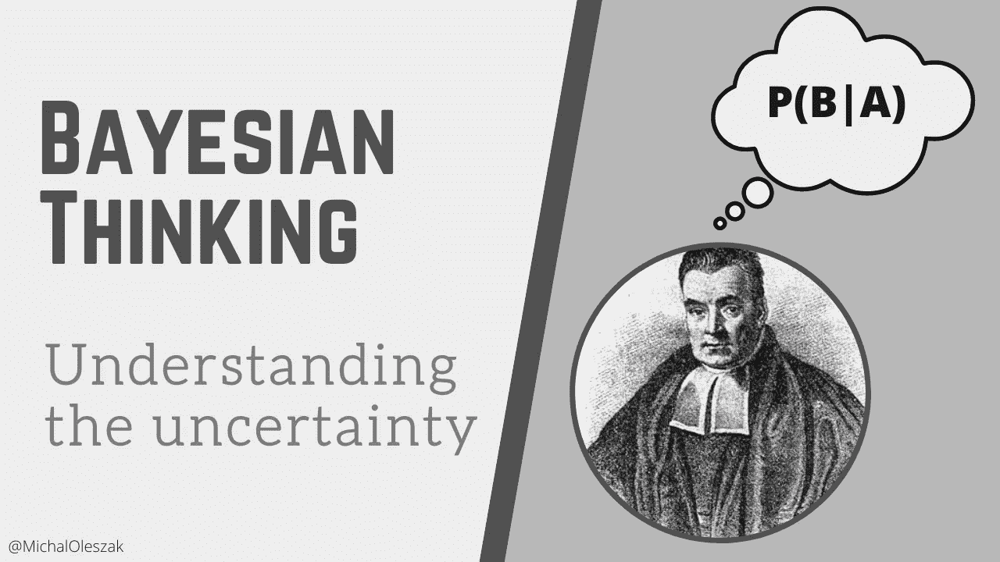
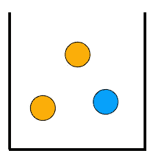
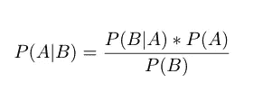
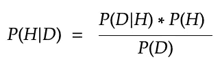
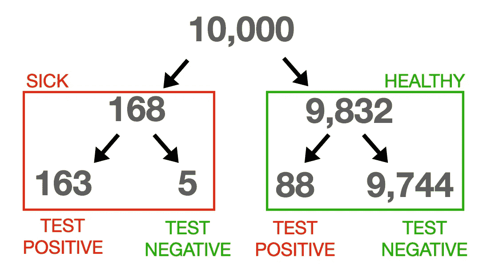

# 贝叶斯思维在日常生活中的重要性

> 原文：<https://towardsdatascience.com/on-the-importance-of-bayesian-thinking-in-everyday-life-a74475fcceeb?source=collection_archive---------1----------------------->

## 这个简单的思维转变将帮助你更好地理解你周围不确定的世界



人类的大脑不能很好地处理概率。我们玩彩票，但害怕坐飞机。这是有生物学基础的:高估小概率(如果它们成为现实，那将是灾难性的)帮助我们的祖先生存了下来。然而，在当今世界，能够以统计学上合理的方式思考是人们想要的品质。这是一项不容易掌握的技能，但它为更好地理解周围世界的不确定性打开了大门。


## 概率思维是不自然的

我们的大脑根本就不是这样思考的。它们是寻找模式的疯狂机器，在没有因果关系的地方发现因果关系，并让我们相信与我们对世界的偏见最接近的事件版本。以著名的[琳达问题](https://en.wikipedia.org/wiki/Conjunction_fallacy)为例，我在这里做了修改以强调效果:

> 琳达是一名年轻的艺术学校毕业生，住在一个大城市，自我认同为左翼分子。关于琳达，哪一个更有可能:
> -她是一名消防员。
> -她是一名消防员，致力于女权运动。

令人惊讶的是，许多人会说后者更有可能。琳达成为一名消防员似乎不太可能。没有多少女性倾向于从事消防员的工作，也许有人会说艺术学校的毕业生也是如此。作为两者的结合体，琳达不可能是一名消防员。然而，考虑到她公开宣布的政治观点，争取妇女权利的运动确实排得上号。将这个看似合理的陈述添加到前面那个不太可能的陈述中，会使整个句子听起来更有可能。多么荒谬！我们的大脑完全忽略了一个事实，即两个概率的总和不可能大于它们中的任何一个。就拿艺术学校毕业的女消防员来说吧，然而她们很少存在。他们中有多少人也在争取女权？至少，一个都没有。最多，全部。但不会再有了！

另一个让我们的概率直觉彻底失败的臭名昭著的例子是蒙蒂霍尔游戏。如果你玩这个游戏，你可以选择三门中的一门。其中一个藏着贵重的奖品，另外两个什么都不会给你。在你选择了你的门之后，剩下的两扇门中的一扇门打开了，显示它是空的。现在你可以选择坚持你最初的选择，得到那扇门后的东西，或者切换到另一扇仍然关闭的门。大多数人会坚持他们的第一选择:他们认为每扇门都有 1/3 的机会藏起奖品，所以没有必要调换。实际上，如果他们换了又输了，他们只会踢自己。似乎粘着更舒服。剧透:切换将使你的获胜机会翻倍。我已经在我之前的一篇文章的[中对此做了更详细的解释。](https://pub.towardsai.net/the-monty-hall-problem-a4b657889035)

不久前，我观察到另一个例子，在 Twitter 上的争吵中，概率对我们来说是多么困难。在比利时，许多因新冠肺炎而住院的人在入院前就已经接种了疫苗。一些人声称这是疫苗无效的证据，并对这么多人接种无效疫苗表示愤怒。他们没有看到的是，许多住院的人都接种了疫苗*，因为人口中的疫苗接种率很高。疫苗不能提供 100%的保护。一些接种疫苗的人确实会生病——尽管这一比例比未接种疫苗的人要小得多。现在想象一下比利时的每个人都接种了疫苗。实际上，住院人数会少得多，但是他们中的所有人都会接种疫苗。与疫苗的有效性无关。*

> 人类的大脑和概率不能很好地结合在一起，但是我们可以改变我们的思维，使之在统计学上更加合理。

这里的底线是人脑和概率不能很好地结合在一起。现在让我们来看看如何将我们的思维转变为更具统计学意义。接下来，我们将把这种思维方式应用到实际例子中:理解 COVID 测试的结果，避免把无辜的人关进监狱。让我们从一个基本问题开始:什么是概率？


## 概率和贝叶斯

令人惊讶的是，对于概率到底是什么意思，人们并没有达成共识。一般来说，有两种方式可以考虑。一种是将概率定义为在许多试验中观察到的事件频率。例如，如果一个人抛硬币很多次，大约一半的结果是正面，另一半是反面。投掷次数越多，观察到的频率就越接近 50–50。因此，我们说掷正面(或反面)的概率是 50%，或 0.5。这就是所谓的频率主义概率。

还有另一种思考方式，被称为主观或贝叶斯概率。简而言之，这个定义表明，一个人对某事发生可能性的主观信念也是一种概率。我可能会说:我觉得明天有 50%的可能会下雨。这是贝叶斯概率的有效陈述，但不是频率主义者的(因为我没有多次观察明天的天气)。

无论我们采用哪种概率定义(我们很快就会看到两者都在起作用)，概率总是遵循一定的规则。它是一个介于 0 和 1 之间的数字，表示某件事发生的可能性有多大。零表示不可能，一表示一定会发生，中间所有的数字都表示不同程度的确定性。

在我们开始在日常生活中正确使用概率之前，我们需要介绍几个简单的概念。想象一个盒子，里面有三个球。两个是橙色的，一个是蓝色的。



盒子里的球。图片来自作者在 DataCamp 讲授的 Python 课程中的[贝叶斯数据分析。](https://www.datacamp.com/courses/bayesian-data-analysis-in-python)

现在，随机抽取一个橙色球的概率是 2/3，即 0.67。我们可以把 is 写成`P(orange)=0.67`。假设我们真的画了一个橙色的球，我们把它放在一边。然后我们从盒子里剩下的两个球中随机挑选另一个球。再抽橙色的概率现在是 0.5。我们记为`P(orange|orange)=0.5`，读作:假设我们在第一次抽中抽到了一个橙色球，放在一边，那么第二次抽中一个橙色球的概率*是 0.5。这就是所谓的*条件概率。* `P(A|B)`是`B`已经发生的情况下`A`的概率。直到现在还没有火箭科学。*

进入巧妙的游戏规则改变者:贝叶斯定理。在这个听起来很强大的名字背后隐藏着一个简单的规则。这个规则告诉我们如何从`P(B|A)`到`P(A|B)`。如果我们知道某样东西给定另一样东西的概率，我们可以通过下面这个简单的等式来还原它:



贝叶斯公式。

将这个简单的等式转化为我们每天思考不确定性的方式，这一技能彻底改变了我们对概率的理解。

> 使用贝叶斯定理来思考不确定性为我们对概率的理解提供了一次彻底的变革。

让我们看看如何做到这一点。首先是两个简单的例子，接下来是一些改变人生的问题。


## 使用贝叶斯定理，或者硬币和孩子

将贝叶斯定理应用于日常问题的关键技巧是理解公式所包含的不同概率。为了使符号更清晰，让我们在公式中将事件*重新命名为*和 *B* 。曾经的 *A* 现在是*假设(H)*和 *B* 将表示*数据(D)*



假设(H)和数据(D)世界中的贝叶斯公式。

现在，让我们通过解决一个简单的问题来实现它。

> 我有两枚硬币:一枚是普通的、公平的硬币，另一枚是两面都有头像的假硬币。我随便挑了一个，扔出去，然后正面朝上。我扔假币的概率是多少？

在这个问题中，我们的假设是我扔了假硬币。数据是我们观察到的:我们有头。我们要计算的是 *P(H|D)，*假设硬币正面朝上，硬币被抛出的概率。这被称为*后验概率，*其中后验意味着在看到数据之后。

先说假设， *H* 。撇开任何数据不谈，它自己有多大可能？或者换句话说，P(H)是什么？它是 0.5，因为我在两个硬币中随机选择了一个。这就是所谓的*先验概率，*这里先验的意思是在看到数据之前。

那么，什么是 T21 呢？或者:假设假币被扔了，得到我们得到的数据(人头)的概率有多大？因为假币总是正面朝上，所以是 1。这被称为数据的*可能性*。

而数据的概率是多少， *P(D)* ？这一部分是最棘手的，但幸运的是，知道它实际上并不重要！在某些类型的问题中，人们可以计算它。我们可以在这里做。为此，我们需要列出所有可能的假设。其中一个是假币被扔了，那么另一个就是公平币被扔了。这是这个问题的一组封闭的假设:它们涵盖了所有可能的情况，其中只有一个是正确的。现在，*P(D)=*σP(D | H)* P(H)，这里我们对所有假设求和。对于假币被抛的假设，我们已经知道乘积是 1 * 0.5 = 0.5。对于另一个假设，它是 0.5 * 0.5 = 0.25(先验仍然是 0.5，但是对于公平硬币，可能性是 0.5)。于是， *P(D)* = 0.5 + 0.25 = 0.75。

这就是我们计算后验概率所需要的。只要把三个概率代入上面的公式就可以发现 *P(H|D)* = 2/3。在抛了头之后，有 66.6%的几率假币被抛出。

在这种情况下，很容易计算出 *P(D)。*有时会更难，正如我提到的，这并不是真正需要的。为什么？请看公式的右边。因为整个分数表示一个概率，所有可能的假设的概率必须加起来等于 1。因此，我们可以将 *P(D)* 视为一个比例因子，确保总后验概率为 1。我们可以使用这个简洁的函数来完成所有这些计算:

我们为它提供了三个列表:假设(假硬币被抛出，公平硬币被抛出)，先验概率(0.5，0.5-随机选择硬币)，以及可能性，即每枚硬币抛出正面的概率(1，0.5)。

```
do_bayes_theorem(["fake_coin", "fair_coin"], [0.5, 0.5], [1, 0.5]) hypothesis  prior  likelihood  posterior
0  fake_coin    0.5         1.0   0.666667
1  fair_coin    0.5         0.5   0.333333
```

现在让我们用这个工具解决一个不同的问题:著名的[儿童问题](https://en.wikipedia.org/wiki/Boy_or_Girl_paradox):

> 史密斯先生有两个孩子。其中至少有一个是男孩。两个孩子都是男孩的概率有多大？

我们的假设是史密斯先生的孩子性别的所有可能组合:两个男孩，两个女孩，男孩和女孩，女孩和男孩。在看到任何数据之前，每个组合的可能性都是相等的，因此四个组合中的每一个的先验值都是 0.25。我们掌握的数据是，其中至少有一个是男孩。这是所有组合的 100%可能性，除了两个女孩，在这种情况下是 0%。让我们看看:

```
do_bayes_theorem(
    hypotheses=["GG", "BB", "GB", "BG"], 
    priors=[0.25, 0.25, 0.25, 0.25], 
    likelihoods=[0, 1, 1, 1]
) hypothesis  prior  likelihood  posterior
0         GG   0.25           0   0.000000
1         BB   0.25           1   0.333333
2         GB   0.25           1   0.333333
3         BG   0.25           1   0.333333
```

两个都是男生的概率是 1/3。现在我们已经掌握了贝叶斯工具集，让我们来处理一些更严重的问题。


## 了解 COVID 测试的结果

我最近检测了 COVID19，结果是阴性。我一知道这件事，就开始思考它到底意味着什么。毕竟，测试有时是错误的，我真的不想传播病毒。

测试结果有两种可能是错误的。一种是*假阴性*场景，检测未能检测出被检测者携带的病毒。另一种是*假阳性*，这意味着测试结果是阳性的，而被测试者实际上是无 COVID 的。几率有多大？进入贝叶斯思维。

首先，我们需要收集一些背景信息。让我们从前科开始。被感染的概率有多大？我是通过将卫生部报告的我国目前感染人数除以总人口计算出来的。这个粗略的近似值得出我感染 COVID 的几率为 0.0168。这种简单的方法完全忽略了疫苗接种和其他情况，但现在让我们坚持下去。

接下来，可能性。我已经在我的考试证书上收到了这些数字。也就是说，它表示测试的灵敏度为 97%，特异性为 99.1%。灵敏度衡量测试正确检测病毒的能力，因此 97%的感染者将得到阳性结果，3%的人将得到阴性结果。特异性衡量健康人群中检测结果为阴性的频率，这意味着在 0.9%的情况下，健康人群会看到阳性结果。

我们已经得到了我们需要的所有数字，所以让我们开始贝叶斯！

```
do_bayes_theorem(
    ["healthy", "sick"], 
    [1 - 0.0168, 0.0168], 
    [0.991, 0.03],
) hypothesis   prior  likelihood  posterior
0    healthy  0.9832       0.991   0.999483
1       sick  0.0168       0.030   0.000517
```

看起来我很确定我很健康。如果我们通过反映我相对年轻并接种过疫苗的事实来使先验更好(比如，让我们将先验除以 2 得到 0.0084)，健康的后验概率将增加到 0.999744。这种增加并不是很大，因为先验在计算后验概率时并没有起到很大的作用；相反，后验概率是由数据(可能性)决定的，这很好，因为它使结果对特定的先验选择更稳健。即使我们假设一半的人口被感染，健康的后验概率也将超过 97%——自己检查一下。

如果我的测试结果是阳性呢？让我们用年龄和疫苗接种调整后的先验来找出答案。

```
do_bayes_theorem(
    ["healthy", "sick"], 
    [1 - 0.0084, 0.0084], 
    [0.009, 0.97],
) hypothesis   prior  likelihood  posterior
0    healthy  0.9916       0.009   0.522738
1       sick  0.0084       0.970   0.477262
```

这很违反直觉，不是吗？尽管测试在这两个准确性指标上分别获得了 97%和 99.1%的分数，但在给出阳性结果的情况下，生病的概率实际上小于健康的概率！不过，这个结果对先验非常敏感。如果我们使用 0.0168 的初始“全局”先验，那么后验概率将为 65%患病和 35%健康。无论如何，即使你测试呈阳性，你也不会死。这是许多医学测试的典型情况，这就是为什么阳性结果通常会导致医生要求重复测试。

从这个例子中得到的教训是，我们的大脑成为一个常见谬误的受害者:当暴露于一个极端的百分比时，无论是大还是小，他们都只分析百分比的大小，而忽略总数。

> 测试呈阳性的健康人的数量只是一个大总数中的一小部分。我们的大脑处理分数的大小，而忽略总数。

想想看:只有 0.9%的健康人测试呈阳性。但是每 10，000 人中有 9832 人健康，其中 0.9%的人达到 88 岁。与此同时，168 人患病，其中 163 人(97%)将检测呈阳性。因此，患病者的阳性检测结果大约是健康者的两倍(163 比 88)。



我做的 COVID 测试的总体结果。图片由作者提供。


## 不要强迫人们进监狱

我在 a .唐尼的《思考贝叶斯》中找到了下面的例子，顺便说一下，这是一本很棒的书。让我在这里解释一下。

> 有人犯了谋杀罪。在犯罪现场发现了两份血样:一份是“0”型，一份是“AB”型。“0”型很流行，当地 60%的人口都有，而“AB”型很少见，只有 1%的人有。已经找到一个嫌疑犯，他的血型是“0”。仅凭这一证据，他们是凶手的可能性大还是小？

大多数人直觉地回答，嫌疑人的血型有利于他是凶手。毕竟数据(他的“0”血型)是符合这个假设的。但是为了安全起见，让我们通过贝叶斯机器来筛选这个问题。

让我们以 50-50 的概率为例，表明我们同样有可能在前面说嫌疑人有罪或无辜。

现在，可能性。如果他有罪，在犯罪现场观察到“0”型和“AB”型的概率有多大？假设他有罪，他占了“0”型，所以我们需要解释“AB”型。在一个随机的人身上观察到的几率是 1%，所以可能性是 0.01。

如果他是无辜的呢？在这种情况下，嫌疑人不在犯罪现场，我们需要解释在那里发现的两种血型。两个随机的人拥有这些特殊血型的几率是 60% * 1% * 2。我们将概率的乘积乘以 2，以说明有两个人:一个是“0”型，另一个是“AB”型，或者相反。这就是我们所需要的！

```
do_bayes_theorem(
    ["guilty", "innocent"], 
    [0.5, 0.5], 
    [0.01, 0.6 * 0.01 * 2],
) hypothesis  prior  likelihood  posterior
0     guilty    0.5       0.010   0.454545
1   innocent    0.5       0.012   0.545455
```

他实际上更有可能是无辜的！这可能违背直觉，但实际上非常有意义。如果嫌疑人有罪，他会说明在犯罪现场发现的“0”型，这将留下一个非常罕见的事件(“AB”型)无法解释。另一方面，如果他是无辜的，我们有两次机会找到罕见的“AB”型人(因为我们需要解释找到的两种血型)。

从这个例子中得到的教训是，如果以统计上合理的方式进行评估，即使数据与假设一致，实际上也可能与假设相反。

> 如果评估正确的话，即使是与某些假设一致的数据也可能会反驳它。

这与我们的直觉思维大相径庭，其原因是大脑假设“你所看到的就是一切”(这是一个谬误，在丹尼尔·卡内曼的《思考，快与慢》中缩写为 WYSIATI)。我们看到嫌疑人的血型与犯罪现场发现的一种血型相匹配，然后就下结论了。我们没有直接看到找到“AB”人有多难，如果我们没有嫌疑人已经解释过的“0”样本，观察到“AB”血液的可能性会更大。


## 经验教训

将贝叶斯定理应用于涉及概率的日常问题，可以让我们以一种统计上合理的方式进行思考，并避免陷入我们大脑如此容易陷入的无数陷阱。我们讨论的陷阱如下。

*   当暴露于一个极端的百分比时，无论是大还是小，我们的大脑只是评估百分比的大小，而忽略总数。例如，我们低估了测试呈阳性的健康人的数量(大总数中的一小部分)。因此，我们倾向于将阳性诊断解读为厄运，而事实并非如此。
*   如果以统计学上合理的方式进行评估，即使是与某些假设一致的数据也可能会反驳它。这与我们的直觉大相径庭，其原因是大脑假设“你所看到的就是一切”，并妄下结论。


感谢阅读！如果您对如何更严格地将贝叶斯思维应用于统计数据分析感兴趣，请查看我关于该主题的介绍性文章:

[](/the-gentlest-of-introductions-to-bayesian-data-analysis-74df448da25) [## 贝叶斯数据分析最温和的介绍

towardsdatascience.com](/the-gentlest-of-introductions-to-bayesian-data-analysis-74df448da25) 

另外，可以随意看看我在 DataCamp 上教的 Python 课程中的 [**贝叶斯数据分析。它从最基本的概率开始，通过贝叶斯 A/B 测试和决策分析逐步发展到更高级的主题，如用马尔可夫链蒙特卡罗模拟方法拟合和评估贝叶斯回归模型。**](https://www.datacamp.com/courses/bayesian-data-analysis-in-python)

如果你喜欢这篇文章，为什么不 [**订阅邮件更新**](https://michaloleszak.medium.com/subscribe) 我的新文章呢？并且通过 [**成为媒介会员**](https://michaloleszak.medium.com/membership) ，可以支持我的写作，获得其他作者和我自己的所有故事的无限访问权限。

需要咨询？你可以问我任何事情，也可以在这里 为我预约 1:1 [**。**](http://hiretheauthor.com/michal)

你也可以试试我的其他文章。不能选择？从这些中选择一个:

[](/6-useful-probability-distributions-with-applications-to-data-science-problems-2c0bee7cef28) [## 6 有用的概率分布及其在数据科学问题中的应用

### 带有示例和 Python 代码的实用概述。

towardsdatascience.com](/6-useful-probability-distributions-with-applications-to-data-science-problems-2c0bee7cef28) [](/statistics-is-dead-long-live-statistics-df6c71262187) [## 统计死了，统计万岁！

### 认识一下重采样，这是一种通用的现代统计方法

towardsdatascience.com](/statistics-is-dead-long-live-statistics-df6c71262187) [](/generative-adversarial-networks-101-c4b135a440d5) [## 生成性对抗网络 101

### 如何构建一个简单的 GAN

towardsdatascience.com](/generative-adversarial-networks-101-c4b135a440d5)