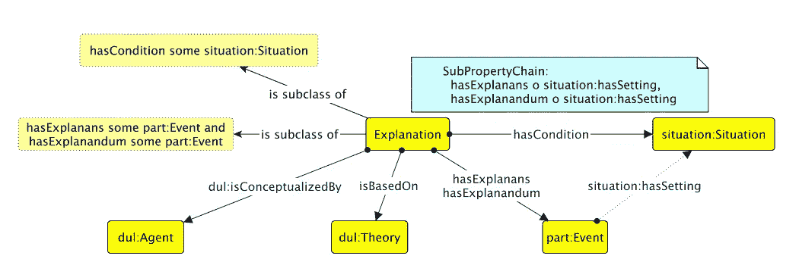
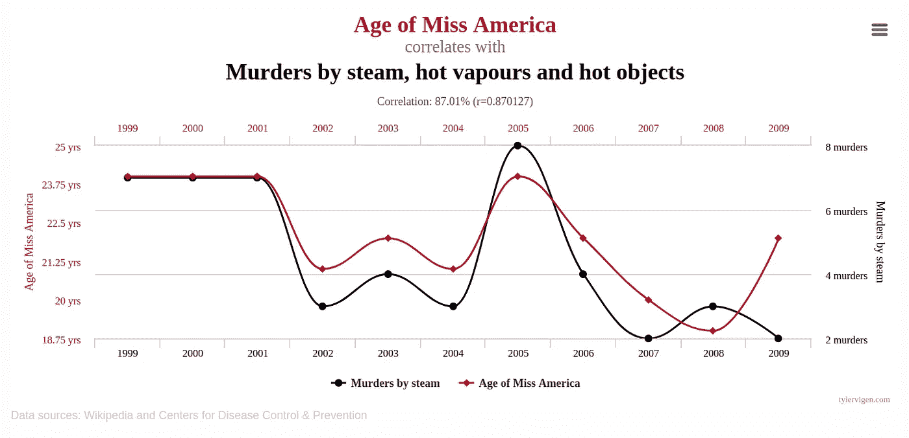

# 论解释人工智能的不可能性

> 原文：<https://towardsdatascience.com/on-the-impossibility-of-explaining-ai-aa0b39768375?source=collection_archive---------19----------------------->

## [模型可解释性](https://towardsdatascience.com/tagged/model-interpretability)

## …及其后果。

阴影(图片由作者提供)。

Y 你在某个医生的办公室里，等着他们描述他们会为你的问题推荐什么样的治疗方案。它不是一个危及生命的问题，但它对你的生活产生了严重影响。它让你焦虑，让你夜不能寐，影响了你们的关系。带着一种既希望又担忧的心情，你等待着医生告诉你他们打算做些什么来修复它。

然后他们告诉你:他们要做 x。

x？你问。好吧，告诉我更多。为什么说是好的选择？你凭什么推荐这个？

哦，他们说我不推荐它。人工智能模型做到了。主要是因为你的年龄。

主要是因为我的年龄？那是什么意思？比我这个年龄的另一个人危险多了还是少了？效率更高？

它的意思是，如果你的年龄稍低，模型会推荐其他的，即 y。

T hat 场景可能听起来完全疯狂，但如果你听听一些人工智能在健康领域的应用程序开发者，那正是他们在卖的东西。我最近听到一个初创公司的人解释说，因为他们可以对输入施加扰动，以观察输出的变化(即灵敏度分析)，所以他们的方法是可以解释的。他们的应用是在健康方面。它完全符合上面的场景，除了我怀疑它会被医生轻易接受。

当然你会告诉我，这不是实现可解释性的唯一方式。你可能是对的，但是那些其他的方法真的那么不同吗？除了找出哪些变量对输出影响最大，LIME 还做了什么？除了寻找模型输入和输出特征之间的相关性，其他方法还能做什么？他们不能做得更好吗？

恐怕他们不能。

解释不仅仅是相互关联。这是医学、心理学、哲学和许多其他学科长期以来已经确定的。这是几年前[的一篇论文](http://oro.open.ac.uk/44321/1/tiddi.pdf)中总结的内容，产生于一位致力于计算机科学解释的研究人员的沮丧，并看到了它是多么令人失望。除了两个事件(解释者和被解释者)的同时发生，它们必须出现在相同的上下文中，更重要的是，它们必须通过一些理论从根本上联系起来，这些理论奠定了它们之间的关系。必须有一些东西表明一个人如何在机械上、化学上、心理上、物理上成为另一个人的原因。那个理论才是真正的解释。我们选择 X 是因为我们相信，不仅从观察中，而且由于一些已知的现象 Y，它在一定年龄后变得更有效。

解释的模式。来自[蒂迪等人 2015](http://oro.open.ac.uk/44321/1/tiddi.pdf) 。

因此，我们的第一个要求是什么应该做出解释:它必须不仅仅是一个相关性。它必须在某种理论层面上把解释成分和被解释成分联系起来。这也是我们的第一个问题。要求解释实际解释模型做出决策的方式也是合理的。它应该解释模型是做什么的。它应该解释基本的逻辑。这听起来可能是显而易见的，但当涉及到解释人工智能时，就不是这样了。这主要是因为他们做的事情实际上很愚蠢。

如果我们专注于天生不透明的机器学习方法，如神经网络，那么相关性就是它们所能获得的全部。他们在数据中找到任何可能显示变量之间关系的信号，并利用它们做出决策。然而，这些关系的实际性质根本不起作用。这完全是外在的，有许多例子<https://www.nature.com/articles/s41467-019-08987-4>****来表明，如果我们用自己的知识仔细观察它们，我们会发现它们实际上并没有反映出一种稳健的决策方式。他们走捷径。他们利用巧合。他们没有基础。我们都见过类似下面这种虚假相关性的例子。神经网络无法区分这一点和有效的因果联系。我们可以，因为我们知道这两件事之间没有任何联系，但是知识是外在的。因此，试图使用这样的外部知识来解释模型的行为可能会有所帮助，但这将是矛盾的，因为模型本身无法访问它。它不能解释模型的决定。它无法解释其逻辑。它只会从外部知识中合理化它。****

********

****很强的相关性。来自[虚假关联](https://www.tylervigen.com/spurious-correlations)网站(抄送)。****

****另一种更积极的方式是:也许我们的目标是建立一个如此庞大的人工智能，包括如此多的与问题直接或间接相关的信息，以至于它们最终会内化理论，这种现象可以解释为什么输入的某些方面和输出的某些方面之间似乎存在联系。这似乎至少在一定程度上是深度学习背后的想法，我们不是精心制作特征来给出模型，而是给它更多的数据，更多的层，让它自己解决。但是，这就是第三个要求发挥作用的地方:难道我们不希望我们的解释是可以理解的吗？如果愿景是建立一个巨大的、超复杂的模型，那么要么解释本身将是超复杂的，要么它们将是模型真正在做的事情的大规模简化(就像他们现在做的那样)。我们不能两者兼得:让人工智能从数十亿个数据点中学习，基于数百万个单元之间的数十亿个连接，并期望用两句话解释我岳母能理解的结果。如果我们能做到这一点，那么也许这个问题并不像我们想象的那样需要太多的智力？让我们明确一点，我的岳母和其他人一样是人工智能的目标，因此也是解释的观众。****

****到总之，上面考虑的三个要求看起来相当合理，尤其是在开始时包括的那种场景中。这些是:****

1.  ****解释不仅仅是相互关联。****
2.  ****解释必须反映模型实际得出结论的方式。****
3.  ****一个解释必须能被受决策影响的人所理解。****

****要求 1 和 2 冲突主要是因为需要解释的人工智能依赖于相关性，并且需要访问外部知识才能得到解释。需求 2 和 3 发生冲突主要是因为，为了以一种可以理解的方式解释非常复杂的模型的结果，我们必须简化模型中实际发生的事情。****

****所以人工智能的可解释性是不可能的。那么，我们应该放弃它，接受人工智能将永远模糊不清(因此不可信和不可靠)的事实吗？我们应该完全放弃那种需要解释的人工智能吗？也许不是。****

****使用人工智能和使用解释可以成为我们更好地理解应该如何做出决定的一种方式。如果知识存在，并且可以为解释模型的结果提供基础，那么也许我们应该将这些知识整合到模型中。如果它还不存在，那么也许我们可以寻找它。也许结果都是垃圾，基于巧合，也许不是。如果不是，我们可能会在这些结果中发现一些东西。决策可能不是人工智能和可解释性的主要目标。它更可能是一种工具，让我们发现让自己的决定更坚定的方法，做出这些决定的新标准，以及支撑这些决定的新知识。****

****—****

*****这里的一些要点是在先前的一本* [*书*](https://books.google.fr/books?hl=en&lr=&id=kfjtDwAAQBAJ&oi=fnd&pg=PA262&dq=info:0OOqtv5FGG4J:scholar.google.com&ots=8dOrzk-mxx&sig=2EYGKZmJEsTY-N1tyaAhHlDv6jU&redir_esc=y#v=onepage&q&f=false) *章中发展出来的。查看* [*其他讨论 AI 一般方面的文章*](https://medium.com/@mathieu.daquin.x) *，比如:*****

****</ai-winter-and-other-seasons-31445f54f4ec> ****