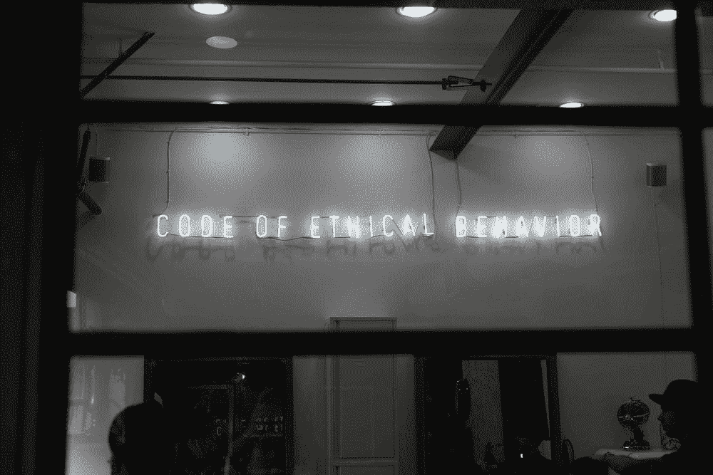

# 论人工智能应用的严肃性

> 原文：<https://towardsdatascience.com/on-the-seriousness-of-ai-applications-f512fd3ced56?source=collection_archive---------44----------------------->

## *关于理解人工智能项目背后的影响和道德的故事和信息*

内森·杜姆劳在 [Unsplash](https://unsplash.com/photos/Ny0Lt7hLSJ0) 上的图片

人工智能的民主化似乎是有益的——任何人，包括像我这样的年轻开发人员，都可以通过参加一门 Coursera 课程或观看 Youtube 播放列表来轻松参与人工智能。不幸的是，包括我在内的许多人都不明白 AI 在现实世界中是如何发挥作用的。对于从基本的面向对象编程开始的程序员来说，很难想象我们创建的应用或程序会对其他人产生任何影响。一般来说，这是真的，因为用 Java 创建一个外星入侵者游戏肯定没有实际意义。然而，构建作为产品进行营销的 AI 应用是非常危险的。

人工智能像所有新领域一样，明显不受监管。开发人员必须遵守的书面行为准则很少。因此，开发人员似乎可以生产任何种类的人工智能应用程序，声称它是有效的，并将其作为真正的产品进行营销。人工智能是一个特别的问题，因为对于人工智能在我们的人口中是如何工作的知识严重缺乏。普通消费者将无法确定人工智能应用程序是如何工作的，这意味着开发者可以传播错误信息来增加他们的销售或用户。

虽然大多数开发人员没有玩世不恭的动机，但即使是那些想要创建软件来改善他人生活的人，也可能会无意中将用户置于危险的境地。本文旨在传达承认人工智能应用程序的伦理和道德含义并采取措施确保它们在开发过程中得到优先考虑的重要性。

# 我的故事

从一年前开始，我开发了我的第一个主要的人工智能应用程序，它使用 NLP 来区分自杀和抑郁消息。自杀当然是一个严肃的话题，大多数高中生可能不应该创建基于人工智能的解决方案，但当我和我的团队开始时，它只是一个个人项目，所以它不是什么大事。我们的项目取得了一些成功和积极的反馈，因此从那时起，我们继续完善我们的模型和功能。一旦我们对该应用的性能和功能感到满意，我们决定联系治疗师，询问他们对我们下一步可能采取的措施的意见。治疗师对我们的渴望感到兴奋，但他们不断警告我们工作的含义。他们对我们的解决方案有点怀疑，并敦促我们如果想认真对待它，就要寻求临床验证。幸运的是，经过进一步的讨论，我们能够与当地的治疗师建立伙伴关系，这有助于我们建立信誉。

受到我们进步的鼓舞，我们过早行动了。几个月后，我们决定从互联网上获取对我们应用程序的反馈。这是一个大错误。我们的帖子无意中将该应用宣传为一个准备推出的真实产品，而实际上我们只是在寻求宣传、反馈和一些 Github 明星。反馈是残酷的批评和关注。起初，我们被贴上了贪财的开发者的标签，他们不关心我们所服务的人们。人们批评我们缺乏关注担心的家人和朋友在看到可以帮助他们所爱的人的人工智能解决方案时会有什么反应。除了这个模型在临床上不准确的事实(测试它的人引起了我们的注意)，我们创建的应用程序的图像令人担忧。

我们写了一篇研究论文，只证明了机器学习算法在机器学习评估中的性能，而不是临床验证。虽然我们声明该论文不是临床证明，但我们相信，因为我们有一篇发表的论文，这意味着我们的应用程序实际上是有效的和准确的。网上论坛上的人继续向我们施压，敦促我们撤下这份申请。他们批评这篇论文没有包括临床支持，虽然我们明确表示我们没有接近临床实施，但我们仍然面临审查。人们甚至发现了我们的电子邮件，并要求我们关闭应用程序，以防止对任何人造成伤害。

当我们最终透露我们是高中生时，公众的反应发生了变化，变得更加友好。很多人道歉，称赞我们高中生的热情和工作水平。然而，他们花时间教育我们，告诉我们工作的危险性。虽然我们是高中生，但这并不意味着我们有借口忽视我们项目的伦理意义。如果高中生可以在高水平上学习人工智能并构建真正的应用程序，他们也必须对自己工作的道德问题负责。

我们的伦理担忧显然是关于不正确预测的影响。如果有人使用我们的应用程序，并认为他们所爱的人没有抑郁，而实际上他们是抑郁的，那么谁应该承担责任？如果真的有人自杀，是我们的错吗？还是用户没有理解我们 app 的细微差别的错？在我看来，即使用户不知道我们的应用程序是如何工作的，即使我们声称它不是一个真正的产品，我们也绝对会对给用户造成的任何伤害承担责任。这是一个没有警告的公共应用程序，它不是一个真正的产品。怎么会有人知道这只是个人项目呢？

这些都是我们没有回答甚至没有想到的问题。我们立刻对过去几个月的决定感到后悔。我们不负责任，只关心宣传和赞美。现在，我们已经剔除了任何表明我们的应用程序合法的迹象。我们已经明确表示，这是一个出于学习目的的个人项目，仅此而已。现在到处都有警报和迹象表明它不是一个经过临床验证的应用程序。然而，从一开始就应该如此。如果我们足够聪明去学习 NLP 并构建一个完整的应用程序，我们肯定足够聪明去意识到我们的执行是危险的。

# 外卖食品

对于那些探索人工智能的人来说，它比编程的其他领域更有意义和影响。对于大多数年轻的开发人员来说，从基本的 OOP 编程到构建人工智能应用的跳跃发生得很快。虽然这看起来只是一个新的噱头领域，但人工智能已经在许多地方以许多方式使用，其影响是严重的。

如果你是人工智能新手，不要跳入医疗保健等严肃领域。从更琐碎的话题开始，比如股市预测或基本的 MNIST 分类。要学的东西很多，所以要慢慢开始。虽然构建人工智能项目很有趣，也可能是一个很好的爱好，但如果你想真正推出自己的应用，请对你的市场和道德影响进行适当的研究。与更了解市场、更有经验的人建立伙伴关系，这样他们可以保护你。

对于开发者来说，在构建应用时，请始终考虑伦理和道德原则。名誉、金钱和贪婪不应该以伤害消费者为代价。人工智能系统没有太多规定的事实不应该成为无知或恶意行动的理由。相反，帮助建立一个关于人工智能系统的通用行为准则。促进有道德的人工智能，并在你自己和你的同龄人中执行规则。参加与道德相关的会议，鼓励关于保护消费者的讨论。

虽然我只是一名高中生，但我担心人工智能如何被用于有害的，尤其是无意的有害方式。当我进入大学，并最终进入工业界或学术界时，我希望成为促进道德人工智能的主要参与者。AI 让我兴奋，它的潜力驱动着我。然而，它在目前的状态下有缺陷，我想消除它们，而不是像我迄今为止所做的那样助长它们。但截至目前，我能做的就是写一篇文章，希望人们阅读并认真对待。