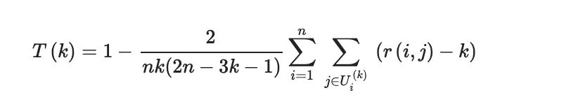

# 关于 UMAP 的验证

> 原文：<https://towardsdatascience.com/on-the-validating-umap-embeddings-2c8907588175?source=collection_archive---------15----------------------->

## 验证亚马逊 DenseClus 中 UMAP 嵌入的一个实例

没有大量实际的工作来验证[一致流形逼近和投影(UMAP](https://arxiv.org/abs/1802.03426) )。在这篇博文中，我将展示一个真实的例子，希望提供一种额外的方法来验证算法的结果。


Artem Verbo 在 [Unsplash](https://unsplash.com/search/photos/cat-cute?utm_source=unsplash&utm_medium=referral&utm_content=creditCopyText) 上拍摄的照片

一般来说，通常的做法是基于下游任务来验证 UMAP 收敛。例如，在分类的情况下，您使用一个客观的度量标准，如 [F1-Score](https://en.wikipedia.org/wiki/F-score) 作为评估维度减少的代理性能度量标准。然而，高 F1 分数 ***并不能保证***UMAP 准确地捕捉到了数据的结构。下游任务的高精度只是告诉你数据在低维是可分离的，在给定输入的情况下表现良好。

简单地说，使用一个度量来评估底层数据的结构保持性**和**一个下游任务度量。可信度和连续性是前者。

这篇博文将带你了解如何使用亚马逊的[dense clus](https://github.com/awslabs/amazon-denseclus)包运行可信度和连续性作为额外的检查，以确认 UMAP 收敛到一个稳定的结果。

## 在那之前，UMAP 是什么？

UMAP 是一种针对高维数据的非线性降维技术。“视觉上类似于 t-SNE 算法(也使其黯然失色)，UMAP 假设数据均匀分布在一个[局部连通的](https://en.wikipedia.org/wiki/Locally_connected)黎曼流形上，黎曼度量是局部恒定或近似局部恒定的”(参见: [UMAP:统一流形近似和降维投影— umap 0.3 文档“](https://umap-learn.readthedocs.io/en/latest/))

在 [UMAP 论文](https://arxiv.org/abs/1802.03426) (UMAP:一致流形逼近和投影麦金尼斯等 2018)中，有一些分析需要拓扑学博士才能完全理解。

现在，让我们把它定义为一种基于**邻居的**降维方法，它可以处理数字和/或分类数据。

如果你想要更深层次的理解，查看上面的 UMAP 文档链接或者作者的 PyData 演讲。

## 安装 UMAP

无论如何，让我们收集一些数据。

您将直接从 [Churn 管道](https://github.com/awslabs/aws-customer-churn-pipeline) repo 中获取一个数据来运行该示例。

原始客户流失数据集是公开可用的，并在丹尼尔·t·拉罗斯的《T2 发现数据中的知识》一书中有所提及。作者将其归功于加州大学欧文分校的机器学习数据集仓库。

```
import matplotlib.pyplot as plt
import seaborn as sns
import pandas as pd
import numpy as np

%matplotlib inline

sns.set_style("darkgrid", {"axes.facecolor": ".9"})
sns.set(rc={"figure.figsize": (10, 8)})

SEED = 42
np.random.seed(SEED)  # set the random seed as best we can

data_url = "https://raw.githubusercontent.com/awslabs/aws-customer-churn-pipeline/main/data/churn.txt"
df = pd.read_csv(data_url).sample(n=2000, random_state=SEED)
df.drop(["Phone","Area Code"], axis=1, inplace=True)
```

接下来，既然已经加载了一个数据集，就给它安装 [Amazon DenseClus](https://github.com/awslabs/amazon-denseclus) 。在幕后，DenseClus 运行着 UMAP，将相干组与混合类型的数据进行拟合。[点击这里](https://aws.amazon.com/blogs/opensource/introducing-denseclus-an-open-source-clustering-package-for-mixed-type-data/)阅读这篇博文中的更多信息。

实际上，下面的代码适合两个 UMAP 图层，一个用于数值数据，一个用于分类数据，然后将这两个图层结合起来。在很大程度上，预处理步骤是在幕后进行的。

```
from denseclus.DenseClus import DenseClus

clf = DenseClus(
    random_state=SEED,
    cluster_selection_method='leaf',
    umap_combine_method="intersection_union_mapper"
)

clf.fit(df)
```

请注意，您在这里为可再现性设置了一个种子，这意味着 UMAP 将在单核上运行。在现实世界中，您不会在单个内核上运行。这意味着，由于算法的随机性质，实际结果在运行之间会有所不同。

```
clf.numerical_umap_.embedding_array([[4.1107535, 6.445445 , 7.030162 ],
       [5.704323 , 3.341485 , 8.94879  ],
       [6.6701894, 3.3435433, 8.452102 ],
       ...,
       [4.8372636, 6.5357466, 7.2330604],
       [5.3695483, 2.8402767, 8.08292  ],
       [5.979106 , 3.3134317, 7.6845136]], dtype=float32)
```

## 诚信是有用的

可信度和连续性衡量降维后数据结构的保留程度。

在 Statis el al 2016 的论文《在降维参数空间中语义控制的 Adaptvive Equalisation》中找到了很好的解释:“这里，使用秩序来测量点 *i* 在高维空间中相对于其 *k* 最近邻点的距离，并且测量每个秩在低维空间中变化的程度。对于 n 个样本，设 *r(i，j)* 为样本 *i* 到样本 *j* 在高维空间 *Uki* 中的距离等级。同理，设*rˇ(I，j)* 为低维空间 *Vki* 中样本 *i* 与样本 *j* 之间距离的秩。使用最近的邻居，如果这些 *k* 邻居也被放置在低维空间中的点 I 附近，则地图被认为是可信的。”



来源:“降维参数空间中语义控制的自适应均衡”，Stasis 等人，2016 年

在 Continuity it 的情况下，Stasis 指出，它“测量原始数据点簇被保留的程度，可以被认为是可信度的逆，在低维空间中找到接近点 I 的样本点，但在高维平面中没有。”


来源:“降维参数空间中语义控制的自适应均衡”，Stasis 等人，2016 年

每个计算的分数输出在 0 和 1 之间。分数越高，原始数据集的局部结构在 UMAP 嵌入中保留得越多。

UMAP 有一个 Numba 优化计算(在验证子模块下)，可以很好地扩展到中等大小的数据。如这里的所示[，另一个参考文献在](https://github.com/lmcinnes/umap/issues/6) [SKLearn 库](https://github.com/scikit-learn/scikit-learn/blob/ccd3331f7eb3468ac96222dc5350e58c58ccba20/sklearn/manifold/t_sne.py#L394)中。

就像上面一样，K 点上的成对距离是在原始数据和嵌入之间取得的。如果发现任何意想不到的邻居，它们将根据原始数据按等级比例受到惩罚。

好了，让我们检查一下嵌入是否在底层数据中捕获了它的邻居。

## 对数据运行验证

对于本例，您将设置 K=30，查看 30 个相邻点进行比较。

*注意:您在这里使用默认的欧几里德距离计算，但是请记住，它支持备选的成对或平方距离。归根结底，这是一个具体问题的选择。*

```
from umap import validation

K = 30

numerical_trustworthiness = validation.trustworthiness_vector(source=clf.numerical_umap_._raw_data
                                  ,embedding=clf.numerical_umap_.embedding_
                                  ,max_k=K)

categorical_trustworthiness = validation.trustworthiness_vector(source=clf.categorical_umap_._raw_data
                                  ,embedding=clf.categorical_umap_.embedding_
                                  ,max_k=K)

_=plt.plot(numerical_trustworthiness)
_=plt.plot(categorical_trustworthiness)
_=plt.ylabel("Value of K")
_= plt.xlabel(f"Trustworthiness score")
_=plt.title(f"Trustworthiness at {K}")
_=plt.legend(["numerical T", "categorical T"], loc="upper right")
```


作者图片

一般来说，0.80 以上的分数被认为是**“好”**的成绩。较低的分数表示您需要查看输入数据和 UMAP 参数以找到更好的拟合。查看从 K=1 到 K=30 的数字嵌入的可信度，我们看到在 K=5 时可信度达到 0.96，然后在 K=30 时进一步下降到 0.90。

同样，对于分类嵌入，K=5 设置为 0.94，然后在 K=30 时下降到 0.93，显示出比数值数据更好的稳定性。

DenseClus 默认使用邻居的 K=30 来生成 UMAP 嵌入，因此这是一个合理的比较。

## 结论

在这篇博文中，您学习了如何在 DenseClus 中验证 UMAP 嵌入，方法是使用可信度来查看源数据和嵌入之间的相邻点有多远。

DenseClus 提供了一种简单的方法来演示如何以这种方式验证多个嵌入。信不信由你，DenseClus 将两者结合到第三个嵌入空间来计算集群！但是，该空间没有可比较的输入数据，因为它是通过 UMAP 图之间的集合运算创建的。这里进一步验证成功的最佳方式是继续运行下游任务。

如果你读到这里，感谢你的阅读:)

请记住，您只是触及了这里的皮毛。基于下游任务方法，以可信度作为约束，可以调整多个可用的底层超参数。

这个例子的笔记本贴在 DenseClus 的 Github repo [下面这里](https://github.com/awslabs/amazon-denseclus/blob/main/notebooks/Validation%20For%20UMAP.ipynb)。

## 参考

“一致流形逼近和降维投影”，麦金尼斯，利兰；约翰·希利；詹姆斯·梅尔维尔 2018“邻里

“非线性投影方法中的保存:实验研究”，Venna 2001 年

“降维参数空间中语义控制的自适应均衡”，Stasis 等人，2016 年