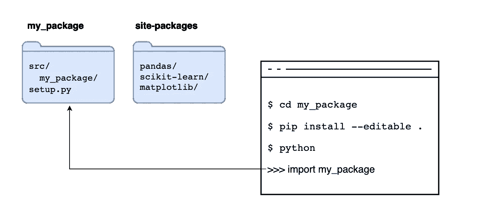

# 写干净的笔记本

> 原文：<https://towardsdatascience.com/on-writing-clean-jupyter-notebooks-abdf6c708c75?source=collection_archive---------3----------------------->

## [提示和技巧](https://towardsdatascience.com/tagged/tips-and-tricks)

## 写可读和可维护的笔记本的 10 个建议

作者图片

笔记本是探索数据的绝佳工具，但如此强大的工具很快就会变得难以管理。具有讽刺意味的是，与我们的数据快速交互(修改代码单元、运行和重复)的能力正是笔记本可能成为难以理解的变量的模糊纠缠的确切原因，即使对笔记本的作者来说也是如此。但不一定非要这样。这篇文章总结了我过去几年写干净笔记本的经验。

大约在同一时间，也就是六年前，我学习了 Python 并发现了 Jupyter 笔记本。最让我吃惊的一件事是，人们是如何写出别人可以可靠使用的代码的。我看了像 scikit-learn 这样的项目，它启发我开始了我的第一个[开源项目](https://github.com/edublancas/sklearn-evaluation)。很快，我学到了很多软件工程实践，比如模块化和打包。尽管如此，我还是不确定如何将其转化到我的数据科学工作中，因为数据分析伴随着更多的不确定性和动态性。但是随着 Python 数据工具生态系统的成熟，我开始思考如何让它发挥作用。

# 摘要

这是细目分类:

1.  锁定依赖关系
2.  打包您的项目
3.  模块化代码
4.  小心可变的数据结构
5.  从外部模块自动重新加载代码
6.  单元测试
7.  分部门组织
8.  使用代码棉签
9.  使用代码自动格式化程序
10.  写更短的笔记本

请继续阅读每一节的详细内容。

此处提供示例代码。

# 1.锁定依赖关系

在讨论*干净的笔记本*之前，我们先花点时间讨论一下依赖管理。无数次，我试图执行一个旧的笔记本(来自我自己或其他人),并撞上多个`ModuleNotFound`错误。即使在为它们中的每一个运行了`pip install`之后，遇到神秘的错误也并不罕见，因为包 API 发生了变化，不再与代码兼容。

以防止因缺少依赖关系而损坏笔记本。我们使用的每个第三方软件包都必须在一个`requirements.txt`文件中注册(如果我们使用的是 conda，则为`environment.yml`)。例如，一个典型的`requirements.txt`可能看起来像这样:

在虚拟环境中安装我们的依赖项后(请始终使用[虚拟环境！](https://ploomber.io/posts/python-envs/))，我们可以使用以下内容生成所有已安装依赖项的详尽列表:

我们的`requirements.lock.txt`看起来像这样:

为什么`requirements.lock.txt`包含这么多行？每个包都有一组依赖项(例如，pandas 需要 NumPy)；因此，`pip freeze`生成了运行我们项目所需的*所有*包的列表。每一行还包括特定的安装版本。因此，如果我们想在一年后运行我们的笔记本，我们不会遇到兼容性问题，因为我们将安装与开发时相同的版本。

即使我们的项目包含多个笔记本，单个`requirements.txt`就足够了。但是，请记住，我们的项目的依赖项越多，遇到依赖项冲突的机会就越大(例如，想象熊猫需要 NumPy 1.1 版，但是 scikit-learn 需要 NumPy 1.2 版)。

记住保持你的`requirements.txt`和`requirements.lock.txt`最新:如果你需要的话添加新的包，如果你不再需要的话移除它们。

# 2.打包您的项目

当编写一个笔记本时，开始在我们的笔记本文件中定义函数或类是很诱人的，但是这会造成一些复杂性。第一，它使得无法在另一个笔记本中导入这样的代码，第二，它使得很难推理其语义(这是处理数据还是绘制数据的函数？).更好的做法是将我们的函数和类定义保存在一个单独的文件中，并将它们导入到我们的笔记本中:

这样一个简单的布局工作得很好，直到我们想要在文件夹中组织我们的代码:

如果我们打开`exploration.ipynb`，就不能再做`import plot`或者`import process`。那是因为在使用`import`的时候，Python 会先寻找一个同名的本地模块(也就是同一个目录下的文件)，然后，在`site-packages`中寻找(当你做`pip install {package}`的时候就是包存放的地方)。因此，如果我们希望 Python 导入我们的代码，我们必须告诉 Python 在哪里可以找到它。我相信你以前见过这个:

我们告诉 Python 在`../src`中寻找模块。如果我们这样做，我们将能够导入`plot.py`和`process.py`。但这是一种可怕的做法。修改`sys.path`使得我们的代码容易被破坏，因为它假设我们想要导入的代码存在于一个特定的位置。如果我们移动任何`.py`文件，我们会弄坏我们的笔记本。幸运的是，有一个健壮的方法可以解决这个问题:创建一个 Python 包。

Python 包是可以用`pip install {package}`安装的 Python 文件的集合。`pip`负责配置 Python，以便它知道在哪里寻找代码。创建包很简单；它只需要您添加一个`setup.py`文件:

然后，我们对我们的项目布局做了一个小小的改变，将我们的代码放在一个`my_package/`目录下，并添加一个`__init__.py`文件:

就是这样！如果您移动到包含`setup.py`文件的文件夹，您可以:

让我们看看这个命令是怎么回事。当通过`pip install {package}`安装包时，我们告诉 pip 转到 [Python 包索引](https://pypi.org/)，搜索具有所请求名称的包，并将其存储在`site-packages`中。

但是`pip`可以从其他位置安装。例如，假设我们执行`pip install .`。在这种情况下，我们告诉`pip`使用当前目录中的源代码，运行这样的命令复制代码，并将其存储在任何其他第三方包旁边的`site-packages`中，如果我们导入它，它将读取`site-packages`中的副本:

作者图片

如果我们添加`--editable`标志，我们告诉`pip` *不要复制*代码，而是读取代码的原始位置，允许我们对代码进行更改，并让 Python 在导入代码时使用最新版本:

作者图片

安装好我们的包后，*文件夹中的任何*模块都可以从*任何*目录中导入:

我们走吧，没有更多的`sys.path`拨弄！

# 3.模块化代码

在浏览数据时，大部分代码如下所示:

但有时，有些代码会有更多的结构:

1.  多次调用的代码片段
2.  具有控制结构的片段(即`if`、`for`)

对于第一种，最好把它们抽象成函数，在笔记本上调用。第二种更主观一些，这取决于代码片段的复杂程度。如果它是一个只有几行代码的单一控制结构，把它留在笔记本里是可以的，但是如果它是一个多行的控制结构，最好创建一个函数，即使你只使用它一次，然后在笔记本里调用它。

一个干净的笔记本实际上是一系列代码行，几乎没有控制结构。软件复杂度以一种叫做[圈复杂度](https://en.wikipedia.org/wiki/Cyclomatic_complexity)的度量标准来形式化，这种度量标准衡量一个程序有多复杂。直观地说，一个程序的*分支*越多(如`if`语句)，它就越复杂。

在每个`git push`上测量笔记本复杂度是防止过于复杂的笔记本进入代码库的一种方式，该包可以测量 Python 程序的圈复杂度:

在前面的命令中，我们只报告复杂性为 3 或更高的笔记本部分；这允许存在简单的控制结构:

但是任何比这更复杂的东西(比如嵌套的控件结构)都会被标记出来:

# 4.小心可变的数据结构

大多数用于数据操作的数据结构都是可变的，这意味着您可以设置一些初始值并在以后修改它们。看一下下面的例子:

正如我们在前面的例子中看到的，我们用零初始化了一个数据帧，但随后修改了这些值。在这么短的代码片段中，很容易看出发生了什么:我们知道在改变数据帧后，`zeros`列包含 1。

然而，如果突变隐藏在函数内部，同样的模式也会导致问题。假设您有以下笔记本:

在这个例子中，函数内部发生了突变；当您到达包含突变`add_one(df)`的单元格时，您可能甚至不记得`add_one`更改了`zeros`列，并假设`df`仍然包含零！如果函数定义存在于不同的文件中，那么跟踪突变就更加复杂。

有两种方法可以防止这类问题。第一种是使用[纯函数](https://en.wikipedia.org/wiki/Pure_function)，这是没有副作用的函数。让我们把`add_one`重新写成一个纯函数:

我们不是对输入数据帧(`df`)进行突变，而是创建一个新的副本，对其进行突变并将其返回:

这种方法的一个警告是，我们浪费了太多的内存，因为每次我们将函数应用于数据帧时，都会创建一个副本。过多的数据复制会迅速增加内存使用量。另一种方法是明确我们的突变，并将对给定列的所有转换放在一个地方:

前面的例子修改了`zeros`列，但方式不同:`add_one_to_column`将一个列作为输入，并返回变异后的值。变异以显式方式发生在函数之外:`df['zeros'] = add_one_to_column(df['zeros'])`。通过查看代码，我们可以看到我们通过对`add_one_to_column`列应用函数来修改它。如果我们对`zeros`列有其他转换，我们应该将它们保存在同一个单元格中，或者更好，保存在同一个函数中。这种方法更节省内存，但是我们必须非常小心以防止错误。

# 5.从外部模块自动重新加载代码

你以前可能尝试过的一件事是将一个函数/类导入到笔记本中，编辑它的源代码，然后再次导入。不幸的是，这样的方法行不通。Python 导入有缓存系统；一旦导入了某个东西，再次导入它不会从源代码中重新加载它，而是使用以前导入的函数/类。但是，有一种简单的方法可以启用模块自动重载，方法是在笔记本顶部添加以下代码:

因为这不是 Python 的原生特性，所以它有一些奇怪的地方。如果您想了解更多关于这种方法的局限性，请查阅 [IPython 的文档](https://ipython.readthedocs.io/en/stable/config/extensions/autoreload.html#caveats)。

# 6.单元测试

考虑到数据科学家必须以多快的速度移动到*来完成事情*(例如，提高模型性能)，我们经常忽略测试就不足为奇了。尽管如此，一旦你习惯了编写测试，它会从根本上提高你的开发速度。

例如，如果您正在使用一个函数来清理数据框中的一列，您可能会交互式地测试一些输入来检查它是否正常工作。在手动测试以确保代码工作之后，您继续前进。一段时间后，您可能需要修改原始代码以在新的用例下工作，运行一些手动测试并继续进行。如果不测试所有的情况，手工测试过程会浪费太多的时间，并为错误敞开大门。最好将那些手动测试写成单元测试，这样您就可以在每次代码更改时快速运行它们。

说要考你的`process.py`；可以添加一个`tests/test_process.py`:

并开始编写您的测试。我通常在`tests/`目录中为`src/`目录中的每个名为`test_{module_name}.py`的文件创建一个文件。这样的命名规则允许我知道在修改代码时运行哪个测试文件。

运行测试的框架有很多，但是我推荐你使用 [pytest](https://docs.pytest.org/) 。例如，假设我们正在编写一个函数来清理包含姓名的列，我们在笔记本中使用它，如下所示:

稍微研究了一下数据之后，我们将发现我们必须应用哪种处理来清理名称:将单词大写，如果名称是“姓，名”格式，则交换顺序，删除前导/尾随空格，等等。有了这些信息，我们可以编写(输入，输出)对来测试我们的功能:

这里我们使用`@pytest.mark.parametrize`装饰器为每个`(name, expected)`对参数化一个测试；我们用`name`调用我们的`clean_name`函数，并检查输出是否等于`expected`。

然后运行您的测试:

编写测试并不简单，因为它涉及到考虑代表性的输入及其适当的输出。通常，数据处理代码操作复杂的数据结构，如数组或数据帧。我的建议是尽可能在最小的数据单元进行测试。在我们的例子中，我们的函数在值级别上操作；在其他情况下，您可能会对整个列应用转换，在最复杂的情况下，可能会对整个数据框应用转换。

学习如何使用 Python 调试器是修复失败测试用例的一项重要技能。假设我们正在修复一个测试。我们可以重新运行我们的测试，但是这次只要其中一个失败就停止执行:

一旦失败，就会启动一个交互式调试会话，我们可以用它来调试我们的管道。要了解更多关于 Python 调试器的信息，[请阅读文档](https://docs.python.org/3/library/pdb.html)

请注意，前面的命令在任何引发错误的给定行启动调试会话；如果要在任意代码行启动调试器，请添加以下代码行:

像这样运行您的测试:

完成后，从代码中删除`from pdb import set_trace; set_trace()`。

如果您想在任何给定的行启动常规 Python 会话，而不是调试器:

并以同样的方式调用您的测试(`pytest tests/ -s`)

# 7.分部门组织

图片作者。

当探索数据时，随着我们对 it 的了解越来越多，自然会有机地编写代码；然而，在实现任何小目标(例如，创建一个新的图表)之后，重温我们的代码并重新组织它是很重要的。为我们的笔记本提供清晰的组织结构使它们更容易理解。一般来说，我用相同的结构保存我的笔记本:

1.  导入报表
2.  配置(例如，开放式数据库连接)
3.  数据加载
4.  内容

每个内容部分都有一个标准结构:

1.  降价标题(如`# My notebook section`)
2.  描述。一两行文字概括了这一部分的内容
3.  外卖。这一部分最重要的几个要点
4.  代码。清理、分析或绘制数据的实际程序。

# 8.使用代码棉签

当重构旧代码时，我们可能会忽略彻底清理它。例如，假设我们使用一个名为`some_plotting_package`的包来创建一些自定义图表，但是发现它不是我们想要的。我们可以删除调用这样一个包的单元格，但是忘记删除`import some_plotting_package`语句。当我们编写更多的程序时，很容易忽略这些小细节。虽然它们可能对程序的执行没有任何影响，但是它们对可读性有很大的影响。

大多数文本编辑器都有检测问题和标记有问题的行的插件。下面是 Visual Studio 代码的一个截图，显示了第一行中的一个问题(`matplotlib`已导入但未使用):

VS 代码截图。图片作者。

不幸的是，Jupyter 笔记本/实验室没有多少林挺插件。最可靠的选择似乎是 jupyterlab-flake8，但是这个项目似乎被放弃了。

我发现清理笔记本的最好方法不是使用`.ipynb`文件，而是普通的`.py`文件。jupytext 实现了一个 Jupyter 插件，允许你将`.py`文件作为笔记本打开。例如，假设你有一个`exploratory.ipynb`，你想启动林挺它。首先，使用 jupytext 将笔记本转换为脚本:

上面的命令会生成一个`exploratory.py`，您仍然可以像打开笔记本一样打开它。如果使用`jupyter notebook`，这将自动发生；如果使用`jupyter lab`，则需要`Right Click -> Open With... -> Notebook`。

编辑完你的“笔记本”，你可以在任何支持 Python 林挺的文本编辑器中打开它；我推荐 Visual Studio 代码，因为它是免费的，而且很容易为 Python 林挺设置。注意有很多选项可以选择；我的推荐是用 [flake8](https://flake8.pycqa.org/en/latest/) 。

请注意，由于`.py`文件不支持将输出存储在同一文件中，如果您关闭该文件，所有表格/图表都会删除。但是，您可以使用 [jupytext 的配对功能](https://jupytext.readthedocs.io/en/latest/paired-notebooks.html)将`.py`文件与`.ipynb`文件配对。你编辑`.py`文件，但是`.ipynb`笔记本用来备份你的输出。

# 9.使用代码自动格式化程序

棉短绒只能指出问题所在，却不能解决问题；但是，自动格式化程序会为您完成这项工作，使您的代码更加易读。使用最广泛的自动格式化程序是[黑色](https://github.com/psf/black)，但也有其他选项，如 [yapf](https://github.com/google/yapf) 。

自动格式化`.ipynb`文件有几个选项([一个](https://github.com/ryantam626/jupyterlab_code_formatter)、[两个](https://github.com/dnanhkhoa/nb_black)、[三个](https://github.com/drillan/jupyter-black))。我没有试过这些，所以我不能评论它们的用法。我推荐的方法与上一节中描述的方法相同:使用 jupytext 将`.py`文件作为笔记本打开，然后使用 Visual Studio 代码对这些`.py`文件应用自动格式化。[点击此处](https://code.visualstudio.com/docs/python/editing#_formatting)获取在 VS 代码中设置格式的说明。

请注意，自动格式化程序并不能解决 flake8 带来的所有问题，因此您可能仍然需要进行一些手动编辑。

# 10.写更短的笔记本

作者图片

由于笔记本是交互式编写的，我们倾向于使用短的变量名，通常遵循我们正在使用的库规定的惯例。很多次我不愿意承认我犯了这样的错误:

重用变量名是错误的重要来源。当交互开发时，我们可能希望节省一些击键次数，并为大多数变量指定简短的名称。这对于获得快速探索体验来说很好，但是我们的笔记本越长，遇到这些问题的几率就越高。最好的方法是将我们的笔记本分成更小的部分，以减少副作用的可能性。

将笔记本分解成多个部分并不像听起来那么容易，因为我们必须找到一个将一个部分连接到下一个部分的部分(即，保存我们的数据框并将其加载到下一个部分)，但这样做将帮助我们创建更易于维护的代码。

如何决定何时可以添加新单元格，何时创建新笔记本这是非常主观的，但这里是我的经验法则:

1.  不同的数据集必须在不同的笔记本中
2.  连接数据集时，创建一个新数据集
3.  一个笔记本用于数据清理，另一个用于绘图(如果进行 ML，则用于特征生成)

当然，这取决于你项目的复杂程度。如果您正在处理一个小数据集，将所有内容保存在一个笔记本中可能是有意义的，但是一旦您正在处理两个或更多数据源，最好将其拆分。

如果您想节省时间将多个笔记本连接成一个连贯的分析管道，请尝试一下 [Ploomber](https://github.com/ploomber/ploomber) 。它允许您这样做，并提供了更多功能，如笔记本并行化、调试工具和云中执行。

# 最后的想法

写干净的笔记本需要一些努力，但绝对值得这个价钱。编写干净代码的主要挑战是在迭代速度和代码质量之间取得健康的平衡。我们的目标应该是在我们的代码中设定一个最低的质量水平，并不断地改进它。通过遵循这十条建议，你将能够写出更整洁、更易于测试和维护的笔记本。

你对改善 Jupyter 笔记本的代码质量有其他想法吗？[请伸出](https://twitter.com/edublancas)。讨论这些话题我总是很兴奋。

*感谢菲利普·扬科维奇对这篇文章的早期版本提供反馈。*

*最初发布于* [ploomber.io](https://ploomber.io/posts/clean-nbs)