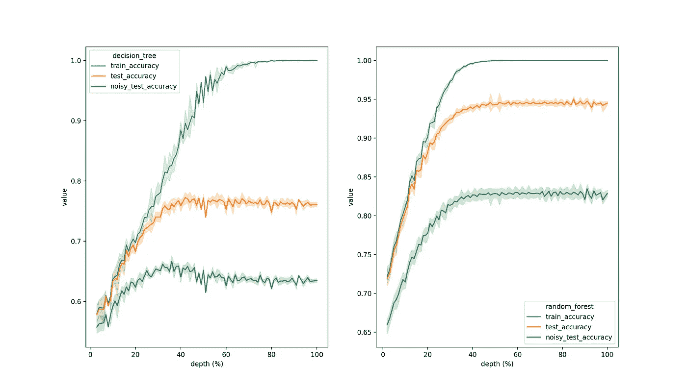

# 关于随机森林和过度适应的一个常见误解

> 原文：<https://towardsdatascience.com/one-common-misconception-about-random-forest-and-overfitting-47cae2e2c23b?source=collection_archive---------2----------------------->

## 自举、多数投票规则和 100%训练准确率的悖论

照片由 [Robert Bye](https://unsplash.com/@robertbye?utm_source=medium&utm_medium=referral) 在 [Unsplash](https://unsplash.com?utm_source=medium&utm_medium=referral) 上拍摄

100%的训练准确率是否表明过度拟合？有许多调整随机森林中树木深度的建议来防止这种情况发生:见[这里](/optimizing-hyperparameters-in-random-forest-classification-ec7741f9d3f6)或[这里](https://medium.com/all-things-ai/in-depth-parameter-tuning-for-random-forest-d67bb7e920d)。这个建议是错误的。这篇文章解释了为什么随机森林的 100%训练准确率与过度适应无关。

这种混乱源于将过度拟合作为一种现象与其指标相混淆。过度拟合的一个简单定义是，当一个模型在我们关心的数据上不再像我们希望的那样准确时。而且我们很少关心训练数据。然而，训练数据上的满分通常是一个很好的指标，表明我们将面临新数据上令人失望的性能下降。通常，但不总是。要理解为什么应该看看随机森林实际上是如何工作的。

简而言之，随机森林包括 1)完全生长的树，2)建立在引导数据上，3)和多数投票规则来进行预测。Leo Breiman 和 Adele Cutler 对前两个概念进行了简洁的解释[1]:

> 如果训练集中的案例数为 N，则从原始数据中随机抽取 N 个案例——但使用替换的*。这个样本将成为种植这棵树的训练集。*
> 
> 每棵树都长到了最大限度。没有修剪。

第三个不言自明。

记住这 3 个概念，很容易看出随机森林如何产生 100%的训练准确性。考虑一个简单的二进制分类问题。如果每棵树都完全长大，就是这样——每片叶子都是纯叶子，并且每个观察值在引导过程中有 62.5%的机会被采样，那么最终集合中超过一半的树“知道”该特定观察值的正确类别。根据多数投票规则，这足以在训练集上给出 100%的准确度。

让我们运行一个简单的模拟。定义一个二元分类问题，并据此模拟一些数据。然后将数据分成两部分:训练和测试。在测试部分，通过向一些特性添加噪声来模拟另一个测试集。在训练集上训练完全成长的简单决策树和随机森林，并对两个测试集进行预测。然后，逐渐减少深度，重复程序。

正如您所观察到的，更深的决策树倾向于过度拟合数据:在达到最大可能深度的大约 35%之后，带有噪声的测试集的准确性下降。兰登森林不会发生这种事。

# 结论

1.  训练数据的 100%准确性不一定是问题
2.  减少随机森林中的最大深度可以节省时间。从网格搜索中排除最大深度可以节省更多时间

# 参考

[1] L. Breiman 和 A. Cutler，[随机森林](https://www.stat.berkeley.edu/~breiman/RandomForests/cc_home.htm)