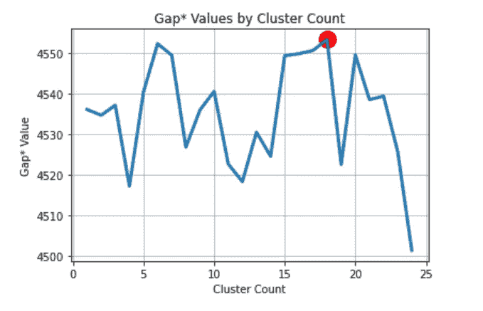

# 一个普通的集群日的一天

> 原文：<https://towardsdatascience.com/one-day-in-an-ordinary-clustering-day-a7a6aa94ed12?source=collection_archive---------32----------------------->

## 足球和集群。似乎很吸引人。让我们潜得更深！


卡蒂亚·奥斯丁在 [Unsplash](https://unsplash.com?utm_source=medium&utm_medium=referral) 上拍摄的照片

我是一个狂热的足球迷，在过去的几天里，我一直在思考一个问题，是否有可能仅仅根据他们的统计数据(上场时间、进球、传球)来猜测一个随机的球员是守门员、后卫还是前锋。显然，我不想手动分配标签。这就是集群发挥作用的地方。这里的一个基本问题是，我们如何确定集群的数量？下面是回答这个问题的尝试。

我原以为为我的目标找到正确的数据是小菜一碟，但现在回想起来，我不得不承认这并不容易。反正我最终在 Kaggle 上找到了数据集，[这里](https://www.kaggle.com/sarangpurandare/83k-football-players-103-stats-per-season)。

> 在我们开始我们的奸诈之旅之前，想提一下，所有代码你都可以在这里找到[](https://nbviewer.jupyter.org/github/MEgamroder/ML_activities/blob/master/Football%20clustering%20final.ipynb)****。****

**首先，在深入集群定义之前，我们应该采取几个步骤:**

**1.**获取有意义的数据子集**。首先，我只对英超联赛感兴趣。其次，在现实生活中，定义特性是聚类过程中的一个关键步骤，但在这里我想进行试验，根据我的直觉选择列特性:**

```
columns = [‘player_name’,’goals’,’assists’,’minutesPlayed’,’substitutionsIn’,’substitutionsOut’,’matchesStarted’,’appearances’]
```

**2.**处理缺失数据**。这不是问题所在。只需用 0 替换丢失的值。如果没有关于进球，助攻，上场时间的数据，这是一个令人信服的假设，这个球员只是没有得分，助攻或比赛。**

**3.**规范化/标准化数据**。为什么我们要有相似的分数范围？绝大多数聚类技术(也许是全部，我不确定)都是基于计算点之间的差异。如果没有标准化，一个特征，例如分钟数，将比目标数更重要，因此我们希望有无偏的权重。标准化的好处还在于加速了整个计算过程。**

> **请不要小看上面这三个步骤！他们会给你很多帮助。**

# **现在，我们来深入探讨一下这个问题！**

# **1.商业领域**

**第一种方法只是基于我们的领域知识，我可以假设应该有 7 个集群:**

****

**业务领域集群**

# **2.肘法**

****肘法**是最常用的确定聚类数的方法。我们只需要运行不同 K 的 K-means，计算失真分数(我们可以使用另一个，但这是一个默认的选择)，绘制它，并确定图上是否有明显的肘部。**

*****扭曲****——各点到其指定中心的平方距离之和***

****

**对于我们的数据集，没有现成的解决方案。我们的“肘”存在于 6 或 7 个集群中。**

# **3.剪影分数**

**轮廓分数测量一个聚类中的每个点与相邻聚类中的点的接近程度。公式很简单:**

**对于每个点，先求 p 到同一个簇中所有其他点的平均距离(姑且称之为 A)。然后求 p 到最近簇中所有点的平均距离(姑且称之为 B)。点的轮廓系数是 B 和 A 之差除以两者中的最大值(max(A，B))。最后，我们只获得所有 p /点的平均轮廓系数。**

***剪影评分范围从-1 到+1。+1 意味着数据被理想地分成簇，而-1 则相反***

****

**在这里，我们希望有最大化我们的轮廓分数的聚类数，但是从领域的角度来看，2 或 3 个聚类没有意义。**

**值 4、6 和 8 具有相似的分数。在这里，我们可以将我们的选择限制在固定列表[ 4，6，8 ]中。**

# **4.差距统计**

**间隙统计将不同值的 *k* 的总簇内变化与其在数据的零参考分布(即无明显聚类的分布)下的预期值进行比较。参考数据是使用抽样的蒙特卡罗模拟生成的。**

**对于观测数据和参考数据，使用不同的 *k* 值计算总簇内变化。给定 *k* 的*间隙统计*定义如下:**

****

*****W****——聚类内的平方和表示聚类的周围。***

*****-期望样本大小 n 下来自参考分布。*****

*****如果您想更深入地了解 Gap value，您可以点击查看[。](https://statweb.stanford.edu/~gwalther/gap)*****

**********

*****差距值*****

*****红色圆圈表示聚类数的最佳值(18)*****

*****为了避免过度估计聚类数，最好使用加权间隙值。想要更深入地了解它，只需看一眼这里的。*****

**********

*****权重差距值(差距*)*****

*****这里我们可以注意到 6、7、15 和 17 个集群具有相似分数。*****

## *****现在问题又出现了，我们如何定义集群的数量？*****

*****我常用的 ***多数表决的所有方法*** :*****

****获胜者是… 6 个集群。****

****让我们使用主成分分析来可视化我们的 6 个聚类(我们的初始归一化也对此有所帮助！)我们的两个分量解释了整个方差的 **83%** 。对于可视化的目的来说，这已经足够了。****

********

****出于好奇，我们来看一些例子:****

******1。萨迪奥·曼内和埃登·阿扎尔被分配到第 5 组。******

******2。安赫尔·迪玛利亚和阿尔伯托·莫雷诺被分配到第 0 组。******

****但是世界上没有什么是完美的。卡斯帕·舒梅切尔和乌戈·洛里斯也被分配到第五组。为了解决这个问题，我们可以考虑添加更多的功能或更多的数据。****

****感谢阅读！****

****待续..****