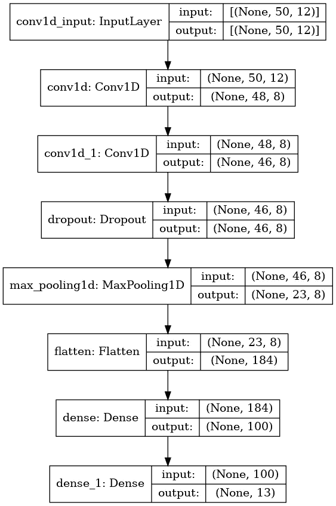
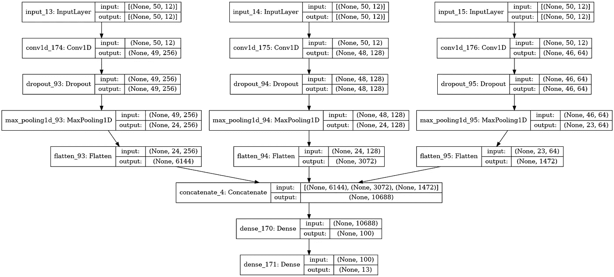

# 用于人类行为分类的一维 CNN

> 原文：<https://towardsdatascience.com/one-dimensional-cnn-for-human-behavior-classification-fb4371d03633?source=collection_archive---------14----------------------->

## [实践教程](https://towardsdatascience.com/tagged/hands-on-tutorials)

## 一个循序渐进的教程，介绍如何将 CNN 整合到时间序列数据中


由[安德里亚·莱奥帕尔迪](https://unsplash.com/@whatyouhide?utm_source=unsplash&utm_medium=referral&utm_content=creditCopyText)在 [Unsplash](https://unsplash.com/s/photos/running?utm_source=unsplash&utm_medium=referral&utm_content=creditCopyText) 上拍摄的照片

我在 Medium 上的第一篇[出版物](/harnessing-the-power-of-transfer-learning-for-medical-image-classification-fd772054fdc7)是对卷积神经网络(CNN)的深入研究。在那篇文章中，我一步一步地介绍了如何使用这种技术进行医学图像分类。这是任何*数据爱好者*的武器库中的一个强大工具，重要的是要认识到 CNN 并不局限于计算机视觉任务。今天，我将向您展示这项技术如何适用于一维顺序数据。

CNN 可以适应 1D 的数据，这不应该太令人震惊。毕竟，图像也是一系列数据。唯一的区别是二维结构(或彩色图像的三维结构)。这种灵活性使其适用于各种应用，其中一些在这里[列出](https://arxiv.org/ftp/arxiv/papers/1905/1905.03554.pdf)。

今天这篇文章的目标是为您提供工具，在您可能感兴趣的任何顺序数据集上实现这一技术。我们将看看如何将我们的网络设置为一个连续的多头模型，并比较结果。如果你想跟随我的笔记本，你可以在这里找到它。现在，事不宜迟，让我们开始吧！

# **图书馆**

下面，你会发现我今天的分析所使用的库的列表。它们由标准数据科学工具包、sklearn 的一个缩放器和必要的 keras/tensorflow 库组成。

# 数据

今天的[数据集](https://www.kaggle.com/gaurav2022/mobile-health)是 Kaggle 的**移动健康人类行为分析**拥有 CC0:公共领域许可证。它由 10 名参与者的右手腕和左脚踝上的 Shimmer2 可穿戴传感器组成。每个传感器收集 x、y 和 z 平面上的加速度和旋转速度，产生 12 个预测变量。

这些变量将用于将参与者的行为归类为以下 12 种活动之一:

*   静止站立(1 分钟)
*   坐着放松(1 分钟)
*   躺下(1 分钟)
*   步行(1 分钟)
*   爬楼梯(1 分钟)
*   向前折叠(20 倍)
*   手臂正面图(20x)
*   蹲伏(20 倍)
*   骑自行车(1 分钟)
*   慢跑(1 分钟)
*   跑步(1 分钟)
*   前后跳跃(20x)

原始数据集还包含心电图和磁力计的数据，但在 Kaggle 版本中不可用。这让我决定不再坐卧活动。其原因是由于缺少磁力计数据，没有这些数据，站立的**、**、**和**、**将没有加速度和旋转速度，使他们无法区分。**

结果是以下数据集:

让我们稍微研究一下我们的数据，看看我们会发现什么。使用 **df.info()** 可以让我们快速了解我们的数据框架。这里我们看到我们有一个非常整洁的数据集，没有丢失值。

接下来，我们将使用 **df 查看分类变量。Activity.value_counts()** 。有趣的是，我们引入了一个新的类 0，这在 Kaggle 数据描述中没有提到。

因为我不知道这个类指的是什么，我决定用**df = df[df]把它放逐到数字炼狱。活动！= 0].**

帮助我们的模型学习的最后一步是使用下面的代码创建均匀的组大小。这将减少过多/过少的代表性影响我们的模型的机会。它也不会损害模型，因为我们没有删除有价值的信息。毕竟，无论是 20 秒还是 1 小时，跑步看起来都应该是一样的(假设跑步者没有摔倒)。

# 分割、缩放和整形

我们需要做的最后一件事是准备数据集，使其格式适合我们的神经网络。下面的代码可以用来分割和缩放数据。让我们来解开它所说的。

前两个模块将我们的数据集分成 70%用于训练，30%用于测试。我还进一步将数据分为 X(预测/特征)和 y(结果)变量。您也可以使用 sklearn 的 t [rain_test_split](https://scikit-learn.org/stable/modules/generated/sklearn.model_selection.train_test_split.html) 获得相同的结果。

在最后两个模块中，我们正在缩放数据。对于预测值，sklearn 的[最小最大缩放器](https://scikit-learn.org/stable/modules/generated/sklearn.preprocessing.MinMaxScaler.html)用于转换我们的数据，以适应 0 到 1 的范围。它通过将每个值减去最小值，然后除以范围 **(x -min)/(max -min)** 来实现。

使用 Keras '[to _ categorial](https://www.tensorflow.org/api_docs/python/tf/keras/utils/to_categorical)函数对结果变量进行一次性编码。这将我们的类转换成一个 1 * N 的二进制矩阵(其中 N 是类的数量)。当类没有有序性时，这是一个重要的步骤。如果您的数据具有有序的结构(即温度、年龄、质量)，您可以考虑使用顺序编码器，而不是一次性编码器。

我们的 CNN 对输入数据的形状有一定的要求。下面，您将看到我们如何将数据重塑为 3d 输入块，从而将预测值和输出组织到窗口中。选择 50 的窗口大小是因为用于收集 Kaggle 上描述的数据的加速度计和陀螺仪的 50Hz 采样率。

有了适当格式的数据，我们现在可以构建分类模型了！

# 美国有线新闻网；卷积神经网络

## 连续的

构建神经网络是一个高度迭代的过程，需要微调多个超参数以优化结果。它还包括尝试各种架构。今天我们将从建立一个连续的 CNN 开始。它将由 2 个卷积层、1 个下降层、1 个最大汇集层、1 个展平层、1 个密集连接层和我们的分类层组成(图 1)。



图 1 —顺序 CNN 模型的网络架构

您可以构建一个硬编码的模型，并在每次试验后对其进行调整，或者您可以构建一个函数来连续运行多次试验，如下面的代码所示。我从[杰森·布朗利](https://machinelearningmastery.com/)那里学到了这个，这是一个很好的省时方法。

在下面的代码中，我们定义了一个函数 *fit_evaluate_model* ，它将(你猜对了！)拟合并评估我们的模型。注意第 2 行，除了 *n_filters 之外，输入还期望我们的 X 和 y 训练/测试集。*使用上述架构，我们将评估以下过滤图【8，16，32，64，128，256】。我们将继续调整模型，因此，当我们调整内核大小和辍学率时，性能最佳的过滤器映射将被硬编码到下一轮中，正如您将看到的那样。

每个试验将运行 10 次迭代，每次迭代的批量为 32。使用单独的函数 *performance_summary* ，我们将收集结果并绘制出来。每个过滤图将运行 5 次，然后我们将计算这些试验的平均值和标准偏差，以确定我们的获胜者(下面的第 4-6 行)。

最后，函数 *run_trials* 将把上面的所有东西联系在一起，并运行我们请求的试验。

这组试验的结果可以在下面看到。随着过滤图的增加，性能有提高的趋势。这种增加似乎在 32 个过滤图附近趋于平稳。最佳点似乎是 64 个过滤贴图，这导致了最高的性能和最低的方差，这意味着它是最稳定的。

```
Param=8: 60.379% (+/-3.593)
Param=16: 65.084% (+/-2.929)
Param=32: 71.039% (+/-5.879)
Param=64: 73.601% (+/-2.396)
Param=128: 72.013% (+/-5.594)
Param=256: 70.702% (+/-5.059)
```

有了最佳过滤图的概念，我们接下来将看看如何调整内核大小。如果你对这些超参数不清楚，别忘了看看我在开头链接的文章。还有许多其他的好资源，但是我深入研究了架构、优化器、激活函数和超参数，并给出了每一个的例子。

大部分代码保持不变，如下图所示，但是，您可以在第 2 行看到一个新变量， *n_kernel* ，它表示我们将在这里评估的内核大小[2，3，5，7，11]。

这些试验的结果如下所示。看起来较小的内核获取了有用的信息来区分我们的类，我们的较大内核丢失了。虽然这些值变化不大，但是使用内核大小为 3 会给我们带来最好的结果。也就是说，这并没有提高我们第一次试验的准确性。让我们看看是否可以通过改变我们的辍学做得更好！

```
Kernel=2: 73.285% (+/-4.676)
Kernel=3: 73.585% (+/-4.133)
Kernel=5: 69.066% (+/-1.468)
Kernel=7: 62.953% (+/-3.858)
Kernel=11: 65.167% (+/-2.749)
```

在下面的代码中，这将是序列模型的最后一组试验，我们测试的是辍学率[0.1，0.3，0.5，0.7，0.9]。重申一下，这里我们硬编码了 tope 执行过滤器映射(64)和内核大小(3)。

这些试验的结果如下所示。虽然我们将整体性能提高了 2%，但这并不是因为我们操纵了什么。对于之前的每个试验，随机选择 0.5 的退出率。观察到的改进是由于这些算法的随机性质。通常，你会发现人们在他们的模型中添加参数*【随机状态】*，以确保他们得到一个可复制的结果。我选择不包括这一点，因为它可以让我们了解我们的模型到底有多稳定。

```
Dropout=0.1: 74.934% (+/-2.552)
Dropout=0.3: 74.862% (+/-5.299)
Dropout=0.5: 75.111% (+/-5.832)
Dropout=0.7: 72.981% (+/-4.504)
Dropout=0.9: 72.297% (+/-2.313)
```

## 多头 CNN

作为上述顺序模型的替代，本节将提供一种使用 CNN 的不同方法。使用多头 CNN 允许您并行添加多个不同的参数。从每个输入中学习到的信息在被馈送到最终的密集层和随后的分类层之前被合并(连接)。

为了帮助可视化这个过程，请参考图 2。三个独立的头部被用作输入，每个头部由不同的过滤器贴图、内核大小和漏失组成。在每个输入被展平后，它们被连接并馈入密集层。最后，将合并后的结果输入分类层。让我们看看这对我们的准确性有什么影响！



图 2 —多头 CNN 模型的网络架构

正如您在下面看到的，代码并没有改变太多。不同之处在于如何定义各种输入，每个输入都有不同的参数。第一个输入有 256 个过滤贴图，内核大小为 2，丢失率为 0.5。第二个输入有 128 个过滤图，内核大小为 3，丢失率为 0.3。最后，最后一个输入有 64 个过滤图，内核大小为 5，丢失率为 0.1。

如上图所示，每个输出都被展平(第 25 行)，然后连接起来。剩下的和顺序模型类似，合并后的输出馈入有 100 个神经元的密集层，再馈入分类层。

多头方法的结果如下所示。使用五次试验的平均值，我们看到我们的性能(72%)略低于我们使用顺序模型观察到的性能(75%)。

```
>#1: 71.229
>#2: 71.903
>#3: 72.020
>#4: 69.389
>#5: 74.481
Accuracy: 71.804% (+/-1.636)
```

# 摘要

在今天的帖子中，我们使用一维 CNN 对生物传感器测量的人类活动进行分类。我们使用顺序和多头方法浏览了示例。我们还研究了如何操作过滤图、内核大小和辍学率，看看我们是否可以提高模型的准确性。

我们以 75%的准确率完成了测试，这还不算太差，但也没什么值得大书特书的。当然，也有办法改善我们的结果。在下一篇文章中，我将向您展示如何将 CNN 的优势与另一位序列/时间序列数据专家结合起来。

我希望你喜欢今天的帖子！下次见，感谢阅读！