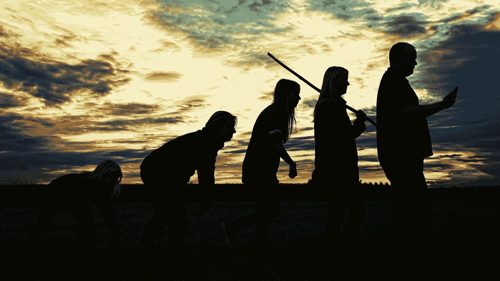
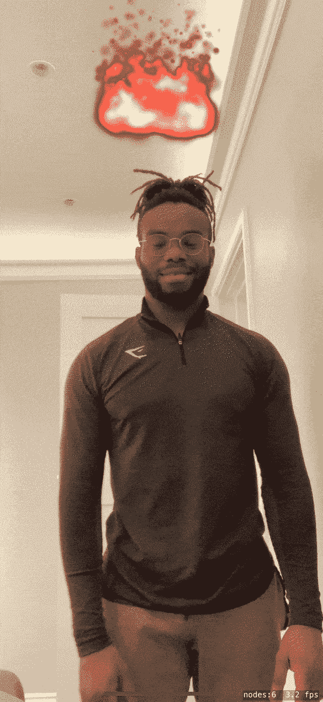
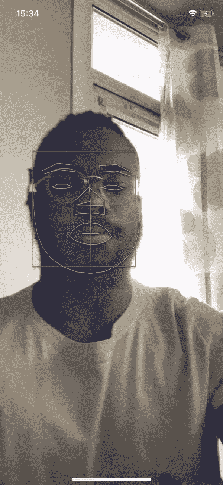
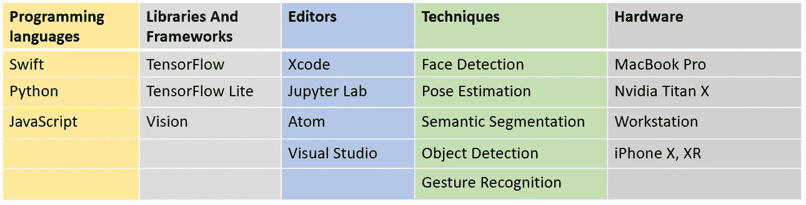
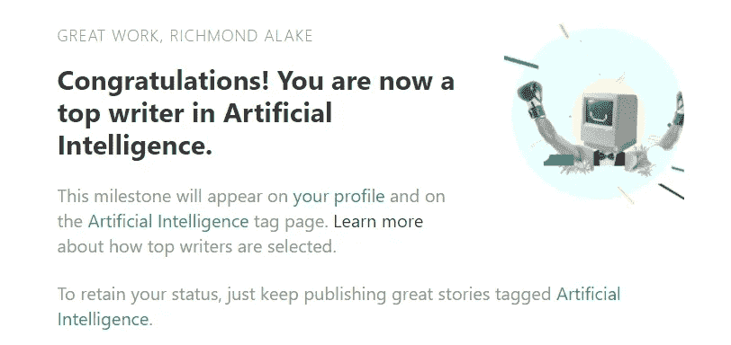
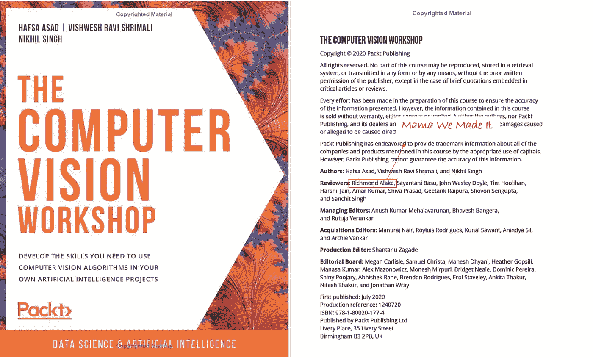

# 一年的计算机视觉工程师

> 原文：<https://towardsdatascience.com/one-eventful-year-as-a-computer-vision-engineer-3e8899cafce3?source=collection_archive---------33----------------------->

## 一个机器学习从业者的所有学习、兴奋、失败、成功、事件浓缩到一篇文章里。

乔恩·泰森在 [Unsplash](https://unsplash.com/s/photos/one?utm_source=unsplash&utm_medium=referral&utm_content=creditCopyText) 上的照片

时间过得很快，主要是如果你因为全国范围的封锁限制而被困在家里一年的话。

在过去的一年里，我一直在深度学习和计算机视觉的世界中航行，这也意味着在编程语言、机器学习模型之间来回穿梭，并在 StackOverflow 上花费了比我愿意承认的更多的时间。

**本文是对我的角色和职责的各种有趣方面的书面回忆。我还将包括对我的职业生涯和专业化轨迹产生重大影响的我的职位之外的学习和经历。**

# 我的角色及其演变

Johannes Plenio 在 [Unsplash](https://unsplash.com/s/photos/evolution?utm_source=unsplash&utm_medium=referral&utm_content=creditCopyText) 上拍摄的照片

在我的角色中，我创造了类似于你在抖音、Instagram 和 Snapchat 等流行社交媒体应用上看到的相机和视觉效果。比如绿屏效果(背景去除)。这就是我对我妈妈描述我的角色的方式。

但对于技术人员来说，我作为计算机视觉工程师的角色是关注深度学习模型的工程和集成到移动平台中，以解决语义分割、姿势估计、对象检测、人脸检测等计算机视觉任务。

在过去的一年里，我一直在实现从图像和相机反馈中提取场景理解的技术，以向游戏开发者提供数据。这些深度学习模型提供的数据实现了绿色屏幕、身体跟踪过滤器和其他酷东西等视觉效果。只是保持我的角色力量和创造力。

左:手势识别和姿态估计，中:人物分割，右:苹果的人脸和面部特征检测

为了更好地理解我作为一名计算机视觉工程师的角色和我使用的工具，我提供了一个表格，详细列出了编程语言、代码编辑器、硬件和其他与我的角色相关的技术组件。

图片由作者提供:编程语言( [Swift](https://developer.apple.com/swift/) 、 [Python](https://www.python.org/) 、 [JavaScript](https://developer.mozilla.org/en-US/docs/Web/JavaScript) )、库( [TensorFlow](https://www.tensorflow.org/overview/) 、 [TFLite](https://www.tensorflow.org/lite/) 、 [TFJS](https://www.tensorflow.org/js/) 、 [Vision](https://developer.apple.com/documentation/vision) 、 [CoreML](https://developer.apple.com/documentation/coreml) )、编辑器( [Xcode](https://developer.apple.com/xcode/) 、 [JupyterLab](https://jupyter.org/) 、 [Atom](https://atom.io/) 、【t

在可预见的未来，我的角色可能会扩展到机器学习的其他领域，如自然语言处理和推荐引擎开发。

随着我主要从事的旗舰产品的开发，融入更多人工智能技术的需求也将增加。作为一名狂热的机器学习实践者，我倾向于探索 ML 领域的其他方面。

一般从学术机构毕业后，了解 ML 内部的各个部门是有帮助的。完成理学硕士学位后，我探索了与数据科学和 NLP 相关的问题领域，如图像字幕和时间序列预测。

将你的技能应用到机器学习的多个领域是在创业公司工作的好处之一。在创业公司，你通常要身兼数职。有一天你是 CV 工程师。接下来，您将探索文本分类的 NLP 技术，以构建一个敏感的内容监控系统。

我角色的另一个重要组成部分是研究。我的角色目前分为 70%的工程和 30%的研究。我从未想过我会在大学之外阅读研究论文。尽管如此，机器学习领域正在快速发展，新的技术、算法和模型频繁发布。

阅读最新的研究论文是与 ML 领域保持联系的一种行之有效的方法。在进入工程领域之前，我花了相当多的时间来理解我正在集成到应用程序中的深度学习模型。与模型的性能、架构、限制和训练方法相关的信息都可以在相应的研究论文中找到。所有这些信息有助于确定整合策略。

> **给你的消息🔊:不要害怕潜入未知，或犯错误。恐惧和完美是进步的敌人。**

# 学习曲线

照片由 [Dmitry Ratushny](https://unsplash.com/@ratushny?utm_source=unsplash&utm_medium=referral&utm_content=creditCopyText) 在 [Unsplash](https://unsplash.com/s/photos/learning?utm_source=unsplash&utm_medium=referral&utm_content=creditCopyText) 上拍摄

在攻读了计算机视觉、机器学习和机器人学的理学硕士学位一年后，我想为什么不把自己扔进深水区，在一家初创公司里拥有计算机视觉成果。这被证明是一个伟大的想法。然而，我必须克服知识上的差距。

本节介绍了作为一名计算机视觉工程师的一些方面，这些方面你在学术研究或 MOOCs(大规模开放在线课程)中可能不一定会接触到。

## 学习 Swift

Python、R、JavaScript、Matlab，这些编程语言是机器学习世界中的主食。但是，为了将 ML 的功能扩展到日常使用的设备中，如智能手机、智能扬声器或汽车，需要利用特定于平台的编程语言，如用于移动设备的 Swift 和 Kotlin。

在过去的一年里，我一直在 iOS 移动应用程序中集成深度学习模型。这要求我学会 Swift 编程语言。作为一个拥有 Java、JavaScript 和 Python 经验的人，理解 Swift 对我来说相当容易。虽然我不得不承认我故意忽略了一些高级概念，但是我以后肯定会去的。

Swift 是一种多功能的编程语言，用于 iOS 应用开发和机器学习等任务。这是一门很容易掌握的语言，尤其是对于那些有 C、Python 或其他面向对象编程(OOP)语言经验的开发人员来说。作为一名 ML 从业者，你应该精通几种编程语言。

## 学习金属

现代移动设备都配备了 GPU。最新的 iPhone 型号包含了[苹果 A12 仿生 64 位芯片](https://en.wikipedia.org/wiki/Apple_A12)。苹果还有一个名为 [Metal](https://developer.apple.com/metal/) 的 API，它抽象了访问移动设备 GPU 底层功能和资源的复杂性。

我把它过于简单化了，但是把金属想象成苹果设备的 CUDA。关键点是 Metal 和 CUDA 都支持在图形处理单元上执行计算。

事实证明，学习金属是一项挑战，但我们不会回避挑战。事实上，随着不断地学习和探索更实用地利用金属来执行图像处理计算，我应该很快就能熟练地使用金属。

需要注意的一点是，我几乎没有在机器学习职位描述中遇到过金属的经验或知识，更具体地说是计算机视觉职位发布。这可能是因为 2019 年发布了 Metal 的稳定发布版本。但是要从候选人中脱颖而出，你可以开始在移动设备上探索金属和计算机视觉技术的世界。

## 算法、性能和内存优化

大多数 ML 从业者都熟悉模型的实现、培训和测试。但是，需要稍微考虑一下算法的效率和程序执行性能，特别是当您深入研究内存和计算资源有限的边缘设备时。

这听起来可能是显而易见的，但指出机器学习领域与计算机科学(CS)相关主题和学科的其他角落有交叉并没有坏处。ML 工程师往往是体面的软件工程师，了解常见的 CS 主题，如并发性、多线程、内存优化、算法时间复杂度等。

> **给你的消息**🔊:**目标是对机器学习领域有一个总体的了解，但是专注于一些利基工具和库会有一些好处。**

# 意外事件

本·怀特在 [Unsplash](https://unsplash.com/s/photos/surprised?utm_source=unsplash&utm_medium=referral&utm_content=creditCopyText) 上的照片

让我们从技术上休息一下。

这一部分包括我偶然的写作生涯——由 Medium 提供动力，突然出现在流行的数据科学 YouTube 频道上，以及与一家顶级出版公司合作。

## 油管（国外视频网站）

是我的错觉，还是听到你的声音很奇怪。

嗯，当我看到我和[肯吉](https://medium.com/u/6ee1f7466557?source=post_page-----3e8899cafce3--------------------------------)的采访进展时，我也是这么想的。Ken Jee 是一个受欢迎的数据科学 YouTuber，在他的主频道上有超过 10 万名订户。

经过几个月的学习，同时也在 Medium 上大量发表 DS 文章，Ken 偶然发现了我的一篇文章。我们联系在一起，意识到我们有很多共同点。肯将我的旅程视为一种激励，许多人都可以从中受益。我同意接受采访录音，并上传到了 YouTube 上。

采访讲述了我在机器学习领域的旅程，以及在机器学习和数据科学的学术和专业方面的经历。

## 中等

在 Medium 上写作并没有出乎意料——*我把 Medium 作为一种学习工具，*但是在 Medium 上成为人工智能主题的顶级作家是一个惊喜。

2020 年 1 月 6 日，我收到一封来自 Medium 的电子邮件，祝贺我成为 AI 的顶级作家。一开始我很困惑，但在深入了解成为一名顶级作家需要什么之后，我意识到这是一个多么大的成就。

成为一名顶级作家是很好的影响力，但更具体地说，它说明了你向目标群体发布的文章的一致性和质量。我非常感激成千上万的人阅读我的文章，并带着行动或额外的知识离开。

顶级作家电子邮件片段

## 使用 Packt

自从我决定超越“你好，世界”节目，我总是购买技术教科书。曼宁出版公司、奥莱利和帕克特出版公司都是我买书的公司。不言而喻，你从一本优秀的传统教科书中获得的丰富信息是无可争议的。

2020 年中期，Packt publishing 的编辑找到了我，因为他们看到我在计算机视觉方面有专长；显然，LinkedIn 推荐了我这个简历专家— *感谢 LinkedIn。*我最终结束了对[计算机视觉练习册](https://courses.packtpub.com/courses/computer-vision)内容的审查。

[计算机视觉工作坊](https://courses.packtpub.com/courses/computer-vision)

除了让我的名字写在计算机视觉教科书上之外，我很高兴成为构建内容过程的一部分，这些内容将不可避免地帮助个人走上计算机视觉和人工智能的道路。

实现和回顾介绍 CV 技术(如人脸检测、对象跟踪和面部识别)的内容很有趣。我实际上为这本书的几个章节录制了一些编码视频和旁白，所以你又可以听到我的声音了。

> **给你的消息🔊字体建立个人品牌把你自己和你的作品展示在公众面前，你不知道会有什么结果。**

# 冒险

去年年底，我成为了一款手机应用程序 [Gonomic](https://www.gonomic.io/) 的联合创始人，这款应用程序利用人工智能技术来监控你在家工作时的身体姿势。从 AI 获得的数据用于提供姿势和人体工程学产品建议。这是一个与时代相关的工具，也是我现在就需要的工具— *我现在正无精打采地趴在桌子上写这篇文章。*

我也是几家初创公司的人工智能顾问， [Genten](https://genten.io/) 和 Readable Tech。Genten 专注于创作基于书面文字的动画广告，而 Readable Tech 正在开发一种工具，可以彻底改变检测儿童阅读障碍的传统方法。

Genten 和 Readable Tech 都在致力于颠覆他们的产业。我的角色本质上是提供关于哪些人工智能技术和工具可用于实现其核心产品功能的信息和建议。

2020 年，世界似乎关上了大门，我们都被限制在房间的四面墙上。尽管如此，随着创新和互动通信技术(Zoom)的出现，世界变得更小了。

> **给你的消息🔊:把努力放在正常工作之外。用直觉和创造性的解决方案解决问题。**

# 未来的抱负和计划

奥克塔维安·罗斯卡在 [Unsplash](https://unsplash.com/s/photos/future?utm_source=unsplash&utm_medium=referral&utm_content=creditCopyText) 上的照片

## **证书**

技术认证和证书，有些人喜欢它们，有些人认为它们并不像看起来那样有助于获得一份 ML 工作。对我来说，我对证书没有强烈的看法，除了一个奇怪的想法，我应该把它们像收藏品一样积累起来。

所以 2021 年，我想至少考取三个机器学习相关的证书。我目前盯上了 [TensorFlow 认证](https://www.tensorflow.org/certificate)。去 TensorFlow 认证是一个简单的选择，因为我每天都使用几个 TensorFlow 库。接下来，我可能会去申请谷歌机器学习认证，然后着眼于一些亚马逊认证。

基本上，“必须抓住他们”。

严肃地说，我对认证的追求是为了给自己一个探索机器学习领域的借口，这些领域是我不一定会强迫自己去做的。这有助于想象可获得的证书是在成为人工智能专家的道路上放置在检查站的激励。

## 《要么做大，要么呆在家》

上面的小标题与本节内容无关。我一直想把这句话写在文章里。但如果我们谈论的是大的，我确实有建立一个人工智能公司的强烈愿望，就像 [Palantir](https://www.palantir.com/) 、[datataiku](https://www.dataiku.com/)这样的公司。

在创业公司工作可能会令人兴奋。当我说**创业是一种推动成长的环境时，那些已经创办公司或在创业公司工作过的人会同意我的观点。对于创业公司的人来说，有两个选择，要么沉沦，要么游泳。**

我还意识到，资金紧张的初创公司受限于他们可以利用的计算和人工智能人才库的数量。他们不能像那些从大学直接吸收人才的大型科技巨头一样提供那么多零分。

我未来的人工智能公司将专注于为初创公司和中小型公司创造可负担得起的人工智能人才和人工智能资源。我还没有具体细节，但它是在工作中。

## 电子书

在我与 Packt publishing 的短暂合作后，我决定写一本计算机视觉/深度学习的书将是一个不错的愿望。首先，它将迫使我成为我所选择领域的专家。其次，这将有助于扩大我在人工智能行业的影响力。

我计划很快发布的第一本电子书将专注于深度卷积神经网络架构的实现。我计划涵盖 AlexNet、GoogLeNet 等架构的细节。我将对每个体系结构的相应研究论文中提出的技术和概念提供一个内在的解释。

您从实现标准神经网络架构中获得的实践和领域知识是无价的。当然，机器学习库抽象了深度卷积神经网络的实现细节，但我认为专家知识最好从基础开始构建。

## 超越 AI

美国宇航局在 [Unsplash](https://unsplash.com/s/photos/space?utm_source=unsplash&utm_medium=referral&utm_content=creditCopyText) 拍摄的照片

*人工智能在太空探索中有什么作用？*

我知道美国宇航局和 SETI 目前利用人工智能技术为他们的工具和太空探索工作提供动力。但是我可以看到人工智能在探索太空和其他星球中扮演更积极的角色。

目前，火星上的火星车主要由自动化系统驱动。在十年内，我们很可能会看到更多智能漫游车的出现，以及 Space X 星际飞船上人工智能助理的可能性如何。

在一般的人工智能行业工作了大约十年后，我将过渡到太空行业，期待更多的刺激、探索和知识——也许是 ET 。

# 结论

简而言之，这就是我目前在人工智能行业的旅程。我不确定我是否做了很多，但我知道我有更多的雄心和动力让我继续前进。

我对这个领域还是个新手，所以欢迎任何 ML 从业者的建议。只要用评论区，我们就可以开始对话了。

## 下面是这篇文章中散布的消息的摘要:

*   ***不要害怕潜入未知，或者犯错误。恐惧和完美是进步的敌人。***
*   ***目标是对机器学习领域有一个总体的了解，但是专注于一些利基工具和库也有一些好处。***
*   将你自己和你的作品展现在公众面前，建立个人品牌。你不知道会有什么结果。
*   ***把精力放在正常工作之外。用直觉和创造性的解决方案解决问题。***

*感谢阅读。*

## 为什么不和我联系？你已经走了这么远了。

1.  关注我的 [**推特**](https://twitter.com/richmondalake)
2.  订阅我的 [**邮箱列表**](https://richmond-alake.ck.page/c8e63294ee) 获取每周简讯
3.  跟着我上 [**中**](https://richmondalake.medium.com/)
4.  通过 [**LinkedIn**](https://www.linkedin.com/in/richmondalake/) 联系我