# One-Hot Elbows 和 k-Prototypes:Python 中更多的客户细分

> 原文：<https://towardsdatascience.com/one-hot-elbows-and-k-prototypes-more-customer-segmentation-in-python-106d13c55eae?source=collection_archive---------7----------------------->

## 混合变量的一键编码、主成分和 k 原型聚类

这第二篇文章完成了我昨天文章开始的基础部分:[肘和轮廓:Python 中的实际客户细分](/elbows-and-silhouettes-hands-on-customer-segmentation-in-python-66c2e794c552)。

[龚慧慧 468 拍摄的女性购物生活方式 Pixabay 上的免费照片](https://pixabay.com/photos/woman-shopping-lifestyle-adult-3040029/)

第一篇文章解释了如何使用 k-Means 或均值漂移聚类分析混合变量——数值型和分类型。

*   本教程还演示了如何确定最重要的超参数:聚类数。
*   我们编写了一个函数，在一种可视化的仪表板中报告聚类分析的输出。每个聚类的列表轮廓和饼图的排列使营销计划者和决策者更容易解释输出。

今天，我们将讨论另外两种聚类方法，使我们能够处理混合变量:

*   一键编码，之后是 k-Means；
*   k 原型。

# 1.分类变量的一键编码

为了准备 k-Means 聚类的源数据，我们在下面显示的笔记本单元格中对它们进行如下转换:

*   第 11 行和第 12 行在两个新的数据帧 df_num 和 df_cat 之间拆分列。在 df_num 中，我们收集数字列；在 df_cat 中，我们组合了对象/字符串变量。
*   我们将 sklearn 的 PowerTransformer 应用于数值数据，以增强它们的正态性。
*   在第 19 行，我们使用 pandas 的 get_dummies 函数为它找到的每个类别值创建一个新的数字列，跨越非数字数据帧的所有列。在下面的屏幕截图中，您可以看到“Partner”列被拆分为“Partner_Yes”和“Partner_No ”,每个列都填充了二进制值 0 或 1。
*   第 23 行将两个数据帧 df_num 和 df_cat 组合成一个新的综合数据帧 dfb2。它包含 28 个数字列，而原始数据帧有 13 个。

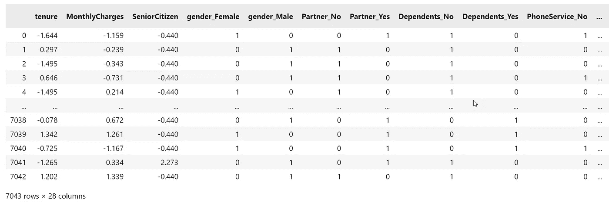

作者图片

接下来，我们将数据帧的数字列标准化，使其平均值接近 0，方差为 1。

# 2.k 均值聚类

主成分分析将有助于我们把大的新数据框架浓缩成其相关特征。我将组件的最大数量限制为 15 个。让我们看看总方差中有多少可以用 15 个或更少的成分来解释。

第 12 行收集新数据帧 df_pca 中的组件。

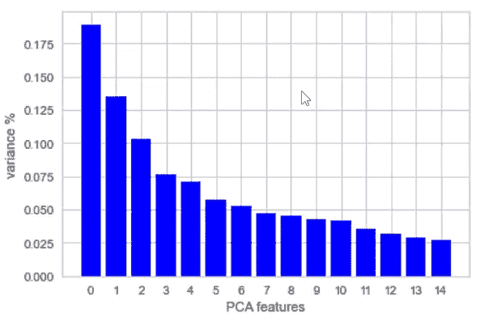

作者图片

PCA 图显示，在 15 个特征之后，每个分量对总方差的贡献将减弱到小于 2.5%。多达 15 个组件似乎充分反映了具有 28 列的源数据帧的模式，其中许多只是二进制虚拟变量。

让我们绘制前两个组件，看看我们是否可以辨别不同的集群。

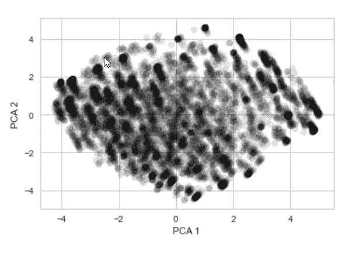

作者图片

剧情比较漫。右上角好像飘着一簇。左下角可能包含一个或多个更大的星团。

五氯苯甲醚碎石图显示了至少高达 3 或 4 的重要成分。但是现在，我们跳过绘制和解释所有组件对的步骤，而是继续 k-Means。

我们将使用更小的数据帧 df_pca 及其反映 dfb3“本质”的 15 个组件，而不是对整个数据帧 dfb3 及其 28 列进行聚类。

正如我们在上一篇文章中所做的，我们将对介于 2 和 10 之间的备选聚类数运行 k-Means，并在 list *inertia_pca* 中收集得到的惯性分数。

对于每个集群编号 k，循环运行三行代码:

*   第 6 行实例化了 k 均值模型
*   第 9 行将其与 df_pca 中的主要组件相匹配
*   第 12 行收集得到的惯性分数，并将其附加到列表 inertias_pca 中

第 14 行到第 18 行准备了惯性分数的 scree 图

我们在 k = 4 个集群处观察到肘点。尽管它并不突出。

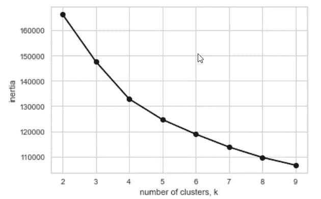

作者图片

我们使用 kneed 包和它的 KneeLocator 方法从数字上确定肘点。它证实了我们的视觉线索，即最佳聚类数是 4。

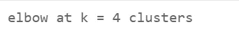

作者图片

或者，我们可以通过计算轮廓分数来确定聚类的数量。下面的第 2 行到第 6 行反映了我们在上面的代码片段中用 *for 循环*括起来的第 4 行到第 12 行。但是在这里，我们将这些行包装在一个列表理解中，而不是一个循环中，因为我们想尝试一种不同的代码风格。

第 8 行的字典收集分数列表和它们对应的聚类数 k。第 10 行的 list comprehension 将逐行打印它们。

第 11 行找到对应于字典中最大轮廓分数的聚类数 k。它确认了它的 4 个簇的值。

第 15 至 21 行绘制了 scree 图，其显示了在 k = 4 个簇处达到峰值的得分曲线。

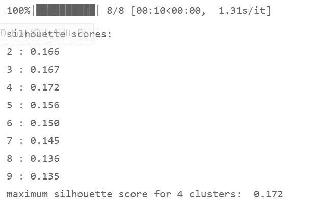

作者图片

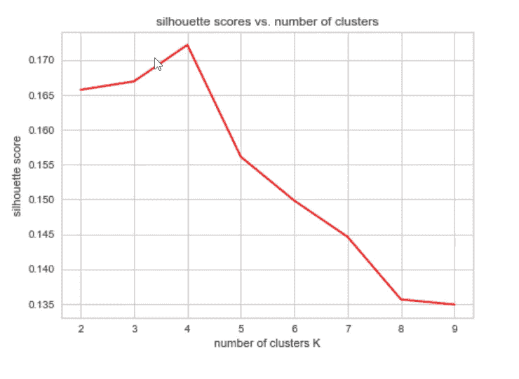

作者图片

我们获取集群标签的数组，并将它们作为新列插入到原始数据帧 dfb1 中。

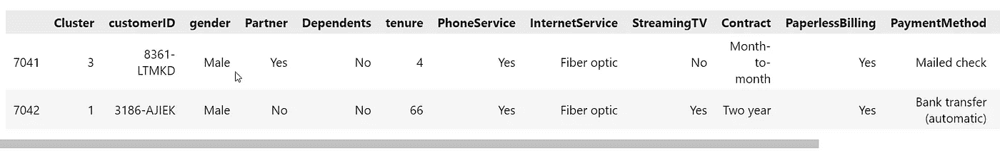

作者图片

最后，我们可以调用函数 *cluster_profile* ，这是我们在之前的教程中编写的，并让它为渴望获得我们的结果的营销规划者和决策者准备一个仪表板:他们将收到一个特定于集群的饼图地图；以及显示每个分类的特征属性的表。

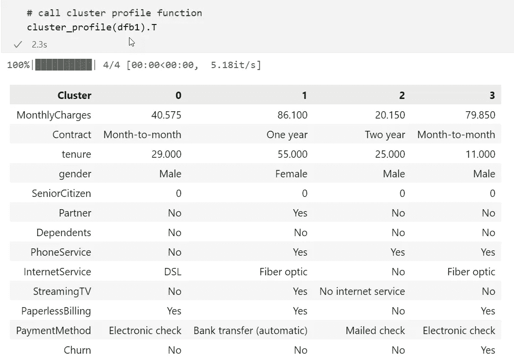

作者图片

该表报告了每个聚类的分类变量的最频繁值；以及数字列的中值(月费用和任期)。

饼图显示了表征每个集群的七个属性:从左侧的合同条款到右侧的流媒体电视选项，四个集群中的每一个都有一行饼图。

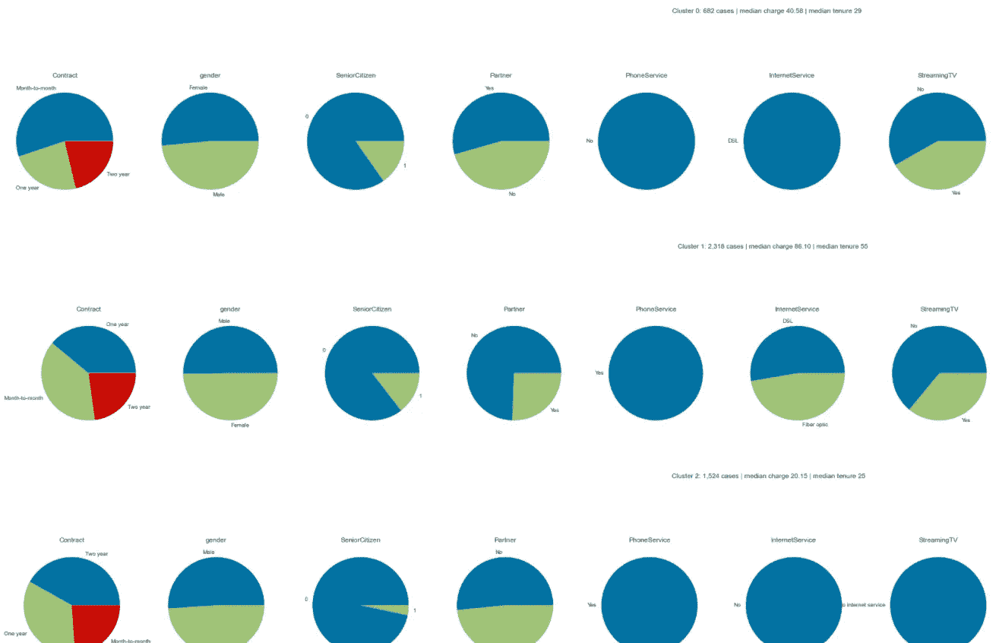

作者图片

# 3.混合型变量的 k 原型聚类

到目前为止，我们已经测试了三种处理混合变量的方法。所有三种转换成整数的分类数据类型:

*   昨天的文章使用了 **pandas 的 *cat.codes*** 方法，该方法将每个唯一的字符串值映射到一个对应的整数值，同时保留列数。
*   我们上面应用的 ***一键编码*** ，通过 **pandas 的 *get_dummies*** 方法，为每个唯一的字符串值创建了一个新列，用二进制值 0 或 1 填充。这种方法将列的数量从 13 个扩展到了 28 个。
*   主成分分析表明，数据模式可以由少于 15 个成分充分反映。
*   —我们在这个 PCA 派生的新数据帧 df_pca 上运行 k-Means 算法，发现少至四个聚类就可以充分描述我们的混合型源数据中的模式。

[Christiann koe pke 拍摄的白色柜台照片上的女性——Christiann koe pke 拍摄的 Unsplash 上的免费接待图像](https://unsplash.com/photos/dQyS2pMYtok)

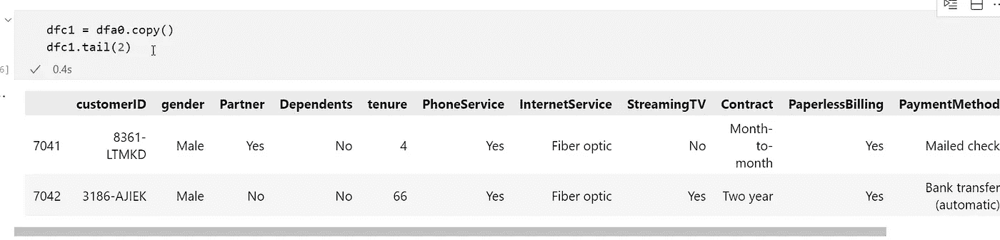

作者图片

我们现在要尝试的第四种方法，**k-原型法**，不需要我们将分类变量转换成数字虚拟变量。

我们从删除列 *customerID* 开始，因为它没有为我们的聚类任务提供有意义的信息。相反，这将是一个障碍。

我们希望对其应用描述性函数(如求和、均值或中值)的变量应该是 float64 类型。因此，我们将*保有权*列从整数转换为浮点数。

二进制值为 0 和 1 的 *SeniorCitizen* 列应该归类为字符串/对象数据类型。

我们运行 sklearn 的标准定标器来消除 float64 变量(月费用和任期)之间的巨大差异，否则集群算法可能会陷入死胡同。

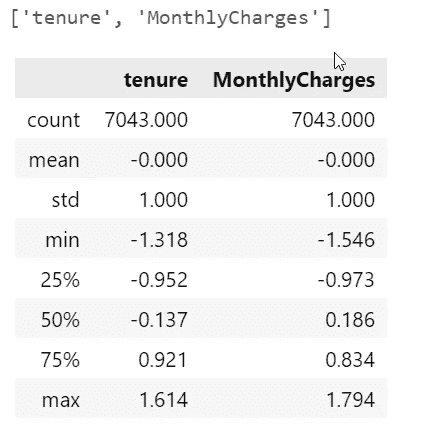

作者图片

第 2 行中的列表理解标识了分类变量。生成的列索引列表 *catcol_idx* 将是 k-Prototypes 方法的必需输入。

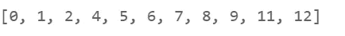

作者图片

下一段代码运行 sklearn 的 *KPrototypes* 集群算法。

我们从前一章的 k 均值结果建议的适当的 k = 4 个聚类开始。第 3 行将数据帧 dfc3 拟合到模型中。请注意，我们必须在专用输入参数“categorial”中标识分类列的索引。

第 4 行收集了 **cost** 得分，也就是所有点到各自聚类质心的总距离。

k-Prototypes 不像 k-Means 和 Mean Shift 聚类那样为我们提供惯性分数。因此，我们将使用成本变量来评估拟合优度。

虽然之前的笔记本单元依赖于预先确定的聚类数，k = 4，这是 k-Means 程序提供给我们的，但我们现在将 k-Prototypes 视为一个独立的程序，并对最佳聚类数进行独立搜索。

在第 6 行到第 9 行，我们设置了一个 *for-loop* ，为 2 到 10 之间的每一个备选集群编号运行 k 原型。

第 7 行准备模型。第 8 行使模型符合数据帧。然后第 9 行收集字典 dict_cost_c3 中的开销值及其 k 值。

第 12 行中的 list comprehension 逐行打印集群编号和成本值。

第 15 行到第 21 行将可视化 scree 图中的成本值。

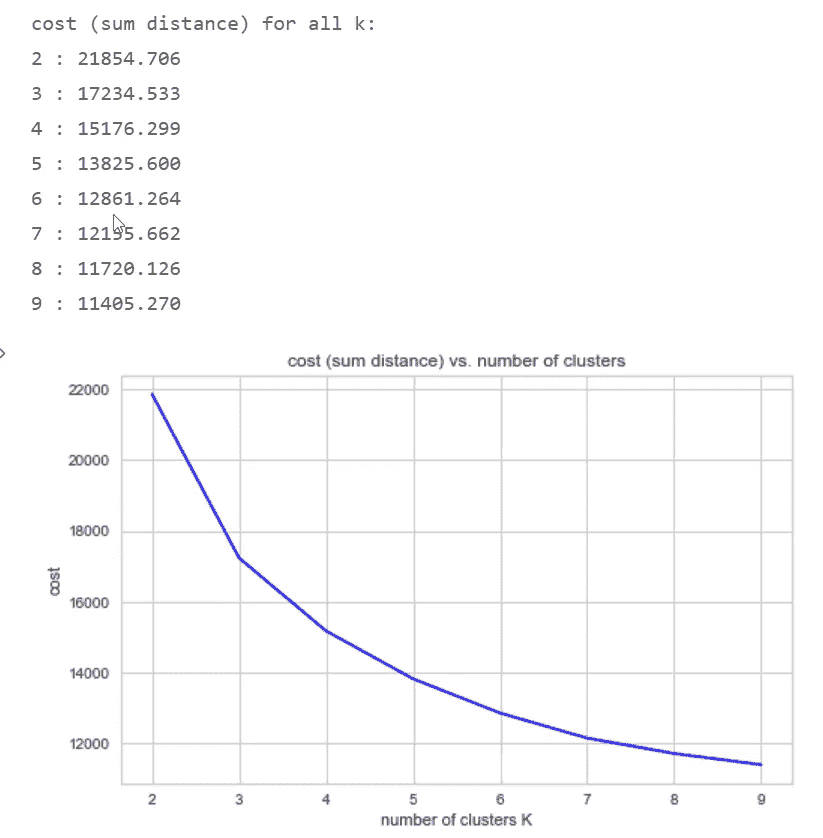

作者图片

通过眯起我们的眼睛，我们可以在 k = 4 个集群处辨别出一个拐点。但是曲线是如此平滑，我们应该通过计算一个精确的度量来验证我们的视觉解释。

我们在之前的聚类练习中已经使用过的*膝盖定位器*来帮忙了，它确认了 k = 4 处的肘部点。

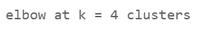

作者图片

我们总结了我们的分析，并将聚类标签作为新列插入到原始数据帧中。

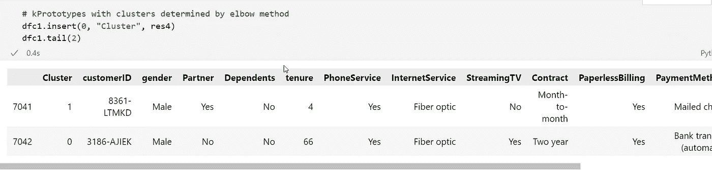

作者图片

现在我们可以调用我们的仪表板函数 *cluster_profile* ，它将把每个聚类的特征值制成表格；并将排列饼图，直观显示七个属性的分类内容。

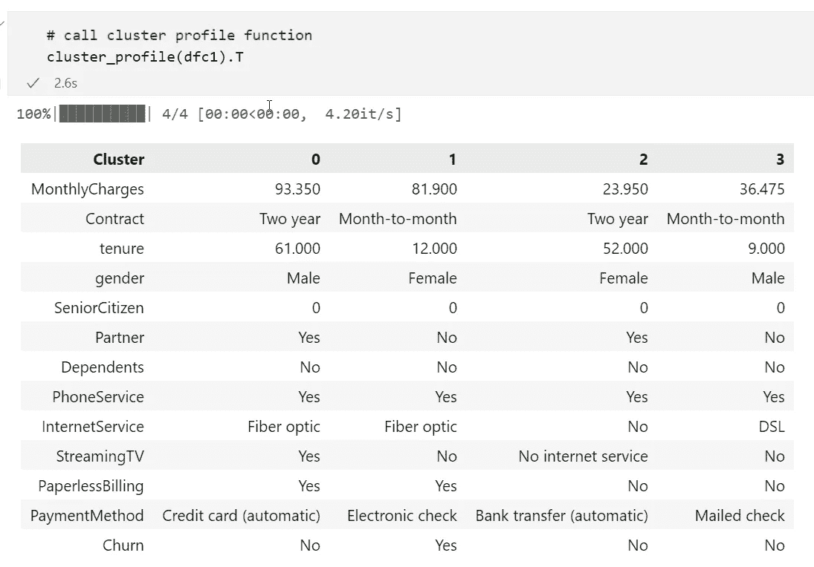

作者图片

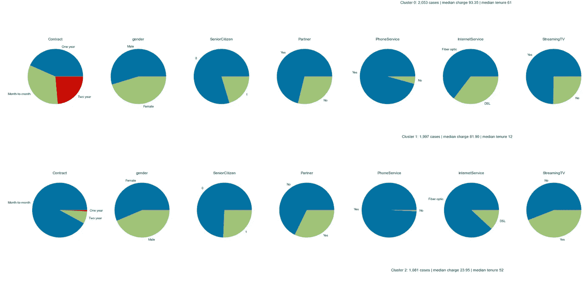

作者图片

# 4.结论

这就结束了我们的分两部分的集群入门。

*   第一篇文章[Elbows and Silhouettes:hand-on Customer Segmentation in Python](/elbows-and-silhouettes-hands-on-customer-segmentation-in-python-66c2e794c552)——通过使用 pandas 的 *cat.codes* 方法，展示了如何将 k-Means 和 Mean Shift 算法应用于混合数据类型，该方法将唯一的分类值映射到唯一的整数值。
*   —我们探索了不同的方法来确定最重要的超参数:适当的聚类数。主成分、惯性和轮廓分数，结合 scree 图，使我们能够确定最佳聚类数。
*   —我们编写了一个聚类分析器函数，它将每个聚类的特征值制成表格，并准备了一个可视化的仪表板，其中充满了描述七个主要属性的饼图。
*   今天的文章从处理分类变量的 *cat.codes* 的替代方法开始:通过 pandas 的 *get_dummies* 方法进行一次性编码，该方法增加了 dataframe 中的列数。每个唯一的分类值都有自己的列，用二进制值填充。我们运行主成分分析将数据帧浓缩成相关的成分。然后我们应用 k-均值聚类。
*   最后，我们介绍了一种不同的方法，k-Prototypes，它不需要将分类值转换为虚拟整数值。

Jupyter 笔记本可在 GitHub 下载: [h3ik0th/clustering:用 kmeans、meanshift、kprototypes、one-hot encoding、inertia 和 silhouette scores 对混合变量进行聚类(github.com)](https://github.com/h3ik0th/clustering)

数据集:Apache-2.0 许可证。[IBM/telco-客户流失-ICP 4d(github.com)](https://github.com/IBM/telco-customer-churn-on-icp4d)