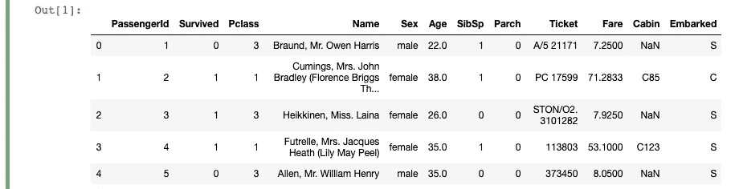
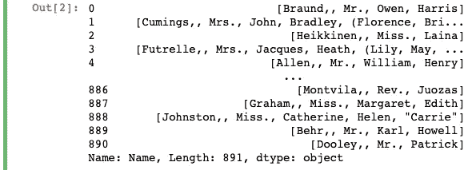
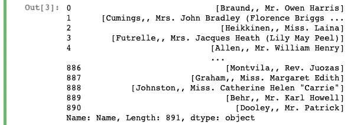
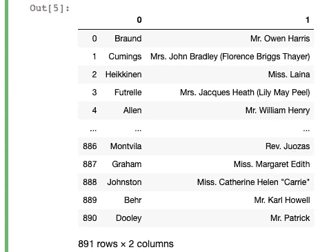
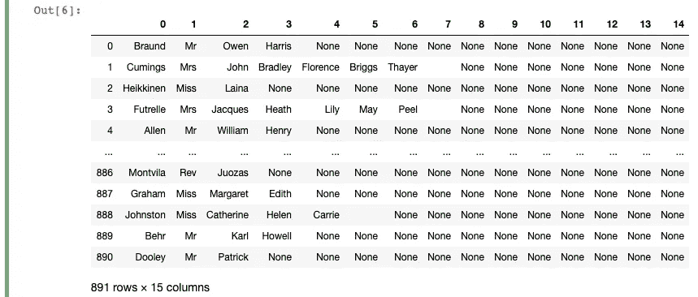
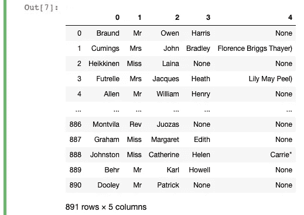

# Pandas 中一个常见的文本预处理步骤的一行代码

> 原文：<https://towardsdatascience.com/one-line-of-code-for-a-common-text-pre-processing-step-in-pandas-e3c4f5d60639?source=collection_archive---------74----------------------->

## 大蟒

## 快速浏览用于机器学习和数据分析的拆分文本列


劈叉！—[凯西·PHAM](https://unsplash.com/@cathypham243?utm_source=unsplash&utm_medium=referral&utm_content=creditCopyText)在 [Unsplash](https://unsplash.com/s/photos/yoga?utm_source=unsplash&utm_medium=referral&utm_content=creditCopyText) 上拍摄的照片

处理文本数据通常意味着您将获得非结构化数据，您需要解析这些数据以获得相关信息。即使您确实获得了干净的数据，有时您也会希望进行一些处理，以便从现有的数据中创建新的变量。这可以简单到将“姓名”列拆分为“名字”和“姓氏”。

不管是什么情况，Pandas 将允许您通过各种内置方法轻松处理文本数据。在这篇文章中，我们将专门分析文本列，以获得您需要的准确信息，用于进一步的数据分析或在机器学习模型中使用。

如果你想继续，请点击这里下载“训练”数据集[。完成后，请确保将其保存到与笔记本相同的目录中，然后运行以下代码来读取它:](https://www.kaggle.com/c/titanic/data?select=train.csv)

```
import pandas as pd
df = pd.read_csv('train.csv')
```



我们开始吧！

# 基本拆分

在整篇文章中，我们将只使用上面阅读过的表格中的“Name”列。我们的目标是使用 Pandas `split`方法尝试分离“Name”列的组件

首先，让我们看看当我们不向可选参数传递任何参数时`split`会做什么:

```
df['Name'].str.split()
```



默认情况下，`split`会在每列值上用空格分隔元素。上面的代码行返回一个序列，因为`split`将返回一个具有其调用者类型的对象(在本例中，我们在一个序列上调用了`split`)。

# 指定拆分的数量

到目前为止，返回的列中的列表可能包含不同数量的元素。要控制输出中可以出现多少个分割，只需在 n:

```
# control the number of splits
df['Name'].str.split(n=1)
```



现在，输出仍然是一个序列，但在这种情况下，每个列值中只有一个拆分。这意味着(从左边开始)第一个空格之前的所有内容是一个元素，空格之后的所有内容构成另一个元素。因此，在上面你可以看到，在第一行“欧文·哈里斯先生”不再被分成不同的元素。

# 控制定界符并将分割扩展成数据帧

接下来，让我们再次尝试限制拆分的数量，但是我们注意到第一个元素包含了原始列中的逗号。为了消除这种情况，让我们通过在`pat`中指定分隔符(要分割的字符)来指定它。让我们也来看看当我们将 True 传递给`expand`时的输出。

```
df['Name'].str.split(n=1, pat=",", expand=True) 
```



不是让返回值的类型与其调用者匹配，而是将 True 传递给`expand`来确保`split`返回一个带有拆分值的数据帧。在我们的例子中，我们从左边的第一个逗号开始分割，所以第一个逗号之前的所有内容组成“0”列中的值，后面的所有内容填充“1”列的值。

这已经很有用了，因为我们可以重命名这些列，并在进一步的分析中使用它们。如果需要，您还可以将它们添加到原始数据帧中，如果您想将它们用于机器学习模型的话。然而，我们仍然可以做得更多，所以让我们看看`split`还能做些什么。

# 使用正则表达式拆分

有时，我们希望能够自定义要拆分的字符。在这些情况下，我们可以将一个正则表达式传入`pat`。因为我们正在拆分 Name 列，所以您会注意到我们可能会基于逗号、空格、句点和括号来拆分列值。但是为什么不为这些字符拆分列呢？让我们看看下面会是什么样子:

```
name_df = df['Name'].str.split(pat=r"\W+", expand=True)
```



表达式的`\W`部分用于选择任何不是字母、数字或下划线的字符。`+`字符专门用于匹配一个或多个`\W`字符。

输出给出了每一行中所有可能的拆分。但是，我们最终会得到许多只有“None”值的列。因此，限制输出中的分割数量实际上会更好。如果我们粗略地看一下输出，我们会看到这个名称在很大程度上有五个组成部分。因此，我们可以通过为`n`指定一个值来获得更清晰的输出，如下所示:

```
final_name_df = df['Name'].str.split(pat=r"\W+", expand=True, n=4)
```



我们的输出现在看起来更清晰了，我们可以将这些列重命名为“姓氏”、“头衔”、“名字”等等。然后，我们可以将其加入到原始数据帧中，用于进一步分析或作为机器学习模型的输入。

仅此而已！

我希望当你开始使用一个新的数据集时，这五个技巧对你有所帮助。我发现在做任何事情之前运行这些代码行有助于我弄清楚如何继续我的数据分析。了解数据的结构及其基本的描述性统计信息将有助于您确定进一步预处理所需的步骤。

祝你未来的熊猫冒险之旅好运！

```
**More by me:** - C[onditional Selection and Assignment With .loc in Pandas](/conditional-selection-and-assignment-with-loc-in-pandas-2a5d17c7765b?sk=e5672d859a3964c1453a1c09edca22cf)
- [2 Easy Ways to Get Tables From a Website With Pandas](/2-easy-ways-to-get-tables-from-a-website-with-pandas-b92fc835e741?sk=9981ddaf0785a79be893b5a1dd3e03dd)
- [5 (and a half) Lines of Code for Understanding Your Data with Pandas](/5-and-a-half-lines-of-code-for-understanding-your-data-with-pandas-aedd3bec4c89?sk=7007a1ae248cf7ea4ef5fcd4af7ae72b)
- [Top 4 Repositories on GitHub to Learn Pandas](/top-4-repositories-on-github-to-learn-pandas-1008cb769f77?source=friends_link&sk=d3acc38062490a86ecb46875342224e6)
- [Learning to Forecast With Tableau in 5 Minutes Or Less](/learning-to-forecast-effectively-with-tableau-in-6-minutes-or-less-3d77a55930a0?source=friends_link&sk=9abdfd7533ee9a31ab8a036413450059)
```