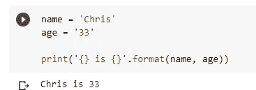
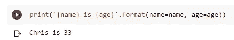
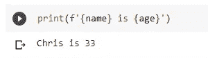
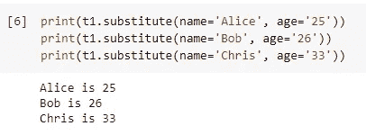
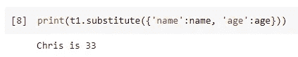
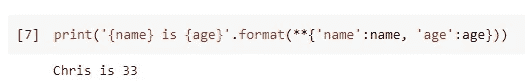
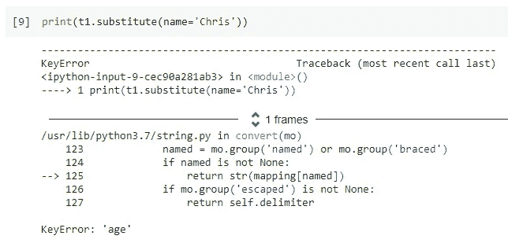
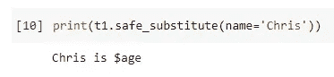
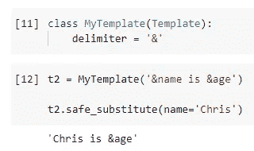

# 关于 Python 字符串，你还需要知道一件事

> 原文：<https://towardsdatascience.com/one-more-thing-you-need-to-know-about-python-string-f9703d052157?source=collection_archive---------43----------------------->


由 [NZKGB](https://pixabay.com/users/nzkgb-20159298/) 在 [Pixabay](https://pixabay.com/photos/man-mountain-snow-camping-tent-5983064/) 上拍摄的照片

## 真正的 Python 字符串模板

Python string 是最基本但功能强大且全面的对象之一。即使你可能是一个初学者，我打赌你应该知道格式功能和 f 字符串。我之前的一篇文章已经介绍了所有这些函数。

[发现 Python3 字符串格式函数中的所有魅力](/discovering-all-the-charms-in-python3-string-format-function-af07d609c760)

然而，这是 Python 字符串的一个很少有人知道的特性。这是字符串模板。我不建议在一般任务中使用它，尤其是数据科学/分析临时工作，它完全不相关。相反，如果您正在开发一个具有大量文本消息或日志的面向用户的 Python 应用程序，那么字符串模板可能值得了解。

# “模板”的老方法


照片由 [Pixabay](https://pixabay.com/photos/bench-bank-seat-rest-forest-1190768/) 上的 [biancamentil](https://pixabay.com/users/biancamentil-2023852/) 拍摄

通常，我们可能会说 Python 有很多方法来定义一个字符串“模板”，我们可以在其中传递任何变量。大多数时候，我们指的是格式字符串或 f 字符串。

例如，如果我们想要定义一个字符串的“模板”来表示某人处于某个特定的年龄，我们可以使用如下格式的字符串。

```
name = 'Chris'
age = '33'print('{} is {}'.format(name, age))
```



我们还可以指定占位符的名称，使它看起来更清楚。

```
print('{name} is {age}'.format(name=name, age=age))
```



除此之外，我们还可以使用 f 弦，我相信对于许多不同的场景来说，这是最简单的方法。这也是我最喜欢的。

```
print(f'{name} is {age}')
```



嗯，这些都不错。但是，请考虑以下场景。

*   你在开发一个应用程序。有许多日志消息具有完全相同的模式，但是在运行时应该替换一些参数。
*   你在开发一个应用程序。句子中的一些单词需要被上下文替换并显示给用户。
*   你在开发一个应用程序。有些单词需要根据用户的语言环境翻译成不同的语言。

在这些情况下，您需要一个真正的模板，而不是如上所示的带引号的“模板:)

# Python 中的字符串模板


图片由[漫画](https://pixabay.com/users/ahmadardity-3112014/)在[图片栏](https://pixabay.com/photos/bench-seat-social-distance-park-5017748/)上拍摄

我们需要在代码中导入`Template`类，但是这是内置在字符串模块中的，所以不需要安装任何东西。

```
from string import Template
```

然后，我们可以如下定义模板。

```
t1 = Template('$name is $age')
```

默认情况下，美元符号`$`将是分隔符，它接受任何大写/小写字母和数字作为占位符名称。

这个模板的使用方法非常简单。只需调用它的函数`substitute()`，并相应地将值传递给占位符名称。

```
print(t1.substitute(name='Alice', age='25'))
print(t1.substitute(name='Bob', age='26'))
print(t1.substitute(name='Chris', age='33'))
```



需要提到的是，`substitute()`函数也接受一个字典，如下。

```
print(t1.substitute({'name':name, 'age':age}))
```



顺便说一句，如果我们将格式字符串与字典一起使用，我们需要对它进行解包，这确实不是直接和直观的。

```
print('{name} is {age}'.format(**{'name':name, 'age':age}))
```



# 安全替代品


照片由 [Olessya](https://pixabay.com/users/olessya-86040/) 在 [Pixabay](https://pixabay.com/photos/couple-bride-love-wedding-bench-260899/) 上拍摄

字符串模板的另一个特性是“安全”替代。当我们使用常规的替换函数时，我们必须为所有的占位符提供值。如果我们没有给出足够的，就会抛出一个异常。

```
print(t1.substitute(name='Chris'))
```



然而，如果我们使用`safe_substitute`函数，丢失的值将被忽略，而原来的占位符将被显示。

```
print(t1.safe_substitute(name='Chris'))
```



# 高级用法


照片由 [pixel2013](https://pixabay.com/users/pixel2013-2364555/) 在 [Pixabay](https://pixabay.com/photos/rest-foresight-distant-view-seat-3592996/) 上拍摄

如果我的应用程序是一个金融应用程序，我必须在字符串模板中使用美元符号，该怎么办？实际上，可能会有冲突。但是，必要时可以覆盖模板类。

例如，我们可以覆盖分隔符，如下所示。

```
class MyTemplate(Template):
    delimiter = '&'
```

在继承自`Template`的`MyTemplate`类中，我们将分隔符改为&符号`&`。所以，我们现在可以用新的符号来定义占位符了。

```
t2 = MyTemplate('&name is &age')t2.safe_substitute(name='Chris')
```



# 摘要


由 [Myriams-Fotos](https://pixabay.com/users/myriams-fotos-1627417/) 在 [Pixabay](https://pixabay.com/photos/teacup-cup-of-tea-peppermint-tea-2325722/) 上拍摄的照片

在本文中，我介绍了一个内置于 Python 字符串模块中但很少被提及的特性。当我们开发一个处理重复消息和日志的应用程序，并且只改变参数时，它可能非常有用。

使用 Python 字符串模板，我们可以一起定义和组织所有的字符串模板，并在我们项目的任何地方使用它。这将导致一个干净整洁的代码呈现。

[](https://medium.com/@qiuyujx/membership) [## 通过我的推荐链接加入 Medium 克里斯托弗·陶

### 作为一个媒体会员，你的会员费的一部分会给你阅读的作家，你可以完全接触到每一个故事…

medium.com](https://medium.com/@qiuyujx/membership) 

如果你觉得我的文章有帮助，请考虑加入 Medium 会员来支持我和成千上万的其他作者！(点击上面的链接)