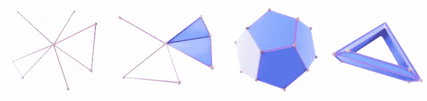
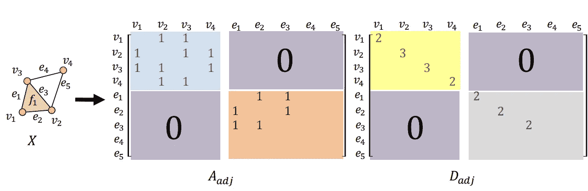
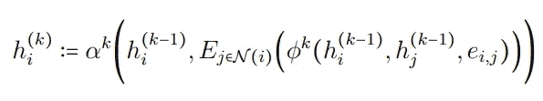
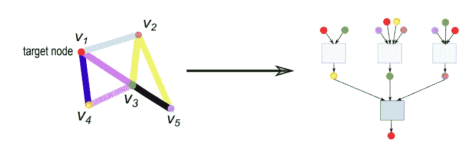
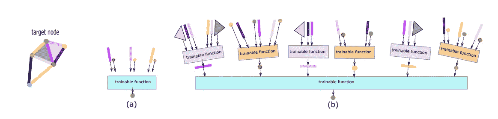
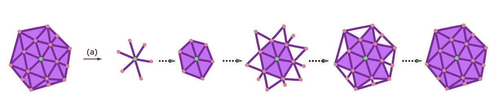
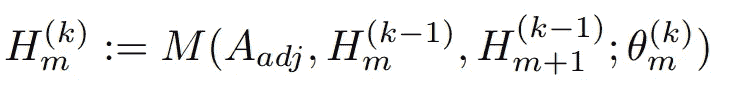
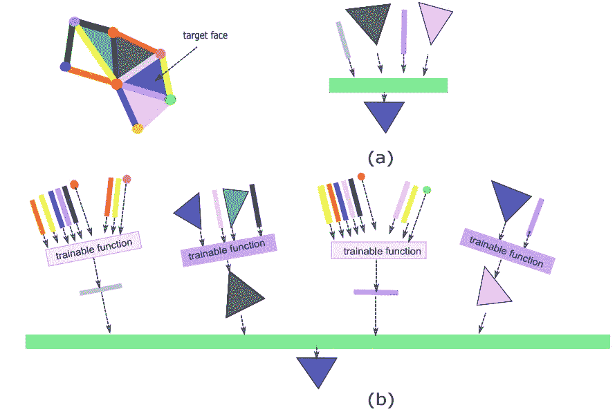
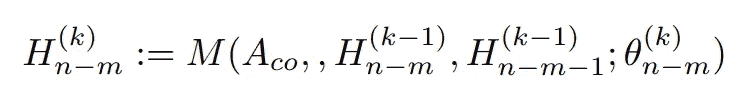
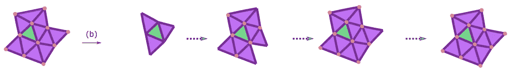

# 一个网络来统治他们:细胞复杂神经网络

> 原文：<https://towardsdatascience.com/one-network-to-rule-them-all-cell-complex-neural-networks-5920b4978a7c?source=collection_archive---------17----------------------->

## [思想和理论](https://towardsdatascience.com/tagged/thoughts-and-theory)

## 一个统一的数学框架，可以在其中定义和执行深度学习模型和协议

由[乔尔·菲利普](https://unsplash.com/@joelfilip?utm_source=medium&utm_medium=referral)在 [Unsplash](https://unsplash.com?utm_source=medium&utm_medium=referral) 上拍摄的照片

图是用于建模实体间关系的自然对象。图已经在许多应用中成功地用于建模这种关系，包括社交网络、物理系统和场景理解。然而，图的建模能力有限，因为它们只能对*成对关系*进行建模。如果我们想要对关系之间的关系建模呢？我们也想知道一个模型，它以抽象的方式建立了这种关系的层次结构。例如，这表现在我们人类的思维方式上。抽象和类比，我们能够要求以层次化的方式在关系之间建立关系。此外，这种观点的重要性在深度学习模型的空前成功中显而易见，在深度学习模型中，复杂的概念是以分层的方式从简单的概念中构建出来的。

在过去的几年中，图形神经网络已经作为一种计算框架出现，以便于在图形上进行神经网络类型的计算。鉴于上述观点，很自然地会想到将图形神经网络推广到对更高阶关系进行建模的网络。从实践的角度来看，人们可能希望对其他对象进行深度学习类型的计算。像三角形和多边形网格、多面体对象等对象。此外，希望有一个允许对这些对象进行深度学习类型计算的单一数学框架。这篇文章的目的是表明这样一个数学框架是可能的，更重要的是直观的理解。具体来说，这篇文章介绍了*细胞复合体神经网络(CXN)[1]* ，这是一个关于细胞复合体的通用统一训练框架，它极大地扩展了人们可以应用深度学习协议的领域。细胞复形是概括图形、3D 网格、单纯复形和多边形复形的数学构造。细胞复合体上的训练以完全组合的方式定义，允许直观的操作、概念化和实施。

我们首先解释什么是细胞复合体，然后继续细胞复合体神经网络的定义。

# 什么是细胞复合体？

细胞复合体是一种数学构造，它是由简单的称为*细胞*的基元组合而成的。这些细胞连接在一起形成最终的物体，称为细胞复合体[2]。下图给出了细胞复合体的例子。

细胞复合体的例子。图片来源[细胞复杂神经网络](https://arxiv.org/abs/2010.00743)

最原始的细胞类型是节点，也称为零细胞。1 单元是边缘，2 单元是面，依此类推。请注意，一个 2-格可以限制任意数量的边，这是不太一般的复形(如单纯复形)不一定具有的性质。细胞复合体的精确数学定义对本文来说并不重要，直觉将足以理解这个概念(参见[2]对细胞复合体更精确的处理)。对我们来说，最相关的事实是，他们通过高阶单元对更高阶的关系进行建模，从这个意义上来说，他们概括了图形。

# 我们如何表示细胞复合体？

使用邻接矩阵可以表示细胞复合体。下图说明了如何构建这些矩阵。注意，这些矩阵推广了图上的邻接矩阵。

细胞复合体的邻接矩阵和度矩阵举例。A_adj 中的蓝色和橙色子矩阵表示 X 的节点-边邻接，橙色矩阵表示边-面邻接。度矩阵是邻接矩阵行的简单总和。图片来源[细胞复杂神经网络](https://arxiv.org/abs/2010.00743)

理解细胞复杂神经网络的最佳方式是看它们如何推广消息传递图神经网络。

# 图形神经网络

最流行的图形神经网络类型可以在消息传递模型下理解[3]。在消息传递模型中，我们通常被给定一个图 G = (V，E)，图中每个节点的嵌入向量，并且有时我们也被给定 G 中每个边的嵌入向量。给定模型的期望深度 L > 0，消息传递方案网络根据以下更新关系更新图中每个节点的嵌入表示 L 次[3]:

图的消息传递方案[3]。

这里，向量 h 是在节点 I 处可用的特征向量。h 上的上标(k)指示更新阶段。函数φ和α是可训练函数，例如 MLP，函数 E 是置换不变可微函数。向量 eij 是表示节点 I 和节点 j 之间的边的嵌入向量，并且它有时被包括在计算中。

下图也对此进行了解释:

相对于红色节点示出了深度为 2 的消息传递网络。图像来源[细胞复杂神经网络](https://arxiv.org/abs/2010.00743)

# 细胞复杂神经网络

现在我们准备引入细胞复杂神经网络。细胞复杂神经网络利用消息传递方案的概念，并使用复杂中的高阶细胞来执行这些计算。核心思想相当直观:图中的边被用来在节点之间传递信息。现在假设我们有一个 2 维的细胞复合体，比如一个三角形表面。在这种情况下，我们有节点、边和面。我们可以在边之间使用相同的消息传递思想，并认为边界面是在边之间传递消息的工具。我们通过一个例子来具体说明这一思想。

## 邻接消息传递方案(AMPS):

考虑下图左侧给出的细胞复合体。

两层细胞复杂神经网络(CXN)。计算是相对于红色目标顶点来演示的。信息流从较低的细胞流向较高的入射细胞[1]。图片来源[单纯复表示学习](https://arxiv.org/abs/2103.04046)

开始时，绿色目标节点从其周围的节点获取消息:布朗、红色和橙色节点以及用于发送这些消息的边:黄色、深色和浅粉色边。从上图(a)可以看出这一点。这正是我们在上面的图形神经网络设置中所做的。

现在我们到细胞复杂网络的第二层，我们想更新边上的向量。在这种情况下，我们认为黄色边缘的邻居是粉红色和灰色边缘，原因是它们都绑定了一个更高维度的面(暗灰色面)。如上图(b)所示。其他边和节点以类似方式更新。

您可以考虑使用下图中给出的消息传递方案的信息流:

使用邻接消息传递方案的信息流。图片来源[单纯复表示学习](https://arxiv.org/abs/2103.04046)

信息从低维细胞向高维细胞呈放射状流动，随着我们在网络中越走越深，我们也离源节点越远。

数学上，这可以用下面的简单等式来描述

邻接消息传递方案(AMPS) [1]。

这里$H_m$是表示细胞复合体中 m 维细胞的嵌入。H 上的上标代表更新阶段。函数 M 是取决于权重θ的消息传播函数。注意，阶段(k)的嵌入取决于相邻关系以及相邻单元和高一个维度的单元。这个等式虽然简单，但是非常通用，且它征服了所有现有消息传递图神经网络。

## 相邻消息传递方案(CMPS):

细胞复合体比图更复杂，它们自然允许其他自然的信息传递模式。特别是，我们可以利用共邻接关系来完成消息传递，而不是利用邻接关系。下图对此进行了说明:

共邻接消息传递方案(CMPS)的图示。图片来源[单纯复表示学习](https://arxiv.org/abs/2103.04046)

例如，如果我们想要在面上进行所需的计算(比如网格分割，并且您想要对这些面进行标记)，可以使用 CMPS。从数学上讲，这可以写成如下形式:

相邻消息传递方案(CMPS) [1]。

使用 CMPS 查看信息流动的方式也很有说明性:

使用共同邻接消息传递方案的信息流。图片来源[单纯复表示学习](https://arxiv.org/abs/2103.04046)

在细胞复合体上还可以定义其他自然的信息传递模式。我们把细节留给我们的论文[1]。

# 但是为什么我们需要具有如此通用性的神经网络呢？

人们可能想要在细胞复合体上定义深度学习有多种原因。首先，从数学上来说，拥有一个能够征服所有其他模型的单一深度学习模型是优雅的。细胞复合体是图的概括，而图又是图像的概括。然而，图和胞复形之间的差距是巨大的，它包含许多其他复形(例如，单纯复形，多面体复形和∈-复形)。所有这些对象在实践中都很重要，有时最好是与一个家族合作而不是与另一个家族合作。例如，在曲面上使用偏微分方程时，最好使用四边形网格。第二，也希望有一个直观的数学框架，其他从业者可以根据他们的目的重建、实现或者定制。图上的消息传递方案很受欢迎，因为它们满足这些条件。在更一般的对象上推广这些方案意味着所有现有的基于消息传递的图模型都可以使用我们上面介绍的通用方案优雅地推广到细胞复合体。

更多关于细胞复杂神经网络的信息可以在这里阅读[。特别地，讨论了更多的消息传递方案以及面向小区复合体的情况。](https://arxiv.org/abs/2010.00743)

**参考文献:**

[1] Mustafa Hajij、Kyle Istvan 和 Ghada Zamzmi。[细胞复杂神经网络](https://arxiv.org/abs/2010.00743)。2020 年 NeurIPS 拓扑数据分析研讨会。

[2] Allen Hatcher，[代数拓扑](https://books.google.com/books?hl=en&lr=&id=xsIiEhRfwuIC&oi=fnd&pg=PR9&dq=hatcher+algebraic+topology&ots=ZpSMioccuT&sig=yabOENNgsVaQXc78e1mB3HWK20Q)，2005。

[3] Gilmer，j .，Schoenholz，S. S .，Riley，P. F .，Vinyal，o .和 Dahl，G. E,《量子化学传递神经信息》。《2017 年国际机器学习会议论文集》