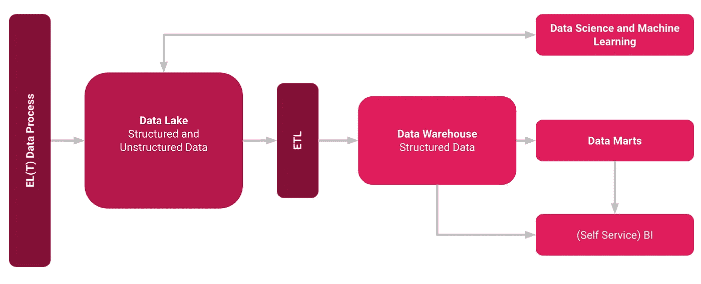
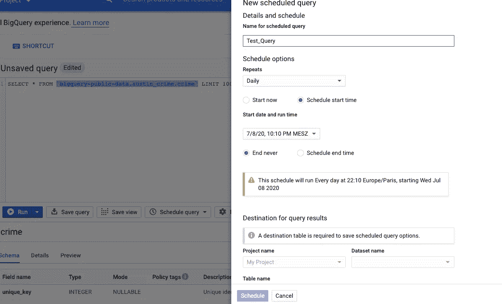

# 数据工程师和科学家最低估的应用之一

> 原文：<https://towardsdatascience.com/one-of-the-most-underrated-applications-for-data-engineers-and-scientists-b2b538d8c9d1?source=collection_archive---------33----------------------->

## 关于谷歌数据传输服务你应该知道什么

尼克·加德纳在 [Unsplash](https://unsplash.com/s/photos/montana?utm_source=unsplash&utm_medium=referral&utm_content=creditCopyText) 上的照片

BigQuery 数据传输服务在计划和管理的基础上自动传输 BigQuery 中的数据。数据工程和分析团队无需编写一行代码就可以为 BigQuery 数据仓库奠定基础[1]。就个人而言，我认为有两个广泛的应用领域可以节省额外的工具和成本。

## 数据集成

数据传输服务可以集成的源有:

**SaaS(软件即服务)从谷歌喜欢的应用:**

*   活动经理
*   云存储
*   谷歌广告经理
*   谷歌广告
*   谷歌商业中心(测试版)
*   Google Play
*   搜索广告 360(测试版)
*   YouTube —频道报道
*   YouTube —权利持有人报告

**外部云存储提供商:**

*   亚马逊 S3

**数据仓库:**

*   Teradata
*   亚马逊红移

此外，谷歌云市场中还提供额外的第三方转让服务[2]。这里的优势很明显，只使用了 SaaS 服务，即 BigQuery 和 DTS，而没有构建任何基础设施。此外，只使用一个服务提供商，即谷歌。这节省了大量的建设和维护工作。因此，您只需为计算能力付费，这当然也会在其他解决方案中产生。

## ELT 处理

除了传输数据之外，这个服务还可以用于数据仓库或数据湖中的数据转换。在这里，我将使用现代方法 ELT 而不是 ETL。对 ELT 和 ETL 的简短总结是，ETL 过程是在数据集成工具中发生转换后将数据加载到目标系统中，ELT 方法首先将数据加载到目标系统中，然后再转换数据。通常 ELT 过程比传统的 ETL 过程更受欢迎，因为它实现起来更简单，加载数据更快[3]。

通过 DTS 进行数据集成和转换—图片来自作者

一种可能的解决方案架构是上面的架构，其中数据传输服务将数据加载到数据湖或临时区域，然后使用简单的 SQL 接管数据的转换。

通过数据传输服务安排查询-按作者排列的图片

BigQuery 中转换任务的一个例子是连接两个表，对列数据类型或值进行一些转换，并将它们保存为一个新的数据对象，以便以后进行分析。编写完 SQL 并点击“Schedule query”后，您可以通过弹出的配置管理器(上图的右侧)自动执行该操作。

DTS 将为您提供通过调度查询来自动化转换任务的可能性，例如在每天的某个时间(类似于批处理和夜间 OLAP 操作)，但由于 GCP 内的可伸缩性，速度会快得多。

## 结论

这种方法带来了某些优势:

*   你只需要使用 GCP 本地服务(不需要大型工具集。) [2]
*   转换可以由 SQL 完成(即使技术经验较少的员工也可以实现数据准备逻辑。)
*   DTS 和 BigQuery 是完全的 SaaS 技术(不用担心基础设施和伸缩性。)
*   DTS 可以很好地处理大数据

由于云平台为我们提供了无限的可扩展性和大量的服务，只需点击一下鼠标，您就可以快速建立数据仓库和所需的数据管道。这个例子向你展示了如何只使用两个 Google 服务和 SQL 来完成所有的设置。

## 资料来源和进一步阅读

[1] Google，[什么是 BigQuery 数据传输服务？](https://cloud.google.com/bigquery-transfer/docs/introduction) (2021)

[2]谷歌，[(2021 年)](https://cloud.google.com/bigquery-transfer/docs/third-party-transfer?hl=de)

[3]https://fivetran.com/_/api/blog/elt-vs-etl/elt-vs-etl.png，T4