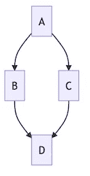
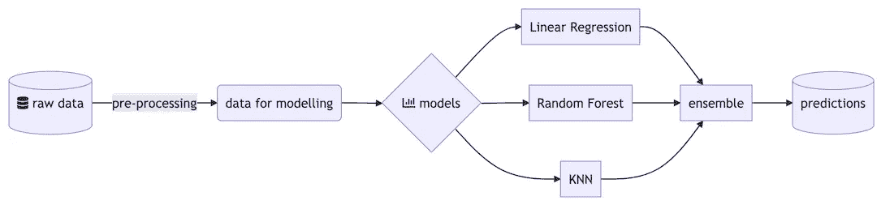
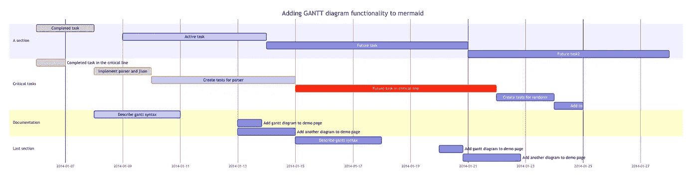
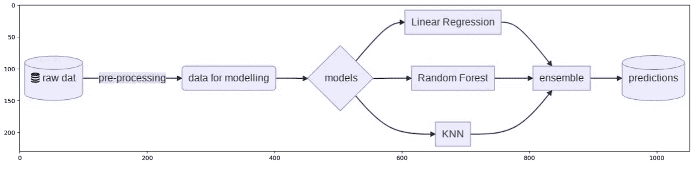

# 一个简单的提示让你的简历脱颖而出

> 原文：<https://towardsdatascience.com/one-simple-tip-to-make-your-readmes-stand-out-9f06ccdd76b?source=collection_archive---------25----------------------->


[Unsplash](https://unsplash.com/s/photos/code?utm_source=unsplash&utm_medium=referral&utm_content=creditCopyText) 上 [AltumCode](https://unsplash.com/@altumcode?utm_source=unsplash&utm_medium=referral&utm_content=creditCopyText) 拍摄的照片

## 使用 Mermaid 设计的图表——一种类似 markdown 的脚本——让您的文档更上一层楼！

文档——毫无疑问，这是每个数据科学家的重要任务之一，但就乐趣而言，这也很可能是最低级的任务。我不会试图说服你保持更新文档的好处，那是另一个时间的话题。

在本文中，我将向您展示一个工具，它可以帮助您使这个过程更快、更有效，甚至更愉快。毕竟，*一图胜千言。为了让它更贴近用户，图片可以是自述文件或其他类似 markdown 的文档中的流程图。*

# 美人鱼

最近一个同事给我介绍了一个叫**美人鱼**的工具。我认为[文档](https://mermaid-js.github.io/mermaid/#/)中的以下句子很好地描述了美人鱼是什么:

> 这是一个基于 Javascript 的图表工具，它呈现受 Markdown 启发的文本定义，以动态地创建和修改图表。

对我来说，对美人鱼有利的关键论点是:

*   免费和开源的，
*   几乎不需要安装(只需要查看图表的插件)，
*   易于使用并有大量文档，
*   可以很容易地集成到当前的文档工作流程中->将图形作为代码存储在 markdown 文件中。

# 实践中的美人鱼

我觉得对于人鱼这样的工具，最简单的学习方法就是做。这就是为什么我们将首先创建一个简单的流程图。对于那些不熟悉它的人来说，它是一种表示过程或工作流的图表。

我们将在本文中使用的两种资源是:

*   [Mermaid 的文档](https://mermaid-js.github.io/mermaid/#/) —通过浏览它，我们可以看到如何使用可用的构建块来创建甚至非常复杂的图，
*   [Mermaid Live Editor](https://mermaid-js.github.io/mermaid-live-editor)——这个工具提供了我们的图表输出的实时预览，在从头构建一些东西时，它会非常方便。

让我们从非常简单的事情开始。

```
graph TD
    A-->B
    A-->C
    B-->D
    C-->D
```

在 live 编辑器中，我们可以看到以下预览:



作者图片

如您所见，语法非常简单。我们指定要创建一个自顶向下的图，并提供了节点和它们之间的连接。

现在，让我们转到更复杂、更类似于现实生活的场景。想象一下，你有一个数据科学项目，在这个项目中，你有一个预测某事的模型集合。细节无关紧要。为了使文档更容易理解，您创建了下图，显示了从获取原始数据到存储集合预测的所有部分是如何连接的。



作者图片

正如你所看到的，这个图肯定更复杂。关于语法需要注意的一些事情:

*   这次我们用了左右图。
*   我们可以通过提供节点实例的名称来命名节点。一个很好的特点是，我们不必给它们都命名，这无疑节省了一些时间。
*   通过在箭头后使用`|text|`，我们可以提供将在给定箭头上显示的描述。
*   使用`id`对象，我们可以创建一个代表数据库的形状。在美人鱼中有许多不同的节点形状，请参考[文档](https://mermaid-js.github.io/mermaid/#/)以获得更多关于可用的和如何创建它们的信息。
*   我们可以使用[字体牛逼的](https://fontawesome.com/)图标结合文字。

这两个例子应该展示了足够的语法，以便您能够自己掌握和试验！这正是 [Live 编辑器](https://mermaid-js.github.io/mermaid-live-editor/edit)大放异彩的时候，因为它使起草和调试变得非常容易。

# **其他种类的可用图表**

美人鱼绝不仅限于流程图。您还可以创建以下类型的图表:

*   程序表
*   类图
*   状态图
*   实体关系图
*   用户旅程
*   [江恩图表](https://en.wikipedia.org/wiki/Gantt_chart)
*   圆形分格统计图表



美人鱼中创建的塘鹅图表示例。[来源](https://mermaid-js.github.io/mermaid/#/gantt)

# 将 Mermaid 集成到当前工作流程中

将美人鱼图整合到你的工作流程中有多难？不是很好，虽然仍然有一些粗糙的边缘你可能要考虑。

让我们从把你的图表嵌入你的降价文件开始。这就像在代码周围添加一个特殊的块一样简单。你可以在下面看到一个非常简单的`README.md`文件的例子。

您可能还想安装一个 VS 代码插件，以便在 markdown 预览中查看图表。PyCharm 也很容易处理美人鱼，你只需要在[设置](https://www.jetbrains.com/help/idea/markdown.html#diagrams)中打开那个选项。

要我说，那些对工作流程的小改动绝对值得。

# 额外收获:Python 集成

你也可以使用 Python 可视化你的美人鱼图形。在这个简短的示例中，我们将可视化上面使用的相同数据科学流程图。为此，我们从导入所需的库开始。

然后，我们运行下面的代码片段。

它生成了我们之前见过的相同的图表。



作者图片

# 外卖食品

*   Mermaid 是一个使用类似 markdown 的语法创建各种图表的工具。
*   使用美人鱼不需要特殊安装。您可以在一个[实时编辑器](https://mermaid-js.github.io/mermaid-live-editor/edit)中摆弄语法。
*   该工具没有与 GitHub 集成，但是您可以使用您选择的 IDE 插件或浏览器扩展来可视化图形。

你可以在我的 [GitHub](https://github.com/erykml/medium_articles/blob/master/Misc/mermaid.ipynb) 上找到本文使用的代码。此外，欢迎任何建设性的反馈。你可以在[推特](https://twitter.com/erykml1?source=post_page---------------------------)或评论中联系我。

如果您喜欢这篇文章，您可能还会对以下内容感兴趣:

[](/9-useful-pandas-methods-you-probably-have-not-heard-about-28ff6c0bceee) [## 你可能没听说过的 9 种有用的熊猫方法

### 它们可以让你的日常工作更容易、更快捷。

towardsdatascience.com](/9-useful-pandas-methods-you-probably-have-not-heard-about-28ff6c0bceee) [](/embed-your-interactive-visualizations-in-medium-posts-using-datapane-9613314f048d) [## 使用 datapane 将您的交互式可视化嵌入到中型帖子中

towardsdatascience.com](/embed-your-interactive-visualizations-in-medium-posts-using-datapane-9613314f048d) [](/beautiful-decision-tree-visualizations-with-dtreeviz-af1a66c1c180) [## 用 dtreeviz 实现漂亮的决策树可视化

### 改进绘制决策树的旧方法，永不回头！

towardsdatascience.com](/beautiful-decision-tree-visualizations-with-dtreeviz-af1a66c1c180)