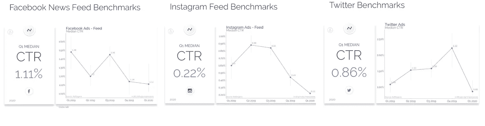

# 更接近实现更相关的广告的一步

> 原文：<https://towardsdatascience.com/one-step-closer-to-achieving-a-more-relevant-advertising-d406fca1198a?source=collection_archive---------50----------------------->

照片由[詹姆斯·庞德](https://unsplash.com/@jamesponddotco?utm_source=unsplash&utm_medium=referral&utm_content=creditCopyText)在 [Unsplash](/s/photos/idea?utm_source=unsplash&utm_medium=referral&utm_content=creditCopyText) 拍摄

## 质量重于数量

## 广告的演变

还记得那些无论如何都要看广告的电视时代吗？此外，我敢打赌，如果全家人都坐在电视机前，广告可能会抓住一个人的注意力，这也是一个很长的镜头。有人可能会说，那是广告的黄金时代，简单却有潜力吸引大众。坦率地说，在那个时候，这是广告的绝对巅峰。广告的受众是基于所投放的节目，如果是足球比赛，投放耐克；如果是儿童节目，投放卡通麦片品牌，等等。这很简单，但更重要的是，它暂时对他们有效，而且是相关的。

然后出现了辉煌的互联网。我记得早期的互联网还没有那么多广告；甚至 Youtube 都很干净，而脸书充满了 emo 风格。但更重要的是，它没有广告。但没过多久，公司就注意到了这一点，并抓住了这一辉煌的互联网机遇。现在，在跳过一个广告之前，你不能在任何地方滚动超过 30 秒。**但更重要的是，这些广告能引起受众的共鸣吗？**

## 我们广告中的错误

我对网上看到的广告几乎不感兴趣；饶了他们几个吧。我在这里不是要指责谁，但你们都需要重新思考如何开展营销活动。

我特别记得 Instagram 上的一个广告，它确实让我点击并结账。这是一个关于 Spotify 摇滚歌剧播放列表的广告。几秒钟后播放的歌曲立即引起了我的注意。我最终按照播放列表，我积极地听它，因为我喜欢摇滚歌剧。所有其他的广告都是不相关和断章取义的，我甚至不会停留超过我可以按下跳过按钮的时间。

根据 [**Smart Insights**](https://www.smartinsights.com/internet-advertising/internet-advertising-analytics/display-advertising-clickthrough-rates/) 的这篇文章，这些脸书广告的点击率是 1.1%，Instagram 广告是 0.22%，对于 Twitter 广告来说，是 0.86%。这太低了。

[2020 年 Smart Insight 广告统计](https://www.smartinsights.com/internet-advertising/internet-advertising-analytics/display-advertising-clickthrough-rates/)

## 那么是哪里出了问题呢？

哦，一路上出了太多问题。这在很多行业都很普遍，不仅仅是广告业。我们更注重数量，而不是质量，以及即时的满足感，我们将会有今天的成就。将一个方法定型到令人讨厌的程度的完美方法。

仅仅因为我去了一个网上商店，点击了一个鞋类产品，并不总是意味着我想买它。 ***更重要的是，这当然不是说，如果你从地球上每一个可能的在线平台反复给我看这个产品的广告，我就会神奇地买下它。基于简单的互动，你只是在我身上浪费你的广告费，而没有考虑到其他因素。***

作为一名活跃的数据科学家，在与来自不同部门的数据进行了所有的互动之后，我可以看出这种想法来自哪里。这是基于一个简单的假设，旨在达到尽可能多的人，把相关因素扔到水里。

## **质量超过数量的一步**

当考虑某人对在线行为的兴趣和意图时，有许多因素。当我们追求更快的结果时，有太多的潜在问题没有从在线行为中得到解决。有很多方法可以让广告对观众和广告制作人来说都是双赢的。就像我之前提到的例子，我点击并继续听 Spotify 的播放列表。结果，我受益于一些好的音乐，播放列表创建者受益于一个流收入。它对我们俩都有效，只是因为这个广告非常符合我的品味和兴趣。

那我们为什么能更多地利用它呢？虽然哲学方面的内容足以在一篇单独的博客上发表，但实用性更容易解释。

如果一个人在看一个产品一定的时间，有很多隐藏的见解。*用户查看产品页面的时间有多长？该产品属于哪个类别？用户是否访问了该产品类别的其他产品页面？用户是否与产品的评分和评论进行了互动？这个用户最后一次访问这个产品页面是什么时候？用户使用的是什么设备？还有许许多多我们没有考虑到的信息。这些都为考虑用户是否真的感兴趣或者只是偶然碰到产品提供了一些权重。*

因此，就像现实一样，一些用户比其他用户更有可能购买该产品。因此，不要盲目地向每个人展示广告，而是通过一些促销活动来展示这个特定的广告，比如从在线平台向这个特定的用户提供折扣或免费送货。这样过滤了你的受众，广告与用户和产品更相关。即使在这之后，也许不是每个人都会在一天结束时与广告互动，但我敢打赌广告点击率将远远高于 1.1%。

## 简单的判决

这不会神奇地解决在线广告相关性问题，也不会治愈市场。然而，这将开始使广告与人更相关，与人的兴趣更相关，与人的品味更相关。这将是一个双赢的公司和用户观看广告。

**那么，我们如何实现这种个性化的方法，让广告更有针对性呢？**答案当然是数据科学。我知道这可能会吓到一些人，但不应该。数据科学已经走过了漫长的道路，并使事情变得如此简单，以至于它不再是一个知识问题；相反，这只是一个执行的问题。一个完美的例子就是 [**增强器**](https://enhencer.com/) 。这个在线平台使用户能够使用人工智能算法创建复杂的模型，而不需要数据科学知识和专业知识。

我将在接下来的博客中介绍这种方法。这只是博客系列的开始，旨在使我们每天看到的广告更相关，对双方都有利。你会惊讶地发现数据科学在这方面能做些什么，而且你会更惊讶地发现你一直以来都忽略了什么。